= kapture-localization / Image Retrieval Benchmark results
:sectnums:
:sectnumlevels: 0
:toc:
:toclevels: 2

TODO add references

== Feather2d2 20k Results

=== Aachen Day-Night v1.1

==== global_sfm

[%header]
|===
| feature type | topk 3+| day 3+|night 
| | |(0.25m_2.0deg)|(0.5m_5.0deg)|(5.0m_10.0deg)|(0.25m_2.0deg)|(0.5m_5.0deg)|(5.0m_10.0deg)
|AP-GeM-LM18|1|80.2%|89.3%|95.6%|48.7%|65.5%|78.0%
|DELG|1|77.8%|87.4%|95.5%|48.2%|60.2%|74.4%
|densevlad_multi|1|77.8%|86.2%|91.8%|39.3%|51.3%|58.6%
|fire|1|76.8%|86.8%|93.7%|47.6%|62.8%|82.2%
|how|1|76.3%|87.1%|93.8%|54.5%|69.6%|85.9%
|netvlad_vd16pitts|1|75.6%|84.1%|90.5%|44.0%|56.0%|69.1%
||||||||
|AP-GeM-LM18|2|82.0%|91.0%|97.2%|53.9%|71.7%|85.3%
|DELG|2|82.3%|91.1%|97.2%|56.5%|72.8%|84.3%
|densevlad_multi|2|80.8%|89.3%|93.7%|42.9%|57.1%|65.5%
|fire|2|81.2%|90.3%|96.6%|53.9%|70.7%|86.9%
|how|2|81.6%|90.1%|97.0%|55.5%|73.3%|89.5%
|netvlad_vd16pitts|2|80.6%|88.5%|93.8%|53.9%|67.0%|79.1%
||||||||
|AP-GeM-LM18|3|84.5%|92.6%|98.3%|58.1%|74.4%|88.5%
|DELG|3|84.0%|92.0%|98.1%|58.6%|76.4%|88.0%
|densevlad_multi|3|83.3%|90.5%|94.7%|49.2%|61.3%|68.1%
|fire|3|83.1%|91.8%|97.7%|56.0%|74.4%|89.5%
|how|3|84.2%|92.4%|97.7%|62.8%|78.0%|93.2%
|netvlad_vd16pitts|3|82.5%|89.6%|94.7%|62.3%|72.3%|85.3%
||||||||
|AP-GeM-LM18|4|85.1%|92.6%|98.3%|58.6%|74.9%|89.5%
|DELG|4|85.2%|93.2%|98.2%|59.2%|76.4%|89.5%
|densevlad_multi|4|83.9%|90.9%|95.3%|51.3%|62.8%|70.2%
|fire|4|84.6%|92.1%|97.8%|59.2%|78.0%|92.2%
|how|4|85.3%|92.7%|98.4%|64.9%|80.6%|93.2%
|netvlad_vd16pitts|4|83.9%|90.5%|95.4%|63.9%|73.8%|86.9%
||||||||
|AP-GeM-LM18|5|85.2%|93.2%|98.5%|61.3%|74.9%|90.6%
|DELG|5|86.0%|93.7%|98.4%|60.7%|75.9%|91.1%
|densevlad_multi|5|84.8%|91.8%|96.0%|51.8%|64.4%|71.7%
|fire|5|84.3%|92.5%|98.1%|60.2%|78.0%|91.6%
|how|5|85.0%|92.7%|98.5%|64.9%|80.1%|94.2%
|netvlad_vd16pitts|5|85.0%|91.3%|95.8%|64.4%|77.0%|88.0%
||||||||
|AP-GeM-LM18|10|87.0%|94.5%|98.8%|63.9%|80.6%|93.2%
|DELG|10|87.3%|94.1%|98.7%|63.4%|79.6%|93.2%
|densevlad_multi|10|86.8%|92.8%|96.8%|54.5%|66.5%|74.9%
|fire|10|86.3%|93.7%|98.7%|66.5%|81.7%|95.3%
|how|10|86.8%|94.1%|99.3%|67.5%|83.8%|96.9%
|netvlad_vd16pitts|10|86.7%|92.7%|97.0%|66.5%|80.1%|91.1%
||||||||
|AP-GeM-LM18|20|88.4%|95.2%|99.0%|69.1%|84.3%|96.3%
|DELG|20|88.4%|94.5%|99.0%|66.5%|82.7%|94.8%
|densevlad_multi|20|87.6%|93.3%|97.1%|58.1%|69.6%|79.1%
|fire|20|88.6%|95.2%|99.0%|67.5%|82.7%|97.4%
|how|20|88.8%|95.4%|99.2%|69.6%|85.3%|97.9%
|netvlad_vd16pitts|20|87.7%|94.7%|97.5%|66.5%|80.6%|94.2%
||||||||
|AP-GeM-LM18|50|88.6%|95.4%|99.2%|68.6%|84.8%|95.3%
|DELG|50|88.7%|95.4%|98.9%|69.1%|85.3%|94.8%
|densevlad_multi|50|89.0%|94.4%|97.7%|61.3%|73.8%|84.3%
|fire|50|89.2%|95.9%|99.3%|71.7%|85.9%|97.4%
|how|50|89.3%|96.0%|99.3%|69.6%|84.8%|96.3%
|netvlad_vd16pitts|50|89.1%|95.0%|97.8%|68.1%|82.7%|94.2%

|===

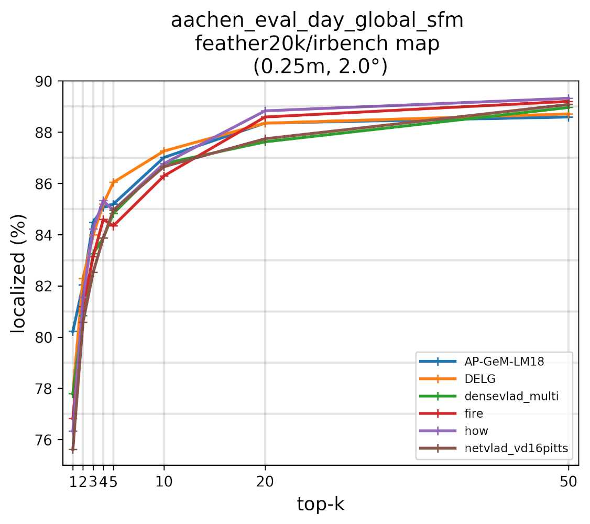
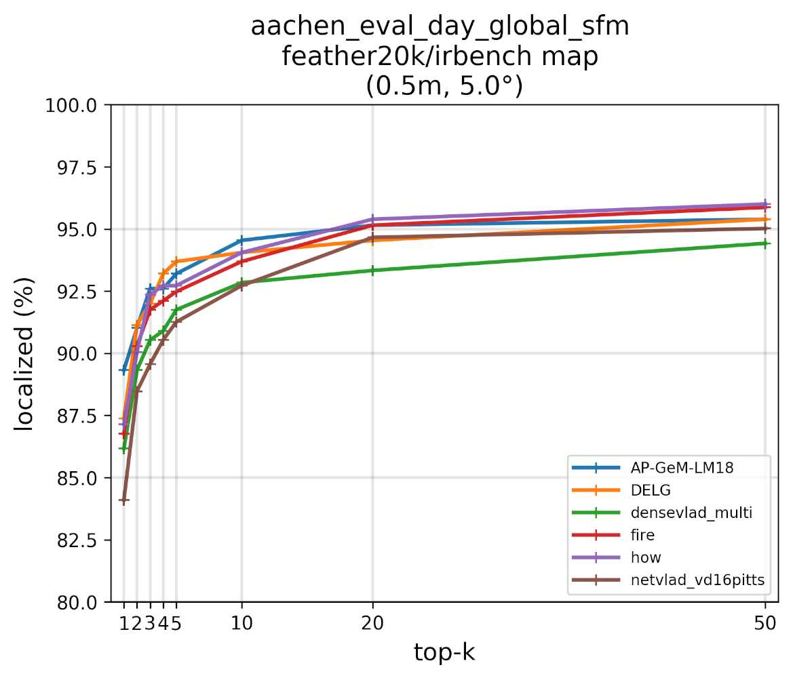
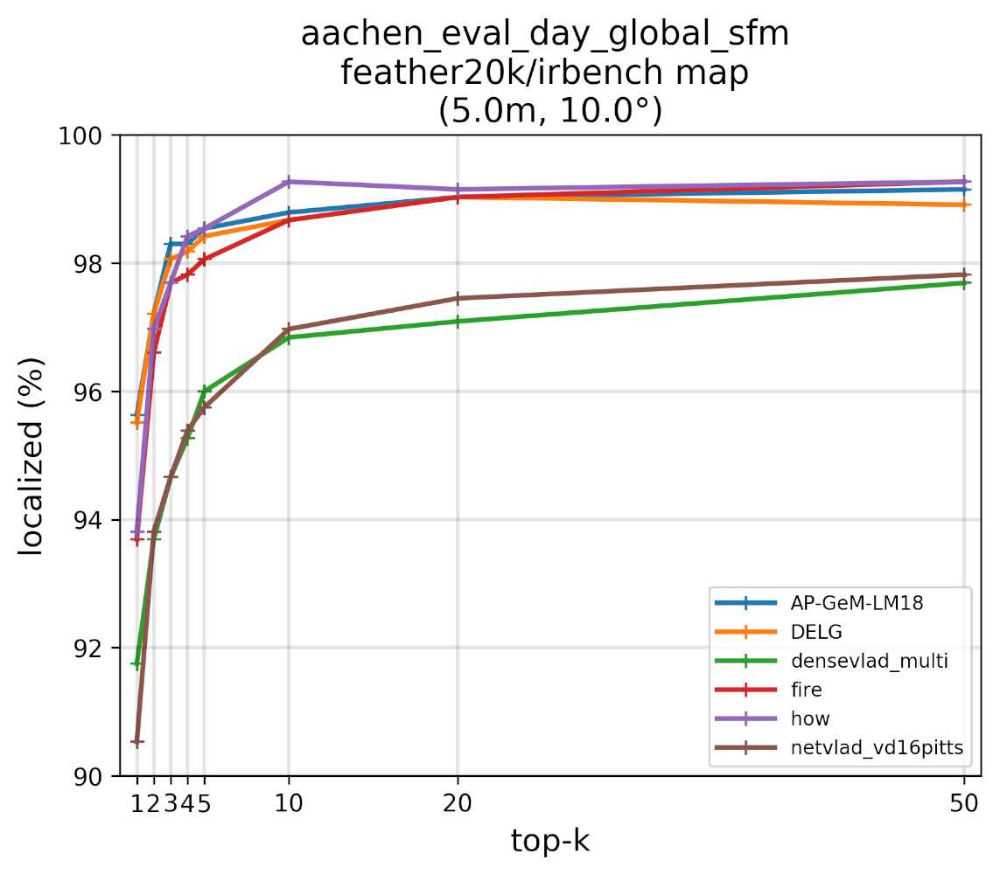

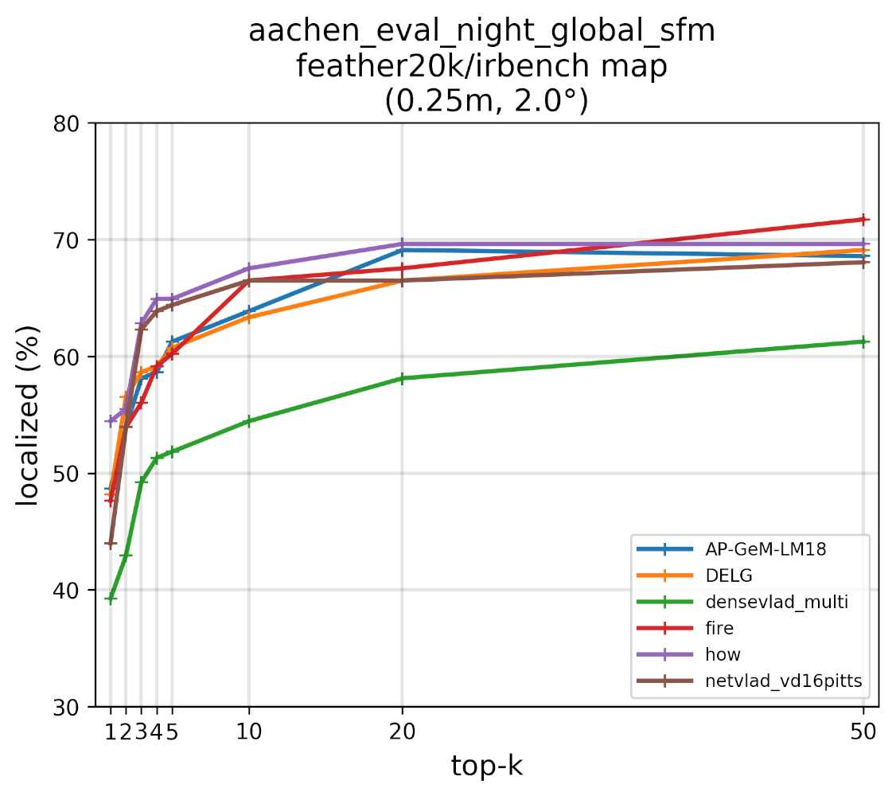
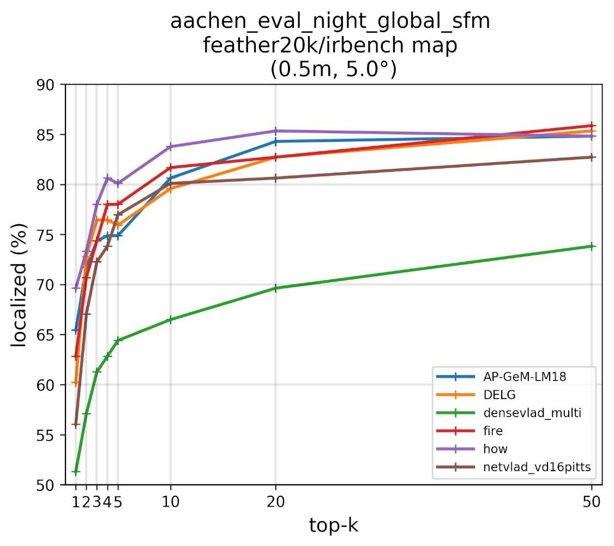
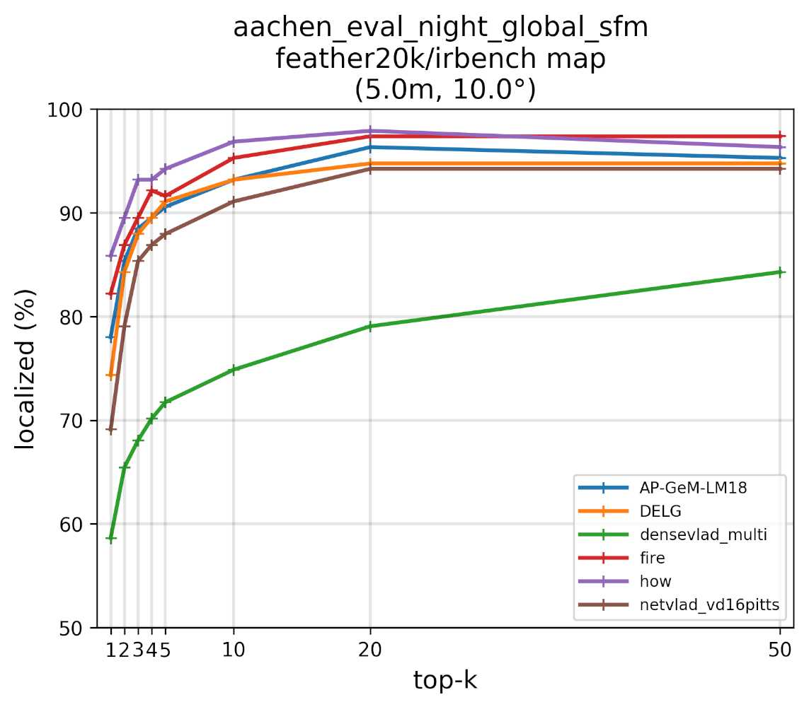

==== local_sfm

[%header]
|===
| feature type | topk 3+|day 3+|night
|||(0.25m_2.0deg)|(0.5m_5.0deg)|(5.0m_10.0deg)|(0.25m_2.0deg)|(0.5m_5.0deg)|(5.0m_10.0deg)
|AP-GeM-LM18|3|42.8%|57.5%|75.2%|9.4%|16.8%|27.8%
|DELG|3|42.7%|57.7%|73.9%|15.2%|19.9%|34.0%
|densevlad_multi|3|43.9%|58.9%|73.5%|9.4%|15.2%|20.4%
|fire|3|44.1%|62.3%|78.2%|14.7%|23.0%|36.7%
|how|3|43.9%|61.4%|78.3%|17.8%|25.7%|37.2%
|netvlad_vd16pitts|3|40.7%|55.1%|70.5%|8.9%|16.2%|24.1%
||||||||
|AP-GeM-LM18|4|56.1%|70.8%|85.8%|21.5%|31.4%|47.6%
|DELG|4|56.3%|71.2%|84.6%|24.1%|34.6%|47.6%
|densevlad_multi|4|57.7%|69.8%|81.9%|17.8%|22.5%|29.8%
|fire|4|56.4%|72.5%|87.9%|25.1%|36.1%|55.0%
|how|4|58.1%|73.7%|87.4%|26.2%|40.8%|55.5%
|netvlad_vd16pitts|4|52.8%|66.4%|79.0%|19.9%|29.3%|41.4%
||||||||
|AP-GeM-LM18|5|60.8%|74.2%|88.0%|27.2%|39.3%|54.5%
|DELG|5|61.9%|75.7%|88.0%|31.9%|42.9%|55.5%
|densevlad_multi|5|61.5%|75.0%|84.6%|18.3%|23.6%|31.9%
|fire|5|63.6%|77.6%|91.0%|30.9%|42.4%|64.4%
|how|5|63.5%|76.3%|89.7%|29.3%|48.7%|64.9%
|netvlad_vd16pitts|5|58.3%|71.5%|82.4%|23.6%|33.5%|48.7%
||||||||
|AP-GeM-LM18|10|72.5%|82.8%|93.0%|47.6%|55.5%|69.1%
|DELG|10|73.3%|84.1%|93.3%|40.8%|56.5%|69.6%
|densevlad_multi|10|71.7%|81.9%|88.4%|23.6%|32.5%|44.5%
|fire|10|73.3%|85.0%|94.7%|45.6%|61.3%|81.2%
|how|10|71.2%|84.6%|94.8%|47.1%|61.8%|79.6%
|netvlad_vd16pitts|10|69.8%|80.0%|88.7%|36.7%|51.8%|63.4%
||||||||
|AP-GeM-LM18|20|79.0%|87.3%|95.0%|48.2%|62.8%|78.5%
|DELG|20|78.6%|89.2%|95.9%|46.6%|62.8%|78.5%
|densevlad_multi|20|76.0%|85.2%|91.5%|29.3%|39.8%|52.4%
|fire|20|79.5%|89.2%|96.2%|50.3%|70.7%|86.4%
|how|20|79.1%|89.3%|96.8%|51.8%|69.1%|84.8%
|netvlad_vd16pitts|20|75.5%|84.8%|91.8%|44.0%|56.5%|70.7%
||||||||
|AP-GeM-LM18|50|82.4%|90.8%|97.8%|53.4%|69.6%|87.4%
|DELG|50|82.7%|91.0%|97.3%|52.4%|71.2%|86.9%
|densevlad_multi|50|79.5%|87.3%|93.6%|37.7%|46.6%|59.2%
|fire|50|83.3%|91.8%|97.7%|57.6%|72.8%|91.6%
|how|50|83.7%|92.0%|97.9%|57.1%|72.3%|90.1%
|netvlad_vd16pitts|50|81.3%|89.3%|95.3%|52.4%|65.5%|77.0%

|===

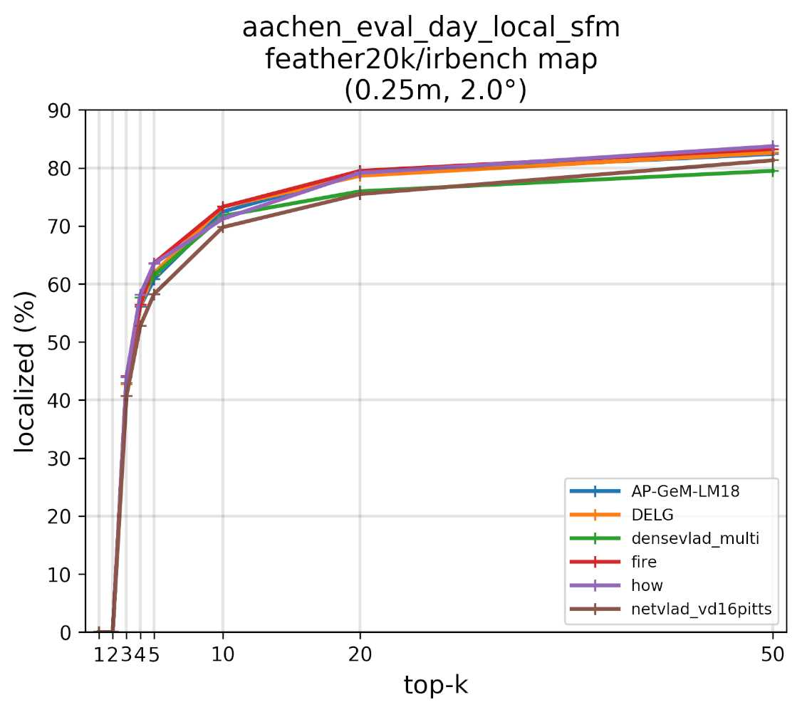
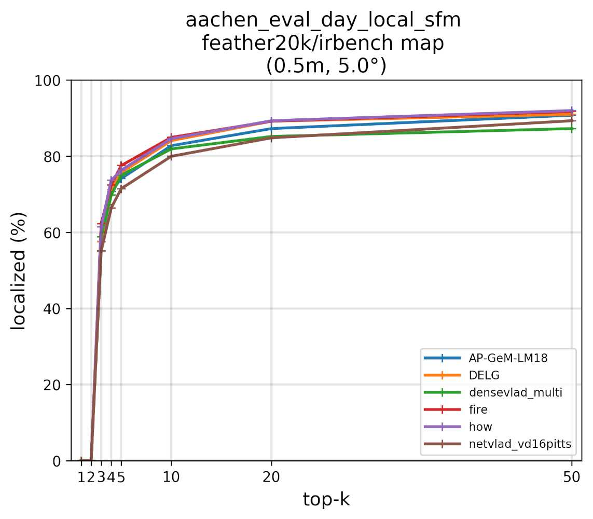
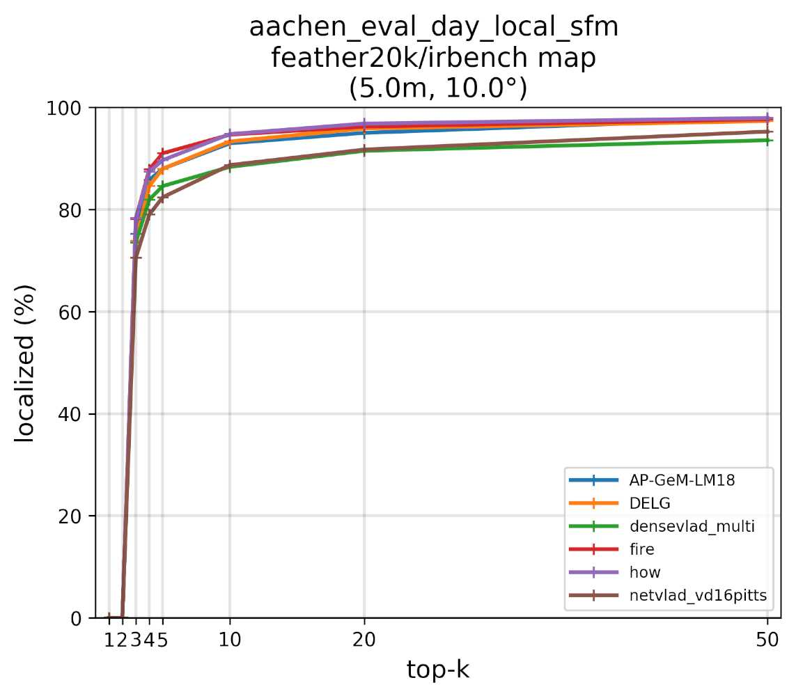

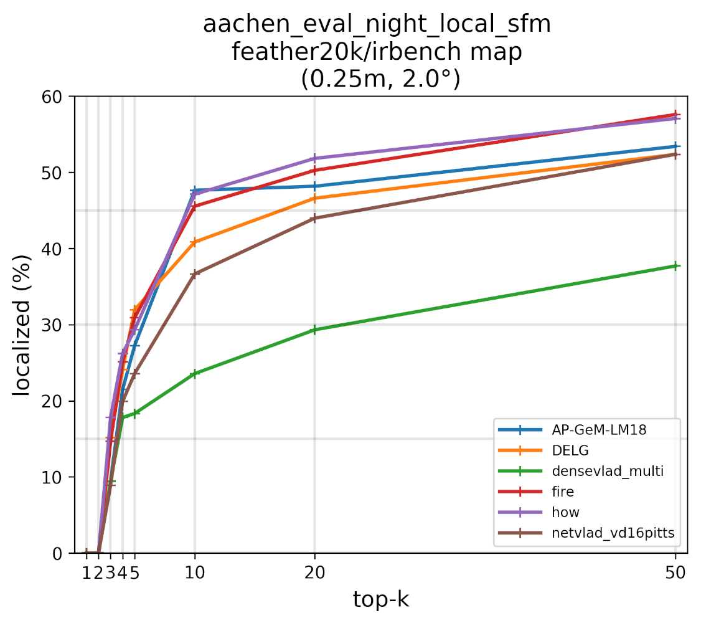
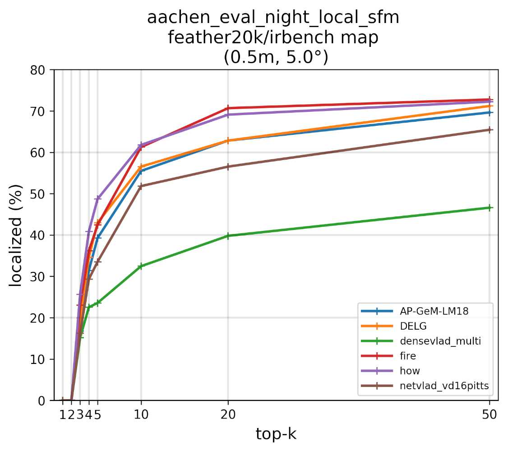
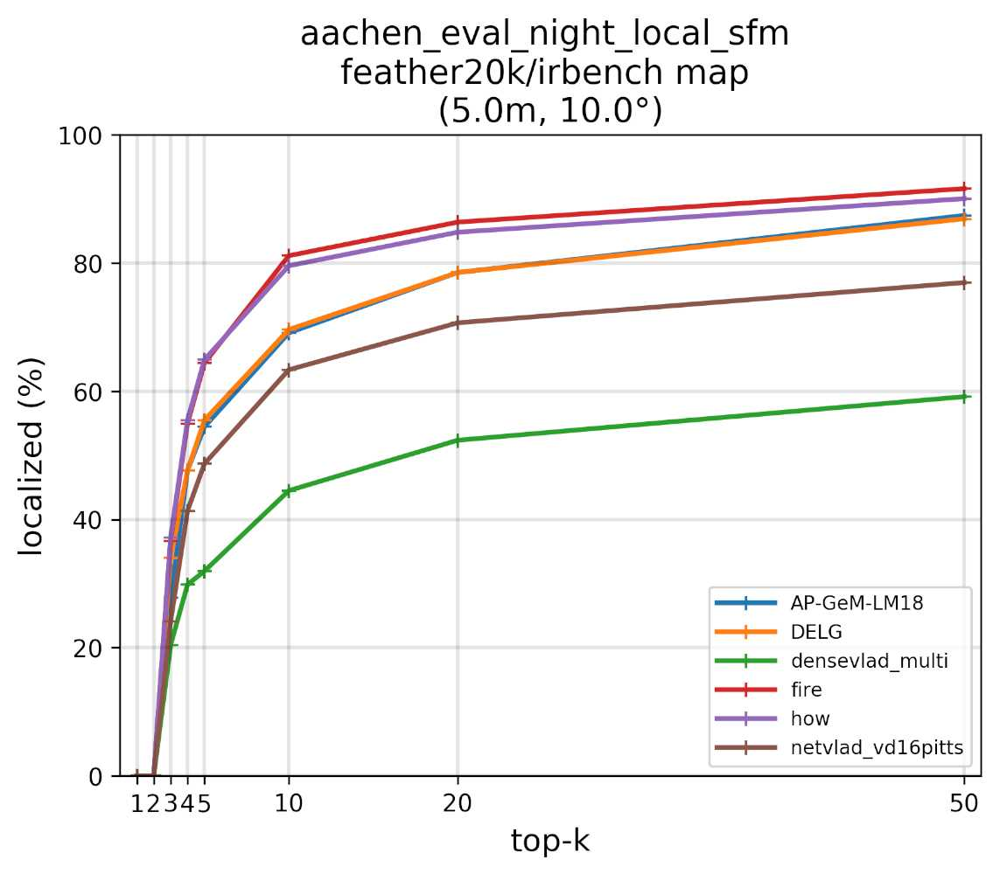

==== EWB

[%header]
|===
|feature type|topk|day|night
|||(5.0m_10.0deg)|(5.0m_10.0deg)
|AP-GeM-LM18|1|23.10%|17.30%
|DELG|1|23.90%|18.90%
|densevlad_multi|1|27.20%|17.80%
|fire|1|28.00%|18.30%
|how|1|28.00%|20.90%
|netvlad_vd16pitts|1|22.50%|16.20%
||||
|AP-GeM-LM18|2|28.20%|17.80%
|DELG|2|31.70%|17.30%
|densevlad_multi|2|33.70%|14.10%
|fire|2|34.70%|20.90%
|how|2|35.90%|21.50%
|netvlad_vd16pitts|2|28.20%|18.30%
||||
|AP-GeM-LM18|3|27.10%|16.80%
|DELG|3|31.30%|20.90%
|densevlad_multi|3|35.10%|11.50%
|fire|3|34.10%|19.90%
|how|3|33.40%|21.50%
|netvlad_vd16pitts|3|25.00%|22.00%
||||
|AP-GeM-LM18|4|24.50%|15.70%
|DELG|4|29.50%|18.90%
|densevlad_multi|4|34.60%|13.60%
|fire|4|33.70%|17.80%
|how|4|34.70%|21.50%
|netvlad_vd16pitts|4|25.90%|14.10%
||||
|AP-GeM-LM18|5|22.80%|14.70%
|DELG|5|28.30%|16.20%
|densevlad_multi|5|31.80%|13.10%
|fire|5|32.00%|20.40%
|how|5|34.20%|20.40%
|netvlad_vd16pitts|5|23.40%|12.00%
||||
|AP-GeM-LM18|10|17.40%|12.00%
|DELG|10|21.40%|12.00%
|densevlad_multi|10|24.90%|6.80%
|fire|10|22.80%|13.10%
|how|10|27.60%|19.40%
|netvlad_vd16pitts|10|19.10%|9.40%
||||
|AP-GeM-LM18|20|11.80%|5.20%
|DELG|20|13.80%|5.20%
|densevlad_multi|20|16.90%|1.60%
|fire|20|16.80%|7.90%
|how|20|18.90%|8.40%
|netvlad_vd16pitts|20|10.90%|4.20%
||||
|AP-GeM-LM18|50|4.50%|3.70%
|DELG|50|5.70%|5.80%
|densevlad_multi|50|5.10%|1.60%
|fire|50|7.00%|4.20%
|how|50|7.40%|2.60%
|netvlad_vd16pitts|50|4.10%|1.10%
|===

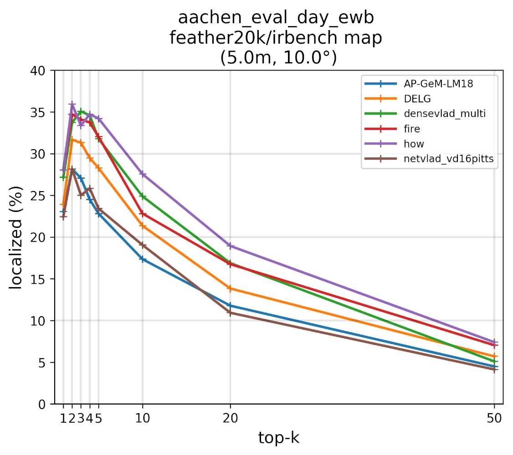
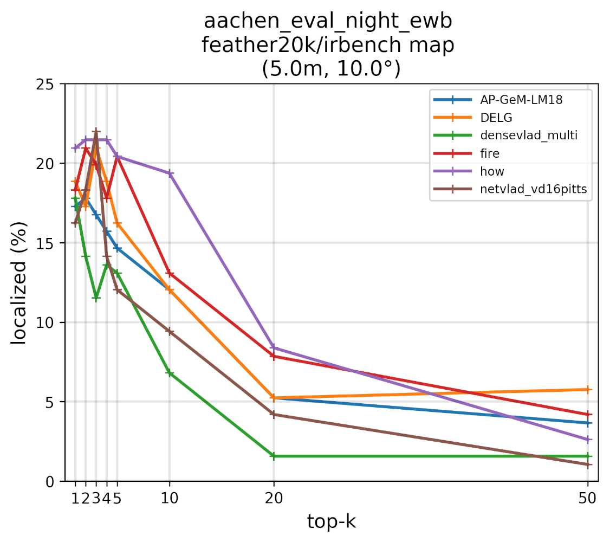

=== Baidu-mall

==== global_sfm

[%header,format=csv,separator=;]
|===
feature type;topk;(0.25m_2.0deg);(0.5m_5.0deg);(5.0m_10.0deg);median distance (m);median angle (deg)
AP-GeM-LM18;1;41.49%;52.97%;61.04%;0.3991;1.6483
DELG;1;39.88%;50.79%;59.29%;0.4515;1.8499
densevlad_multi;1;43.06%;53.93%;61.08%;0.362;1.5849
fire;1;48.65%;63.61%;72.29%;0.2539;1.1739
how;1;51.40%;66.27%;76.22%;0.2308;1.1269
netvlad_vd16pitts;1;42.10%;52.27%;59.55%;0.3983;1.7977
;;;;;;
AP-GeM-LM18;2;45.99%;58.55%;67.32%;0.2867;1.2706
DELG;2;45.72%;57.94%;65.62%;0.2937;1.2847
densevlad_multi;2;47.38%;59.42%;66.58%;0.2684;1.2062
fire;2;55.24%;69.98%;78.84%;0.2087;0.9831
how;2;58.03%;73.43%;82.68%;0.1906;0.9223
netvlad_vd16pitts;2;47.64%;58.64%;66.67%;0.2733;1.2313
;;;;;;
AP-GeM-LM18;3;49.13%;62.13%;70.81%;0.247;1.117
DELG;3;48.39%;61.26%;68.98%;0.2594;1.1736
densevlad_multi;3;49.56%;61.61%;69.24%;0.2423;1.1299
fire;3;56.72%;71.99%;80.98%;0.1969;0.9265
how;3;60.78%;76.66%;84.99%;0.1792;0.8848
netvlad_vd16pitts;3;49.35%;61.30%;69.33%;0.2468;1.1575
;;;;;;
AP-GeM-LM18;4;50.92%;63.48%;72.77%;0.2306;1.0552
DELG;4;49.91%;63.00%;71.07%;0.2428;1.0829
densevlad_multi;4;51.44%;63.87%;71.38%;0.2256;1.0703
fire;4;58.60%;73.43%;81.59%;0.1845;0.903
how;4;61.61%;77.31%;85.56%;0.1727;0.8701
netvlad_vd16pitts;4;50.96%;63.39%;71.47%;0.2331;1.0867
;;;;;;
AP-GeM-LM18;5;51.27%;64.62%;74.04%;0.2278;1.0318
DELG;5;51.40%;64.40%;72.77%;0.2271;1.0535
densevlad_multi;5;52.53%;65.45%;73.04%;0.2186;1.0229
fire;5;59.95%;74.65%;82.77%;0.1804;0.8775
how;5;62.91%;78.88%;86.61%;0.1673;0.8419
netvlad_vd16pitts;5;51.96%;64.49%;72.99%;0.2227;1.0418
;;;;;;
AP-GeM-LM18;10;54.23%;68.19%;76.92%;0.2075;0.9539
DELG;10;55.15%;68.11%;76.09%;0.2041;0.9479
densevlad_multi;10;54.84%;69.59%;77.09%;0.2007;0.9355
fire;10;62.13%;76.40%;83.99%;0.1714;0.8559
how;10;64.79%;80.72%;88.31%;0.1636;0.8137
netvlad_vd16pitts;10;55.15%;68.54%;76.88%;0.2056;0.9586
;;;;;;
AP-GeM-LM18;20;56.24%;70.72%;80.02%;0.1953;0.9077
DELG;20;57.98%;70.68%;79.54%;0.1899;0.9006
densevlad_multi;20;58.12%;72.64%;80.41%;0.1827;0.8944
fire;20;63.22%;79.14%;86.52%;0.1674;0.8469
how;20;65.27%;81.68%;89.40%;0.1599;0.8228
netvlad_vd16pitts;20;58.29%;71.60%;80.10%;0.1891;0.9201
;;;;;;
AP-GeM-LM18;50;57.98%;72.91%;82.37%;0.187;0.8748
DELG;50;59.03%;74.13%;82.16%;0.1822;0.8789
densevlad_multi;50;61.43%;76.83%;84.69%;0.1734;0.8705
fire;50;63.57%;79.71%;87.57%;0.1653;0.8428
how;50;65.58%;81.72%;88.92%;0.16;0.8302
netvlad_vd16pitts;50;60.03%;75.17%;83.33%;0.1771;0.8933

|===

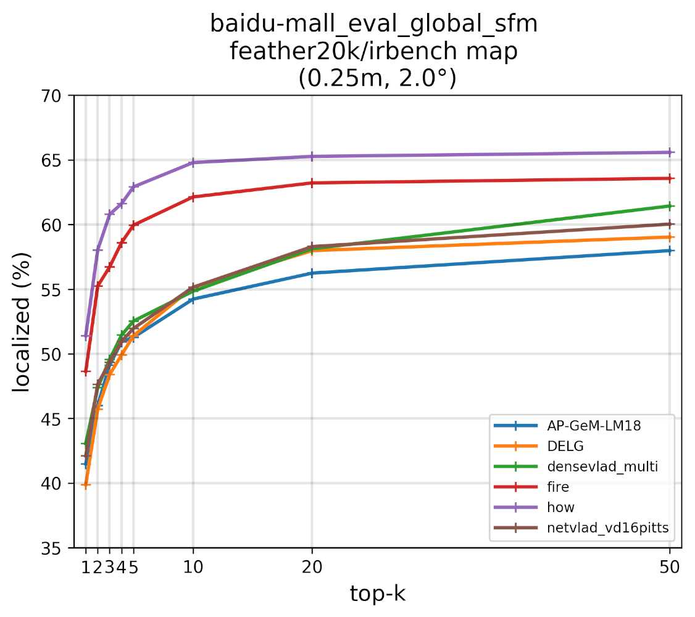
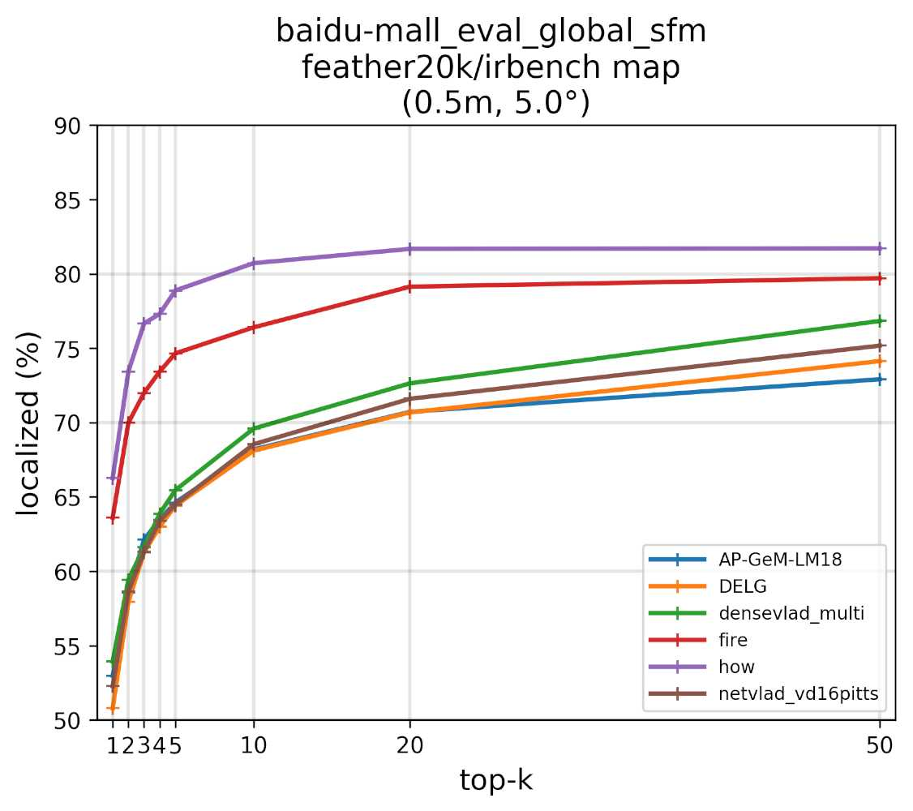
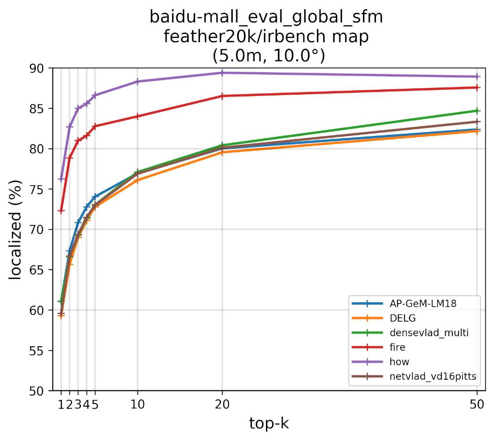

==== local_sfm

[%header,format=csv,separator=;]
|===       
feature type;topk;(0.25m_2.0deg);(0.5m_5.0deg);(5.0m_10.0deg);median distance (m);median angle (deg)
AP-GeM-LM18;3;2.71%;4.01%;5.89%;inf;inf
DELG;3;2.66%;4.23%;5.98%;inf;inf
densevlad_multi;3;3.10%;4.71%;6.72%;inf;inf
fire;3;3.45%;5.80%;9.12%;inf;inf
how;3;3.62%;5.72%;9.60%;inf;inf
netvlad_vd16pitts;3;2.44%;3.88%;5.67%;inf;inf
;;;;;;
AP-GeM-LM18;4;7.64%;12.26%;16.71%;inf;inf
DELG;4;6.76%;10.99%;15.14%;inf;inf
densevlad_multi;4;7.72%;11.82%;15.84%;inf;inf
fire;4;9.69%;15.36%;22.16%;inf;inf
how;4;9.86%;16.58%;23.04%;inf;inf
netvlad_vd16pitts;4;6.54%;10.38%;14.27%;inf;inf
;;;;;;
AP-GeM-LM18;5;12.00%;18.41%;24.30%;inf;inf
DELG;5;10.82%;16.36%;21.47%;inf;inf
densevlad_multi;5;11.78%;17.15%;22.25%;inf;inf
fire;5;14.88%;22.86%;30.89%;inf;inf
how;5;15.40%;24.30%;32.64%;inf;inf
netvlad_vd16pitts;5;10.03%;15.58%;20.20%;inf;inf
;;;;;;
AP-GeM-LM18;10;19.28%;27.53%;37.83%;inf;inf
DELG;10;17.93%;25.09%;33.99%;inf;inf
densevlad_multi;10;19.11%;26.66%;35.60%;inf;inf
fire;10;26.35%;37.52%;48.60%;2.6673;11.6364
how;10;27.36%;40.01%;53.62%;1.1763;5.4334
netvlad_vd16pitts;10;17.84%;26.70%;34.47%;inf;inf
;;;;;;
AP-GeM-LM18;20;23.69%;34.16%;45.33%;6.1982;23.359
DELG;20;22.21%;31.11%;42.45%;inf;inf
densevlad_multi;20;23.12%;31.89%;42.41%;157.3505;178.8039
fire;20;29.93%;42.58%;55.58%;0.9282;3.9254
how;20;31.76%;45.38%;60.65%;0.6982;3.1201
netvlad_vd16pitts;20;22.21%;32.77%;42.54%;39.8295;148.5412
;;;;;;
AP-GeM-LM18;50;26.61%;37.57%;51.66%;1.6433;6.1614
DELG;50;26.96%;37.70%;50.48%;1.9979;6.9691
densevlad_multi;50;26.96%;37.87%;50.79%;1.8145;6.5525
fire;50;32.02%;46.42%;59.86%;0.6654;2.7916
how;50;33.42%;47.95%;62.17%;0.5579;2.5338
netvlad_vd16pitts;50;26.70%;38.09%;51.48%;1.662;6.651

|===

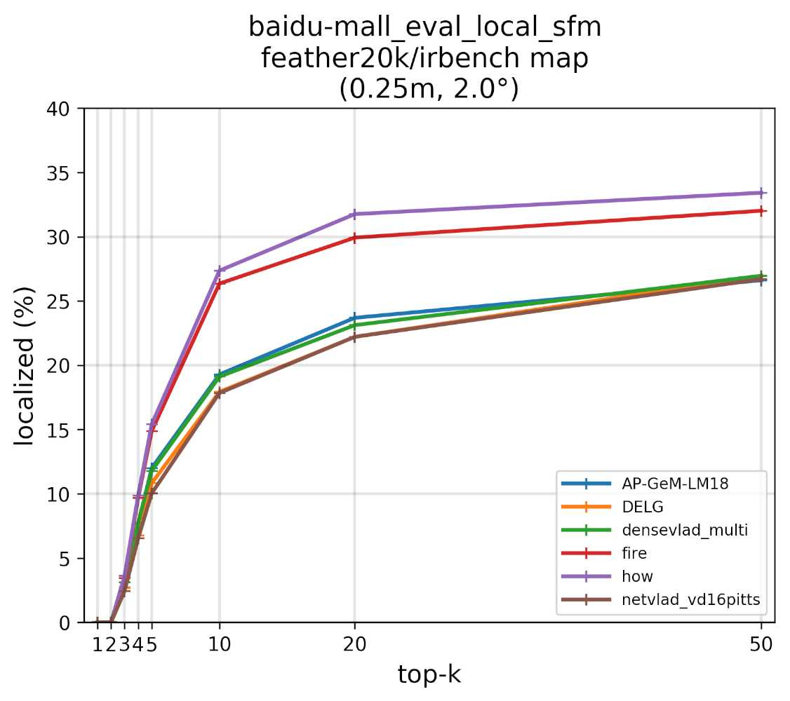
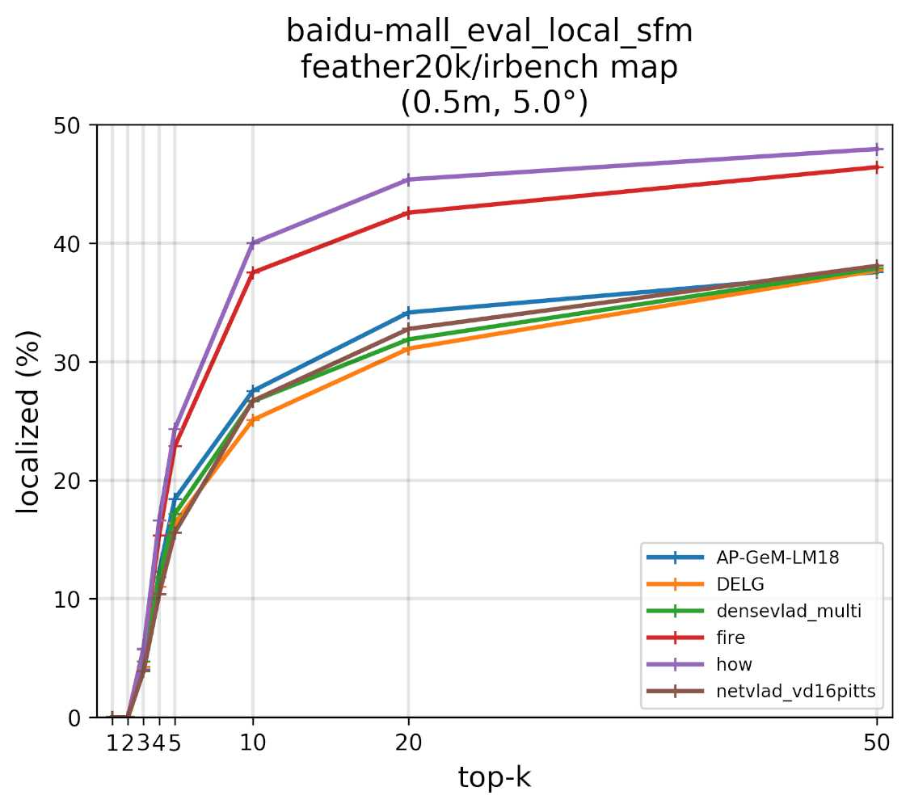
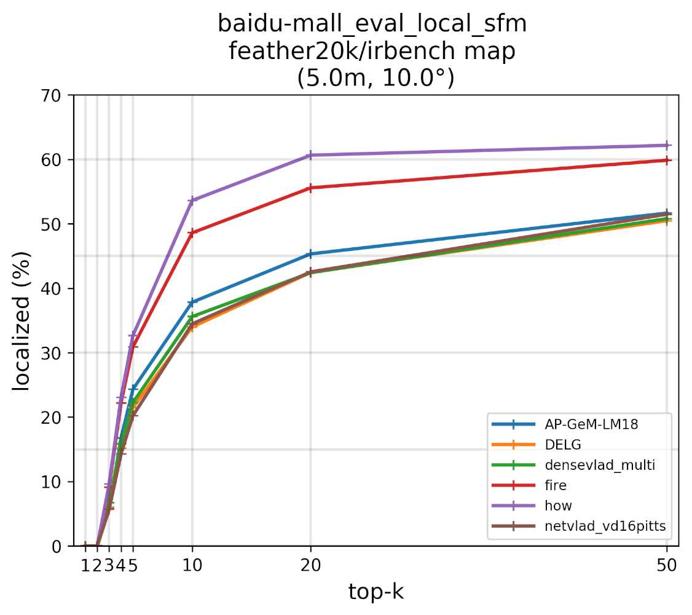

==== EWB

[%header,format=csv,separator=;]
|===
feature type;topk;(5.0m_10.0deg);median distance (m);median angle (deg)
AP-GeM-LM18;1;10.43%;7.2109;26.6689
DELG;1;10.60%;6.2504;26.7181
densevlad_multi;1;12.00%;6.673;23.697
fire;1;12.35%;5.575;25.5125
how;1;12.52%;5.2578;25.1081
netvlad_vd16pitts;1;11.26%;6.47;26.5437
;;;;
AP-GeM-LM18;2;10.43%;7.542;27.8744
DELG;2;11.17%;6.6436;27.7308
densevlad_multi;2;11.56%;7.5993;24.4993
fire;2;13.31%;5.5801;25.5571
how;2;13.66%;5.2997;23.9257
netvlad_vd16pitts;2;11.26%;6.6716;28.1548
;;;;
AP-GeM-LM18;3;9.60%;8.4706;26.1011
DELG;3;10.73%;7.1468;26.7348
densevlad_multi;3;11.26%;9.1667;23.4016
fire;3;12.61%;5.6782;24.9604
how;3;13.31%;5.5141;23.6242
netvlad_vd16pitts;3;10.60%;7.497;25.9385
;;;;
AP-GeM-LM18;4;8.07%;9.2447;26.9744
DELG;4;9.95%;8.0939;27.3394
densevlad_multi;4;10.03%;11.8928;23.8444
fire;4;12.00%;5.9515;25.1414
how;4;12.83%;5.6813;23.9538
netvlad_vd16pitts;4;9.77%;8.8262;27.6777
;;;;
AP-GeM-LM18;5;7.33%;10.4991;26.6251
DELG;5;9.12%;9.4026;26.9786
densevlad_multi;5;8.77%;15.1397;24.2678
fire;5;11.39%;6.2185;24.6712
how;5;12.13%;5.8031;24.0752
netvlad_vd16pitts;5;9.21%;10.8028;26.4875
;;;;
AP-GeM-LM18;10;3.93%;18.6119;28.2682
DELG;10;3.75%;21.9131;28.5106
densevlad_multi;10;3.84%;26.7983;25.3009
fire;10;7.11%;11.7412;24.1158
how;10;8.90%;8.7749;23.7837
netvlad_vd16pitts;10;3.97%;21.292;27.0966
;;;;
AP-GeM-LM18;20;0.87%;31.5298;33.336
DELG;20;1.44%;35.3734;32.2189
densevlad_multi;20;1.44%;38.8395;27.4481
fire;20;2.53%;24.6811;25.3815
how;20;3.58%;16.4386;25.1866
netvlad_vd16pitts;20;1.18%;33.7681;30.084
;;;;
AP-GeM-LM18;50;0.13%;47.8105;43.4094
DELG;50;0.22%;49.1835;41.8617
densevlad_multi;50;0.09%;51.9908;34.0089
fire;50;0.26%;44.6016;33.2701
how;50;0.57%;38.4978;34.0702
netvlad_vd16pitts;50;0.22%;46.5507;36.354

|===

image::../doc/plots/feather2d2/baidu-baidu-mall_eval_ewb_5_0m_10_0deg.jpg[baidu-baidu-mall_eval_ewb_5_0m_10_0deg]

=== RobotCar Seasons

==== global_sfm

[%header]
|===
|feature type|topk 3+|day 3+|night
|||(0.25m_2.0deg)|(0.5m_5.0deg)|(5.0m_10.0deg)|(0.25m_2.0deg)|(0.5m_5.0deg)|(5.0m_10.0deg)
|AP-GeM-LM18|1|47.9%|76.8%|92.5%|7.9%|18.2%|35.3%
|DELG|1|47.2%|74.8%|89.6%|7.0%|14.0%|24.9%
|densevlad_multi|1|48.6%|76.4%|91.4%|10.6%|18.8%|26.2%
|fire|1|49.9%|78.5%|93.8%|8.4%|18.5%|29.0%
|how|1|48.7%|77.2%|92.3%|11.3%|22.1%|34.4%
|netvlad_vd16pitts|1|48.7%|77.5%|93.1%|6.6%|12.3%|18.2%
||||||||
|AP-GeM-LM18|2|49.5%|78.3%|93.4%|12.3%|26.1%|40.4%
|DELG|2|49.0%|76.2%|91.0%|8.4%|17.1%|28.8%
|densevlad_multi|2|49.9%|78.1%|92.7%|11.9%|23.2%|31.4%
|fire|2|51.0%|79.4%|94.5%|11.4%|21.4%|32.7%
|how|2|50.0%|78.1%|93.1%|12.0%|25.3%|38.4%
|netvlad_vd16pitts|2|49.8%|78.6%|93.9%|9.9%|16.0%|23.9%
||||||||
|AP-GeM-LM18|3|49.9%|78.8%|94.0%|13.9%|29.0%|45.6%
|DELG|3|49.5%|76.9%|91.9%|9.5%|19.3%|30.6%
|densevlad_multi|3|50.8%|78.8%|93.4%|13.2%|25.9%|34.7%
|fire|3|51.3%|79.7%|94.9%|12.2%|23.0%|36.0%
|how|3|50.6%|78.7%|93.5%|13.6%|26.5%|40.3%
|netvlad_vd16pitts|3|50.7%|79.0%|94.6%|10.3%|17.3%|27.8%
||||||||
|AP-GeM-LM18|4|50.4%|79.2%|94.2%|15.5%|31.3%|47.7%
|DELG|4|50.2%|77.8%|92.6%|9.6%|20.3%|31.7%
|densevlad_multi|4|51.0%|79.1%|93.8%|14.4%|27.6%|37.2%
|fire|4|51.7%|80.0%|95.2%|14.0%|25.5%|37.5%
|how|4|50.7%|78.9%|93.9%|13.9%|28.0%|41.3%
|netvlad_vd16pitts|4|51.1%|79.5%|94.9%|11.3%|19.6%|29.3%
||||||||
|AP-GeM-LM18|5|50.8%|79.6%|94.4%|16.0%|32.1%|49.2%
|DELG|5|50.3%|78.0%|93.0%|9.5%|20.7%|33.6%
|densevlad_multi|5|51.2%|79.3%|94.0%|14.5%|28.5%|38.0%
|fire|5|51.6%|80.1%|95.3%|14.6%|26.9%|39.3%
|how|5|51.2%|79.1%|94.2%|14.1%|29.6%|41.9%
|netvlad_vd16pitts|5|51.0%|79.7%|95.0%|12.0%|21.4%|30.9%
||||||||
|AP-GeM-LM18|10|51.5%|80.0%|94.9%|19.8%|36.7%|54.3%
|DELG|10|51.0%|78.9%|93.7%|11.1%|23.8%|36.8%
|densevlad_multi|10|51.9%|80.0%|94.7%|15.6%|31.3%|43.2%
|fire|10|52.3%|80.7%|96.1%|16.4%|30.1%|44.5%
|how|10|51.8%|80.0%|95.2%|15.3%|32.9%|46.9%
|netvlad_vd16pitts|10|52.1%|80.6%|95.7%|13.0%|24.5%|35.9%
||||||||
|AP-GeM-LM18|20|52.2%|80.4%|95.6%|20.7%|39.9%|57.6%
|DELG|20|51.6%|79.4%|94.7%|13.1%|27.2%|40.8%
|densevlad_multi|20|52.1%|80.6%|95.3%|16.4%|33.3%|45.8%
|fire|20|52.4%|80.9%|96.7%|19.5%|32.9%|47.6%
|how|20|52.3%|80.7%|95.8%|17.4%|33.6%|48.4%
|netvlad_vd16pitts|20|52.4%|80.8%|95.9%|13.9%|27.8%|39.8%
||||||||
|AP-GeM-LM18|50|52.6%|80.8%|96.2%|22.6%|41.9%|57.7%
|DELG|50|52.3%|80.4%|95.7%|15.4%|31.1%|45.4%
|densevlad_multi|50|52.5%|80.9%|95.7%|17.2%|34.2%|47.2%
|fire|50|52.7%|81.1%|96.8%|18.6%|31.6%|46.9%
|how|50|52.7%|81.1%|96.3%|17.4%|35.0%|49.4%
|netvlad_vd16pitts|50|52.7%|81.1%|96.2%|15.3%|30.0%|42.7%
|===

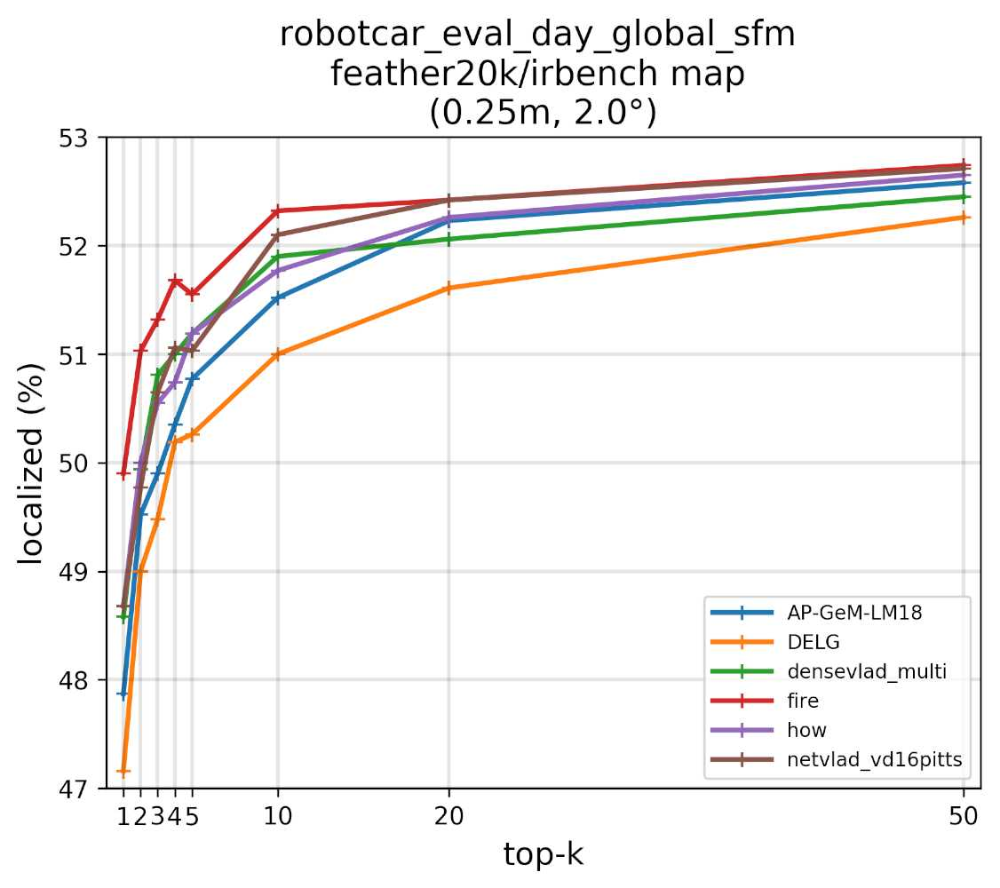
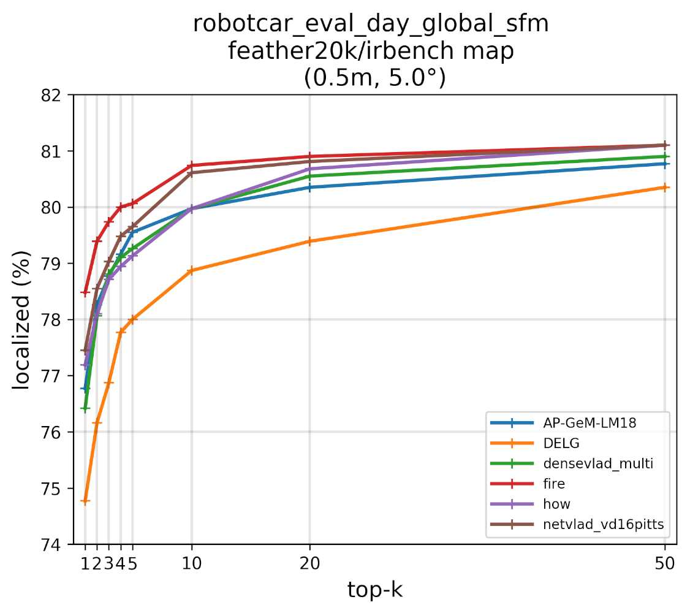
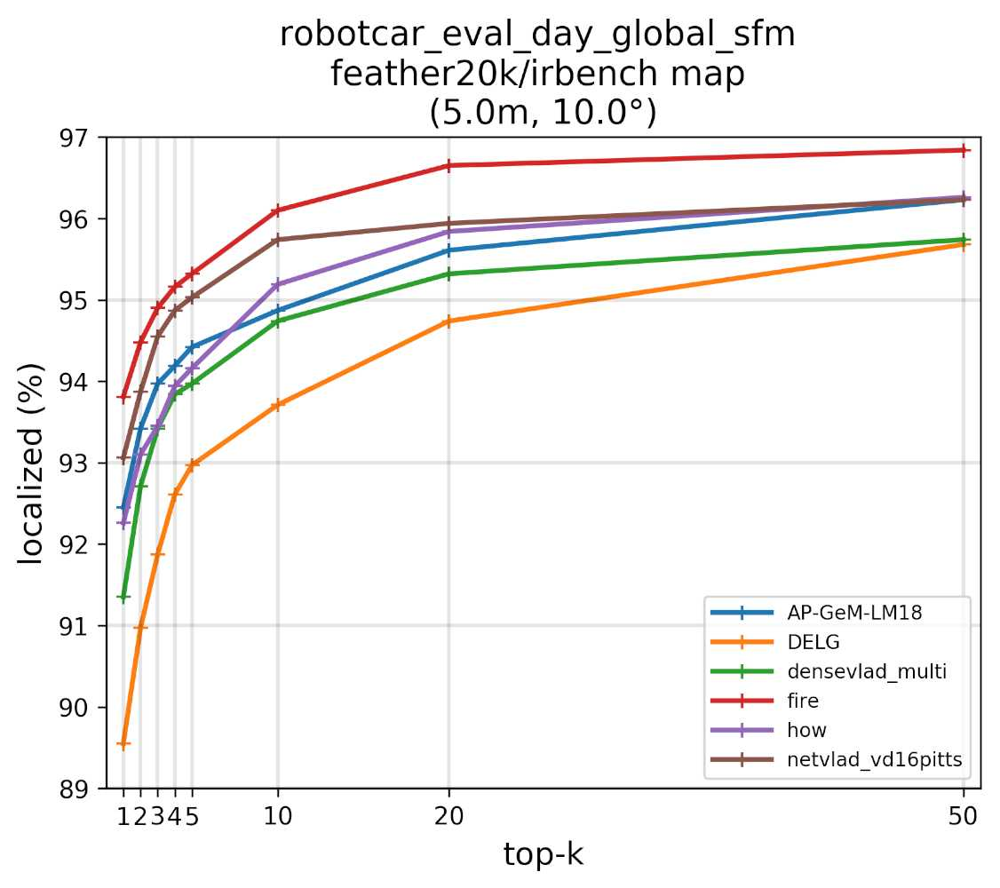

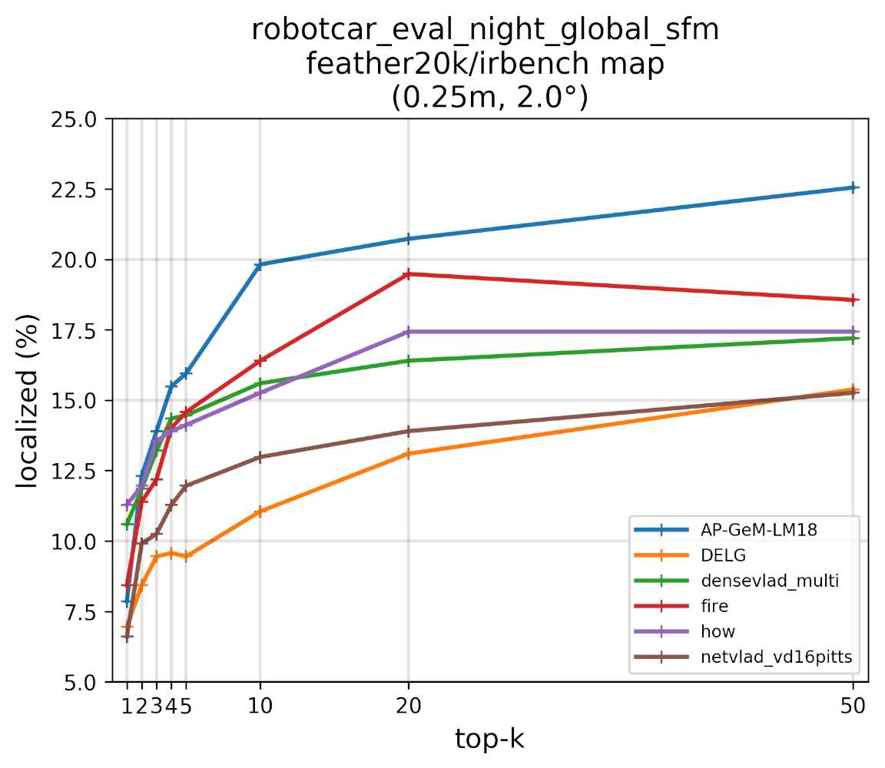
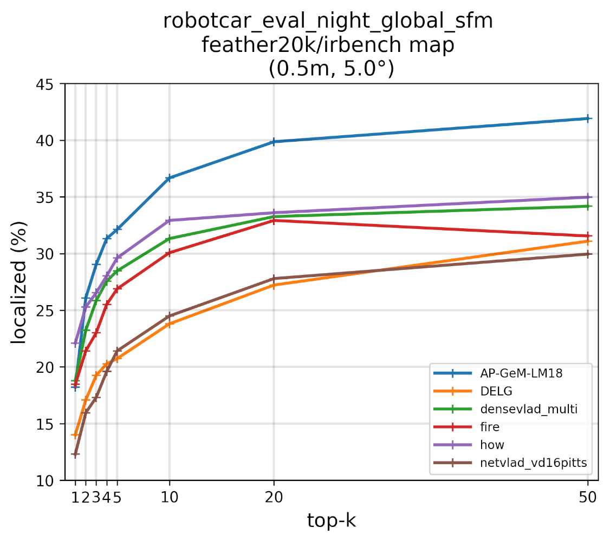
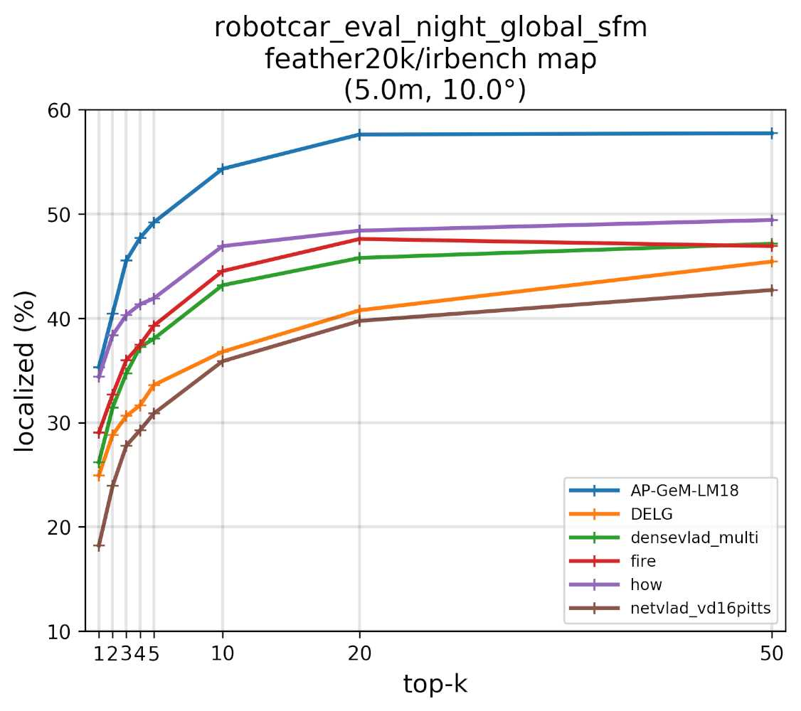

==== local_sfm

[%header]
|===
|feature type|topk 3+|day 3+|night
|||(0.25m_2.0deg)|(0.5m_5.0deg)|(5.0m_10.0deg)|(0.25m_2.0deg)|(0.5m_5.0deg)|(5.0m_10.0deg)
|AP-GeM-LM18|3|23.8%|46.3%|68.7%|0.5%|1.0%|2.7%
|DELG|3|23.3%|45.6%|66.7%|0.2%|0.9%|2.1%
|densevlad_multi|3|25.4%|49.3%|70.6%|0.3%|1.1%|3.3%
|fire|3|26.6%|50.7%|72.3%|0.5%|1.3%|3.4%
|how|3|26.7%|50.4%|71.4%|0.6%|2.2%|5.6%
|netvlad_vd16pitts|3|25.2%|48.7%|70.3%|0.0%|0.6%|2.2%
||||||||
|AP-GeM-LM18|4|34.7%|63.5%|85.9%|1.7%|4.8%|10.0%
|DELG|4|34.3%|61.9%|82.5%|1.4%|3.8%|7.7%
|densevlad_multi|4|35.9%|64.5%|84.3%|1.6%|4.2%|8.3%
|fire|4|36.9%|66.9%|87.4%|0.9%|4.9%|10.8%
|how|4|37.3%|66.3%|86.2%|2.2%|7.1%|14.7%
|netvlad_vd16pitts|4|34.9%|64.1%|84.7%|0.6%|2.7%|6.0%
||||||||
|AP-GeM-LM18|5|39.2%|68.5%|89.1%|2.4%|7.2%|17.2%
|DELG|5|38.1%|67.1%|86.4%|1.1%|5.6%|11.1%
|densevlad_multi|5|39.0%|68.9%|86.8%|2.2%|6.2%|10.8%
|fire|5|41.7%|71.8%|90.7%|2.1%|8.7%|14.6%
|how|5|40.7%|70.7%|88.7%|3.0%|10.5%|20.6%
|netvlad_vd16pitts|5|39.5%|68.7%|88.6%|1.5%|4.4%|8.0%
||||||||
|AP-GeM-LM18|10|45.3%|76.3%|92.8%|5.9%|16.0%|27.8%
|DELG|10|44.6%|73.5%|90.7%|4.2%|12.8%|21.4%
|densevlad_multi|10|44.3%|74.1%|90.5%|4.3%|11.3%|17.2%
|fire|10|45.6%|76.6%|93.7%|4.4%|14.4%|22.6%
|how|10|45.0%|75.5%|91.7%|6.6%|17.4%|29.2%
|netvlad_vd16pitts|10|44.2%|74.7%|92.2%|3.6%|8.8%|13.1%
||||||||
|AP-GeM-LM18|20|47.1%|77.9%|93.9%|9.0%|23.1%|36.3%
|DELG|20|47.0%|76.8%|93.1%|7.9%|18.3%|27.3%
|densevlad_multi|20|46.6%|76.2%|92.4%|6.2%|15.4%|23.6%
|fire|20|48.4%|79.1%|94.9%|7.3%|18.2%|27.7%
|how|20|47.3%|77.6%|93.3%|11.1%|22.4%|34.9%
|netvlad_vd16pitts|20|46.4%|77.6%|94.0%|5.4%|12.6%|19.0%
||||||||
|AP-GeM-LM18|50|48.2%|79.3%|95.0%|13.1%|29.0%|45.4%
|DELG|50|48.6%|78.7%|94.6%|9.9%|21.9%|35.7%
|densevlad_multi|50|47.7%|78.1%|93.9%|8.5%|18.9%|30.5%
|fire|50|48.7%|80.1%|95.7%|9.1%|20.8%|33.8%
|how|50|48.7%|79.2%|94.8%|11.7%|26.9%|39.9%
|netvlad_vd16pitts|50|48.0%|79.5%|95.6%|7.3%|16.0%|26.4%

|===

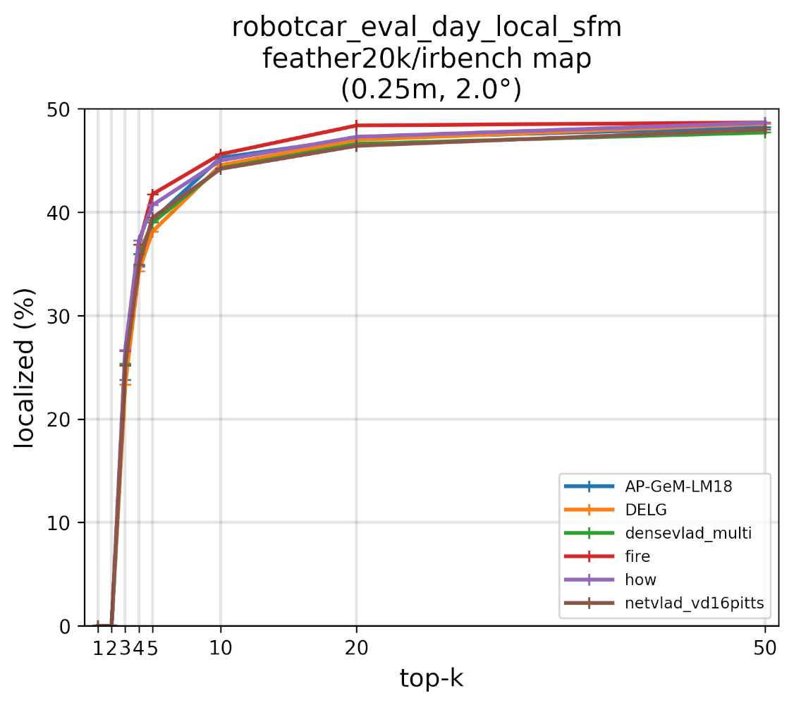
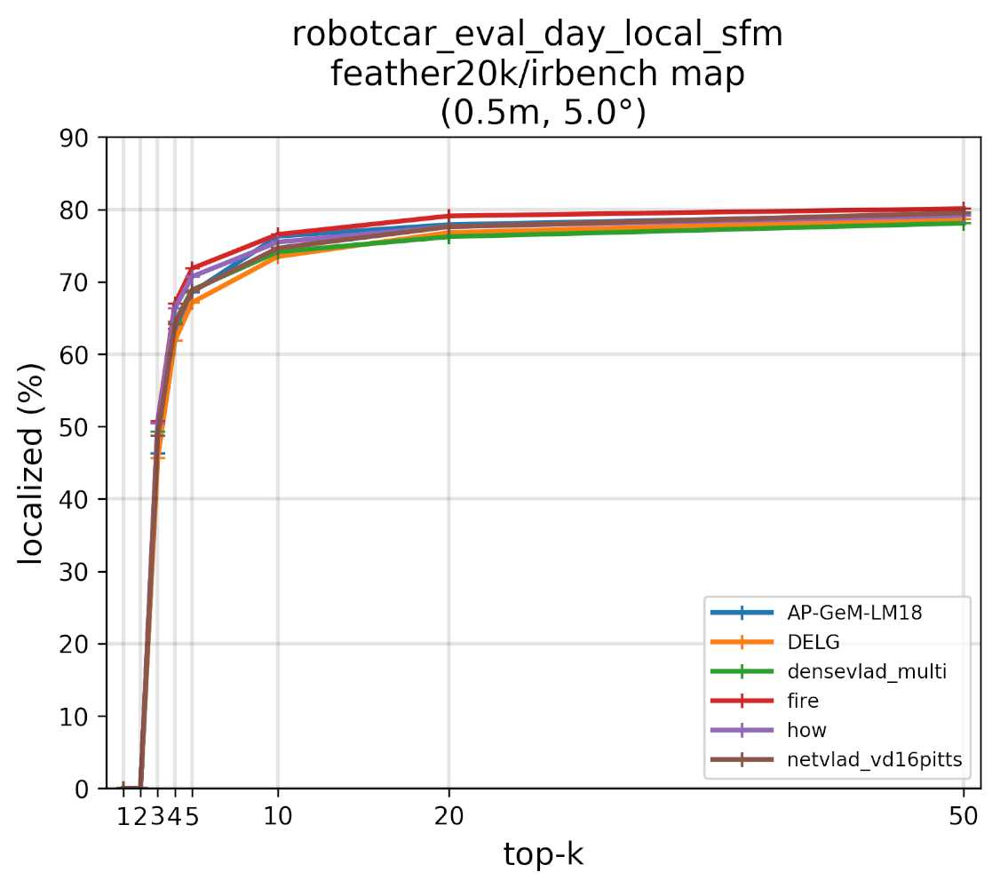
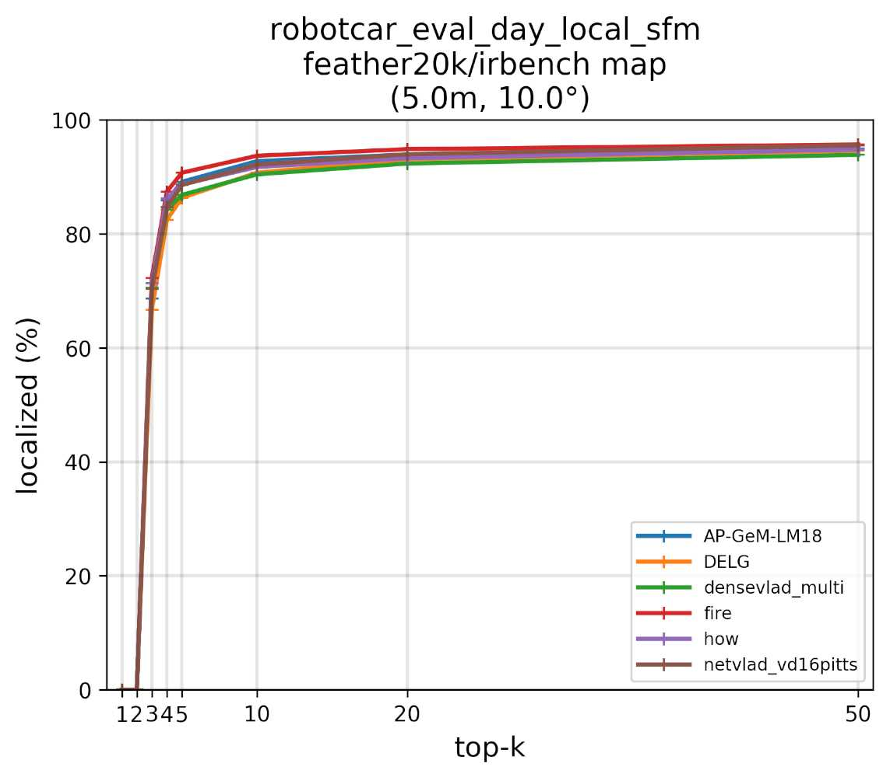

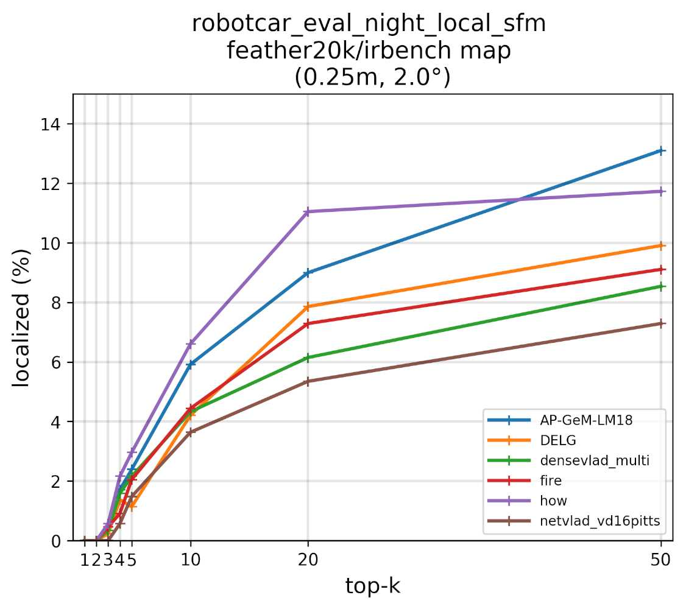
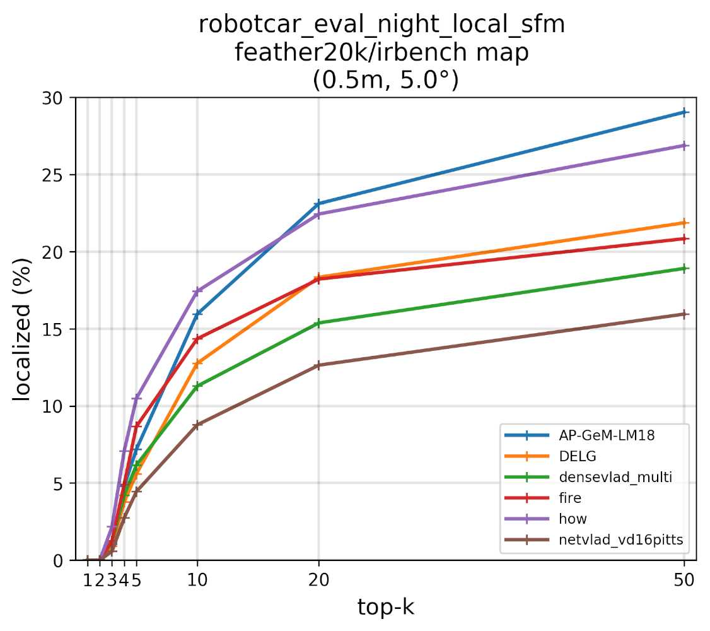
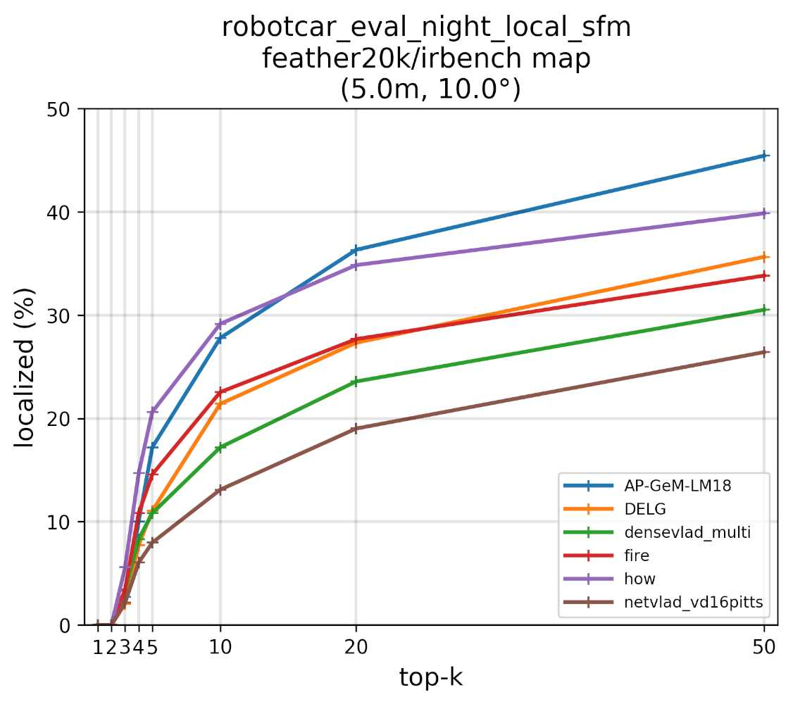

==== EWB

[%header]
|===
|feature type|topk|day|night
|||(5.0m_10.0deg)|(5.0m_10.0deg)
|AP-GeM-LM18|1|90.10%|28.40%
|DELG|1|85.40%|22.70%
|densevlad_multi|1|90.10%|24.90%
|fire|1|92.10%|25.90%
|how|1|91.00%|31.70%
|netvlad_vd16pitts|1|91.50%|16.10%
||||
|AP-GeM-LM18|2|90.30%|27.20%
|DELG|2|85.10%|20.10%
|densevlad_multi|2|89.10%|20.40%
|fire|2|91.60%|22.40%
|how|2|90.10%|28.70%
|netvlad_vd16pitts|2|90.20%|12.90%
||||
|AP-GeM-LM18|3|89.70%|24.60%
|DELG|3|85.20%|18.70%
|densevlad_multi|3|87.60%|16.60%
|fire|3|91.40%|21.20%
|how|3|89.10%|26.70%
|netvlad_vd16pitts|3|89.70%|10.60%
||||
|AP-GeM-LM18|4|88.50%|23.90%
|DELG|4|84.50%|17.10%
|densevlad_multi|4|85.30%|13.70%
|fire|4|90.70%|18.70%
|how|4|88.30%|24.40%
|netvlad_vd16pitts|4|88.80%|8.10%
||||
|AP-GeM-LM18|5|88.00%|21.50%
|DELG|5|83.50%|16.10%
|densevlad_multi|5|83.10%|11.30%
|fire|5|90.20%|17.70%
|how|5|87.70%|24.00%
|netvlad_vd16pitts|5|87.10%|6.70%
||||
|AP-GeM-LM18|10|81.50%|14.00%
|DELG|10|78.80%|14.40%
|densevlad_multi|10|66.40%|4.40%
|fire|10|84.80%|12.10%
|how|10|81.30%|16.00%
|netvlad_vd16pitts|10|77.30%|2.10%
||||
|AP-GeM-LM18|20|55.10%|4.00%
|DELG|20|58.70%|6.20%
|densevlad_multi|20|35.60%|0.70%
|fire|20|62.50%|4.60%
|how|20|61.40%|6.80%
|netvlad_vd16pitts|20|42.10%|0.20%
||||
|AP-GeM-LM18|50|9.90%|0.00%
|DELG|50|12.30%|0.10%
|densevlad_multi|50|6.30%|0.00%
|fire|50|12.00%|0.00%
|how|50|9.80%|0.00%
|netvlad_vd16pitts|50|9.00%|0.00%
|===

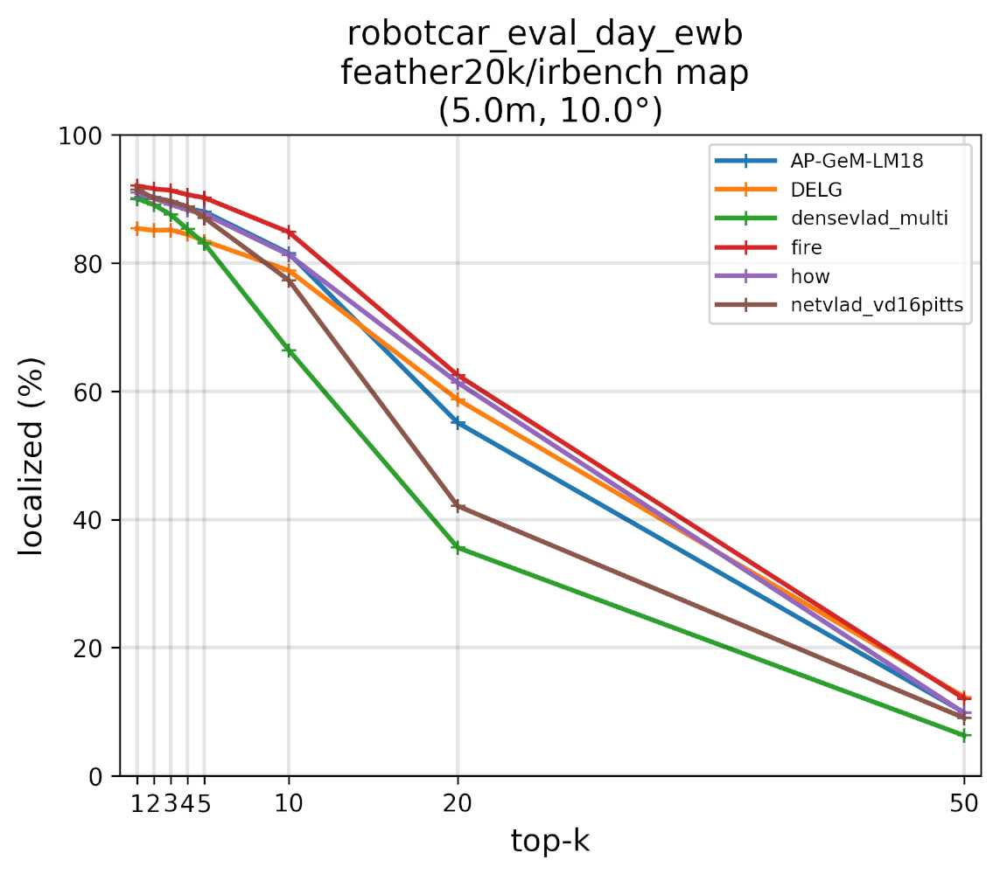
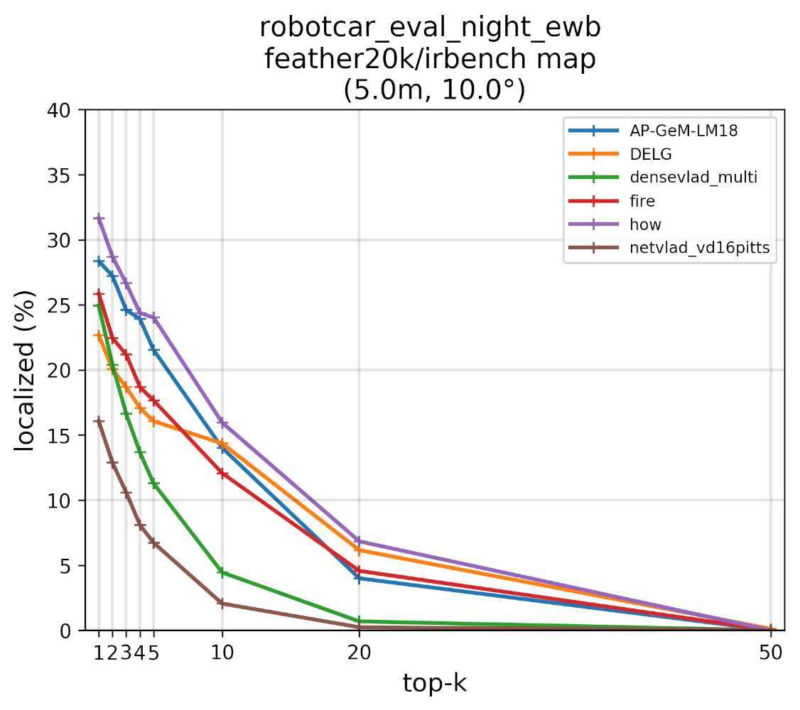

=== Gangnam Station B2

==== global_sfm

[%header]
|===
|feature type|topk 3+|test 5+|validation
|||(0.25m_2.0deg)|(0.5m_5.0deg)|(5.0m_10.0deg)|(0.25m_2.0deg)|(0.5m_5.0deg)|(5.0m_10.0deg)|median distance (m)|median angle (deg)
|AP-GeM-LM18|1|26.8%|37.2%|41.2%|20.74%|33.52%|38.54%|21.2516|18.8292
|densevlad_multi|1|30.6%|42.0%|46.5%|27.73%|44.10%|49.34%|0.5458|1.7576
|fire|1|37.0%|51.7%|57.5%|34.61%|56.88%|64.30%|0.0703|1.3495
|how|1|41.0%|57.3%|62.9%|36.57%|54.91%|60.48%|0.0783|1.3628
|openibl_vgg16_netvlad|1|30.5%|42.2%|46.6%|28.06%|42.36%|48.03%|10.6814|1.8746
|r101delg_gldv2clean|1|25.3%|34.9%|39.6%|19.87%|32.75%|38.54%|18.0958|15.665
||||||||||
|AP-GeM-LM18|2|31.6%|44.1%|48.2%|23.91%|39.41%|44.87%|4.7676|2.6949
|densevlad_multi|2|35.0%|48.2%|52.2%|30.90%|48.91%|53.60%|0.1048|1.489
|fire|2|41.0%|58.4%|63.9%|41.48%|64.52%|71.07%|0.0584|1.1287
|how|2|44.5%|61.7%|67.0%|40.94%|61.68%|67.79%|0.0611|1.1637
|openibl_vgg16_netvlad|2|34.3%|48.2%|53.1%|31.11%|47.05%|53.06%|0.1194|1.5353
|r101delg_gldv2clean|2|31.2%|43.2%|47.9%|25.11%|40.07%|45.96%|6.0026|2.5651
||||||||||
|AP-GeM-LM18|3|33.7%|47.3%|51.8%|26.97%|42.69%|48.47%|1.3409|2.039
|densevlad_multi|3|36.5%|50.5%|55.0%|32.64%|51.20%|56.44%|0.0904|1.3902
|fire|3|42.6%|61.1%|66.3%|42.03%|66.70%|72.93%|0.0549|1.0767
|how|3|45.9%|63.8%|68.8%|42.58%|63.10%|69.10%|0.0609|1.1281
|openibl_vgg16_netvlad|3|36.6%|51.1%|55.7%|32.75%|49.13%|55.13%|0.1022|1.4721
|r101delg_gldv2clean|3|33.8%|47.1%|51.8%|27.18%|42.47%|48.91%|0.8538|2.0312
||||||||||
|AP-GeM-LM18|4|35.2%|49.9%|54.4%|28.38%|45.20%|51.42%|0.1845|1.755
|densevlad_multi|4|38.1%|52.7%|57.5%|33.52%|52.51%|57.75%|0.0853|1.3505
|fire|4|43.5%|62.1%|67.6%|43.23%|67.69%|74.13%|0.0532|1.0778
|how|4|45.7%|63.9%|69.2%|41.70%|62.34%|69.00%|0.0601|1.1291
|openibl_vgg16_netvlad|4|37.5%|52.9%|57.6%|34.28%|50.98%|56.55%|0.0975|1.4378
|r101delg_gldv2clean|4|34.7%|49.1%|53.8%|28.71%|45.09%|51.42%|0.2015|1.7395
||||||||||
|AP-GeM-LM18|5|36.5%|51.3%|55.8%|30.02%|47.38%|53.06%|0.139|1.6379
|densevlad_multi|5|39.3%|54.1%|58.7%|34.93%|54.15%|59.61%|0.079|1.3518
|fire|5|44.2%|62.4%|68.0%|43.45%|67.69%|74.13%|0.0526|1.0495
|how|5|45.2%|64.2%|69.1%|42.25%|63.86%|70.09%|0.0598|1.1307
|openibl_vgg16_netvlad|5|38.6%|54.0%|59.2%|34.50%|51.86%|57.53%|0.0911|1.3679
|r101delg_gldv2clean|5|36.3%|50.8%|55.7%|29.80%|47.05%|53.28%|0.1394|1.6806
||||||||||
|AP-GeM-LM18|10|38.8%|55.4%|60.5%|33.95%|54.04%|59.83%|0.0793|1.3902
|densevlad_multi|10|42.3%|57.6%|62.6%|38.54%|57.86%|63.65%|0.0652|1.2005
|fire|10|45.6%|64.6%|69.8%|45.96%|67.90%|74.45%|0.0517|1.0254
|how|10|46.6%|65.1%|70.2%|43.45%|63.10%|69.98%|0.0597|1.0881
|openibl_vgg16_netvlad|10|42.1%|58.2%|63.4%|37.55%|54.04%|59.72%|0.0791|1.2667
|r101delg_gldv2clean|10|39.9%|55.5%|60.1%|32.21%|50.55%|56.33%|0.0972|1.5088
||||||||||
|AP-GeM-LM18|20|42.3%|59.5%|64.3%|35.59%|56.66%|62.23%|0.0756|1.2993
|densevlad_multi|20|44.2%|60.6%|65.5%|39.41%|59.28%|65.07%|0.0632|1.1746
|fire|20|47.6%|66.7%|71.7%|47.27%|69.10%|75.22%|0.0518|1.0021
|how|20|47.3%|66.0%|71.4%|44.10%|64.63%|70.09%|0.0579|1.112
|openibl_vgg16_netvlad|20|45.3%|61.8%|66.8%|38.76%|57.21%|62.77%|0.0722|1.2265
|r101delg_gldv2clean|20|42.8%|59.2%|64.4%|35.26%|53.28%|58.84%|0.0861|1.3658
||||||||||
|AP-GeM-LM18|50|45.5%|63.1%|68.3%|39.30%|61.35%|66.81%|0.0607|1.1808
|densevlad_multi|50|46.6%|65.1%|70.0%|41.92%|61.79%|67.36%|0.0607|1.1358
|fire|50|49.1%|68.3%|73.7%|47.49%|69.21%|74.67%|0.0502|0.9931
|how|50|48.1%|66.7%|71.9%|44.76%|65.17%|70.96%|0.0548|1.0708
|openibl_vgg16_netvlad|50|46.8%|63.9%|69.2%|41.05%|59.28%|64.08%|0.0644|1.1605
|r101delg_gldv2clean|50|45.8%|63.7%|68.7%|37.66%|56.99%|63.10%|0.0709|1.3114

|===

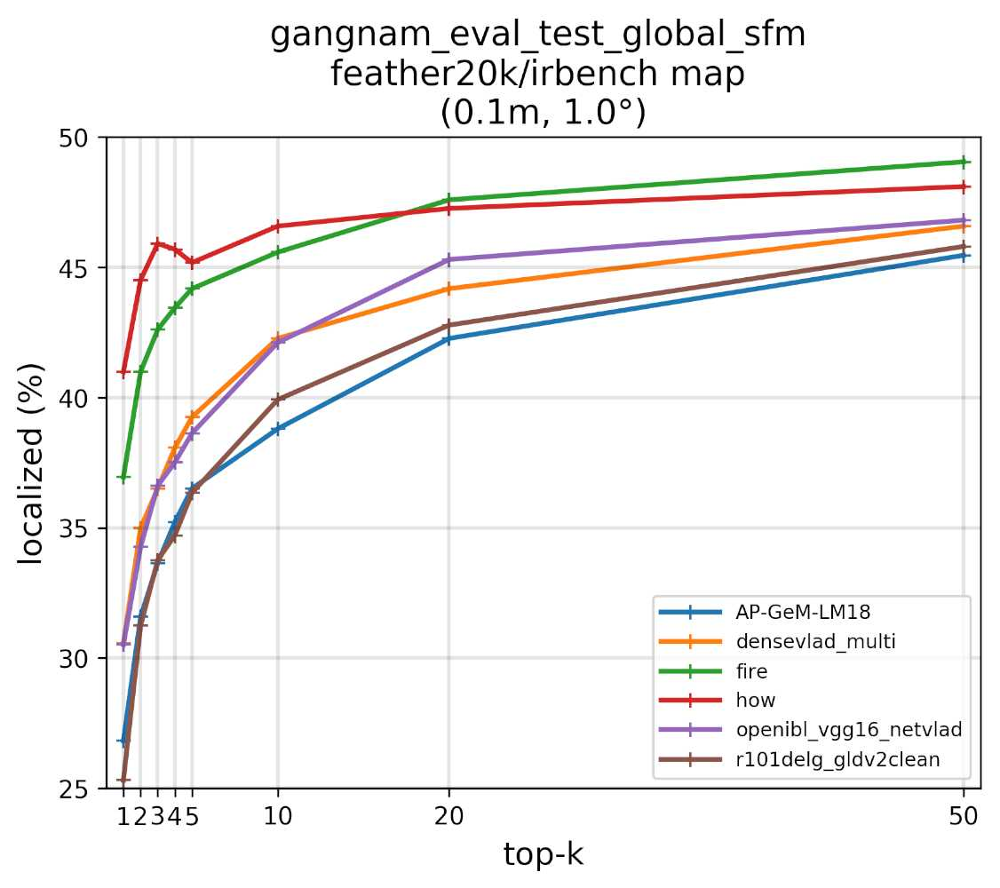
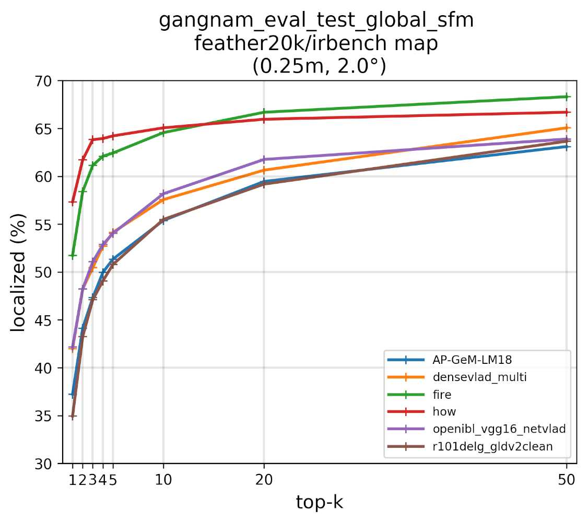
image::../doc/plots/feather2d2/gangnam_eval_test_global_sfm_1_0m_5_0deg.jpg[gangnam_eval_test_global_sfm_1_0m_5_0deg]

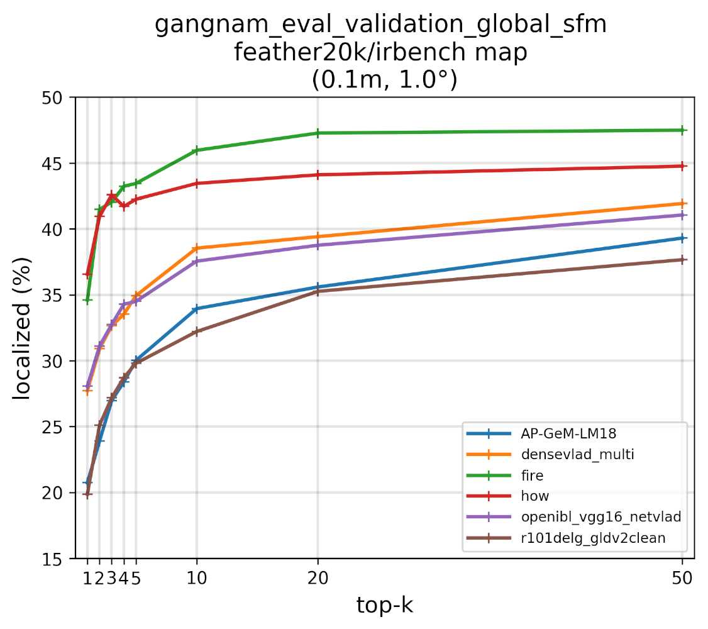
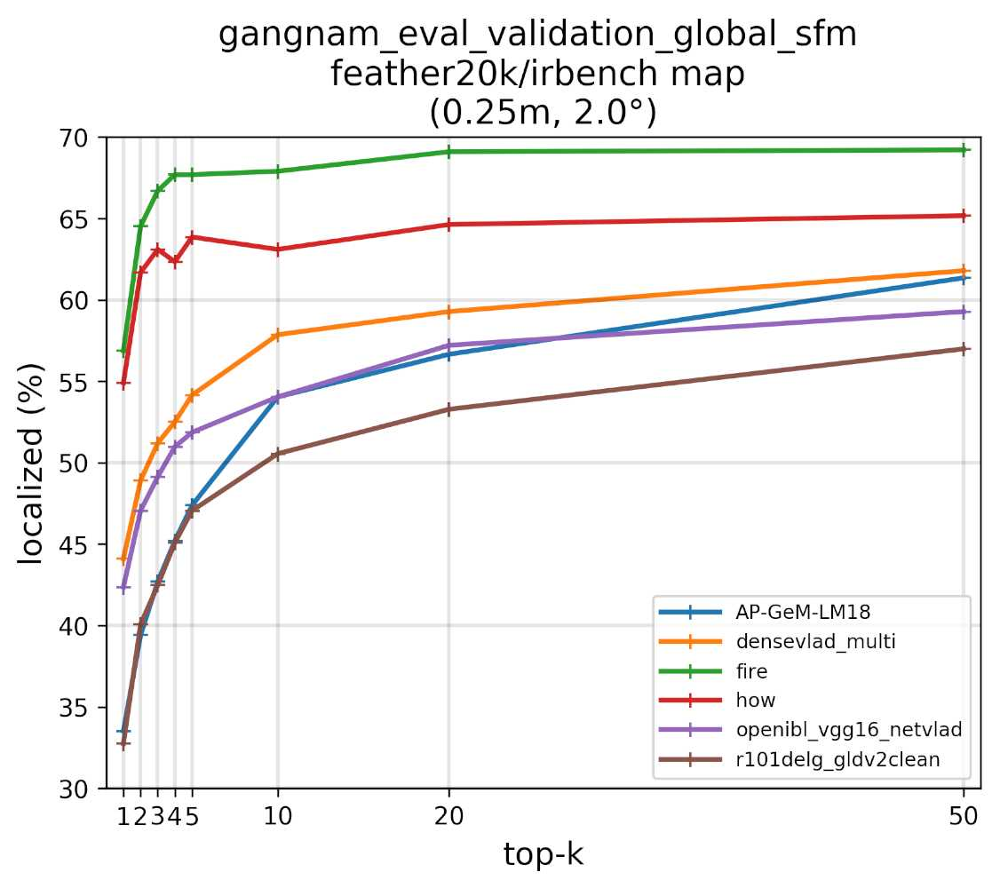
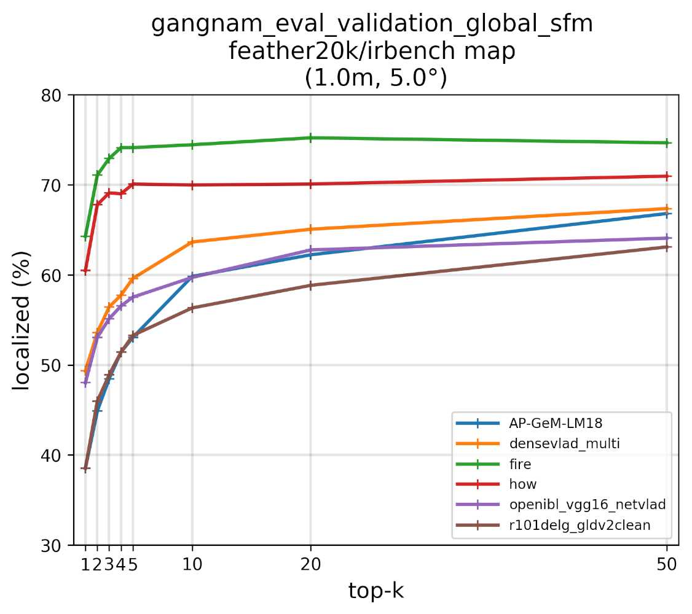

==== local_sfm

[%header]
|===
|feature type|topk 3+|test 5+|validation
|||(0.25m_2.0deg)|(0.5m_5.0deg)|(5.0m_10.0deg)|(0.25m_2.0deg)|(0.5m_5.0deg)|(5.0m_10.0deg)|median distance (m)|median angle (deg)
|AP-GeM-LM18|3|2.0%|3.6%|5.5%|2.18%|3.93%|5.57%|inf|inf
|densevlad_multi|3|3.0%|5.4%|6.8%|4.37%|6.99%|7.97%|inf|inf
|fire|3|5.3%|10.4%|14.6%|7.10%|11.90%|15.83%|inf|inf
|how|3|7.7%|13.4%|17.3%|7.42%|11.68%|15.39%|inf|inf
|openibl_vgg16_netvlad|3|2.6%|4.5%|5.8%|3.82%|6.00%|6.88%|inf|inf
|r101delg_gldv2clean|3|2.2%|4.1%|5.3%|2.18%|3.93%|4.59%|inf|inf
||||||||||
|AP-GeM-LM18|4|4.4%|7.7%|10.9%|4.15%|7.31%|8.30%|inf|inf
|densevlad_multi|4|5.9%|10.2%|12.7%|7.75%|11.14%|13.54%|inf|inf
|fire|4|11.1%|18.8%|24.0%|12.12%|19.10%|24.89%|inf|inf
|how|4|12.9%|21.6%|26.9%|12.55%|19.76%|24.02%|inf|inf
|openibl_vgg16_netvlad|4|4.7%|8.3%|10.7%|5.90%|8.73%|10.81%|inf|inf
|r101delg_gldv2clean|4|4.7%|7.9%|9.9%|4.69%|7.75%|9.28%|inf|inf
||||||||||
|AP-GeM-LM18|5|6.7%|11.9%|15.0%|5.02%|9.28%|10.48%|inf|inf
|densevlad_multi|5|8.3%|13.8%|16.7%|8.95%|13.21%|16.16%|inf|inf
|fire|5|13.2%|24.1%|29.7%|14.85%|23.25%|29.80%|inf|inf
|how|5|16.1%|26.5%|31.8%|15.28%|24.24%|29.91%|inf|inf
|openibl_vgg16_netvlad|5|6.4%|11.3%|14.6%|7.53%|11.46%|13.86%|inf|inf
|r101delg_gldv2clean|5|6.4%|10.3%|13.1%|5.57%|10.48%|12.77%|inf|inf
||||||||||
|AP-GeM-LM18|10|12.7%|21.3%|26.1%|9.06%|15.39%|18.23%|inf|inf
|densevlad_multi|10|13.4%|21.4%|26.0%|12.34%|19.43%|23.25%|inf|inf
|fire|10|20.4%|34.3%|40.7%|21.83%|36.24%|42.47%|50.035|89.5379
|how|10|22.8%|35.7%|41.8%|20.09%|32.97%|38.97%|145.8425|177.1708
|openibl_vgg16_netvlad|10|12.3%|19.8%|23.6%|13.10%|19.32%|22.16%|inf|inf
|r101delg_gldv2clean|10|12.5%|19.8%|23.1%|11.03%|17.69%|21.94%|inf|inf
||||||||||
|AP-GeM-LM18|20|17.2%|28.5%|33.5%|12.88%|21.18%|25.33%|inf|inf
|densevlad_multi|20|18.0%|28.1%|32.7%|17.25%|27.07%|31.99%|inf|inf
|fire|20|26.0%|41.7%|48.0%|25.44%|40.61%|46.51%|5.1373|4.4642
|how|20|26.4%|42.2%|48.3%|24.67%|38.10%|43.34%|13.6278|6.6769
|openibl_vgg16_netvlad|20|16.9%|26.5%|31.5%|17.25%|24.78%|29.15%|inf|inf
|r101delg_gldv2clean|20|18.3%|28.2%|33.5%|14.41%|23.25%|28.38%|inf|inf
||||||||||
|AP-GeM-LM18|50|23.2%|37.2%|42.9%|18.34%|29.15%|34.61%|83.283|149.1298
|densevlad_multi|50|24.1%|35.9%|41.2%|22.60%|33.30%|38.86%|52.5008|9.2161
|fire|50|30.9%|46.7%|52.7%|28.49%|44.98%|51.31%|0.2414|2.1263
|how|50|30.9%|46.1%|52.1%|26.20%|40.39%|45.85%|9.538|2.8887
|openibl_vgg16_netvlad|50|22.5%|35.0%|41.3%|20.52%|29.15%|34.28%|79.8215|76.0621
|r101delg_gldv2clean|50|25.0%|39.1%|45.0%|19.43%|31.66%|36.68%|50.048|60.5858
|===

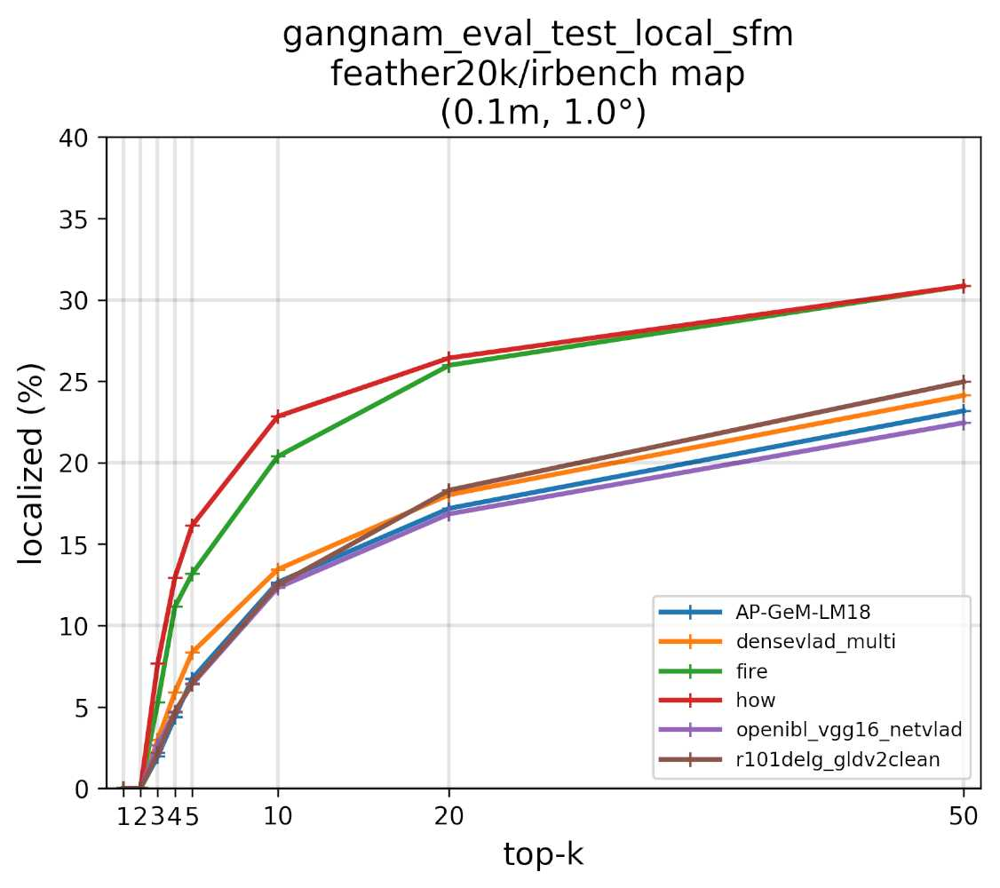
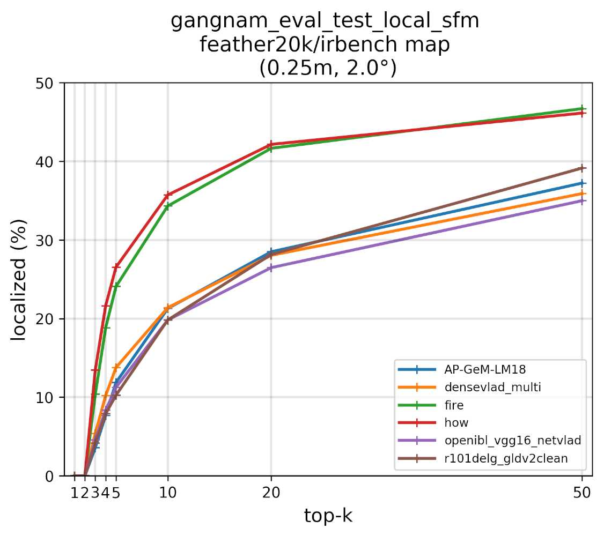
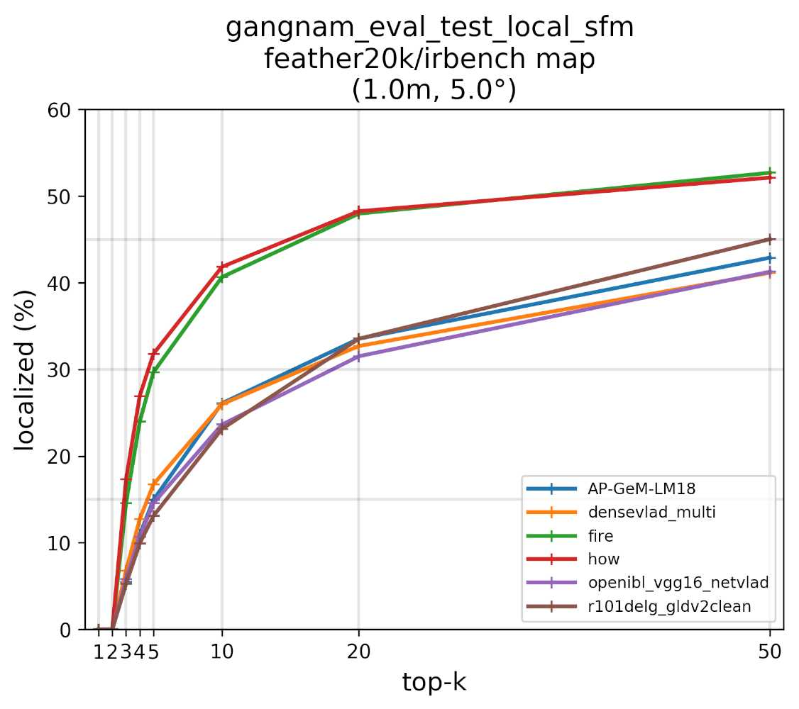

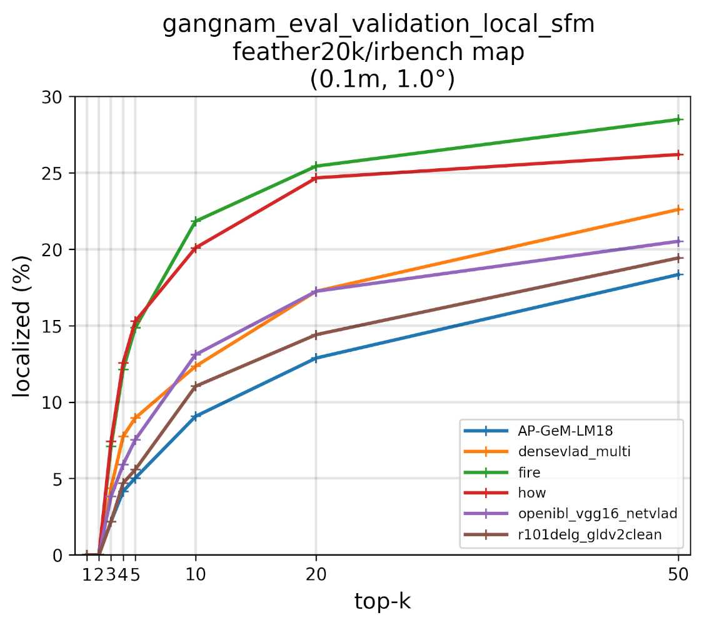
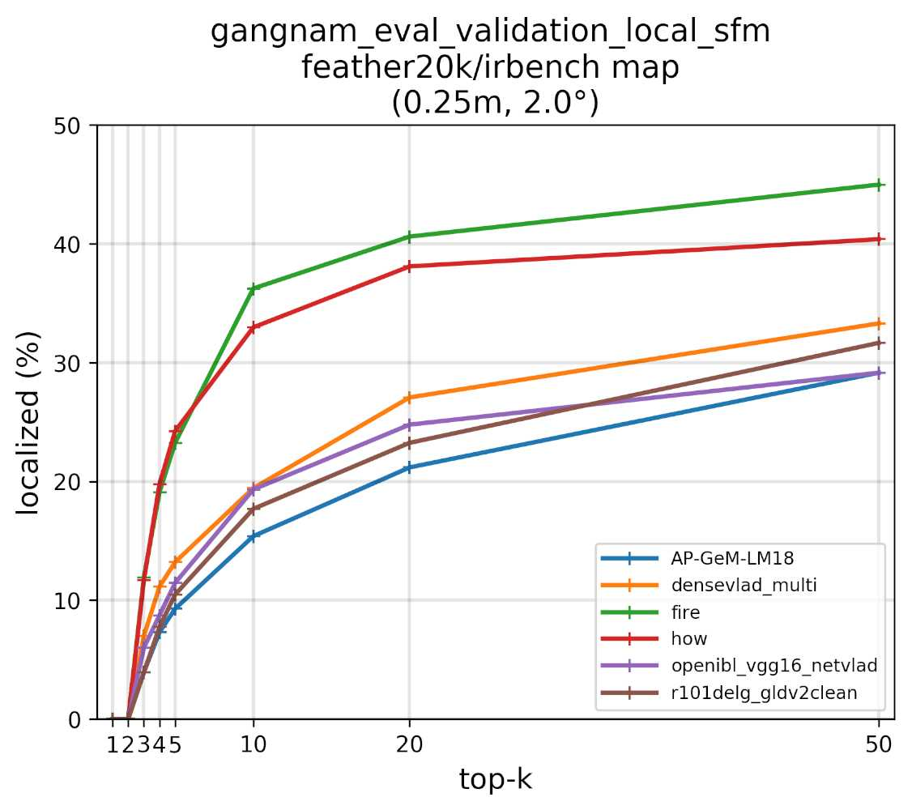
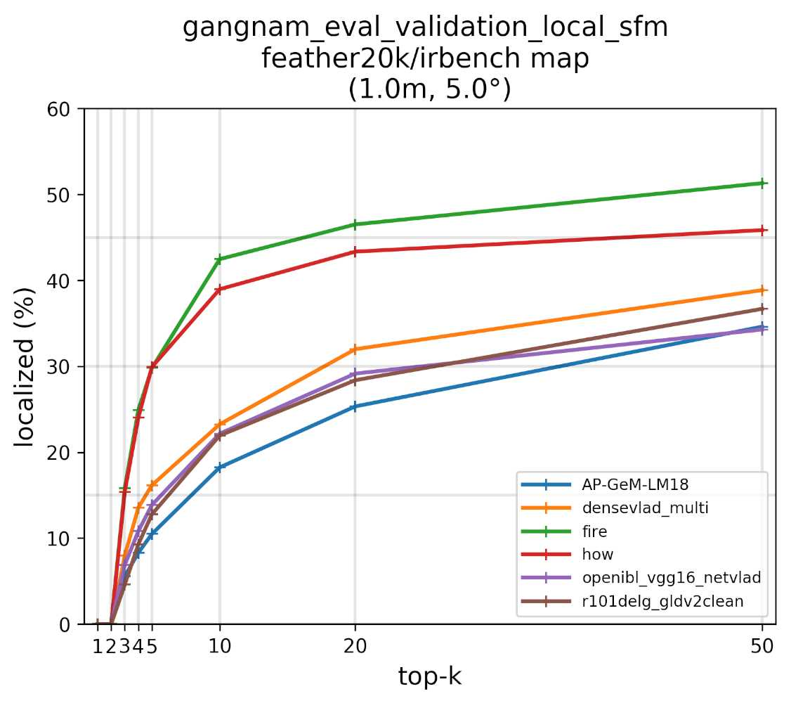

==== EWB

[%header]
|===
|feature type|topk|test 3+|validation
|||(5.0m_10.0deg)|(5.0m_10.0deg)|median distance (m)|median angle (deg)
|AP-GeM-LM18|1|7.2%|7.10%|9.3424|32.4455
|densevlad_multi|1|15.0%|12.88%|1.7043|21.7211
|fire|1|11.8%|11.35%|1.1299|24.3258
|how|1|12.2%|11.03%|1.2002|26.2644
|openibl_vgg16_netvlad|1|9.5%|9.17%|1.6348|24.9467
|r101delg_gldv2clean|1|9.1%|8.62%|7.3242|33.2266
||||||
|AP-GeM-LM18|2|6.7%|6.66%|26.5404|53.7033
|densevlad_multi|2|15.3%|13.54%|19.9861|26.9344
|fire|2|16.2%|20.41%|2.1365|24.6344
|how|2|18.1%|17.03%|2.8138|26.6581
|openibl_vgg16_netvlad|2|9.4%|12.99%|20.0063|29.2547
|r101delg_gldv2clean|2|8.2%|7.53%|15.9593|50.3933
||||||
|AP-GeM-LM18|3|6.4%|5.46%|32.5287|44.8997
|densevlad_multi|3|12.7%|10.15%|31.426|21.3753
|fire|3|14.1%|17.25%|4.847|22.8792
|how|3|15.7%|14.63%|9.8958|23.8021
|openibl_vgg16_netvlad|3|6.8%|8.30%|28.269|26.6298
|r101delg_gldv2clean|3|6.1%|7.10%|28.8875|45.2919
||||||
|AP-GeM-LM18|4|5.4%|3.71%|33.0103|49.4994
|densevlad_multi|4|10.9%|8.41%|34.9468|25.2218
|fire|4|11.6%|16.05%|7.8771|24.9698
|how|4|13.6%|14.96%|14.6134|24.7318
|openibl_vgg16_netvlad|4|6.2%|6.00%|31.0726|30.5133
|r101delg_gldv2clean|4|4.7%|5.24%|30.7981|51.1382
||||||
|AP-GeM-LM18|5|5.0%|2.95%|36.9162|46.8449
|densevlad_multi|5|8.6%|6.44%|36.9263|22.428
|fire|5|9.7%|12.45%|12.2167|27.4671
|how|5|12.2%|10.92%|17.2968|24.915
|openibl_vgg16_netvlad|5|4.6%|4.37%|33.2157|29.1717
|r101delg_gldv2clean|5|3.8%|3.71%|34.781|46.7612
||||||
|AP-GeM-LM18|10|3.3%|0.22%|44.869|56.5601
|densevlad_multi|10|5.0%|1.42%|44.7523|27.8604
|fire|10|5.2%|4.26%|22.2106|33.5603
|how|10|6.9%|5.02%|29.0837|29.2194
|openibl_vgg16_netvlad|10|3.0%|0.55%|41.8669|39.9828
|r101delg_gldv2clean|10|2.2%|0.55%|42.5713|51.4846
||||||
|AP-GeM-LM18|20|1.3%|0.00%|51.6639|63.4245
|densevlad_multi|20|2.0%|0.22%|52.191|28.3163
|fire|20|2.8%|1.20%|32.6906|40.2351
|how|20|3.6%|0.98%|37.1708|37.3056
|openibl_vgg16_netvlad|20|1.4%|0.22%|48.4789|43.4044
|r101delg_gldv2clean|20|1.5%|0.00%|51.8713|53.4991
||||||
|AP-GeM-LM18|50|0.3%|0.00%|58.7295|76.4843
|densevlad_multi|50|0.6%|0.00%|59.6624|42.5387
|fire|50|0.2%|0.11%|43.8313|49.3844
|how|50|0.5%|0.00%|47.2794|49.9256
|openibl_vgg16_netvlad|50|0.3%|0.00%|56.5447|59.5042
|r101delg_gldv2clean|50|0.8%|0.00%|60.8332|62.0772
|===

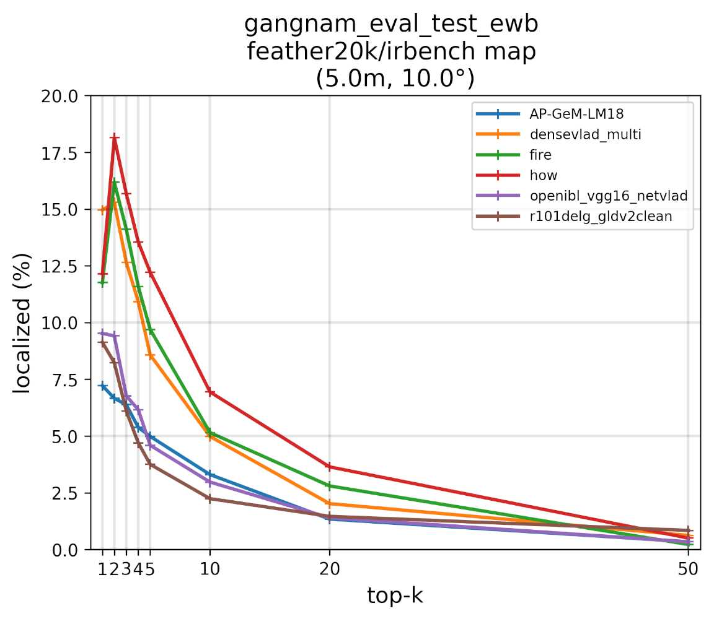
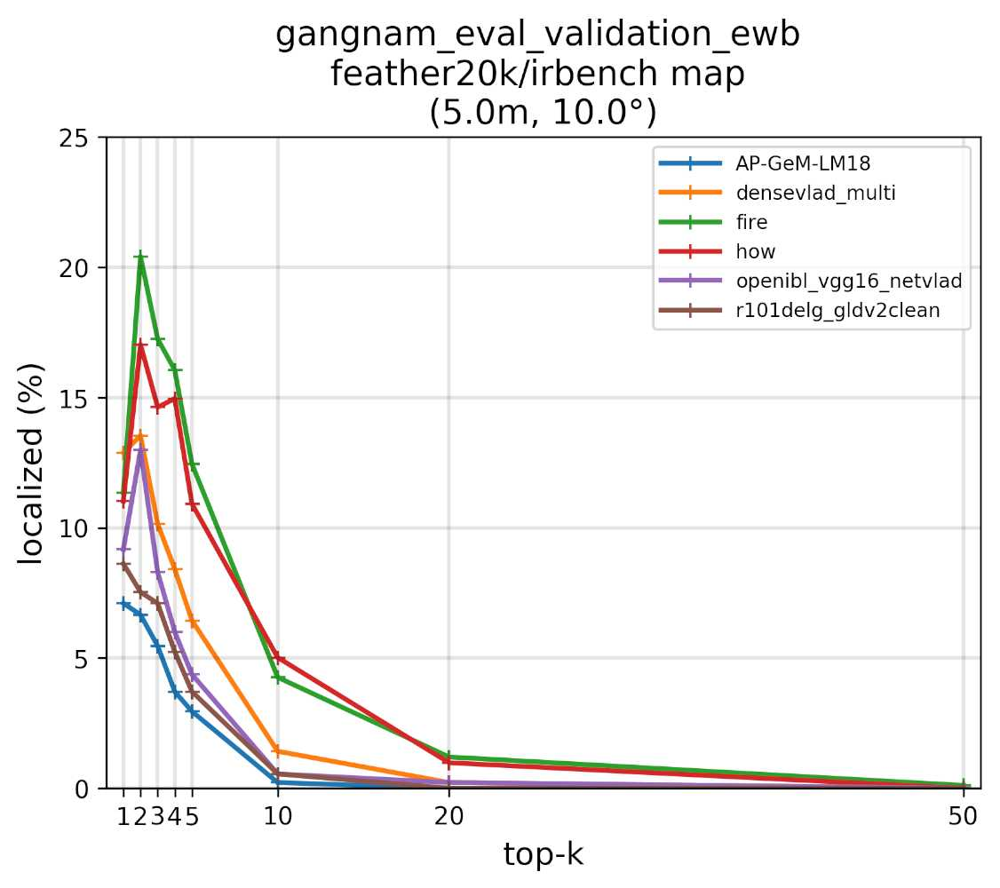

== r2d2_WASF_N8_big 20k Results

=== Aachen Day-Night v1.1

==== global_sfm

[%header]
|===
|feature type|topk 3+|Day 3+|Night
|||(0.25, 2.0)|(0.5, 5.0)|(5.0, 10.0)|(0.25, 2.0)|(0.5, 5.0)|(5.0, 10.0)
|AP-GeM-LM18|1         |81.8%|92.4%|97.3%|62.3%|76.4%|92.2%
|DELG|1                |80.7%|90.9%|96.8%|58.1%|75.4%|86.4%
|densevlad_multi|1     |78.4%|88.7%|93.2%|45.6%|57.1%|64.9%
|fire|1|78.3%|88.6%|95.4%|61.8%|78.0%|94.8%
|how|1                 |77.6%|89.2%|95.4%|65.5%|78.5%|94.8%
|netvlad_vd16pitts|1   |78.0%|88.1%|92.7%|56.0%|72.3%|82.7%
||||||||
|AP-GeM-LM18|2         |85.1%|94.1%|98.4%|66.0%|83.3%|94.2%
|DELG|2                |84.5%|93.6%|98.1%|61.3%|79.6%|89.5%
|densevlad_multi|2     |82.5%|90.4%|94.9%|51.8%|64.4%|72.3%
|fire|2|82.4%|91.9%|97.5%|65.5%|82.2%|95.3%
|how|2                 |83.0%|92.6%|97.9%|68.1%|86.4%|98.4%
|netvlad_vd16pitts|2   |82.9%|90.5%|94.4%|63.4%|76.4%|89.5%
||||||||
|AP-GeM-LM18|3         |86.8%|95.4%|99.0%|65.5%|83.8%|95.8%
|DELG|3                |86.2%|94.3%|98.4%|62.8%|79.6%|93.2%
|densevlad_multi|3     |85.0%|92.0%|95.4%|55.0%|67.0%|75.4%
|fire|3|84.3%|93.2%|98.3%|66.5%|83.8%|96.3%
|how|3                 |84.8%|93.7%|98.3%|71.2%|86.4%|99.0%
|netvlad_vd16pitts|3   |84.5%|91.8%|95.5%|68.1%|81.7%|92.7%
||||||||
|AP-GeM-LM18|4         |87.0%|95.4%|98.8%|69.1%|83.8%|96.3%
|DELG|4                |87.0%|94.9%|98.8%|64.9%|81.7%|93.2%
|densevlad_multi|4     |85.3%|92.4%|95.9%|56.0%|67.0%|76.4%
|fire|4|85.6%|94.1%|98.7%|67.5%|84.8%|97.9%
|how|4                 |86.0%|94.5%|98.8%|70.2%|86.4%|99.0%
|netvlad_vd16pitts|4   |85.7%|92.2%|96.1%|69.1%|82.2%|92.7%
||||||||
|AP-GeM-LM18|5         |87.6%|95.6%|99.0%|68.1%|85.3%|96.9%
|DELG|5                |87.6%|95.3%|98.8%|67.5%|82.7%|94.2%
|densevlad_multi|5     |85.7%|93.0%|96.4%|57.6%|69.1%|79.1%
|fire|5|85.9%|94.2%|98.5%|68.6%|84.8%|97.9%
|how|5                 |86.8%|95.3%|99.0%|71.7%|86.9%|99.0%
|netvlad_vd16pitts|5   |86.4%|93.2%|96.5%|70.2%|82.7%|93.7%
||||||||
|AP-GeM-LM18|10        |89.0%|96.0%|99.3%|72.8%|87.4%|96.9%
|DELG|10               |88.4%|95.6%|98.9%|72.8%|84.3%|96.3%
|densevlad_multi|10    |87.9%|94.2%|97.0%|57.6%|73.8%|82.7%
|fire|10|88.6%|96.0%|99.3%|71.2%|85.9%|99.0%
|how|10                |88.8%|96.1%|99.4%|72.8%|88.0%|99.5%
|netvlad_vd16pitts|10  |88.6%|94.4%|97.5%|72.8%|85.3%|96.9%
||||||||
|AP-GeM-LM18|20        |89.6%|96.5%|99.3%|73.3%|86.9%|97.9%
|DELG|20               |89.7%|96.4%|99.3%|74.4%|88.5%|96.9%
|densevlad_multi|20    |87.9%|94.2%|97.5%|63.4%|79.1%|86.9%
|fire|20|90.2%|96.7%|99.4%|73.8%|88.0%|99.0%
|how|20                |90.3%|96.2%|99.3%|74.4%|88.5%|99.5%
|netvlad_vd16pitts|20  |89.0%|95.2%|97.9%|73.8%|89.0%|97.4%
||||||||
|AP-GeM-LM18|50        |89.8%|96.8%|99.5%|74.9%|89.0%|98.4%
|DELG|50               |90.9%|96.7%|99.5%|76.4%|90.1%|98.4%
|densevlad_multi|50    |90.1%|95.8%|98.4%|67.5%|83.8%|91.6%
|fire|50|90.5%|97.1%|99.8%|77.0%|91.6%|99.0%
|how|50                |90.4%|96.8%|99.6%|75.9%|90.6%|99.5%
|netvlad_vd16pitts|50  |89.6%|95.8%|98.4%|74.9%|89.0%|97.9%

|===

image::../doc/plots/r2d2/aachen_day_r2d2_global_sfm_0.jpg[aachen_day_r2d2_global_sfm_0]
image::../doc/plots/r2d2/aachen_day_r2d2_global_sfm_1.jpg[aachen_day_r2d2_global_sfm_1]
image::../doc/plots/r2d2/aachen_day_r2d2_global_sfm_2.jpg[aachen_day_r2d2_global_sfm_2]

image::../doc/plots/r2d2/aachen_night_r2d2_global_sfm_0.jpg[aachen_night_r2d2_global_sfm_0]
image::../doc/plots/r2d2/aachen_night_r2d2_global_sfm_1.jpg[aachen_night_r2d2_global_sfm_1]
image::../doc/plots/r2d2/aachen_night_r2d2_global_sfm_2.jpg[aachen_night_r2d2_global_sfm_2]

==== local_sfm

[%header]
|===
|feature type|topk 3+|Day 3+|Night
|||(0.25, 2.0)|(0.5, 5.0)|(5.0, 10.0)|(0.25, 2.0)|(0.5, 5.0)|(5.0, 10.0)
|AP-GeM-LM18|3         |53.4%|67.7%|83.9%|22.5%|37.2%|55.0%
|DELG|3                |51.8%|66.5%|82.9%|25.7%|38.7%|58.1%
|densevlad_multi|3     |53.3%|65.2%|78.6%|16.2%|23.0%|30.4%
|fire|3|51.9%|67.8%|85.2%|28.3%|40.3%|62.3%
|how|3                 |52.2%|68.6%|84.8%|35.1%|46.1%|65.5%
|netvlad_vd16pitts|3   |50.0%|63.1%|76.0%|21.5%|31.9%|46.1%
||||||||
|AP-GeM-LM18|4         |64.4%|76.6%|90.5%|38.7%|53.9%|71.2%
|DELG|4                |64.0%|77.8%|90.8%|41.4%|55.0%|72.8%
|densevlad_multi|4     |62.3%|74.6%|84.1%|21.5%|30.9%|38.7%
|fire|4|62.4%|77.1%|90.8%|39.3%|57.6%|83.8%
|how|4                 |63.4%|78.4%|91.0%|39.3%|56.5%|83.8%
|netvlad_vd16pitts|4   |58.7%|71.6%|83.5%|34.0%|48.7%|59.7%
||||||||
|AP-GeM-LM18|5         |67.6%|79.6%|92.1%|45.0%|61.8%|79.6%
|DELG|5                |69.2%|82.5%|93.2%|45.6%|60.7%|78.0%
|densevlad_multi|5     |66.3%|78.2%|86.3%|25.1%|33.5%|43.5%
|fire|5|67.7%|81.3%|93.2%|47.6%|66.5%|90.1%
|how|5                 |68.0%|80.8%|93.1%|44.5%|68.1%|86.4%
|netvlad_vd16pitts|5   |62.9%|75.7%|86.5%|39.8%|57.1%|68.6%
||||||||
|AP-GeM-LM18|10        |76.6%|87.9%|96.5%|56.0%|74.9%|89.5%
|DELG|10               |77.9%|89.1%|97.0%|58.6%|71.2%|89.0%
|densevlad_multi|10    |74.8%|85.2%|90.9%|33.5%|42.9%|54.5%
|fire|10|77.2%|88.1%|96.5%|60.2%|77.5%|94.2%
|how|10                |76.3%|89.3%|96.0%|59.2%|78.0%|93.2%
|netvlad_vd16pitts|10  |75.5%|85.2%|92.1%|53.4%|65.5%|80.1%
||||||||
|AP-GeM-LM18|20        |82.8%|92.4%|98.4%|60.7%|79.1%|93.7%
|DELG|20               |83.9%|92.6%|97.9%|63.4%|78.5%|92.2%
|densevlad_multi|20    |80.1%|88.5%|93.3%|40.3%|56.0%|66.5%
|fire|20|82.3%|92.2%|98.1%|65.5%|83.8%|95.8%
|how|20                |82.8%|92.2%|98.3%|64.9%|84.3%|96.9%
|netvlad_vd16pitts|20  |81.6%|89.4%|95.2%|55.5%|73.8%|84.3%
||||||||
|AP-GeM-LM18|50        |86.5%|94.3%|99.2%|66.0%|84.8%|95.8%
|DELG|50               |85.9%|94.3%|98.8%|70.7%|84.3%|94.8%
|densevlad_multi|50    |83.7%|91.0%|95.6%|46.6%|61.3%|75.4%
|fire|50|86.7%|94.8%|98.8%|68.1%|82.7%|96.9%
|how|50                |86.8%|94.7%|99.2%|70.2%|85.9%|97.9%
|netvlad_vd16pitts|50  |84.5%|92.8%|97.3%|63.4%|78.5%|91.1%
|===

image::../doc/plots/r2d2/aachen_day_r2d2_local_sfm_0.jpg[aachen_day_r2d2_local_sfm_0]
image::../doc/plots/r2d2/aachen_day_r2d2_local_sfm_1.jpg[aachen_day_r2d2_local_sfm_1]
image::../doc/plots/r2d2/aachen_day_r2d2_local_sfm_2.jpg[aachen_day_r2d2_local_sfm_2]

image::../doc/plots/r2d2/aachen_night_r2d2_local_sfm_0.jpg[aachen_night_r2d2_local_sfm_0]
image::../doc/plots/r2d2/aachen_night_r2d2_local_sfm_1.jpg[aachen_night_r2d2_local_sfm_1]
image::../doc/plots/r2d2/aachen_night_r2d2_local_sfm_2.jpg[aachen_night_r2d2_local_sfm_2]

==== EWB

[%header]
|===
|feature type|topk|Day|Night
|||(5.0, 10.0)|(5.0, 10.0)
|AP-GeM-LM18|1         |23.1%|17.3%
|DELG|1                |23.9%|18.9%
|densevlad_multi|1     |27.2%|17.8%
|fire|1|28.0%|18.3%
|how|1                 |28.0%|20.9%
|netvlad_vd16pitts|1   |22.5%|16.2%
||||
|AP-GeM-LM18|2         |28.2%|17.8%
|DELG|2                |31.7%|17.3%
|densevlad_multi|2     |33.7%|14.1%
|fire|2|34.7%|20.9%
|how|2                 |35.9%|21.5%
|netvlad_vd16pitts|2   |28.2%|18.3%
||||
|AP-GeM-LM18|3         |27.1%|16.8%
|DELG|3                |31.3%|20.9%
|densevlad_multi|3     |35.1%|11.5%
|fire|3|34.1%|19.9%
|how|3                 |33.4%|21.5%
|netvlad_vd16pitts|3   |25.0%|22.0%
||||
|AP-GeM-LM18|4         |24.5%|15.7%
|DELG|4                |29.5%|18.9%
|densevlad_multi|4     |34.6%|13.6%
|fire|4|33.7%|17.8%
|how|4                 |34.7%|21.5%
|netvlad_vd16pitts|4   |25.9%|14.1%
||||
|AP-GeM-LM18|5         |22.8%|14.7%
|DELG|5                |28.3%|16.2%
|densevlad_multi|5     |31.8%|13.1%
|fire|5|32.0%|20.4%
|how|5                 |34.2%|20.4%
|netvlad_vd16pitts|5   |23.4%|12.0%
||||
|AP-GeM-LM18|10        |17.4%|12.0%
|DELG|10               |21.4%|12.0%
|densevlad_multi|10    |24.9%|6.8%
|fire|10|22.8%|13.1%
|how|10                |27.6%|19.4%
|netvlad_vd16pitts|10  |19.1%|9.4%
||||
|AP-GeM-LM18|20        |11.8%|5.2%
|DELG|20               |13.8%|5.2%
|densevlad_multi|20    |16.9%|1.6%
|fire|20|16.8%|7.9%
|how|20                |18.9%|8.4%
|netvlad_vd16pitts|20  |10.9%|4.2%
||||
|AP-GeM-LM18|50        |4.5%|3.7%
|DELG|50               |5.7%|5.8%
|densevlad_multi|50    |5.1%|1.6%
|fire|50|7.0%|4.2%
|how|50                |7.4%|2.6%
|netvlad_vd16pitts|50  |4.1%|1.1%
|===

image::../doc/plots/r2d2/aachen_day_r2d2_ewb.jpg[aachen_day_r2d2_ewb]
image::../doc/plots/r2d2/aachen_night_r2d2_ewb.jpg[aachen_night_r2d2_ewb]

=== baidu-mall

==== global_sfm

[%header,format=csv,separator=;]
|===
feature type;top;(0.25, 2.0);(0.5, 5.0);(5.0, 10.0);median distance (m);median angle (deg)
AP-GeM-LM18;1         ;47.43%;58.68%;66.27%;0.2748;1.2784
DELG;1                ;45.29%;56.89%;64.49%;0.3023;1.3403
densevlad_multi;1     ;46.51%;57.64%;64.27%;0.2815;1.2915
fire;1;55.80%;69.50%;76.92%;0.2015;0.9501
how;1                 ;58.42%;74.30%;82.94%;0.1887;0.9057
netvlad_vd16pitts;1   ;46.64%;58.03%;64.92%;0.2778;1.2881
;;;;;;
AP-GeM-LM18;2         ;51.66%;64.14%;72.12%;0.2248;1.0248
DELG;2                ;50.65%;63.05%;69.90%;0.2324;1.0763
densevlad_multi;2     ;51.27%;63.05%;69.76%;0.2324;1.0564
fire;2;60.65%;75.31%;82.85%;0.1798;0.838
how;2                 ;65.27%;79.97%;87.52%;0.1637;0.7938
netvlad_vd16pitts;2   ;52.66%;63.92%;70.20%;0.22;1.0434
;;;;;;
AP-GeM-LM18;3         ;53.49%;66.23%;74.04%;0.2097;0.9788
DELG;3                ;53.14%;66.10%;73.21%;0.2111;0.9754
densevlad_multi;3     ;53.53%;65.84%;72.12%;0.2123;0.9638
fire;3;62.35%;77.66%;84.16%;0.1699;0.8122
how;3                 ;67.63%;82.68%;89.09%;0.1566;0.7641
netvlad_vd16pitts;3   ;54.19%;66.49%;73.17%;0.2119;0.9811
;;;;;;
AP-GeM-LM18;4         ;55.76%;69.15%;77.01%;0.197;0.895
DELG;4                ;54.80%;68.46%;75.48%;0.2044;0.9328
densevlad_multi;4     ;55.54%;68.32%;74.61%;0.2014;0.9185
fire;4;64.40%;78.88%;85.21%;0.1649;0.7815
how;4                 ;68.15%;83.42%;89.62%;0.1556;0.7497
netvlad_vd16pitts;4   ;55.37%;68.80%;74.91%;0.202;0.9136
;;;;;;
AP-GeM-LM18;5         ;56.76%;70.24%;77.92%;0.1925;0.8796
DELG;5                ;55.93%;69.85%;76.75%;0.1947;0.9055
densevlad_multi;5     ;56.06%;69.50%;76.22%;0.1997;0.8908
fire;5;65.18%;79.45%;85.86%;0.1601;0.7742
how;5                 ;68.85%;84.42%;90.14%;0.1524;0.7392
netvlad_vd16pitts;5   ;56.33%;69.46%;76.22%;0.1967;0.906
;;;;;;
AP-GeM-LM18;10        ;59.03%;73.43%;81.59%;0.1817;0.8436
DELG;10               ;59.82%;73.30%;80.50%;0.1775;0.8468
densevlad_multi;10    ;59.51%;74.00%;80.72%;0.18;0.8448
fire;10;67.23%;82.16%;88.26%;0.155;0.7499
how;10                ;70.94%;85.91%;91.62%;0.146;0.7303
netvlad_vd16pitts;10  ;59.34%;73.69%;81.11%;0.1745;0.8553
;;;;;;
AP-GeM-LM18;20        ;61.34%;76.31%;84.60%;0.1717;0.8082
DELG;20               ;62.09%;76.53%;83.60%;0.1704;0.8049
densevlad_multi;20    ;62.87%;77.53%;84.51%;0.1654;0.7815
fire;20;68.94%;83.86%;89.92%;0.1519;0.7427
how;20                ;71.47%;86.95%;92.19%;0.1485;0.7341
netvlad_vd16pitts;20  ;62.87%;77.66%;84.51%;0.1668;0.8095
;;;;;;
AP-GeM-LM18;50        ;64.97%;79.67%;87.04%;0.163;0.7733
DELG;50               ;64.53%;79.76%;87.22%;0.1617;0.7622
densevlad_multi;50    ;66.36%;82.07%;88.35%;0.1563;0.7556
fire;50;69.37%;84.77%;91.45%;0.1515;0.7444
how;50                ;71.03%;86.74%;92.28%;0.1488;0.7343
netvlad_vd16pitts;50  ;65.45%;80.32%;87.35%;0.1581;0.7838

|===

image::../doc/plots/r2d2/baidu_mall_r2d2_global_sfm_0.jpg[baidu_mall_r2d2_global_sfm_0]
image::../doc/plots/r2d2/baidu_mall_r2d2_global_sfm_1.jpg[baidu_mall_r2d2_global_sfm_1]
image::../doc/plots/r2d2/baidu_mall_r2d2_global_sfm_2.jpg[baidu_mall_r2d2_global_sfm_2]

==== local_sfm

[%header,format=csv,separator=;]
|===
feature type;topk;(0.25, 2.0);(0.5, 5.0);(5.0, 10.0);median distance (m);median angle (deg)
AP-GeM-LM18;3       ;4.14%;6.63%;10.43%;inf;inf
DELG;3              ;4.06%;6.33%;9.25%;inf;inf
densevlad_multi;3   ;5.50%;7.90%;10.51%;inf;inf
fire;3              ;5.76%;9.55%;13.92%;inf;inf
how;3               ;6.33%;9.73%;14.22%;inf;inf
netvlad_vd16pitts;3 ;3.93%;6.15%;8.81%;inf;inf
;;;;;;
AP-GeM-LM18;4       ;11.95%;17.89%;24.21%;inf;inf
DELG;4              ;10.34%;16.14%;21.77%;inf;inf
densevlad_multi;4   ;11.52%;16.54%;21.60%;inf;inf
fire;4              ;14.79%;23.21%;30.98%;inf;inf
how;4               ;16.93%;25.00%;33.25%;inf;inf
netvlad_vd16pitts;4 ;10.17%;15.79%;20.11%;inf;inf
;;;;;;
AP-GeM-LM18;5       ;18.46%;25.35%;32.59%;inf;inf
DELG;5              ;16.40%;22.60%;29.28%;inf;inf
densevlad_multi;5   ;17.19%;23.52%;29.28%;inf;inf
fire;5              ;22.38%;32.94%;42.10%;inf;inf
how;5               ;23.82%;34.82%;45.59%;10.9197;48.4926
netvlad_vd16pitts;5 ;16.10%;22.56%;28.58%;inf;inf
;;;;;;
AP-GeM-LM18;10      ;27.62%;37.17%;47.29%;4.7866;17.8806
DELG;10             ;25.74%;33.51%;42.63%;inf;inf
densevlad_multi;10  ;25.79%;35.21%;43.63%;inf;inf
fire;10             ;34.90%;48.25%;59.29%;0.5782;2.5331
how;10              ;37.57%;53.32%;65.97%;0.4069;1.8924
netvlad_vd16pitts;10;25.87%;34.60%;43.02%;inf;inf
;;;;;;
AP-GeM-LM18;20      ;31.94%;44.02%;56.46%;0.8801;3.2265
DELG;20             ;29.80%;40.40%;51.57%;1.7591;5.0492
densevlad_multi;20  ;31.11%;41.40%;52.27%;1.4399;4.753
fire;20             ;39.44%;54.23%;66.54%;0.3798;1.6277
how;20              ;42.28%;59.77%;72.43%;0.3101;1.3917
netvlad_vd16pitts;20;30.28%;41.58%;52.14%;1.2579;4.7007
;;;;;;
AP-GeM-LM18;50      ;36.78%;49.83%;63.00%;0.4917;1.9196
DELG;50            ;35.78%;48.47%;61.74%;0.5646;2.1207
densevlad_multi;50  ;36.17%;49.56%;60.91%;0.5066;2.1644
fire;50             ;42.45%;57.37%;70.03%;0.3265;1.4427
how;50              ;43.28%;59.95%;72.91%;0.305;1.3389
netvlad_vd16pitts;50;36.26%;49.74%;62.00%;0.4981;2.0799

|===

image::../doc/plots/r2d2/baidu_mall_r2d2_local_sfm_0.jpg[baidu_mall_r2d2_local_sfm_0]
image::../doc/plots/r2d2/baidu_mall_r2d2_local_sfm_1.jpg[baidu_mall_r2d2_local_sfm_1]
image::../doc/plots/r2d2/baidu_mall_r2d2_local_sfm_2.jpg[baidu_mall_r2d2_local_sfm_2]

==== EWB

[%header,format=csv,separator=;]
|===
feature type;topk;(5.0, 10.0);median distance (m);median angle (deg)
AP-GeM-LM18;1       ;10.43%;7.2109;26.6689
DELG;1              ;10.60%;6.2504;26.7181
densevlad_multi;1   ;12.00%;6.673;23.697
fire;1              ;12.35%;5.575;25.5125
how;1               ;12.52%;5.2578;25.1081
netvlad_vd16pitts;1 ;11.26%;6.47;26.5437
;;;;
AP-GeM-LM18;2       ;10.43%;7.542;27.8744
DELG;2              ;11.17%;6.6436;27.7308
densevlad_multi;2   ;11.56%;7.5993;24.4993
fire;2              ;13.31%;5.5801;25.5571
how;2               ;13.66%;5.2997;23.9257
netvlad_vd16pitts;2 ;11.26%;6.6716;28.1548
;;;;
AP-GeM-LM18;3       ;9.60%;8.4706;26.1011
DELG;3              ;10.73%;7.1468;26.7348
densevlad_multi;3   ;11.26%;9.1667;23.4016
fire;3              ;12.61%;5.6782;24.9604
how;3               ;13.31%;5.5141;23.6242
netvlad_vd16pitts;3 ;10.60%;7.497;25.9385
;;;;
AP-GeM-LM18;4       ;8.07%;9.2447;26.9744
DELG;4              ;9.95%;8.0939;27.3394
densevlad_multi;4   ;10.03%;11.8928;23.8444
fire;4              ;12.00%;5.9515;25.1414
how;4               ;12.83%;5.6813;23.9538
netvlad_vd16pitts;4 ;9.77%;8.8262;27.6777
;;;;
AP-GeM-LM18;5       ;7.33%;10.4991;26.6251
DELG;5              ;9.12%;9.4026;26.9786
densevlad_multi;5   ;8.77%;15.1397;24.2678
fire;5              ;11.39%;6.2185;24.6712
how;5               ;12.13%;5.8031;24.0752
netvlad_vd16pitts;5 ;9.21%;10.8028;26.4875
;;;;
AP-GeM-LM18;10      ;3.93%;18.6119;28.2682
DELG;10             ;3.75%;21.9131;28.5106
densevlad_multi;10  ;3.84%;26.7983;25.3009
fire;10             ;7.11%;11.7412;24.1158
how;10              ;8.90%;8.7749;23.7837
netvlad_vd16pitts;10;3.97%;21.292;27.0966
;;;;
AP-GeM-LM18;20      ;0.87%;31.5298;33.336
DELG;20             ;1.44%;35.3734;32.2189
densevlad_multi;20  ;1.44%;38.8395;27.4481
fire;20             ;2.53%;24.6811;25.3815
how;20              ;3.58%;16.4386;25.1866
netvlad_vd16pitts;20;1.18%;33.7681;30.084
;;;;
AP-GeM-LM18;50      ;0.13%;47.8105;43.4094
DELG;50             ;0.22%;49.1835;41.8617
densevlad_multi;50  ;0.09%;51.9908;34.0089
fire;50             ;0.26%;44.6016;33.2701
how;50              ;0.57%;38.4978;34.0702
netvlad_vd16pitts;50;0.22%;46.5507;36.354

|===

image::../doc/plots/r2d2/baidu_mall_r2d2_ewb.jpg[baidu_mall_r2d2_ewb]

=== Gangnam Station B2

==== global_sfm

[%header]
|===
|feature type|topk 3+|test 5+|validation
|||(0.1, 1.0)|(0.25, 2.0)|(1.0, 5.0)|(0.1, 1.0)|(0.25, 2.0)|(1.0, 5.0)|median distance (m)|median angle (deg)
|AP-GeM-LM18|1           |27.0%|39.4%|43.3%|22.05%|37.45%|41.59%|11.8132|4.2542
|densevlad_multi|1       |31.5%|43.6%|47.6%|28.93%|45.41%|50.66%|0.1929|1.7301
|fire|1                  |37.5%|53.9%|59.0%|36.68%|58.08%|66.38%|0.0665|1.3107
|how|1                   |41.7%|58.6%|64.0%|37.99%|56.44%|62.99%|0.0732|1.2976
|openibl_vgg16_netvlad|1 |31.7%|43.7%|47.8%|29.04%|44.10%|50.11%|0.2385|1.6934
|r101delg_gldv2clean|1   |26.5%|37.9%|41.9%|22.05%|35.59%|41.81%|12.3551|3.8491
||||||||||
|AP-GeM-LM18|2           |31.9%|45.9%|50.0%|26.20%|42.36%|47.71%|1.7231|2.083
|densevlad_multi|2       |35.8%|49.2%|53.3%|32.31%|50.44%|55.46%|0.0949|1.3747
|fire|2                  |41.9%|60.5%|65.3%|42.36%|65.50%|72.27%|0.0551|1.1224
|how|2                   |45.6%|63.4%|68.5%|41.70%|62.55%|68.67%|0.0596|1.1554
|openibl_vgg16_netvlad|2 |35.3%|49.5%|54.1%|32.64%|49.56%|55.35%|0.0941|1.4064
|r101delg_gldv2clean|2   |32.5%|45.7%|49.9%|26.53%|42.25%|48.36%|1.6396|2.0249
||||||||||
|AP-GeM-LM18|3           |34.2%|49.4%|53.8%|28.71%|46.29%|50.98%|0.1867|1.6925
|densevlad_multi|3       |37.9%|52.0%|56.4%|34.17%|51.75%|57.86%|0.0816|1.2997
|fire|3                  |43.5%|62.8%|67.3%|44.00%|67.25%|74.02%|0.0543|1.0775
|how|3                   |46.3%|65.2%|70.1%|42.36%|63.43%|69.87%|0.0595|1.1419
|openibl_vgg16_netvlad|3 |37.2%|51.7%|56.7%|34.06%|51.53%|57.31%|0.0866|1.3649
|r101delg_gldv2clean|3   |34.7%|49.1%|53.6%|28.60%|45.20%|50.98%|0.2125|1.724
||||||||||
|AP-GeM-LM18|4           |36.2%|52.1%|56.5%|30.90%|49.13%|53.93%|0.1141|1.5381
|densevlad_multi|4       |39.5%|54.3%|58.6%|35.37%|53.93%|59.72%|0.0747|1.2385
|fire|4                  |44.5%|63.3%|68.6%|44.32%|68.78%|75.00%|0.0516|1.0555
|how|4                   |46.4%|65.3%|70.4%|43.12%|64.08%|69.76%|0.0577|1.1283
|openibl_vgg16_netvlad|4 |38.4%|53.4%|58.4%|35.15%|52.95%|58.52%|0.0853|1.3497
|r101delg_gldv2clean|4   |36.1%|50.8%|55.3%|29.91%|47.60%|53.93%|0.1216|1.5953
||||||||||
|AP-GeM-LM18|5           |37.4%|53.3%|57.7%|31.33%|50.66%|56.11%|0.1022|1.4472
|densevlad_multi|5       |40.7%|55.5%|59.7%|36.35%|55.02%|60.70%|0.0725|1.2373
|fire|5                  |45.0%|64.2%|69.3%|45.31%|69.32%|75.76%|0.051|1.0299
|how|5                   |46.1%|65.5%|70.3%|43.45%|64.63%|70.09%|0.0576|1.1026
|openibl_vgg16_netvlad|5 |39.3%|54.7%|60.0%|36.46%|54.37%|59.61%|0.0764|1.274
|r101delg_gldv2clean|5   |37.6%|52.7%|57.1%|31.55%|49.45%|55.46%|0.1067|1.5001
||||||||||
|AP-GeM-LM18|10          |40.8%|58.1%|62.3%|35.70%|56.33%|61.57%|0.0743|1.3216
|densevlad_multi|10      |43.0%|58.9%|63.3%|38.65%|58.73%|64.30%|0.0647|1.1438
|fire|10                 |46.5%|65.8%|70.8%|49.13%|72.05%|77.73%|0.0494|0.9606
|how|10                  |47.3%|66.4%|71.4%|44.21%|64.63%|70.09%|0.0563|1.0587
|openibl_vgg16_netvlad|10|42.4%|58.9%|63.9%|39.63%|57.64%|62.55%|0.0693|1.1703
|r101delg_gldv2clean|10  |41.7%|57.9%|62.7%|34.06%|53.28%|58.08%|0.0863|1.3592
||||||||||
|AP-GeM-LM18|20          |43.8%|61.9%|66.0%|37.23%|59.17%|63.65%|0.0701|1.2489
|densevlad_multi|20      |45.0%|61.8%|66.4%|40.07%|60.15%|65.72%|0.0606|1.1023
|fire|20                 |48.5%|67.9%|72.9%|49.13%|71.72%|77.29%|0.0493|0.9752
|how|20                  |47.6%|67.4%|72.6%|45.63%|66.16%|71.18%|0.055|1.0449
|openibl_vgg16_netvlad|20|45.9%|62.9%|68.0%|40.50%|59.39%|64.08%|0.0641|1.1485
|r101delg_gldv2clean|20  |43.6%|61.5%|66.2%|36.68%|56.00%|61.46%|0.0771|1.2382
||||||||||
|AP-GeM-LM18|50          |46.8%|65.0%|69.8%|40.61%|62.01%|67.14%|0.059|1.1378
|densevlad_multi|50      |48.1%|66.5%|71.8%|42.90%|62.99%|68.45%|0.0582|1.0605
|fire|50                 |50.0%|69.8%|74.9%|48.58%|70.52%|76.64%|0.0492|0.971
|how|50                  |48.8%|69.0%|73.9%|46.18%|66.38%|71.51%|0.0553|1.0224
|openibl_vgg16_netvlad|50|47.5%|65.6%|70.6%|42.69%|61.46%|66.05%|0.0595|1.0909
|r101delg_gldv2clean|50  |47.0%|65.9%|71.1%|38.43%|59.17%|64.30%|0.0675|1.2269
|===

image::../doc/plots/r2d2/gangnam_b2_test_r2d2_global_sfm_0.jpg[gangnam_b2_test_r2d2_global_sfm_0]
image::../doc/plots/r2d2/gangnam_b2_test_r2d2_global_sfm_1.jpg[gangnam_b2_test_r2d2_global_sfm_1]
image::../doc/plots/r2d2/gangnam_b2_test_r2d2_global_sfm_2.jpg[gangnam_b2_test_r2d2_global_sfm_2]

image::../doc/plots/r2d2/gangnam_b2_val_r2d2_global_sfm_0.jpg[gangnam_b2_val_r2d2_global_sfm_0]
image::../doc/plots/r2d2/gangnam_b2_val_r2d2_global_sfm_1.jpg[gangnam_b2_val_r2d2_global_sfm_1]
image::../doc/plots/r2d2/gangnam_b2_val_r2d2_global_sfm_2.jpg[gangnam_b2_val_r2d2_global_sfm_2]

==== local_sfm

[%header]
|===
|feature type|topk 3+|test 5+|validation
|||(0.1, 1.0)|(0.25, 2.0)|(1.0, 5.0)|(0.1, 1.0)|(0.25, 2.0)|(1.0, 5.0)|median distance (m)|median angle (deg)
|AP-GeM-LM18|3           |3.3%|6.4%|8.3%|3.17%|5.57%|7.75%|inf      |inf           
|densevlad_multi|3       |4.6%|8.2%|10.4%|5.24%|8.73%|10.48%|inf      |inf           
|fire|3                  |8.7%|15.7%|19.3%|9.17%|15.17%|20.85%|inf      |inf           
|how|3                   |10.7%|18.5%|23.0%|10.37%|16.05%|20.20%|inf      |inf           
|openibl_vgg16_netvlad|3 |4.4%|6.7%|8.3%|4.80%|8.30%|9.50%|inf      |inf           
|r101delg_gldv2clean|3   |3.6%|6.9%|8.8%|2.51%|5.46%|6.88%|inf      |inf           
||||||||||
|AP-GeM-LM18|4           |6.7%|11.5%|15.1%|4.59%|8.62%|11.24%|inf      |inf           
|densevlad_multi|4       |8.3%|13.8%|16.6%|8.84%|12.99%|15.83%|inf      |inf           
|fire|4                  |14.3%|24.4%|28.4%|14.19%|25.22%|31.66%|inf      |inf           
|how|4                   |16.2%|26.4%|31.6%|15.50%|24.56%|29.37%|inf      |inf           
|openibl_vgg16_netvlad|4 |7.1%|11.8%|14.3%|7.64%|12.34%|14.30%|inf      |inf           
|r101delg_gldv2clean|4   |7.3%|12.4%|15.1%|5.24%|10.70%|13.10%|inf      |inf           
||||||||||
|AP-GeM-LM18|5           |9.9%|16.4%|19.8%|6.55%|11.68%|15.07%|inf      |inf           
|densevlad_multi|5       |11.1%|17.1%|20.7%|9.83%|15.50%|18.78%|inf      |inf           
|fire|5                  |18.0%|29.9%|34.6%|19.32%|31.11%|37.45%|inf      |inf           
|how|5                   |19.7%|32.1%|37.4%|18.67%|29.15%|35.92%|inf      |inf           
|openibl_vgg16_netvlad|5 |9.3%|14.9%|18.2%|10.15%|15.83%|18.23%|inf      |inf           
|r101delg_gldv2clean|5   |8.9%|15.2%|18.4%|6.66%|13.21%|17.47%|inf      |inf           
||||||||||
|AP-GeM-LM18|10          |16.5%|26.8%|31.2%|10.59%|19.21%|23.36%|inf      |inf           
|densevlad_multi|10      |15.8%|25.6%|29.9%|15.17%|23.47%|27.07%|inf      |inf           
|fire|10                 |25.0%|40.1%|45.7%|26.20%|41.70%|47.93%|1.8084|3.4737
|how|10                  |27.5%|42.1%|47.5%|24.02%|37.77%|44.98%|14.0386|6.3632
|openibl_vgg16_netvlad|10|15.5%|25.3%|29.2%|16.05%|23.69%|27.73%|inf      |inf           
|r101delg_gldv2clean|10  |15.3%|25.1%|29.6%|13.76%|22.60%|27.73%|inf      |inf           
||||||||||
|AP-GeM-LM18|20          |21.4%|33.3%|38.5%|15.94%|26.09%|30.68%|130.0278|177.1321
|densevlad_multi|20      |21.4%|32.7%|37.4%|18.89%|31.00%|35.70%|93.4907|149.0737
|fire|20                 |30.1%|47.3%|52.9%|29.48%|44.98%|50.44%|0.2289|2.1484
|how|20                  |30.7%|46.5%|52.0%|25.33%|41.05%|46.72%|5.0559|2.7953
|openibl_vgg16_netvlad|20|20.0%|30.9%|36.5%|19.76%|27.62%|32.21%|122.3517|166.8184
|r101delg_gldv2clean|20  |21.4%|33.9%|39.8%|17.79%|28.93%|33.95%|80.7263|133.7759
||||||||||
|AP-GeM-LM18|50          |27.2%|41.1%|47.5%|20.41%|34.39%|39.63%|16.5694|5.8163
|densevlad_multi|50      |27.0%|40.4%|45.1%|24.89%|37.34%|42.03%|20.9874|3.0187
|fire|50                 |34.4%|51.6%|57.3%|32.42%|49.34%|55.35%|0.1136|1.5768
|how|50                  |33.1%|49.1%|54.4%|28.28%|43.01%|48.25%|2.7191|2.0202
|openibl_vgg16_netvlad|50|26.7%|39.3%|44.9%|22.71%|31.88%|36.68%|39.5042|4.9221
|r101delg_gldv2clean|50  |28.7%|44.4%|49.9%|21.94%|33.95%|39.08%|18.7617|4.3711
|===

image::../doc/plots/r2d2/gangnam_b2_test_r2d2_local_sfm_0.jpg[gangnam_b2_test_r2d2_local_sfm_0]
image::../doc/plots/r2d2/gangnam_b2_test_r2d2_local_sfm_1.jpg[gangnam_b2_test_r2d2_local_sfm_1]
image::../doc/plots/r2d2/gangnam_b2_test_r2d2_local_sfm_2.jpg[gangnam_b2_test_r2d2_local_sfm_2]

image::../doc/plots/r2d2/gangnam_b2_val_r2d2_local_sfm_0.jpg[gangnam_b2_val_r2d2_local_sfm_0]
image::../doc/plots/r2d2/gangnam_b2_val_r2d2_local_sfm_1.jpg[gangnam_b2_val_r2d2_local_sfm_1]
image::../doc/plots/r2d2/gangnam_b2_val_r2d2_local_sfm_2.jpg[gangnam_b2_val_r2d2_local_sfm_2]

==== EWB

[%header]
|===
|feature type|topk|test 3+|validation
|||(5.0, 10.0)|(5.0, 10.0)|median distance (m)|median angle (deg)
|AP-GeM-LM18|1           |7.2%|7.10%|9.3424|32.4455
|densevlad_multi|1       |15.0%|12.88%|1.7043|21.7211
|fire|1                  |11.8%|11.35%|1.1299|24.3258
|how|1                   |12.2%|11.03%|1.2002|26.2644
|openibl_vgg16_netvlad|1 |9.5%|9.17%|1.6348|24.9467
|r101delg_gldv2clean|1   |9.1%|8.62%|7.3242|33.2266
||||||
|AP-GeM-LM18|2           |6.7%|6.66%|26.5404|53.7033
|densevlad_multi|2       |15.3%|13.54%|19.9861|26.9344
|fire|2                  |16.2%|20.41%|2.1365|24.6344
|how|2                   |18.1%|17.03%|2.8138|26.6581
|openibl_vgg16_netvlad|2 |9.4%|12.99%|20.0063|29.2547
|r101delg_gldv2clean|2   |8.2%|7.53%|15.9593|50.3933
||||||
|AP-GeM-LM18|3           |6.4%|5.46%|32.5287|44.8997
|densevlad_multi|3       |12.7%|10.15%|31.426|21.3753
|fire|3                  |14.1%|17.25%|4.847|22.8792
|how|3                   |15.7%|14.63%|9.8958|23.8021
|openibl_vgg16_netvlad|3 |6.8%|8.30%|28.269|26.6298
|r101delg_gldv2clean|3   |6.1%|7.10%|28.8875|45.2919
||||||
|AP-GeM-LM18|4           |5.4%|3.71%|33.0103|49.4994
|densevlad_multi|4       |10.9%|8.41%|34.9468|25.2218
|fire|4                  |11.6%|16.05%|7.8771|24.9698
|how|4                   |13.6%|14.96%|14.6134|24.7318
|openibl_vgg16_netvlad|4 |6.2%|6.00%|31.0726|30.5133
|r101delg_gldv2clean|4   |4.7%|5.24%|30.7981|51.1382
||||||
|AP-GeM-LM18|5           |5.0%|2.95%|36.9162|46.8449
|densevlad_multi|5       |8.6%|6.44%|36.9263|22.428
|fire|5                  |9.7%|12.45%|12.2167|27.4671
|how|5                   |12.2%|10.92%|17.2968|24.915
|openibl_vgg16_netvlad|5 |4.6%|4.37%|33.2157|29.1717
|r101delg_gldv2clean|5   |3.8%|3.71%|34.781|46.7612
||||||
|AP-GeM-LM18|10          |3.3%|0.22%|44.869|56.5601
|densevlad_multi|10      |5.0%|1.42%|44.7523|27.8604
|fire|10                 |5.2%|4.26%|22.2106|33.5603
|how|10                  |6.9%|5.02%|29.0837|29.2194
|openibl_vgg16_netvlad|10|3.0%|0.55%|41.8669|39.9828
|r101delg_gldv2clean|10  |2.2%|0.55%|42.5713|51.4846
||||||
|AP-GeM-LM18|20          |1.3%|0.00%|51.6639|63.4245
|densevlad_multi|20      |2.0%|0.22%|52.191|28.3163
|fire|20                 |2.8%|1.20%|32.6906|40.2351
|how|20                  |3.6%|0.98%|37.1708|37.3056
|openibl_vgg16_netvlad|20|1.4%|0.22%|48.4789|43.4044
|r101delg_gldv2clean|20  |1.5%|0.00%|51.8713|53.4991
||||||
|AP-GeM-LM18|50          |0.3%|0.00%|58.7295|76.4843
|densevlad_multi|50      |0.6%|0.00%|59.6624|42.5387
|fire|50                 |0.2%|0.11%|43.8313|49.3844
|how|50                  |0.5%|0.00%|47.2794|49.9256
|openibl_vgg16_netvlad|50|0.3%|0.00%|56.5447|59.5042
|r101delg_gldv2clean|50  |0.8%|0.00%|60.8332|62.0772
|===

image::../doc/plots/r2d2/gangnam_b2_test_r2d2_ewb.jpg[gangnam_b2_test_r2d2_ewb]
image::../doc/plots/r2d2/gangnam_b2_val_r2d2_ewb.jpg[gangnam_b2_val_r2d2_ewb]