= Aachen Day-Night v1.1 : Image Retrieval Benchmark results 
:sectnums:
:sectnumlevels: 0
:toc:
:toclevels: 3

== Feather2d2 20k Results

=== global_sfm

[%header]
|===
| feature type | topk 3+| day 3+|night 
| | |(0.25m_2.0deg)|(0.5m_5.0deg)|(5.0m_10.0deg)|(0.25m_2.0deg)|(0.5m_5.0deg)|(5.0m_10.0deg)
|AP-GeM-LM18|1|80.2%|89.3%|95.6%|48.7%|65.5%|78.0%
|DELG|1|77.8%|87.4%|95.5%|48.2%|60.2%|74.4%
|densevlad_multi|1|77.8%|86.2%|91.8%|39.3%|51.3%|58.6%
|fire|1|76.8%|86.8%|93.7%|47.6%|62.8%|82.2%
|how|1|76.3%|87.1%|93.8%|54.5%|69.6%|85.9%
|netvlad_vd16pitts|1|75.6%|84.1%|90.5%|44.0%|56.0%|69.1%
|r101delg_gldv2clean|1|79.3%|86.8%|94.5%|47.1%|62.8%|78.0%
||||||||
|AP-GeM-LM18|2|82.0%|91.0%|97.2%|53.9%|71.7%|85.3%
|DELG|2|82.3%|91.1%|97.2%|56.5%|72.8%|84.3%
|densevlad_multi|2|80.8%|89.3%|93.7%|42.9%|57.1%|65.5%
|fire|2|81.2%|90.3%|96.6%|53.9%|70.7%|86.9%
|how|2|81.6%|90.1%|97.0%|55.5%|73.3%|89.5%
|netvlad_vd16pitts|2|80.6%|88.5%|93.8%|53.9%|67.0%|79.1%
|r101delg_gldv2clean|2|81.3%|89.6%|96.5%|54.5%|71.2%|83.8%
||||||||
|AP-GeM-LM18|3|84.5%|92.6%|98.3%|58.1%|74.4%|88.5%
|DELG|3|84.0%|92.0%|98.1%|58.6%|76.4%|88.0%
|densevlad_multi|3|83.3%|90.5%|94.7%|49.2%|61.3%|68.1%
|fire|3|83.1%|91.8%|97.7%|56.0%|74.4%|89.5%
|how|3|84.2%|92.4%|97.7%|62.8%|78.0%|93.2%
|netvlad_vd16pitts|3|82.5%|89.6%|94.7%|62.3%|72.3%|85.3%
|r101delg_gldv2clean|3|83.3%|91.9%|97.2%|58.1%|75.4%|86.4%
||||||||
|AP-GeM-LM18|4|85.1%|92.6%|98.3%|58.6%|74.9%|89.5%
|DELG|4|85.2%|93.2%|98.2%|59.2%|76.4%|89.5%
|densevlad_multi|4|83.9%|90.9%|95.3%|51.3%|62.8%|70.2%
|fire|4|84.6%|92.1%|97.8%|59.2%|78.0%|92.2%
|how|4|85.3%|92.7%|98.4%|64.9%|80.6%|93.2%
|netvlad_vd16pitts|4|83.9%|90.5%|95.4%|63.9%|73.8%|86.9%
|r101delg_gldv2clean|4|84.3%|92.1%|97.6%|60.2%|77.5%|89.0%
||||||||
|AP-GeM-LM18|5|85.2%|93.2%|98.5%|61.3%|74.9%|90.6%
|DELG|5|86.0%|93.7%|98.4%|60.7%|75.9%|91.1%
|densevlad_multi|5|84.8%|91.8%|96.0%|51.8%|64.4%|71.7%
|fire|5|84.3%|92.5%|98.1%|60.2%|78.0%|91.6%
|how|5|85.0%|92.7%|98.5%|64.9%|80.1%|94.2%
|netvlad_vd16pitts|5|85.0%|91.3%|95.8%|64.4%|77.0%|88.0%
|r101delg_gldv2clean|5|85.4%|92.8%|97.9%|63.4%|81.2%|90.6%
||||||||
|AP-GeM-LM18|10|87.0%|94.5%|98.8%|63.9%|80.6%|93.2%
|DELG|10|87.3%|94.1%|98.7%|63.4%|79.6%|93.2%
|densevlad_multi|10|86.8%|92.8%|96.8%|54.5%|66.5%|74.9%
|fire|10|86.3%|93.7%|98.7%|66.5%|81.7%|95.3%
|how|10|86.8%|94.1%|99.3%|67.5%|83.8%|96.9%
|netvlad_vd16pitts|10|86.7%|92.7%|97.0%|66.5%|80.1%|91.1%
|r101delg_gldv2clean|10|87.1%|93.8%|98.2%|66.5%|83.8%|94.8%
||||||||
|AP-GeM-LM18|20|88.4%|95.2%|99.0%|69.1%|84.3%|96.3%
|DELG|20|88.4%|94.5%|99.0%|66.5%|82.7%|94.8%
|densevlad_multi|20|87.6%|93.3%|97.1%|58.1%|69.6%|79.1%
|fire|20|88.6%|95.2%|99.0%|67.5%|82.7%|97.4%
|how|20|88.8%|95.4%|99.2%|69.6%|85.3%|97.9%
|netvlad_vd16pitts|20|87.7%|94.7%|97.5%|66.5%|80.6%|94.2%
|r101delg_gldv2clean|20|87.7%|94.4%|98.9%|66.5%|84.3%|95.8%
||||||||
|AP-GeM-LM18|50|88.6%|95.4%|99.2%|68.6%|84.8%|95.3%
|DELG|50|88.7%|95.4%|98.9%|69.1%|85.3%|94.8%
|densevlad_multi|50|89.0%|94.4%|97.7%|61.3%|73.8%|84.3%
|fire|50|89.2%|95.9%|99.3%|71.7%|85.9%|97.4%
|how|50|89.3%|96.0%|99.3%|69.6%|84.8%|96.3%
|netvlad_vd16pitts|50|89.1%|95.0%|97.8%|68.1%|82.7%|94.2%
|r101delg_gldv2clean|50|88.1%|94.7%|98.9%|67.5%|85.9%|95.8%
|===

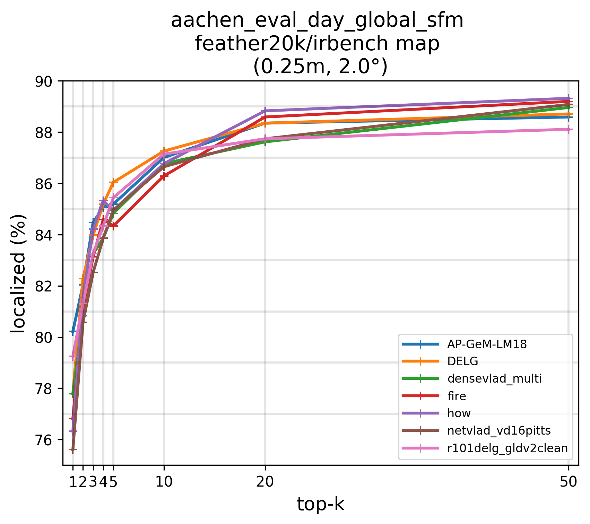
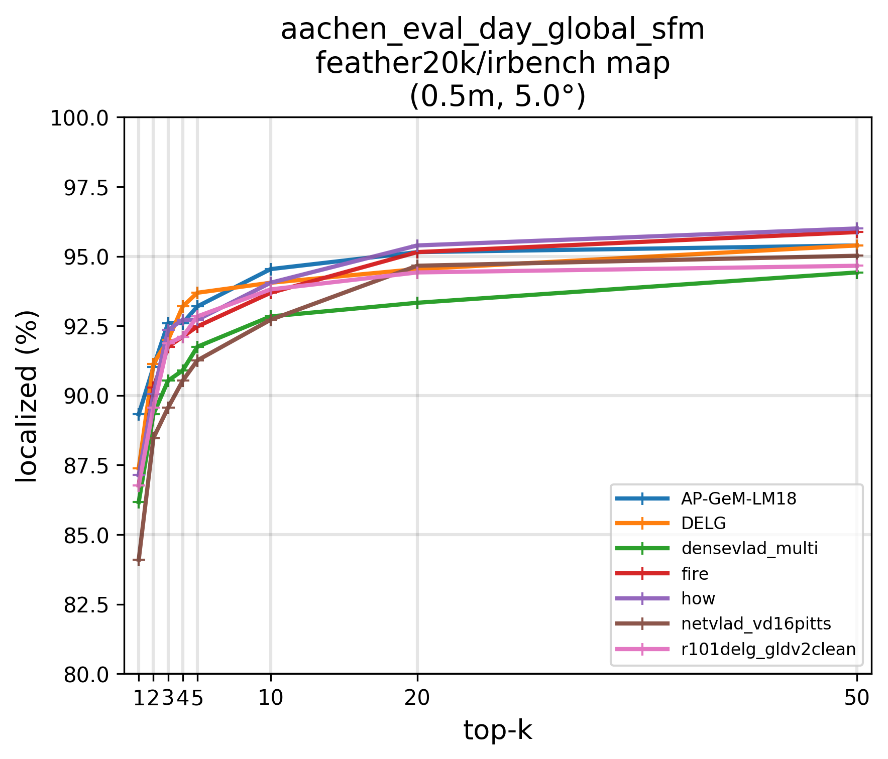
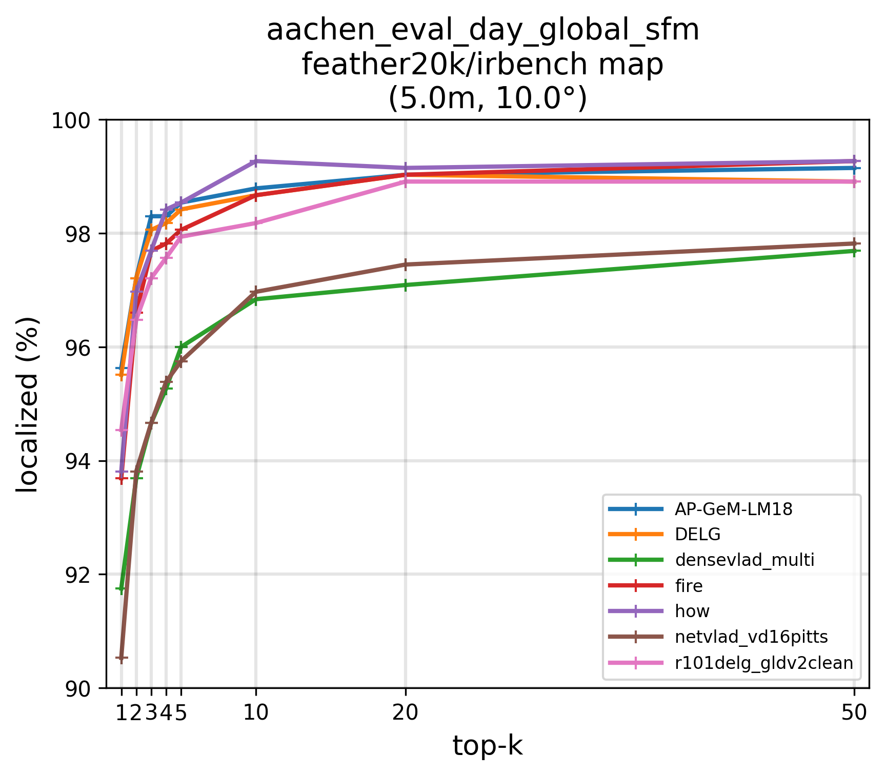

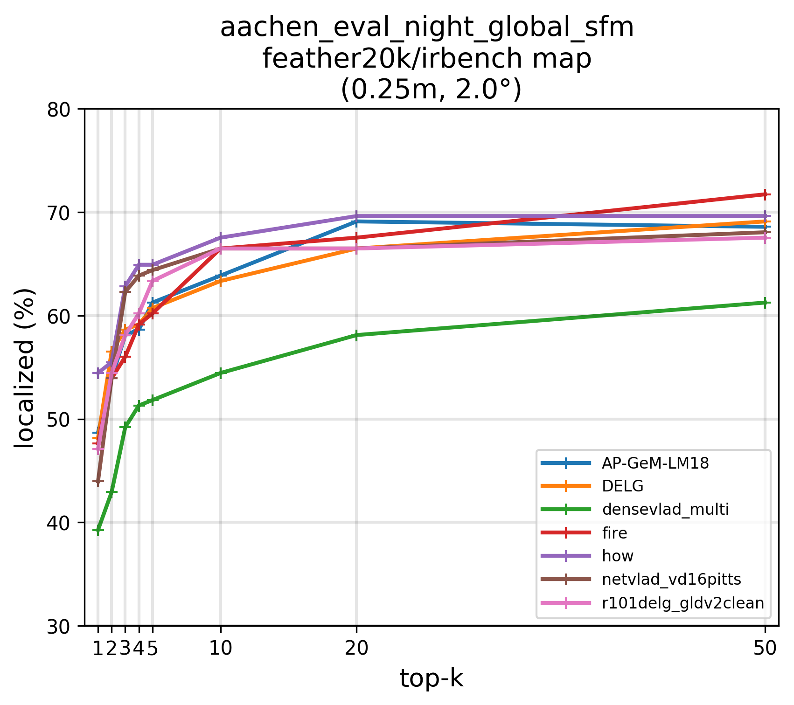
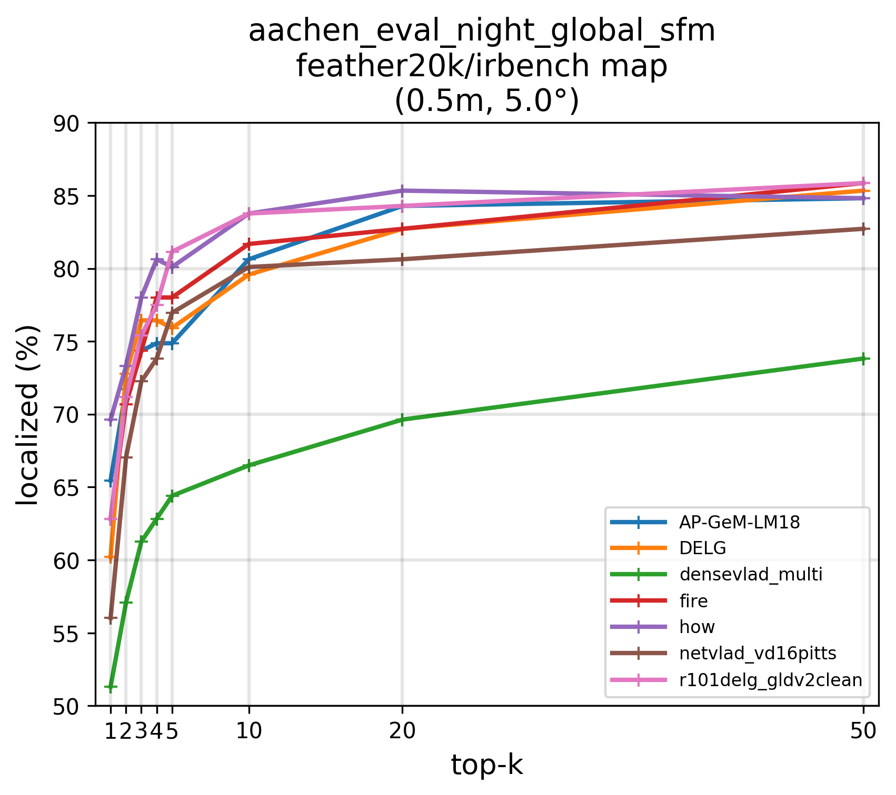
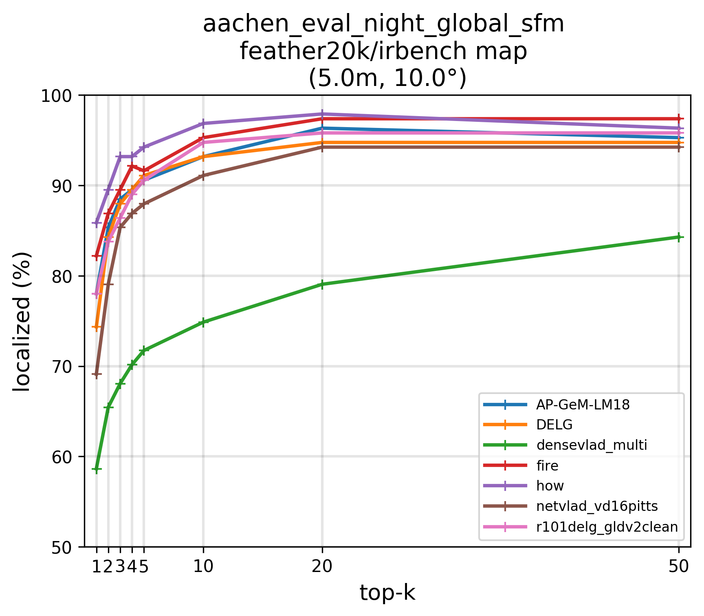

=== local_sfm

[%header]
|===
| feature type | topk 3+|day 3+|night
|||(0.25m_2.0deg)|(0.5m_5.0deg)|(5.0m_10.0deg)|(0.25m_2.0deg)|(0.5m_5.0deg)|(5.0m_10.0deg)
|AP-GeM-LM18|3|42.8%|57.5%|75.2%|9.4%|16.8%|27.8%
|DELG|3|42.7%|57.7%|73.9%|15.2%|19.9%|34.0%
|densevlad_multi|3|43.9%|58.9%|73.5%|9.4%|15.2%|20.4%
|fire|3|44.1%|62.3%|78.2%|14.7%|23.0%|36.7%
|how|3|43.9%|61.4%|78.3%|17.8%|25.7%|37.2%
|netvlad_vd16pitts|3|40.7%|55.1%|70.5%|8.9%|16.2%|24.1%
|r101delg_gldv2clean|3|39.9%|55.5%|71.0%|11.0%|19.9%|28.8%
||||||||
|AP-GeM-LM18|4|56.1%|70.8%|85.8%|21.5%|31.4%|47.6%
|DELG|4|56.3%|71.2%|84.6%|24.1%|34.6%|47.6%
|densevlad_multi|4|57.7%|69.8%|81.9%|17.8%|22.5%|29.8%
|fire|4|56.4%|72.5%|87.9%|25.1%|36.1%|55.0%
|how|4|58.1%|73.7%|87.4%|26.2%|40.8%|55.5%
|netvlad_vd16pitts|4|52.8%|66.4%|79.0%|19.9%|29.3%|41.4%
|r101delg_gldv2clean|4|55.0%|68.0%|82.3%|18.9%|29.8%|44.5%
||||||||
|AP-GeM-LM18|5|60.8%|74.2%|88.0%|27.2%|39.3%|54.5%
|DELG|5|61.9%|75.7%|88.0%|31.9%|42.9%|55.5%
|densevlad_multi|5|61.5%|75.0%|84.6%|18.3%|23.6%|31.9%
|fire|5|63.6%|77.6%|91.0%|30.9%|42.4%|64.4%
|how|5|63.5%|76.3%|89.7%|29.3%|48.7%|64.9%
|netvlad_vd16pitts|5|58.3%|71.5%|82.4%|23.6%|33.5%|48.7%
|r101delg_gldv2clean|5|60.9%|74.2%|86.5%|28.8%|37.2%|50.8%
||||||||
|AP-GeM-LM18|10|72.5%|82.8%|93.0%|47.6%|55.5%|69.1%
|DELG|10|73.3%|84.1%|93.3%|40.8%|56.5%|69.6%
|densevlad_multi|10|71.7%|81.9%|88.4%|23.6%|32.5%|44.5%
|fire|10|73.3%|85.0%|94.7%|45.6%|61.3%|81.2%
|how|10|71.2%|84.6%|94.8%|47.1%|61.8%|79.6%
|netvlad_vd16pitts|10|69.8%|80.0%|88.7%|36.7%|51.8%|63.4%
|r101delg_gldv2clean|10|71.6%|82.5%|92.6%|38.7%|53.9%|67.5%
||||||||
|AP-GeM-LM18|20|79.0%|87.3%|95.0%|48.2%|62.8%|78.5%
|DELG|20|78.6%|89.2%|95.9%|46.6%|62.8%|78.5%
|densevlad_multi|20|76.0%|85.2%|91.5%|29.3%|39.8%|52.4%
|fire|20|79.5%|89.2%|96.2%|50.3%|70.7%|86.4%
|how|20|79.1%|89.3%|96.8%|51.8%|69.1%|84.8%
|netvlad_vd16pitts|20|75.5%|84.8%|91.8%|44.0%|56.5%|70.7%
|r101delg_gldv2clean|20|77.3%|88.1%|96.0%|50.8%|69.1%|81.7%
||||||||
|AP-GeM-LM18|50|82.4%|90.8%|97.8%|53.4%|69.6%|87.4%
|DELG|50|82.7%|91.0%|97.3%|52.4%|71.2%|86.9%
|densevlad_multi|50|79.5%|87.3%|93.6%|37.7%|46.6%|59.2%
|fire|50|83.3%|91.8%|97.7%|57.6%|72.8%|91.6%
|how|50|83.7%|92.0%|97.9%|57.1%|72.3%|90.1%
|netvlad_vd16pitts|50|81.3%|89.3%|95.3%|52.4%|65.5%|77.0%
|r101delg_gldv2clean|50|81.3%|90.4%|97.1%|55.0%|72.3%|86.4%
|===

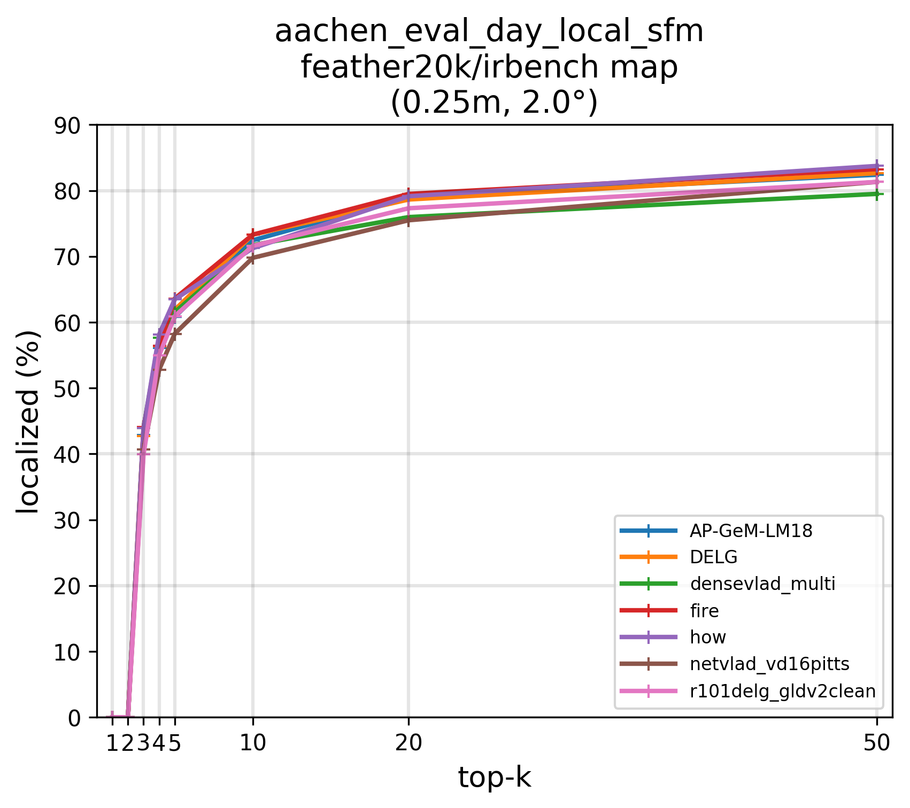
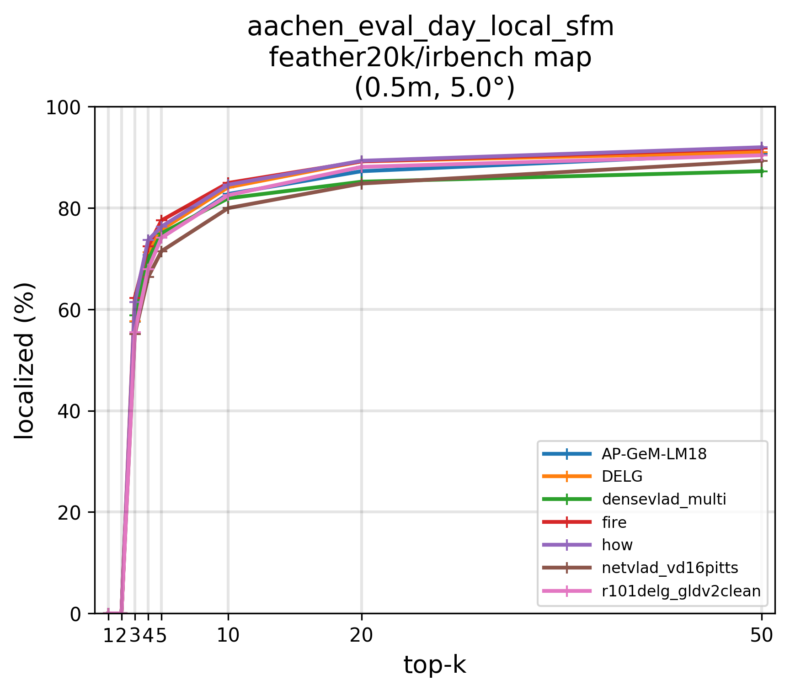
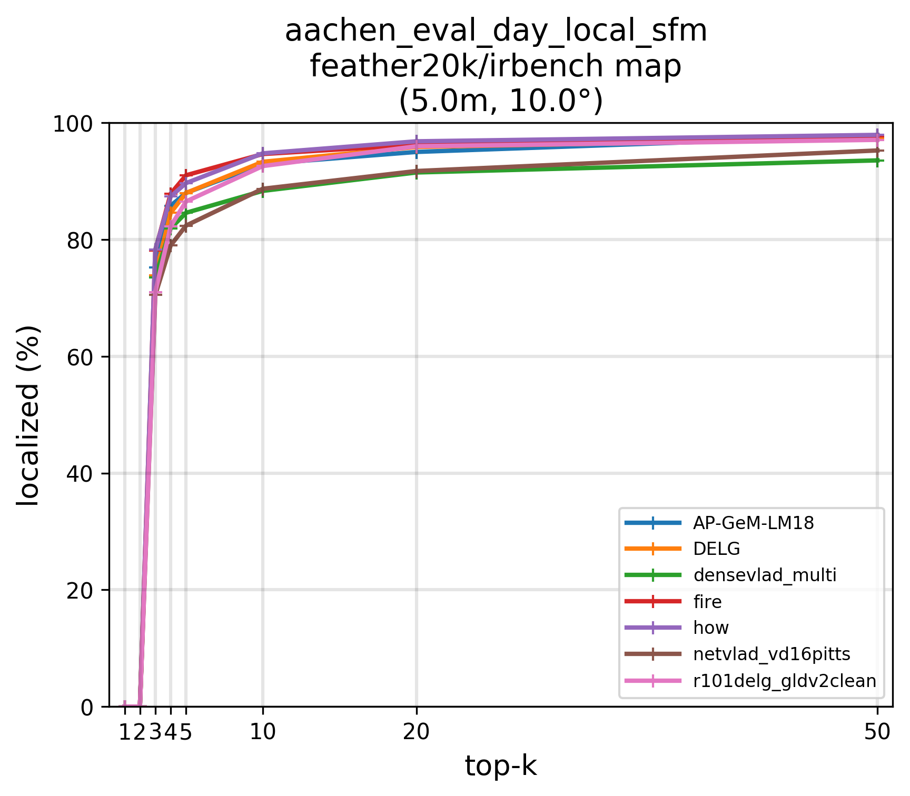

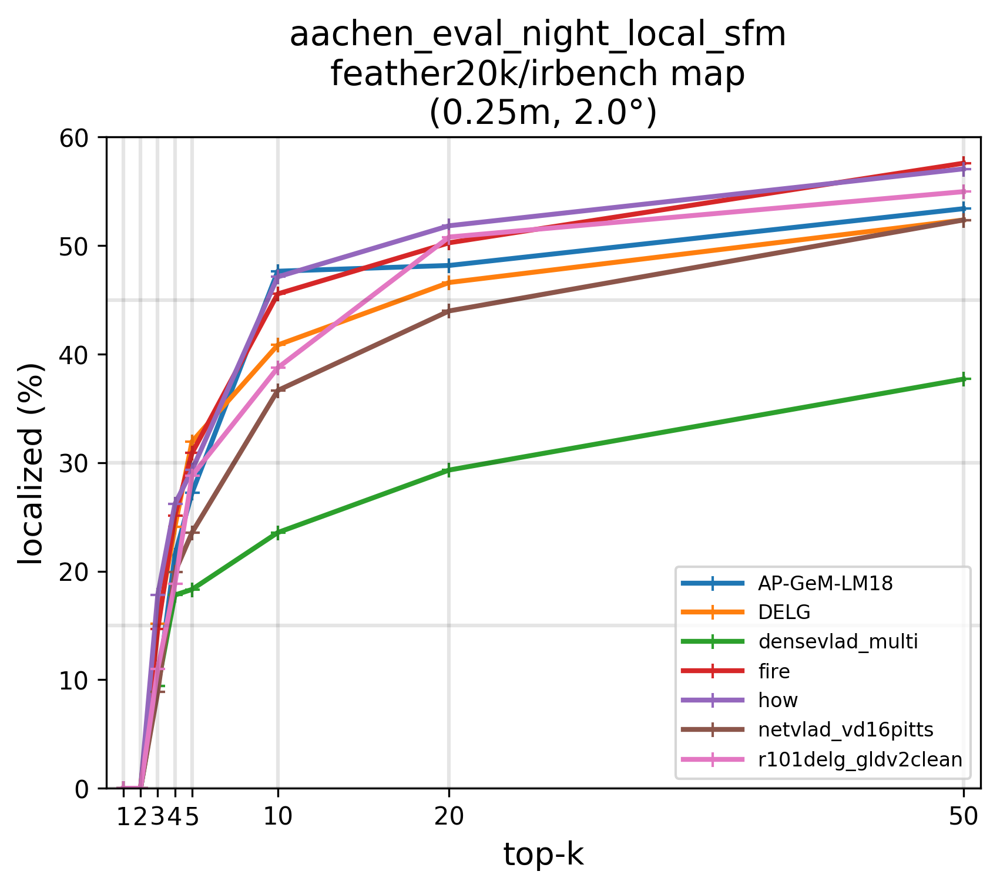
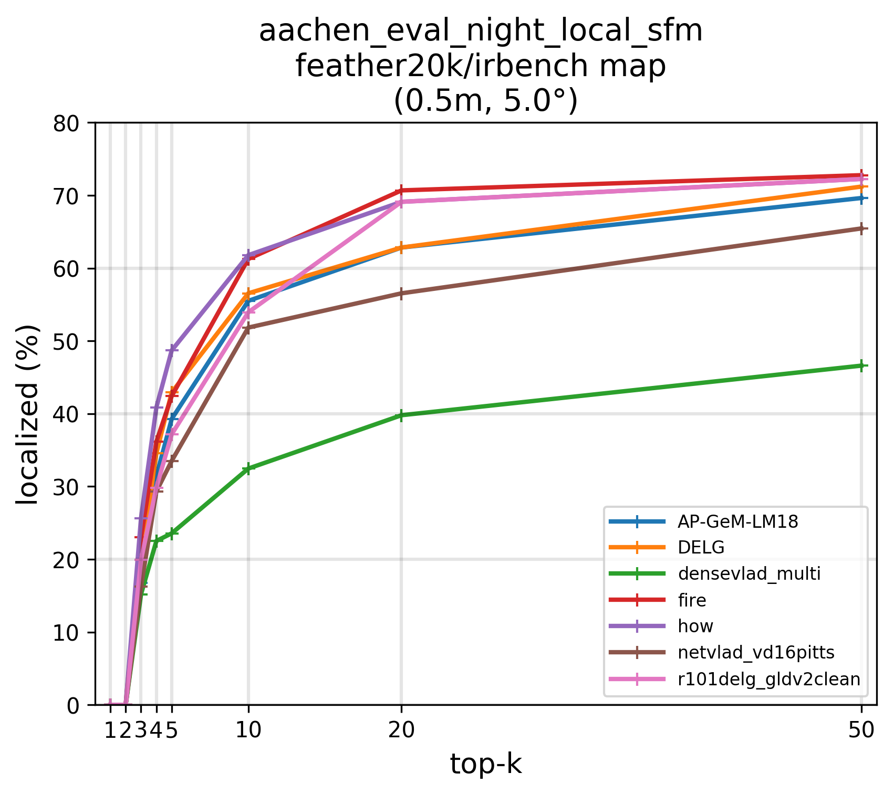
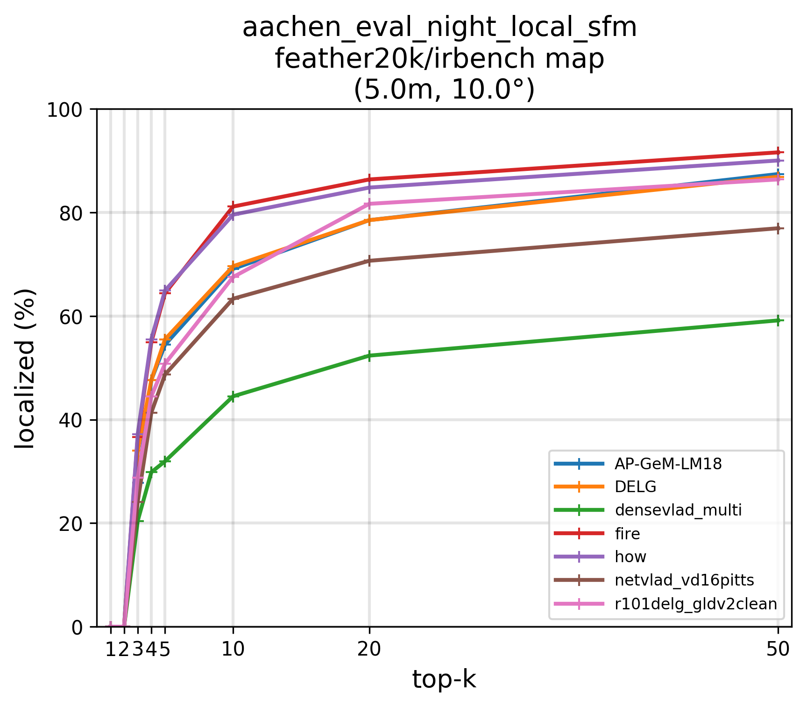

=== EWB

[%header]
|===
|feature type|topk|day|night
|||(5.0m_10.0deg)|(5.0m_10.0deg)
|AP-GeM-LM18|1|23.1%|17.3%
|DELG|1|23.9%|18.9%
|densevlad_multi|1|27.2%|17.8%
|fire|1|28.0%|18.3%
|how|1|28.0%|20.9%
|netvlad_vd16pitts|1|22.5%|16.2%
|r101delg_gldv2clean|1|21.5%|18.3%
||||
|AP-GeM-LM18|2|28.2%|17.8%
|DELG|2|31.7%|17.3%
|densevlad_multi|2|33.7%|14.1%
|fire|2|34.7%|20.9%
|how|2|35.9%|21.5%
|netvlad_vd16pitts|2|28.2%|18.3%
|r101delg_gldv2clean|2|26.6%|20.9%
||||
|AP-GeM-LM18|3|27.1%|16.8%
|DELG|3|31.3%|20.9%
|densevlad_multi|3|35.1%|11.5%
|fire|3|34.1%|19.9%
|how|3|33.4%|21.5%
|netvlad_vd16pitts|3|25.0%|22.0%
|r101delg_gldv2clean|3|26.3%|24.6%
||||
|AP-GeM-LM18|4|24.5%|15.7%
|DELG|4|29.5%|18.9%
|densevlad_multi|4|34.6%|13.6%
|fire|4|33.7%|17.8%
|how|4|34.7%|21.5%
|netvlad_vd16pitts|4|25.9%|14.1%
|r101delg_gldv2clean|4|27.6%|20.4%
||||
|AP-GeM-LM18|5|22.8%|14.7%
|DELG|5|28.3%|16.2%
|densevlad_multi|5|31.8%|13.1%
|fire|5|32.0%|20.4%
|how|5|34.2%|20.4%
|netvlad_vd16pitts|5|23.4%|12.0%
|r101delg_gldv2clean|5|26.1%|15.2%
||||
|AP-GeM-LM18|10|17.4%|12.0%
|DELG|10|21.4%|12.0%
|densevlad_multi|10|24.9%|6.8%
|fire|10|22.8%|13.1%
|how|10|27.6%|19.4%
|netvlad_vd16pitts|10|19.1%|9.4%
|r101delg_gldv2clean|10|20.4%|14.1%
||||
|AP-GeM-LM18|20|11.8%|5.2%
|DELG|20|13.8%|5.2%
|densevlad_multi|20|16.9%|1.6%
|fire|20|16.8%|7.9%
|how|20|18.9%|8.4%
|netvlad_vd16pitts|20|10.9%|4.2%
|r101delg_gldv2clean|20|13.5%|8.9%
||||
|AP-GeM-LM18|50|4.5%|3.7%
|DELG|50|5.7%|5.8%
|densevlad_multi|50|5.1%|1.6%
|fire|50|7.0%|4.2%
|how|50|7.4%|2.6%
|netvlad_vd16pitts|50|4.1%|1.1%
|r101delg_gldv2clean|50|5.5%|5.2%
|===

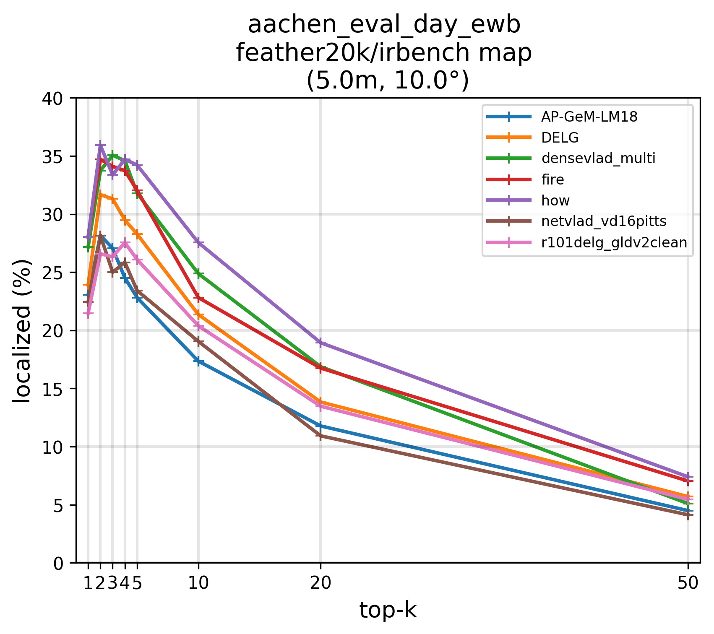
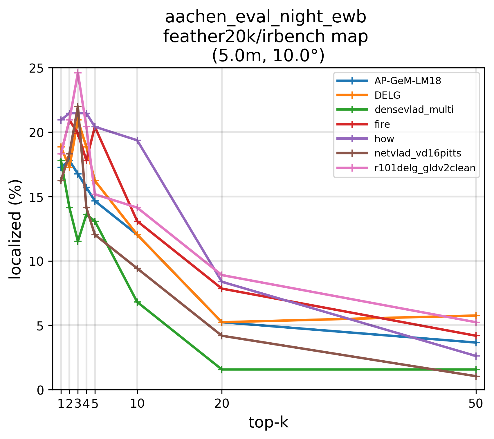

== r2d2_WASF_N8_big 20k Results

=== global_sfm

[%header]
|===
|feature type|topk 3+|Day 3+|Night
|||(0.25, 2.0)|(0.5, 5.0)|(5.0, 10.0)|(0.25, 2.0)|(0.5, 5.0)|(5.0, 10.0)
|AP-GeM-LM18|1         |81.8%|92.4%|97.3%|62.3%|76.4%|92.2%
|DELG|1                |80.7%|90.9%|96.8%|58.1%|75.4%|86.4%
|densevlad_multi|1     |78.4%|88.7%|93.2%|45.6%|57.1%|64.9%
|fire|1|78.3%|88.6%|95.4%|61.8%|78.0%|94.8%
|how|1                 |77.6%|89.2%|95.4%|65.5%|78.5%|94.8%
|netvlad_vd16pitts|1   |78.0%|88.1%|92.7%|56.0%|72.3%|82.7%
||||||||
|AP-GeM-LM18|2         |85.1%|94.1%|98.4%|66.0%|83.3%|94.2%
|DELG|2                |84.5%|93.6%|98.1%|61.3%|79.6%|89.5%
|densevlad_multi|2     |82.5%|90.4%|94.9%|51.8%|64.4%|72.3%
|fire|2|82.4%|91.9%|97.5%|65.5%|82.2%|95.3%
|how|2                 |83.0%|92.6%|97.9%|68.1%|86.4%|98.4%
|netvlad_vd16pitts|2   |82.9%|90.5%|94.4%|63.4%|76.4%|89.5%
||||||||
|AP-GeM-LM18|3         |86.8%|95.4%|99.0%|65.5%|83.8%|95.8%
|DELG|3                |86.2%|94.3%|98.4%|62.8%|79.6%|93.2%
|densevlad_multi|3     |85.0%|92.0%|95.4%|55.0%|67.0%|75.4%
|fire|3|84.3%|93.2%|98.3%|66.5%|83.8%|96.3%
|how|3                 |84.8%|93.7%|98.3%|71.2%|86.4%|99.0%
|netvlad_vd16pitts|3   |84.5%|91.8%|95.5%|68.1%|81.7%|92.7%
||||||||
|AP-GeM-LM18|4         |87.0%|95.4%|98.8%|69.1%|83.8%|96.3%
|DELG|4                |87.0%|94.9%|98.8%|64.9%|81.7%|93.2%
|densevlad_multi|4     |85.3%|92.4%|95.9%|56.0%|67.0%|76.4%
|fire|4|85.6%|94.1%|98.7%|67.5%|84.8%|97.9%
|how|4                 |86.0%|94.5%|98.8%|70.2%|86.4%|99.0%
|netvlad_vd16pitts|4   |85.7%|92.2%|96.1%|69.1%|82.2%|92.7%
||||||||
|AP-GeM-LM18|5         |87.6%|95.6%|99.0%|68.1%|85.3%|96.9%
|DELG|5                |87.6%|95.3%|98.8%|67.5%|82.7%|94.2%
|densevlad_multi|5     |85.7%|93.0%|96.4%|57.6%|69.1%|79.1%
|fire|5|85.9%|94.2%|98.5%|68.6%|84.8%|97.9%
|how|5                 |86.8%|95.3%|99.0%|71.7%|86.9%|99.0%
|netvlad_vd16pitts|5   |86.4%|93.2%|96.5%|70.2%|82.7%|93.7%
||||||||
|AP-GeM-LM18|10        |89.0%|96.0%|99.3%|72.8%|87.4%|96.9%
|DELG|10               |88.4%|95.6%|98.9%|72.8%|84.3%|96.3%
|densevlad_multi|10    |87.9%|94.2%|97.0%|57.6%|73.8%|82.7%
|fire|10|88.6%|96.0%|99.3%|71.2%|85.9%|99.0%
|how|10                |88.8%|96.1%|99.4%|72.8%|88.0%|99.5%
|netvlad_vd16pitts|10  |88.6%|94.4%|97.5%|72.8%|85.3%|96.9%
||||||||
|AP-GeM-LM18|20        |89.6%|96.5%|99.3%|73.3%|86.9%|97.9%
|DELG|20               |89.7%|96.4%|99.3%|74.4%|88.5%|96.9%
|densevlad_multi|20    |87.9%|94.2%|97.5%|63.4%|79.1%|86.9%
|fire|20|90.2%|96.7%|99.4%|73.8%|88.0%|99.0%
|how|20                |90.3%|96.2%|99.3%|74.4%|88.5%|99.5%
|netvlad_vd16pitts|20  |89.0%|95.2%|97.9%|73.8%|89.0%|97.4%
||||||||
|AP-GeM-LM18|50        |89.8%|96.8%|99.5%|74.9%|89.0%|98.4%
|DELG|50               |90.9%|96.7%|99.5%|76.4%|90.1%|98.4%
|densevlad_multi|50    |90.1%|95.8%|98.4%|67.5%|83.8%|91.6%
|fire|50|90.5%|97.1%|99.8%|77.0%|91.6%|99.0%
|how|50                |90.4%|96.8%|99.6%|75.9%|90.6%|99.5%
|netvlad_vd16pitts|50  |89.6%|95.8%|98.4%|74.9%|89.0%|97.9%

|===

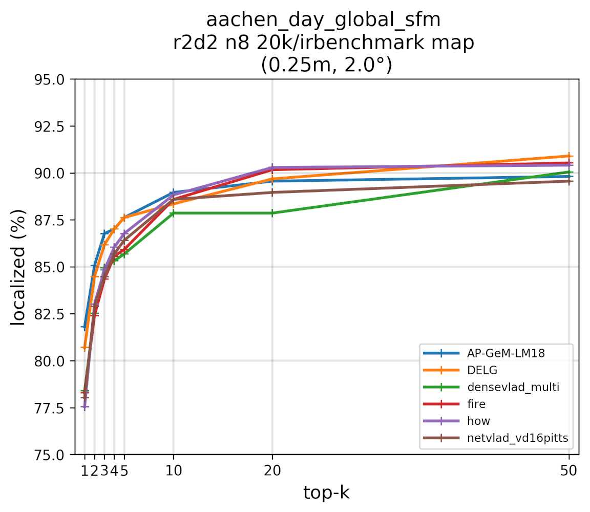
image::../doc/plots/r2d2/aachen_day_r2d2_global_sfm_1.jpg[aachen_day_r2d2_global_sfm_1]
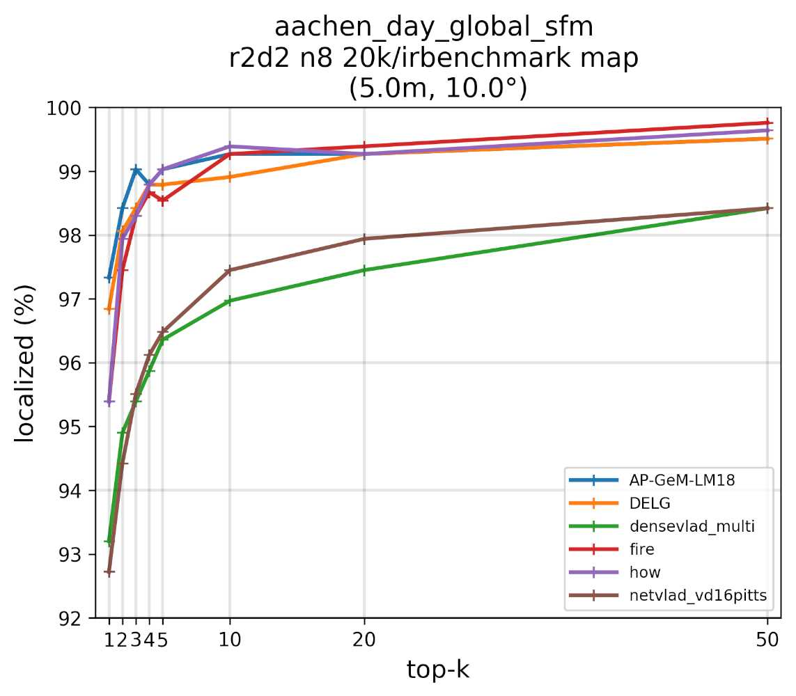

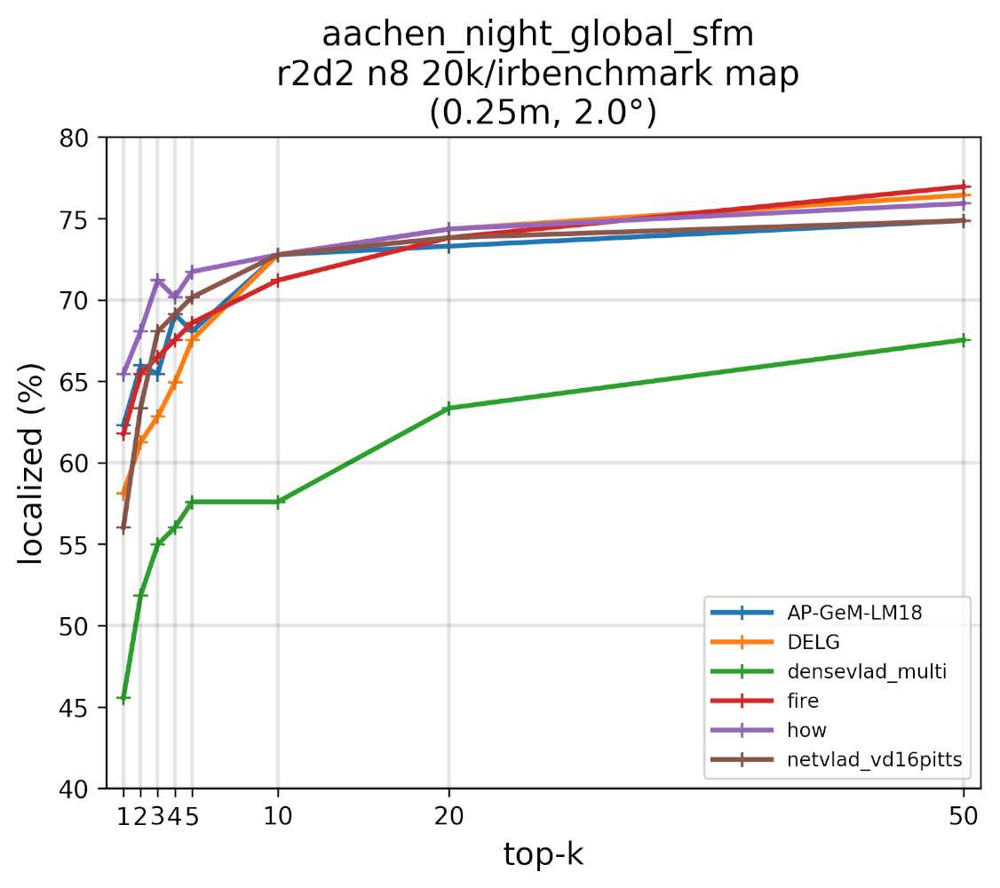
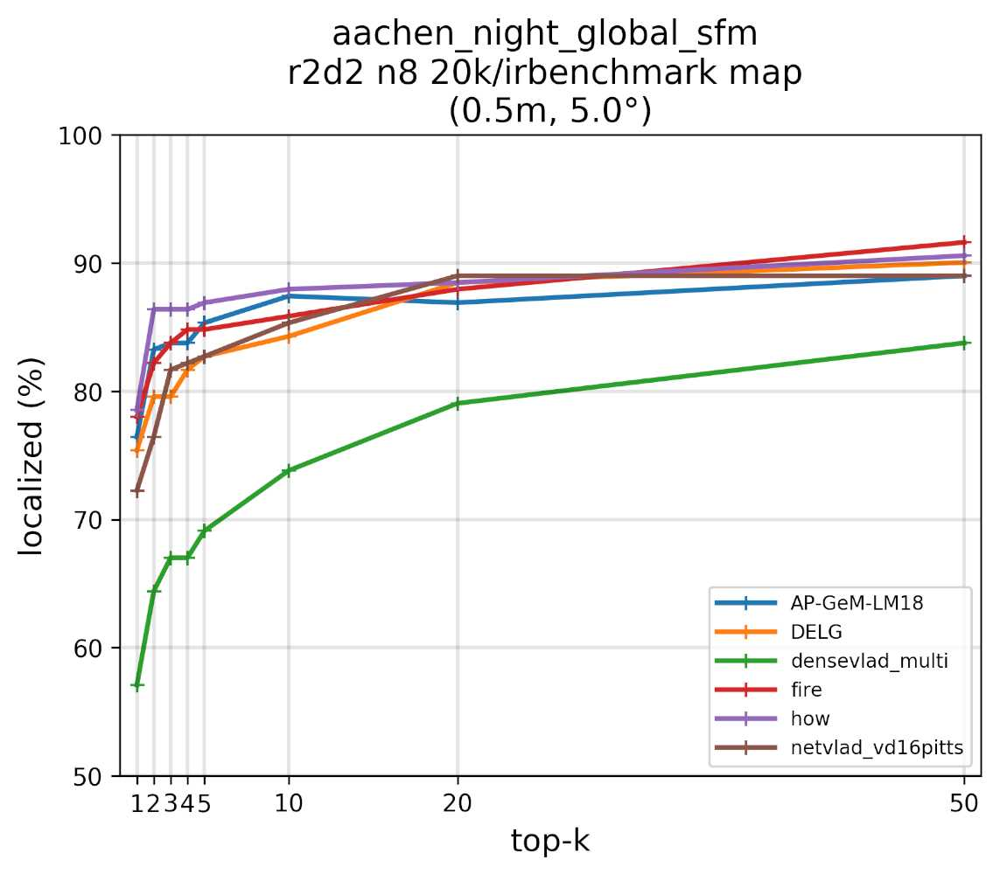
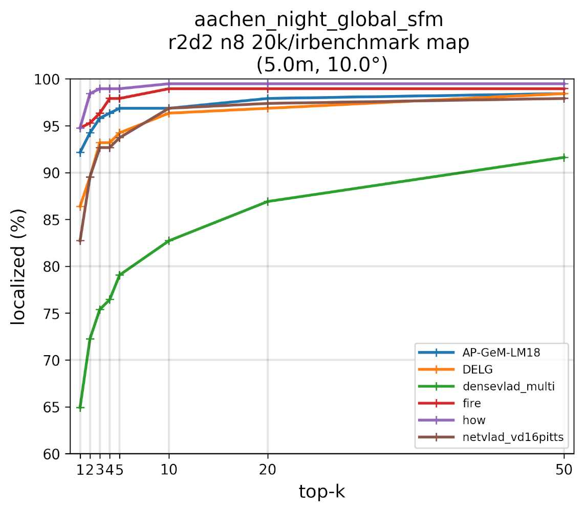

=== local_sfm

[%header]
|===
|feature type|topk 3+|Day 3+|Night
|||(0.25, 2.0)|(0.5, 5.0)|(5.0, 10.0)|(0.25, 2.0)|(0.5, 5.0)|(5.0, 10.0)
|AP-GeM-LM18|3         |53.4%|67.7%|83.9%|22.5%|37.2%|55.0%
|DELG|3                |51.8%|66.5%|82.9%|25.7%|38.7%|58.1%
|densevlad_multi|3     |53.3%|65.2%|78.6%|16.2%|23.0%|30.4%
|fire|3|51.9%|67.8%|85.2%|28.3%|40.3%|62.3%
|how|3                 |52.2%|68.6%|84.8%|35.1%|46.1%|65.5%
|netvlad_vd16pitts|3   |50.0%|63.1%|76.0%|21.5%|31.9%|46.1%
||||||||
|AP-GeM-LM18|4         |64.4%|76.6%|90.5%|38.7%|53.9%|71.2%
|DELG|4                |64.0%|77.8%|90.8%|41.4%|55.0%|72.8%
|densevlad_multi|4     |62.3%|74.6%|84.1%|21.5%|30.9%|38.7%
|fire|4|62.4%|77.1%|90.8%|39.3%|57.6%|83.8%
|how|4                 |63.4%|78.4%|91.0%|39.3%|56.5%|83.8%
|netvlad_vd16pitts|4   |58.7%|71.6%|83.5%|34.0%|48.7%|59.7%
||||||||
|AP-GeM-LM18|5         |67.6%|79.6%|92.1%|45.0%|61.8%|79.6%
|DELG|5                |69.2%|82.5%|93.2%|45.6%|60.7%|78.0%
|densevlad_multi|5     |66.3%|78.2%|86.3%|25.1%|33.5%|43.5%
|fire|5|67.7%|81.3%|93.2%|47.6%|66.5%|90.1%
|how|5                 |68.0%|80.8%|93.1%|44.5%|68.1%|86.4%
|netvlad_vd16pitts|5   |62.9%|75.7%|86.5%|39.8%|57.1%|68.6%
||||||||
|AP-GeM-LM18|10        |76.6%|87.9%|96.5%|56.0%|74.9%|89.5%
|DELG|10               |77.9%|89.1%|97.0%|58.6%|71.2%|89.0%
|densevlad_multi|10    |74.8%|85.2%|90.9%|33.5%|42.9%|54.5%
|fire|10|77.2%|88.1%|96.5%|60.2%|77.5%|94.2%
|how|10                |76.3%|89.3%|96.0%|59.2%|78.0%|93.2%
|netvlad_vd16pitts|10  |75.5%|85.2%|92.1%|53.4%|65.5%|80.1%
||||||||
|AP-GeM-LM18|20        |82.8%|92.4%|98.4%|60.7%|79.1%|93.7%
|DELG|20               |83.9%|92.6%|97.9%|63.4%|78.5%|92.2%
|densevlad_multi|20    |80.1%|88.5%|93.3%|40.3%|56.0%|66.5%
|fire|20|82.3%|92.2%|98.1%|65.5%|83.8%|95.8%
|how|20                |82.8%|92.2%|98.3%|64.9%|84.3%|96.9%
|netvlad_vd16pitts|20  |81.6%|89.4%|95.2%|55.5%|73.8%|84.3%
||||||||
|AP-GeM-LM18|50        |86.5%|94.3%|99.2%|66.0%|84.8%|95.8%
|DELG|50               |85.9%|94.3%|98.8%|70.7%|84.3%|94.8%
|densevlad_multi|50    |83.7%|91.0%|95.6%|46.6%|61.3%|75.4%
|fire|50|86.7%|94.8%|98.8%|68.1%|82.7%|96.9%
|how|50                |86.8%|94.7%|99.2%|70.2%|85.9%|97.9%
|netvlad_vd16pitts|50  |84.5%|92.8%|97.3%|63.4%|78.5%|91.1%
|===

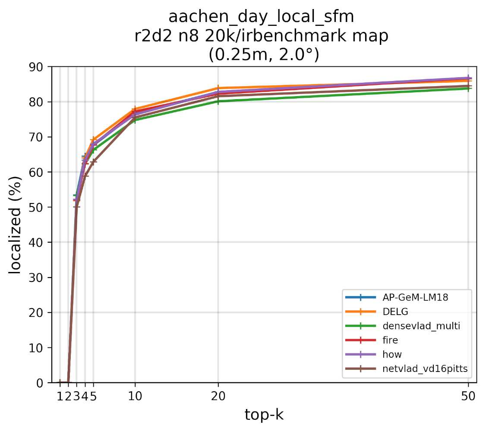
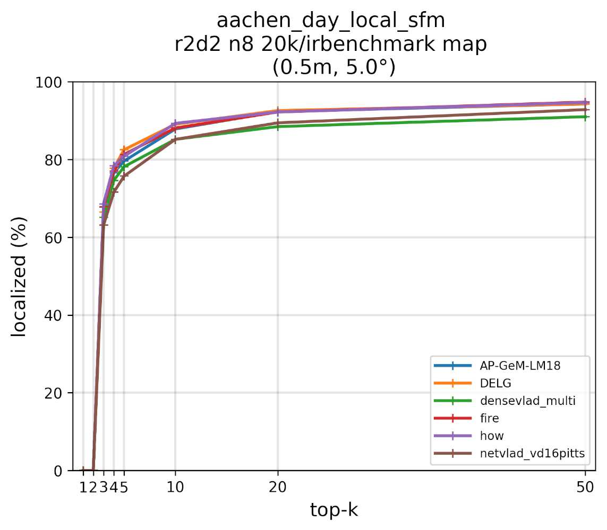
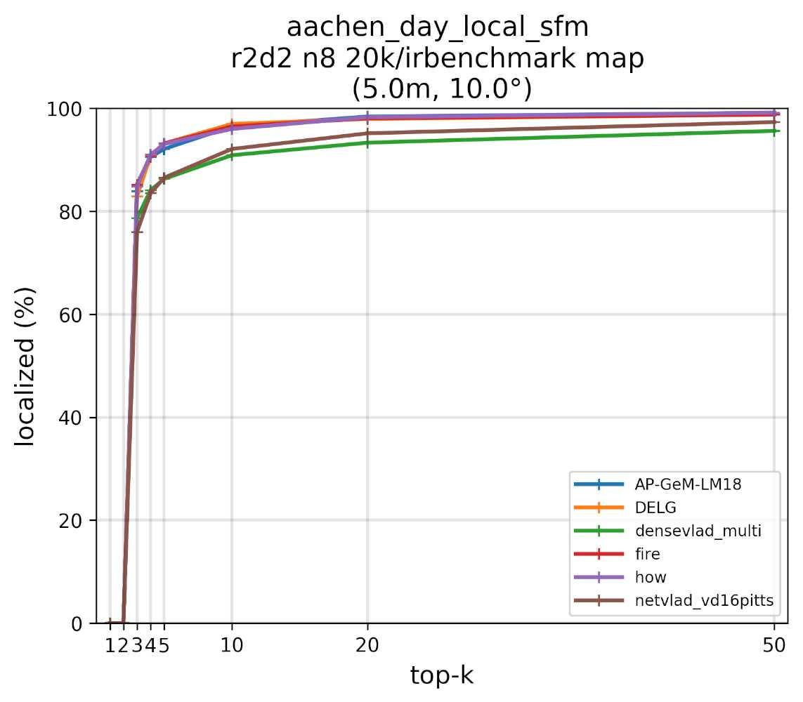

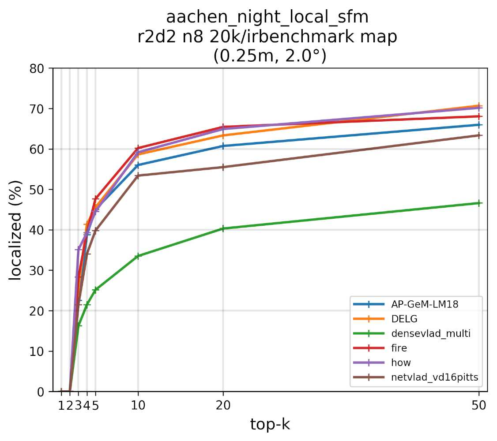
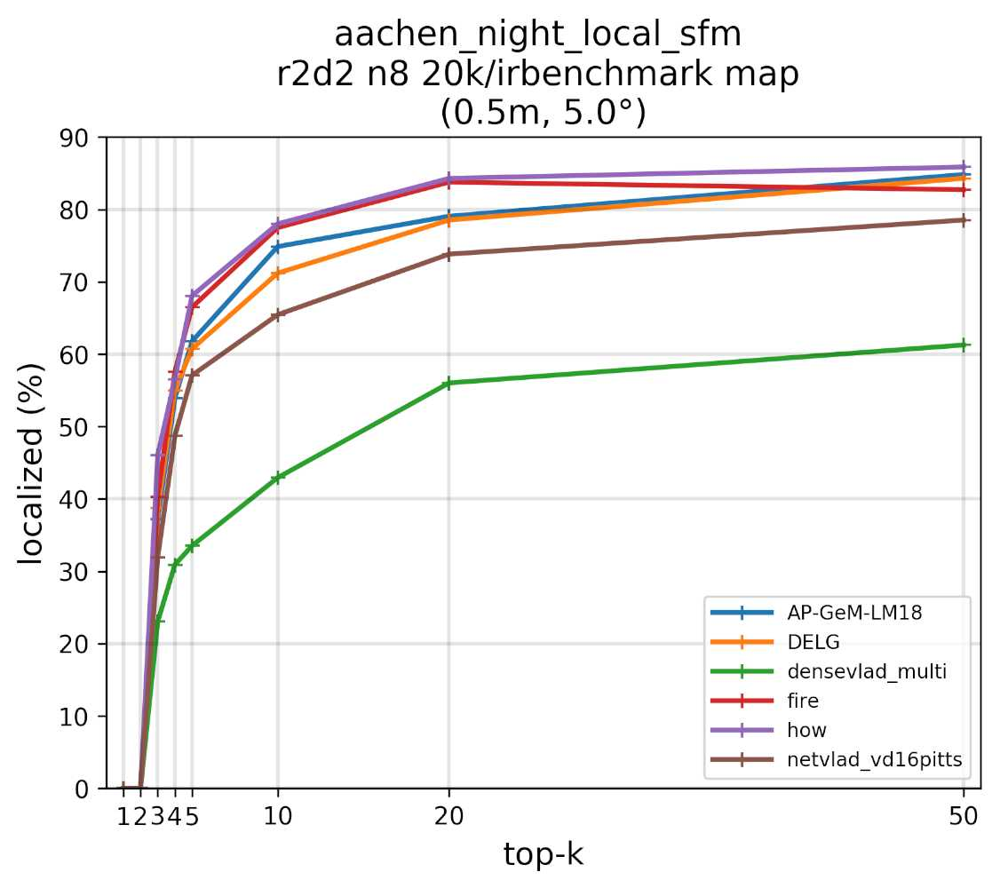
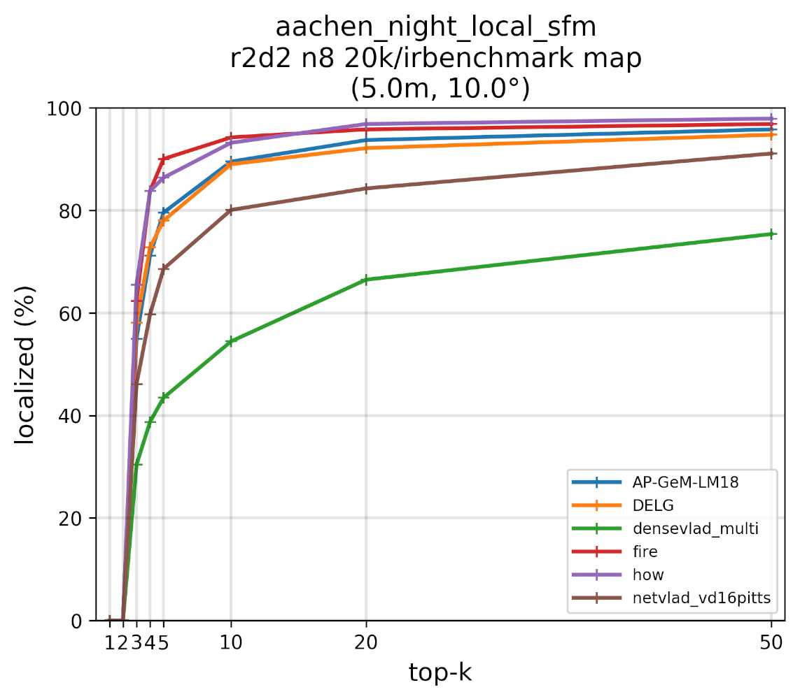

=== EWB

[%header]
|===
|feature type|topk|Day|Night
|||(5.0, 10.0)|(5.0, 10.0)
|AP-GeM-LM18|1         |23.1%|17.3%
|DELG|1                |23.9%|18.9%
|densevlad_multi|1     |27.2%|17.8%
|fire|1|28.0%|18.3%
|how|1                 |28.0%|20.9%
|netvlad_vd16pitts|1   |22.5%|16.2%
||||
|AP-GeM-LM18|2         |28.2%|17.8%
|DELG|2                |31.7%|17.3%
|densevlad_multi|2     |33.7%|14.1%
|fire|2|34.7%|20.9%
|how|2                 |35.9%|21.5%
|netvlad_vd16pitts|2   |28.2%|18.3%
||||
|AP-GeM-LM18|3         |27.1%|16.8%
|DELG|3                |31.3%|20.9%
|densevlad_multi|3     |35.1%|11.5%
|fire|3|34.1%|19.9%
|how|3                 |33.4%|21.5%
|netvlad_vd16pitts|3   |25.0%|22.0%
||||
|AP-GeM-LM18|4         |24.5%|15.7%
|DELG|4                |29.5%|18.9%
|densevlad_multi|4     |34.6%|13.6%
|fire|4|33.7%|17.8%
|how|4                 |34.7%|21.5%
|netvlad_vd16pitts|4   |25.9%|14.1%
||||
|AP-GeM-LM18|5         |22.8%|14.7%
|DELG|5                |28.3%|16.2%
|densevlad_multi|5     |31.8%|13.1%
|fire|5|32.0%|20.4%
|how|5                 |34.2%|20.4%
|netvlad_vd16pitts|5   |23.4%|12.0%
||||
|AP-GeM-LM18|10        |17.4%|12.0%
|DELG|10               |21.4%|12.0%
|densevlad_multi|10    |24.9%|6.8%
|fire|10|22.8%|13.1%
|how|10                |27.6%|19.4%
|netvlad_vd16pitts|10  |19.1%|9.4%
||||
|AP-GeM-LM18|20        |11.8%|5.2%
|DELG|20               |13.8%|5.2%
|densevlad_multi|20    |16.9%|1.6%
|fire|20|16.8%|7.9%
|how|20                |18.9%|8.4%
|netvlad_vd16pitts|20  |10.9%|4.2%
||||
|AP-GeM-LM18|50        |4.5%|3.7%
|DELG|50               |5.7%|5.8%
|densevlad_multi|50    |5.1%|1.6%
|fire|50|7.0%|4.2%
|how|50                |7.4%|2.6%
|netvlad_vd16pitts|50  |4.1%|1.1%
|===

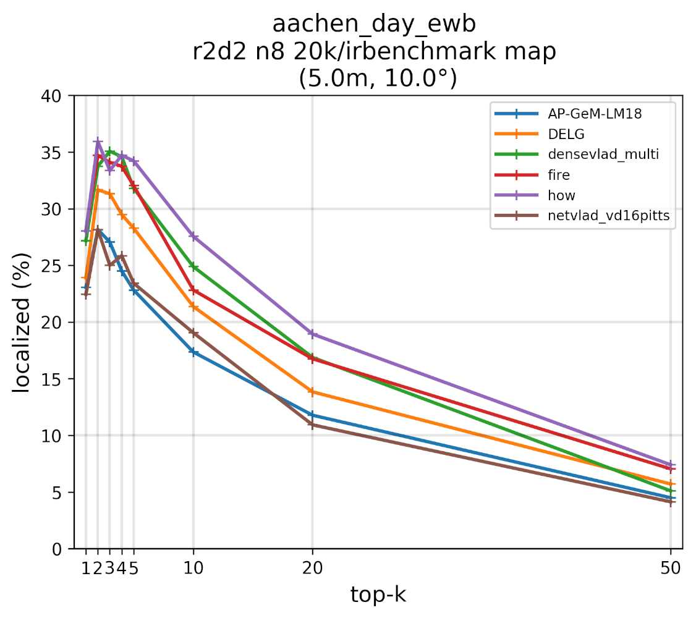
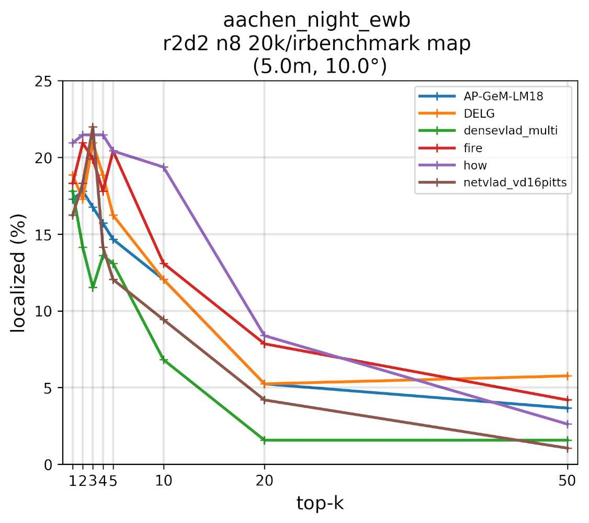
