= Baidu-mall : Image Retrieval Benchmark results
:sectnums:
:sectnumlevels: 0
:toc:
:toclevels: 3

== Feather2d2 20k Results

=== global_sfm

[%header,format=csv,separator=;]
|===
feature type;topk;(0.25m_2.0deg);(0.5m_5.0deg);(5.0m_10.0deg);median distance (m);median angle (deg)
AP-GeM-LM18;1;41.49%;52.97%;61.04%;0.3991;1.6483
DELG;1;39.88%;50.79%;59.29%;0.4515;1.8499
densevlad_multi;1;43.06%;53.93%;61.08%;0.3620;1.5849
fire;1;48.65%;63.61%;72.29%;0.2539;1.1739
how;1;51.40%;66.27%;76.22%;0.2308;1.1269
netvlad_vd16pitts;1;42.10%;52.27%;59.55%;0.3983;1.7977
r101delg_gldv2clean;1;40.36%;51.83%;60.08%;0.4113;1.8627
;;;;;;
AP-GeM-LM18;2;45.99%;58.55%;67.32%;0.2867;1.2706
DELG;2;45.72%;57.94%;65.62%;0.2937;1.2847
densevlad_multi;2;47.38%;59.42%;66.58%;0.2684;1.2062
fire;2;55.24%;69.98%;78.84%;0.2087;0.9831
how;2;58.03%;73.43%;82.68%;0.1906;0.9223
netvlad_vd16pitts;2;47.64%;58.64%;66.67%;0.2733;1.2313
r101delg_gldv2clean;2;46.82%;59.73%;67.67%;0.2741;1.2638
;;;;;;
AP-GeM-LM18;3;49.13%;62.13%;70.81%;0.2470;1.1170
DELG;3;48.39%;61.26%;68.98%;0.2594;1.1736
densevlad_multi;3;49.56%;61.61%;69.24%;0.2423;1.1299
fire;3;56.72%;71.99%;80.98%;0.1969;0.9265
how;3;60.78%;76.66%;84.99%;0.1792;0.8848
netvlad_vd16pitts;3;49.35%;61.30%;69.33%;0.2468;1.1575
r101delg_gldv2clean;3;49.39%;62.70%;70.42%;0.2458;1.1694
;;;;;;
AP-GeM-LM18;4;50.92%;63.48%;72.77%;0.2306;1.0552
DELG;4;49.91%;63.00%;71.07%;0.2428;1.0829
densevlad_multi;4;51.44%;63.87%;71.38%;0.2256;1.0703
fire;4;58.60%;73.43%;81.59%;0.1845;0.9030
how;4;61.61%;77.31%;85.56%;0.1727;0.8701
netvlad_vd16pitts;4;50.96%;63.39%;71.47%;0.2331;1.0867
r101delg_gldv2clean;4;50.35%;64.18%;72.29%;0.2383;1.0790
;;;;;;
AP-GeM-LM18;5;51.27%;64.62%;74.04%;0.2278;1.0318
DELG;5;51.40%;64.40%;72.77%;0.2271;1.0535
densevlad_multi;5;52.53%;65.45%;73.04%;0.2186;1.0229
fire;5;59.95%;74.65%;82.77%;0.1804;0.8775
how;5;62.91%;78.88%;86.61%;0.1673;0.8419
netvlad_vd16pitts;5;51.96%;64.49%;72.99%;0.2227;1.0418
r101delg_gldv2clean;5;52.14%;65.58%;73.82%;0.2237;1.0594
;;;;;;
AP-GeM-LM18;10;54.23%;68.19%;76.92%;0.2075;0.9539
DELG;10;55.15%;68.11%;76.09%;0.2041;0.9479
densevlad_multi;10;54.84%;69.59%;77.09%;0.2007;0.9355
fire;10;62.13%;76.40%;83.99%;0.1714;0.8559
how;10;64.79%;80.72%;88.31%;0.1636;0.8137
netvlad_vd16pitts;10;55.15%;68.54%;76.88%;0.2056;0.9586
r101delg_gldv2clean;10;55.19%;69.37%;77.01%;0.2026;0.9327
;;;;;;
AP-GeM-LM18;20;56.24%;70.72%;80.02%;0.1953;0.9077
DELG;20;57.98%;70.68%;79.54%;0.1899;0.9006
densevlad_multi;20;58.12%;72.64%;80.41%;0.1827;0.8944
fire;20;63.22%;79.14%;86.52%;0.1674;0.8469
how;20;65.27%;81.68%;89.40%;0.1599;0.8228
netvlad_vd16pitts;20;58.29%;71.60%;80.10%;0.1891;0.9201
r101delg_gldv2clean;20;57.98%;72.25%;80.24%;0.1894;0.9102
;;;;;;
AP-GeM-LM18;50;57.98%;72.91%;82.37%;0.1870;0.8748
DELG;50;59.03%;74.13%;82.16%;0.1822;0.8789
densevlad_multi;50;61.43%;76.83%;84.69%;0.1734;0.8705
fire;50;63.57%;79.71%;87.57%;0.1653;0.8428
how;50;65.58%;81.72%;88.92%;0.1600;0.8302
netvlad_vd16pitts;50;60.03%;75.17%;83.33%;0.1771;0.8933
r101delg_gldv2clean;50;61.21%;76.09%;83.90%;0.1715;0.8458
|===

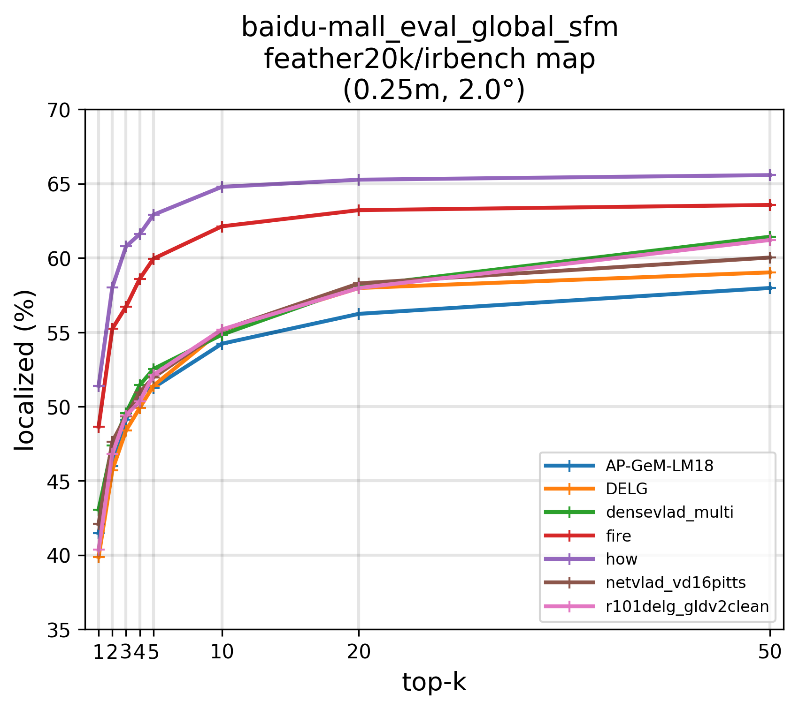
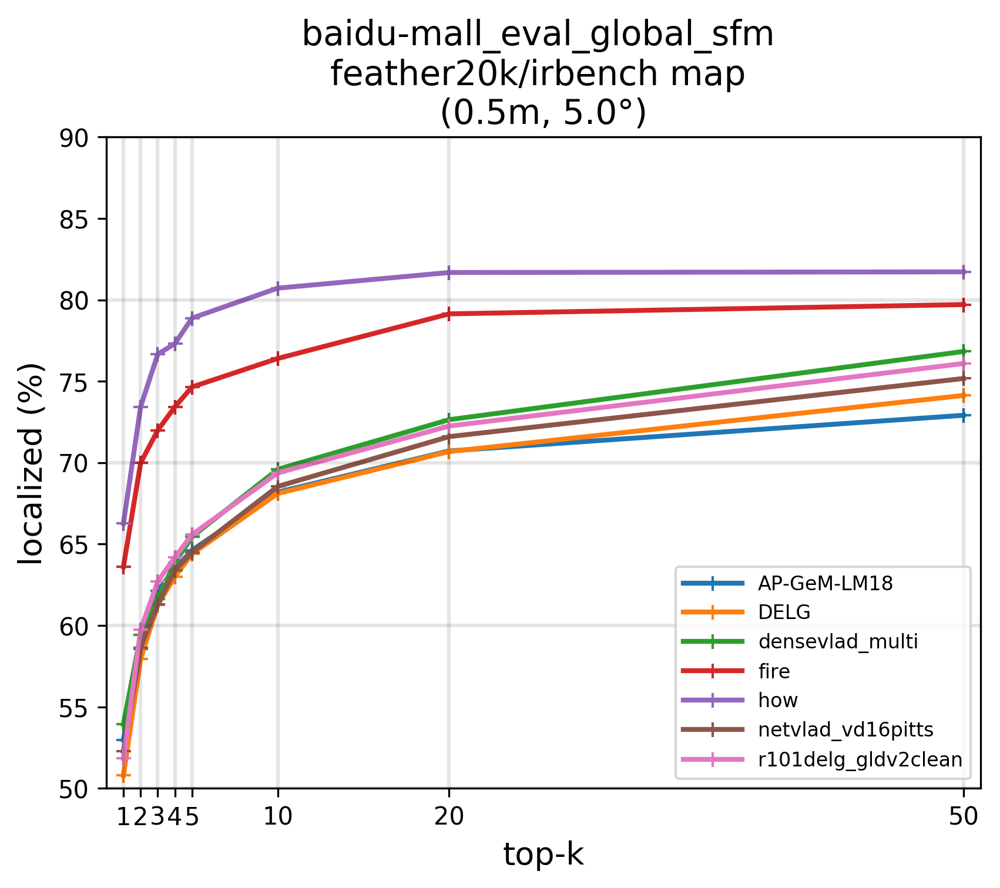
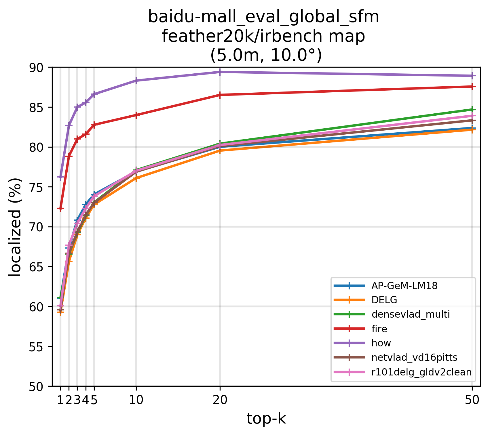

=== local_sfm

[%header,format=csv,separator=;]
|===
feature type;topk;(0.25m_2.0deg);(0.5m_5.0deg);(5.0m_10.0deg);median distance (m);median angle (deg)
AP-GeM-LM18;1;0.00%;0.00%;0.00%;inf;inf
DELG;1;0.00%;0.00%;0.00%;inf;inf
densevlad_multi;1;0.00%;0.00%;0.00%;inf;inf
fire;1;0.00%;0.00%;0.00%;inf;inf
how;1;0.00%;0.00%;0.00%;inf;inf
netvlad_vd16pitts;1;0.00%;0.00%;0.00%;inf;inf
r101delg_gldv2clean;1;0.00%;0.00%;0.00%;inf;inf
;;;;;;
AP-GeM-LM18;2;0.00%;0.00%;0.00%;inf;inf
DELG;2;0.00%;0.00%;0.00%;inf;inf
densevlad_multi;2;0.00%;0.00%;0.00%;inf;inf
fire;2;0.00%;0.00%;0.00%;inf;inf
how;2;0.00%;0.00%;0.00%;inf;inf
netvlad_vd16pitts;2;0.00%;0.00%;0.00%;inf;inf
r101delg_gldv2clean;2;0.00%;0.00%;0.00%;inf;inf
;;;;;;
AP-GeM-LM18;3;2.71%;4.01%;5.89%;inf;inf
DELG;3;2.66%;4.23%;5.98%;inf;inf
densevlad_multi;3;3.10%;4.71%;6.72%;inf;inf
fire;3;3.45%;5.80%;9.12%;inf;inf
how;3;3.62%;5.72%;9.60%;inf;inf
netvlad_vd16pitts;3;2.44%;3.88%;5.67%;inf;inf
r101delg_gldv2clean;3;2.75%;4.49%;6.11%;inf;inf
;;;;;;
AP-GeM-LM18;4;7.64%;12.26%;16.71%;inf;inf
DELG;4;6.76%;10.99%;15.14%;inf;inf
densevlad_multi;4;7.72%;11.82%;15.84%;inf;inf
fire;4;9.69%;15.36%;22.16%;inf;inf
how;4;9.86%;16.58%;23.04%;inf;inf
netvlad_vd16pitts;4;6.54%;10.38%;14.27%;inf;inf
r101delg_gldv2clean;4;6.76%;10.95%;15.05%;inf;inf
;;;;;;
AP-GeM-LM18;5;12.00%;18.41%;24.30%;inf;inf
DELG;5;10.82%;16.36%;21.47%;inf;inf
densevlad_multi;5;11.78%;17.15%;22.25%;inf;inf
fire;5;14.88%;22.86%;30.89%;inf;inf
how;5;15.40%;24.30%;32.64%;inf;inf
netvlad_vd16pitts;5;10.03%;15.58%;20.20%;inf;inf
r101delg_gldv2clean;5;10.73%;16.14%;21.51%;inf;inf
;;;;;;
AP-GeM-LM18;10;19.28%;27.53%;37.83%;inf;inf
DELG;10;17.93%;25.09%;33.99%;inf;inf
densevlad_multi;10;19.11%;26.66%;35.60%;inf;inf
fire;10;26.35%;37.52%;48.60%;2.6673;11.6364
how;10;27.36%;40.01%;53.62%;1.1763;5.4334
netvlad_vd16pitts;10;17.84%;26.70%;34.47%;inf;inf
r101delg_gldv2clean;10;19.02%;26.70%;35.56%;inf;inf
;;;;;;
AP-GeM-LM18;20;23.69%;34.16%;45.33%;6.1982;23.3590
DELG;20;22.21%;31.11%;42.45%;inf;inf
densevlad_multi;20;23.12%;31.89%;42.41%;157.3505;178.8039
fire;20;29.93%;42.58%;55.58%;0.9282;3.9254
how;20;31.76%;45.38%;60.65%;0.6982;3.1201
netvlad_vd16pitts;20;22.21%;32.77%;42.54%;39.8295;148.5412
r101delg_gldv2clean;20;23.82%;33.07%;44.02%;11.5205;47.1031
;;;;;;
AP-GeM-LM18;50;26.61%;37.57%;51.66%;1.6433;6.1614
DELG;50;26.96%;37.70%;50.48%;1.9979;6.9691
densevlad_multi;50;26.96%;37.87%;50.79%;1.8145;6.5525
fire;50;32.02%;46.42%;59.86%;0.6654;2.7916
how;50;33.42%;47.95%;62.17%;0.5579;2.5338
netvlad_vd16pitts;50;26.70%;38.09%;51.48%;1.6620;6.6510
r101delg_gldv2clean;50;27.36%;39.09%;52.01%;1.6470;5.6029
|===

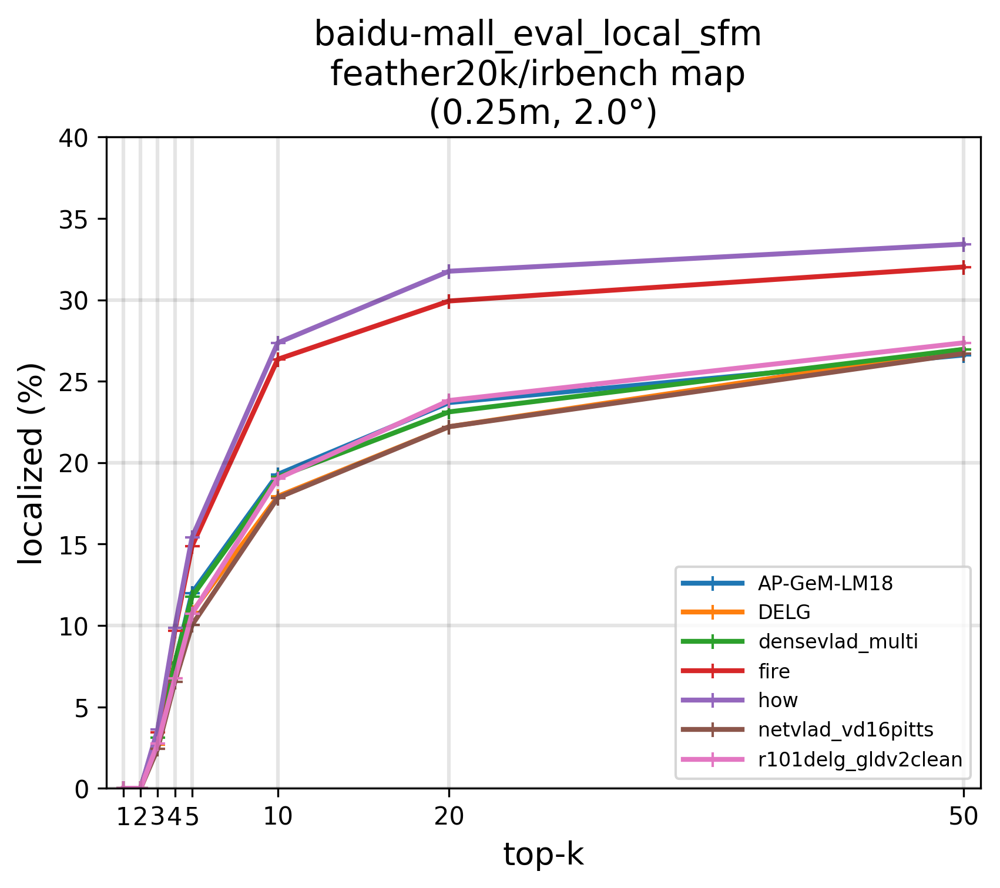
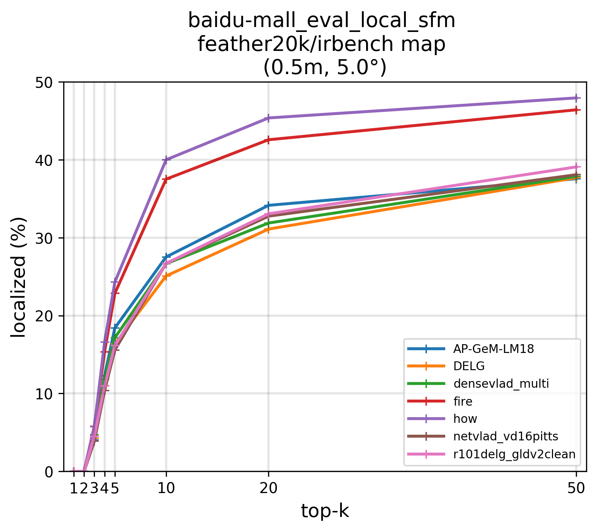
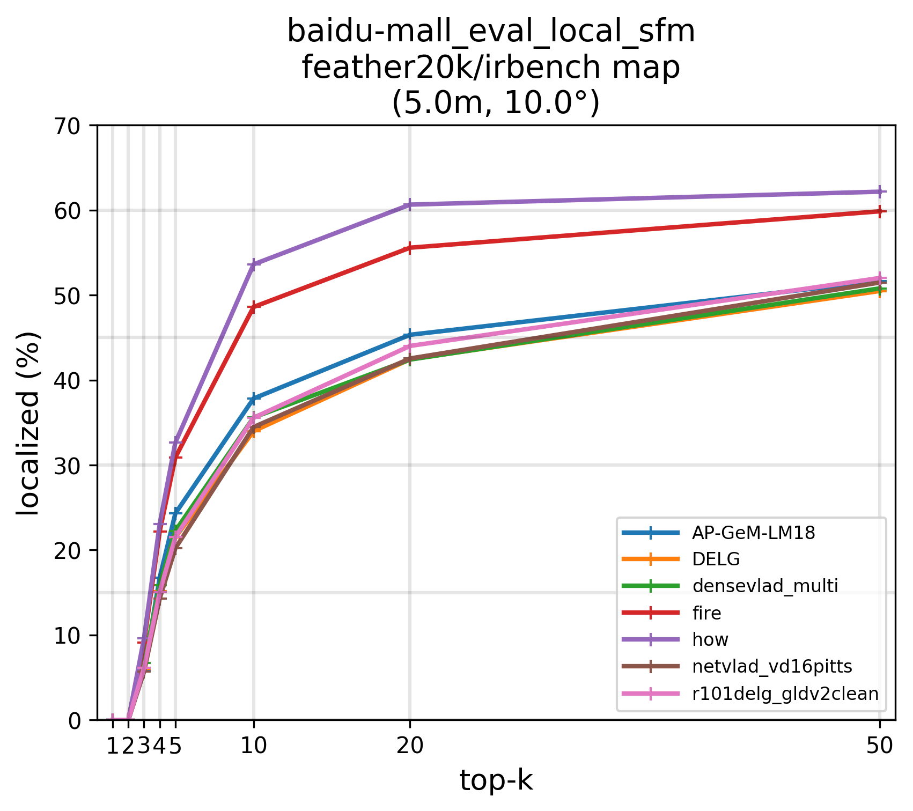

=== EWB

[%header,format=csv,separator=;]
|===
feature type;topk;(5.0m_10.0deg);median distance (m);median angle (deg)
AP-GeM-LM18;1;10.43%;7.2109;26.6689
DELG;1;10.60%;6.2504;26.7181
densevlad_multi;1;12.00%;6.673;23.697
fire;1;12.35%;5.575;25.5125
how;1;12.52%;5.2578;25.1081
netvlad_vd16pitts;1;11.26%;6.47;26.5437
r101delg_gldv2clean;1;11.04%;6.6522;27.7751
;;;;
AP-GeM-LM18;2;10.43%;7.542;27.8744
DELG;2;11.17%;6.6436;27.7308
densevlad_multi;2;11.56%;7.5993;24.4993
fire;2;13.31%;5.5801;25.5571
how;2;13.66%;5.2997;23.9257
netvlad_vd16pitts;2;11.26%;6.6716;28.1548
r101delg_gldv2clean;2;11.30%;6.9504;28.1256
;;;;
AP-GeM-LM18;3;9.60%;8.4706;26.1011
DELG;3;10.73%;7.1468;26.7348
densevlad_multi;3;11.26%;9.1667;23.4016
fire;3;12.61%;5.6782;24.9604
how;3;13.31%;5.5141;23.6242
netvlad_vd16pitts;3;10.60%;7.497;25.9385
r101delg_gldv2clean;3;10.56%;7.442;26.7351
;;;;
AP-GeM-LM18;4;8.07%;9.2447;26.9744
DELG;4;9.95%;8.0939;27.3394
densevlad_multi;4;10.03%;11.8928;23.8444
fire;4;12.00%;5.9515;25.1414
how;4;12.83%;5.6813;23.9538
netvlad_vd16pitts;4;9.77%;8.8262;27.6777
r101delg_gldv2clean;4;10.12%;8.1706;27.776
;;;;
AP-GeM-LM18;5;7.33%;10.4991;26.6251
DELG;5;9.12%;9.4026;26.9786
densevlad_multi;5;8.77%;15.1397;24.2678
fire;5;11.39%;6.2185;24.6712
how;5;12.13%;5.8031;24.0752
netvlad_vd16pitts;5;9.21%;10.8028;26.4875
r101delg_gldv2clean;5;9.38%;9.2596;27.9494
;;;;
AP-GeM-LM18;10;3.93%;18.6119;28.2682
DELG;10;3.75%;21.9131;28.5106
densevlad_multi;10;3.84%;26.7983;25.3009
fire;10;7.11%;11.7412;24.1158
how;10;8.90%;8.7749;23.7837
netvlad_vd16pitts;10;3.97%;21.292;27.0966
r101delg_gldv2clean;10;4.36%;18.4918;28.9858
;;;;
AP-GeM-LM18;20;0.87%;31.5298;33.336
DELG;20;1.44%;35.3734;32.2189
densevlad_multi;20;1.44%;38.8395;27.4481
fire;20;2.53%;24.6811;25.3815
how;20;3.58%;16.4386;25.1866
netvlad_vd16pitts;20;1.18%;33.7681;30.084
r101delg_gldv2clean;20;1.31%;30.379;32.3773
;;;;
AP-GeM-LM18;50;0.13%;47.8105;43.4094
DELG;50;0.22%;49.1835;41.8617
densevlad_multi;50;0.09%;51.9908;34.0089
fire;50;0.26%;44.6016;33.2701
how;50;0.57%;38.4978;34.0702
netvlad_vd16pitts;50;0.22%;46.5507;36.354
r101delg_gldv2clean;50;0.13%;45.203;44.9521
|===

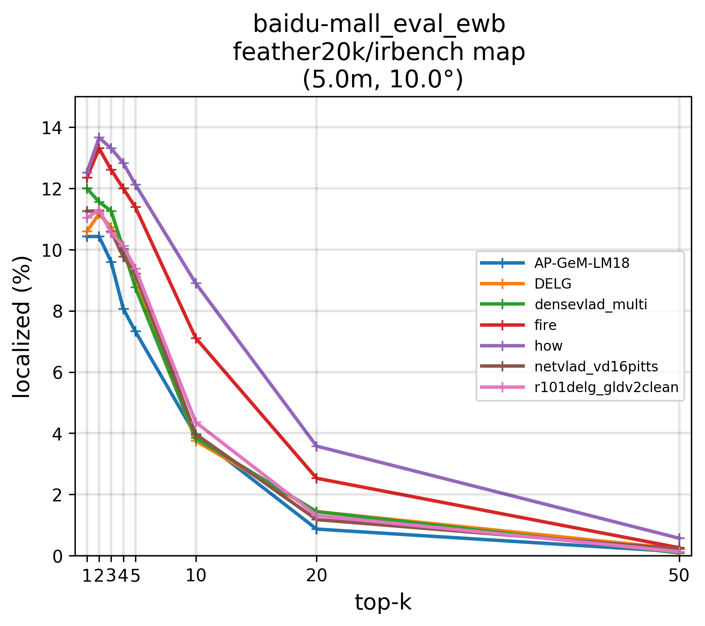

== r2d2_WASF_N8_big 20k Results

=== global_sfm

[%header,format=csv,separator=;]
|===
feature type;top;(0.25, 2.0);(0.5, 5.0);(5.0, 10.0);median distance (m);median angle (deg)
AP-GeM-LM18;1         ;47.43%;58.68%;66.27%;0.2748;1.2784
DELG;1                ;45.29%;56.89%;64.49%;0.3023;1.3403
densevlad_multi;1     ;46.51%;57.64%;64.27%;0.2815;1.2915
fire;1;55.80%;69.50%;76.92%;0.2015;0.9501
how;1                 ;58.42%;74.30%;82.94%;0.1887;0.9057
netvlad_vd16pitts;1   ;46.64%;58.03%;64.92%;0.2778;1.2881
;;;;;;
AP-GeM-LM18;2         ;51.66%;64.14%;72.12%;0.2248;1.0248
DELG;2                ;50.65%;63.05%;69.90%;0.2324;1.0763
densevlad_multi;2     ;51.27%;63.05%;69.76%;0.2324;1.0564
fire;2;60.65%;75.31%;82.85%;0.1798;0.838
how;2                 ;65.27%;79.97%;87.52%;0.1637;0.7938
netvlad_vd16pitts;2   ;52.66%;63.92%;70.20%;0.22;1.0434
;;;;;;
AP-GeM-LM18;3         ;53.49%;66.23%;74.04%;0.2097;0.9788
DELG;3                ;53.14%;66.10%;73.21%;0.2111;0.9754
densevlad_multi;3     ;53.53%;65.84%;72.12%;0.2123;0.9638
fire;3;62.35%;77.66%;84.16%;0.1699;0.8122
how;3                 ;67.63%;82.68%;89.09%;0.1566;0.7641
netvlad_vd16pitts;3   ;54.19%;66.49%;73.17%;0.2119;0.9811
;;;;;;
AP-GeM-LM18;4         ;55.76%;69.15%;77.01%;0.197;0.895
DELG;4                ;54.80%;68.46%;75.48%;0.2044;0.9328
densevlad_multi;4     ;55.54%;68.32%;74.61%;0.2014;0.9185
fire;4;64.40%;78.88%;85.21%;0.1649;0.7815
how;4                 ;68.15%;83.42%;89.62%;0.1556;0.7497
netvlad_vd16pitts;4   ;55.37%;68.80%;74.91%;0.202;0.9136
;;;;;;
AP-GeM-LM18;5         ;56.76%;70.24%;77.92%;0.1925;0.8796
DELG;5                ;55.93%;69.85%;76.75%;0.1947;0.9055
densevlad_multi;5     ;56.06%;69.50%;76.22%;0.1997;0.8908
fire;5;65.18%;79.45%;85.86%;0.1601;0.7742
how;5                 ;68.85%;84.42%;90.14%;0.1524;0.7392
netvlad_vd16pitts;5   ;56.33%;69.46%;76.22%;0.1967;0.906
;;;;;;
AP-GeM-LM18;10        ;59.03%;73.43%;81.59%;0.1817;0.8436
DELG;10               ;59.82%;73.30%;80.50%;0.1775;0.8468
densevlad_multi;10    ;59.51%;74.00%;80.72%;0.18;0.8448
fire;10;67.23%;82.16%;88.26%;0.155;0.7499
how;10                ;70.94%;85.91%;91.62%;0.146;0.7303
netvlad_vd16pitts;10  ;59.34%;73.69%;81.11%;0.1745;0.8553
;;;;;;
AP-GeM-LM18;20        ;61.34%;76.31%;84.60%;0.1717;0.8082
DELG;20               ;62.09%;76.53%;83.60%;0.1704;0.8049
densevlad_multi;20    ;62.87%;77.53%;84.51%;0.1654;0.7815
fire;20;68.94%;83.86%;89.92%;0.1519;0.7427
how;20                ;71.47%;86.95%;92.19%;0.1485;0.7341
netvlad_vd16pitts;20  ;62.87%;77.66%;84.51%;0.1668;0.8095
;;;;;;
AP-GeM-LM18;50        ;64.97%;79.67%;87.04%;0.163;0.7733
DELG;50               ;64.53%;79.76%;87.22%;0.1617;0.7622
densevlad_multi;50    ;66.36%;82.07%;88.35%;0.1563;0.7556
fire;50;69.37%;84.77%;91.45%;0.1515;0.7444
how;50                ;71.03%;86.74%;92.28%;0.1488;0.7343
netvlad_vd16pitts;50  ;65.45%;80.32%;87.35%;0.1581;0.7838

|===

image::../doc/plots/r2d2/baidu_mall_r2d2_global_sfm_0.jpg[baidu_mall_r2d2_global_sfm_0]
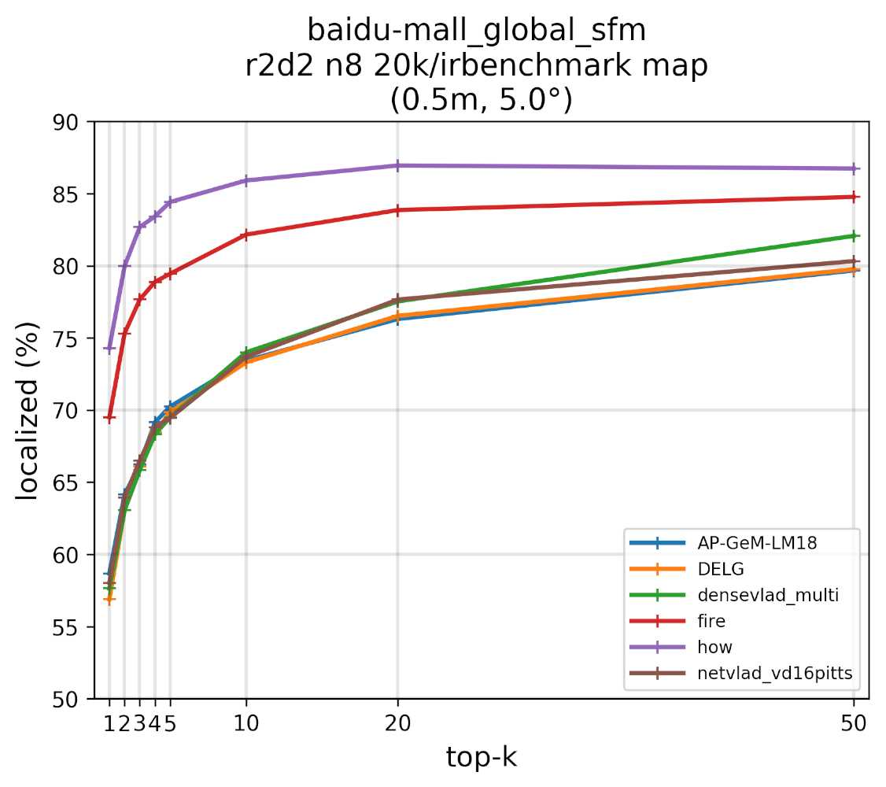
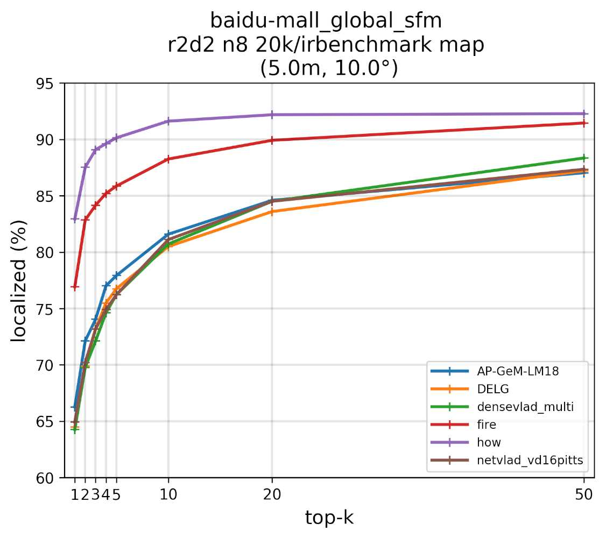

=== local_sfm

[%header,format=csv,separator=;]
|===
feature type;topk;(0.25, 2.0);(0.5, 5.0);(5.0, 10.0);median distance (m);median angle (deg)
AP-GeM-LM18;3       ;4.14%;6.63%;10.43%;inf;inf
DELG;3              ;4.06%;6.33%;9.25%;inf;inf
densevlad_multi;3   ;5.50%;7.90%;10.51%;inf;inf
fire;3              ;5.76%;9.55%;13.92%;inf;inf
how;3               ;6.33%;9.73%;14.22%;inf;inf
netvlad_vd16pitts;3 ;3.93%;6.15%;8.81%;inf;inf
;;;;;;
AP-GeM-LM18;4       ;11.95%;17.89%;24.21%;inf;inf
DELG;4              ;10.34%;16.14%;21.77%;inf;inf
densevlad_multi;4   ;11.52%;16.54%;21.60%;inf;inf
fire;4              ;14.79%;23.21%;30.98%;inf;inf
how;4               ;16.93%;25.00%;33.25%;inf;inf
netvlad_vd16pitts;4 ;10.17%;15.79%;20.11%;inf;inf
;;;;;;
AP-GeM-LM18;5       ;18.46%;25.35%;32.59%;inf;inf
DELG;5              ;16.40%;22.60%;29.28%;inf;inf
densevlad_multi;5   ;17.19%;23.52%;29.28%;inf;inf
fire;5              ;22.38%;32.94%;42.10%;inf;inf
how;5               ;23.82%;34.82%;45.59%;10.9197;48.4926
netvlad_vd16pitts;5 ;16.10%;22.56%;28.58%;inf;inf
;;;;;;
AP-GeM-LM18;10      ;27.62%;37.17%;47.29%;4.7866;17.8806
DELG;10             ;25.74%;33.51%;42.63%;inf;inf
densevlad_multi;10  ;25.79%;35.21%;43.63%;inf;inf
fire;10             ;34.90%;48.25%;59.29%;0.5782;2.5331
how;10              ;37.57%;53.32%;65.97%;0.4069;1.8924
netvlad_vd16pitts;10;25.87%;34.60%;43.02%;inf;inf
;;;;;;
AP-GeM-LM18;20      ;31.94%;44.02%;56.46%;0.8801;3.2265
DELG;20             ;29.80%;40.40%;51.57%;1.7591;5.0492
densevlad_multi;20  ;31.11%;41.40%;52.27%;1.4399;4.753
fire;20             ;39.44%;54.23%;66.54%;0.3798;1.6277
how;20              ;42.28%;59.77%;72.43%;0.3101;1.3917
netvlad_vd16pitts;20;30.28%;41.58%;52.14%;1.2579;4.7007
;;;;;;
AP-GeM-LM18;50      ;36.78%;49.83%;63.00%;0.4917;1.9196
DELG;50            ;35.78%;48.47%;61.74%;0.5646;2.1207
densevlad_multi;50  ;36.17%;49.56%;60.91%;0.5066;2.1644
fire;50             ;42.45%;57.37%;70.03%;0.3265;1.4427
how;50              ;43.28%;59.95%;72.91%;0.305;1.3389
netvlad_vd16pitts;50;36.26%;49.74%;62.00%;0.4981;2.0799

|===

image::../doc/plots/r2d2/baidu_mall_r2d2_local_sfm_0.jpg[baidu_mall_r2d2_local_sfm_0]
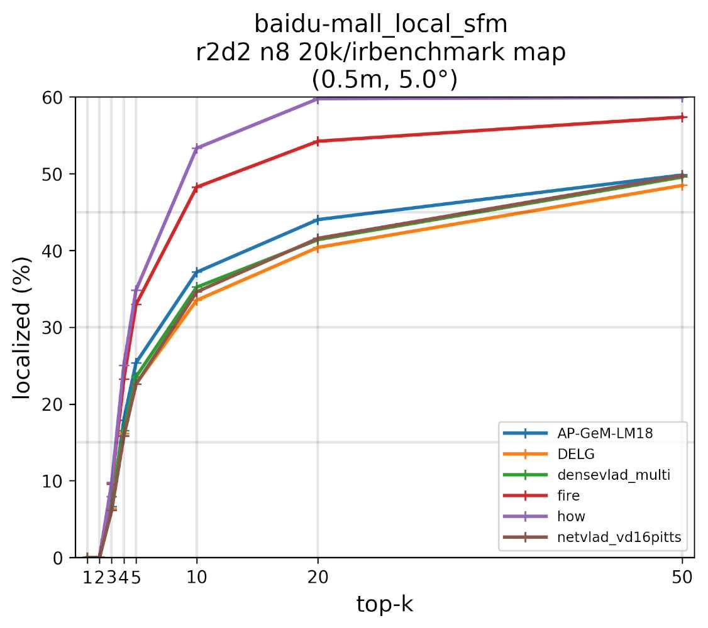
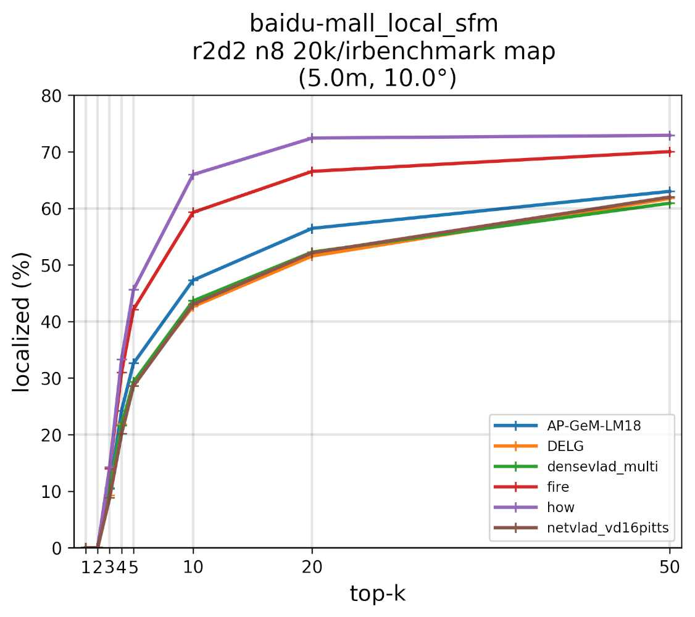

=== EWB

[%header,format=csv,separator=;]
|===
feature type;topk;(5.0, 10.0);median distance (m);median angle (deg)
AP-GeM-LM18;1       ;10.43%;7.2109;26.6689
DELG;1              ;10.60%;6.2504;26.7181
densevlad_multi;1   ;12.00%;6.673;23.697
fire;1              ;12.35%;5.575;25.5125
how;1               ;12.52%;5.2578;25.1081
netvlad_vd16pitts;1 ;11.26%;6.47;26.5437
;;;;
AP-GeM-LM18;2       ;10.43%;7.542;27.8744
DELG;2              ;11.17%;6.6436;27.7308
densevlad_multi;2   ;11.56%;7.5993;24.4993
fire;2              ;13.31%;5.5801;25.5571
how;2               ;13.66%;5.2997;23.9257
netvlad_vd16pitts;2 ;11.26%;6.6716;28.1548
;;;;
AP-GeM-LM18;3       ;9.60%;8.4706;26.1011
DELG;3              ;10.73%;7.1468;26.7348
densevlad_multi;3   ;11.26%;9.1667;23.4016
fire;3              ;12.61%;5.6782;24.9604
how;3               ;13.31%;5.5141;23.6242
netvlad_vd16pitts;3 ;10.60%;7.497;25.9385
;;;;
AP-GeM-LM18;4       ;8.07%;9.2447;26.9744
DELG;4              ;9.95%;8.0939;27.3394
densevlad_multi;4   ;10.03%;11.8928;23.8444
fire;4              ;12.00%;5.9515;25.1414
how;4               ;12.83%;5.6813;23.9538
netvlad_vd16pitts;4 ;9.77%;8.8262;27.6777
;;;;
AP-GeM-LM18;5       ;7.33%;10.4991;26.6251
DELG;5              ;9.12%;9.4026;26.9786
densevlad_multi;5   ;8.77%;15.1397;24.2678
fire;5              ;11.39%;6.2185;24.6712
how;5               ;12.13%;5.8031;24.0752
netvlad_vd16pitts;5 ;9.21%;10.8028;26.4875
;;;;
AP-GeM-LM18;10      ;3.93%;18.6119;28.2682
DELG;10             ;3.75%;21.9131;28.5106
densevlad_multi;10  ;3.84%;26.7983;25.3009
fire;10             ;7.11%;11.7412;24.1158
how;10              ;8.90%;8.7749;23.7837
netvlad_vd16pitts;10;3.97%;21.292;27.0966
;;;;
AP-GeM-LM18;20      ;0.87%;31.5298;33.336
DELG;20             ;1.44%;35.3734;32.2189
densevlad_multi;20  ;1.44%;38.8395;27.4481
fire;20             ;2.53%;24.6811;25.3815
how;20              ;3.58%;16.4386;25.1866
netvlad_vd16pitts;20;1.18%;33.7681;30.084
;;;;
AP-GeM-LM18;50      ;0.13%;47.8105;43.4094
DELG;50             ;0.22%;49.1835;41.8617
densevlad_multi;50  ;0.09%;51.9908;34.0089
fire;50             ;0.26%;44.6016;33.2701
how;50              ;0.57%;38.4978;34.0702
netvlad_vd16pitts;50;0.22%;46.5507;36.354

|===

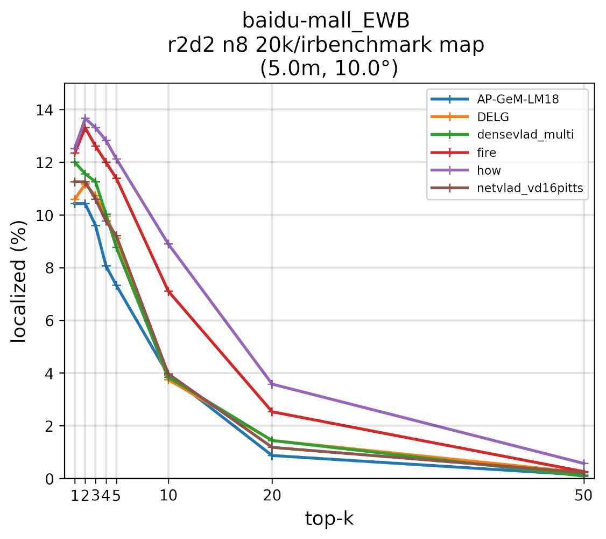
