= Gangnam Station B2 : Image Retrieval Benchmark results
:sectnums:
:sectnumlevels: 0
:toc:
:toclevels: 3

== Feather2d2 20k Results

=== global_sfm

[%header]
|===
|feature type|topk 3+|test 5+|validation
|||(0.1m_1.0deg)|(0.25m_2.0deg)|(1.0m_5.0deg)|(0.1m_1.0deg)|(0.25m_2.0deg)|(1.0m_5.0deg)|median distance (m)|median angle (deg)
|AP-GeM-LM18|1|26.8%|37.2%|41.2%|20.74%|33.52%|38.54%|21.2516|18.8292
|densevlad_multi|1|30.6%|42.0%|46.5%|27.73%|44.10%|49.34%|0.5458|1.7576
|fire|1|37.0%|51.7%|57.5%|34.61%|56.88%|64.30%|0.0703|1.3495
|how|1|41.0%|57.3%|62.9%|36.57%|54.91%|60.48%|0.0783|1.3628
|openibl_vgg16_netvlad|1|30.5%|42.2%|46.6%|28.06%|42.36%|48.03%|10.6814|1.8746
|r101delg_gldv2clean|1|25.3%|34.9%|39.6%|19.87%|32.75%|38.54%|18.0958|15.665
|DELG|1|25.7%|36.9%|41.6%|23.58%|38.10%|45.09%|6.8922|3.6596
||||||||||
|AP-GeM-LM18|2|31.6%|44.1%|48.2%|23.91%|39.41%|44.87%|4.7676|2.6949
|densevlad_multi|2|35.0%|48.2%|52.2%|30.90%|48.91%|53.60%|0.1048|1.489
|fire|2|41.0%|58.4%|63.9%|41.48%|64.52%|71.07%|0.0584|1.1287
|how|2|44.5%|61.7%|67.0%|40.94%|61.68%|67.79%|0.0611|1.1637
|openibl_vgg16_netvlad|2|34.3%|48.2%|53.1%|31.11%|47.05%|53.06%|0.1194|1.5353
|r101delg_gldv2clean|2|31.2%|43.2%|47.9%|25.11%|40.07%|45.96%|6.0026|2.5651
|DELG|2|31.8%|45.4%|49.5%|28.17%|45.41%|52.18%|0.17|1.85
||||||||||
|AP-GeM-LM18|3|33.7%|47.3%|51.8%|26.97%|42.69%|48.47%|1.3409|2.039
|densevlad_multi|3|36.5%|50.5%|55.0%|32.64%|51.20%|56.44%|0.0904|1.3902
|fire|3|42.6%|61.1%|66.3%|42.03%|66.70%|72.93%|0.0549|1.0767
|how|3|45.9%|63.8%|68.8%|42.58%|63.10%|69.10%|0.0609|1.1281
|openibl_vgg16_netvlad|3|36.6%|51.1%|55.7%|32.75%|49.13%|55.13%|0.1022|1.4721
|r101delg_gldv2clean|3|33.8%|47.1%|51.8%|27.18%|42.47%|48.91%|0.8538|2.0312
|DELG|3|33.7%|48.3%|52.8%|30.90%|47.71%|54.69%|0.1123|1.6315
||||||||||
|AP-GeM-LM18|4|35.2%|49.9%|54.4%|28.38%|45.20%|51.42%|0.1845|1.755
|densevlad_multi|4|38.1%|52.7%|57.5%|33.52%|52.51%|57.75%|0.0853|1.3505
|fire|4|43.5%|62.1%|67.6%|43.23%|67.69%|74.13%|0.0532|1.0778
|how|4|45.7%|63.9%|69.2%|41.70%|62.34%|69.00%|0.0601|1.1291
|openibl_vgg16_netvlad|4|37.5%|52.9%|57.6%|34.28%|50.98%|56.55%|0.0975|1.4378
|r101delg_gldv2clean|4|34.7%|49.1%|53.8%|28.71%|45.09%|51.42%|0.2015|1.7395
|DELG|4|35.7%|50.7%|55.6%|32.64%|50.00%|56.88%|0.0956|1.4989
||||||||||
|AP-GeM-LM18|5|36.5%|51.3%|55.8%|30.02%|47.38%|53.06%|0.139|1.6379
|densevlad_multi|5|39.3%|54.1%|58.7%|34.93%|54.15%|59.61%|0.079|1.3518
|fire|5|44.2%|62.4%|68.0%|43.45%|67.69%|74.13%|0.0526|1.0495
|how|5|45.2%|64.2%|69.1%|42.25%|63.86%|70.09%|0.0598|1.1307
|openibl_vgg16_netvlad|5|38.6%|54.0%|59.2%|34.50%|51.86%|57.53%|0.0911|1.3679
|r101delg_gldv2clean|5|36.3%|50.8%|55.7%|29.80%|47.05%|53.28%|0.1394|1.6806
|DELG|5|37.0%|52.3%|57.1%|33.95%|52.07%|58.84%|0.0865|1.4125
||||||||||
|AP-GeM-LM18|10|38.8%|55.4%|60.5%|33.95%|54.04%|59.83%|0.0793|1.3902
|densevlad_multi|10|42.3%|57.6%|62.6%|38.54%|57.86%|63.65%|0.0652|1.2005
|fire|10|45.6%|64.6%|69.8%|45.96%|67.90%|74.45%|0.0517|1.0254
|how|10|46.6%|65.1%|70.2%|43.45%|63.10%|69.98%|0.0597|1.0881
|openibl_vgg16_netvlad|10|42.1%|58.2%|63.4%|37.55%|54.04%|59.72%|0.0791|1.2667
|r101delg_gldv2clean|10|39.9%|55.5%|60.1%|32.21%|50.55%|56.33%|0.0972|1.5088
|DELG|10|39.6%|56.0%|61.1%|36.35%|55.02%|61.24%|0.0759|1.2888
||||||||||
|AP-GeM-LM18|20|42.3%|59.5%|64.3%|35.59%|56.66%|62.23%|0.0756|1.2993
|densevlad_multi|20|44.2%|60.6%|65.5%|39.41%|59.28%|65.07%|0.0632|1.1746
|fire|20|47.6%|66.7%|71.7%|47.27%|69.10%|75.22%|0.0518|1.0021
|how|20|47.3%|66.0%|71.4%|44.10%|64.63%|70.09%|0.0579|1.112
|openibl_vgg16_netvlad|20|45.3%|61.8%|66.8%|38.76%|57.21%|62.77%|0.0722|1.2265
|r101delg_gldv2clean|20|42.8%|59.2%|64.4%|35.26%|53.28%|58.84%|0.0861|1.3658
|DELG|20|42.4%|59.7%|65.2%|37.66%|57.97%|64.19%|0.0694|1.2015
||||||||||
|AP-GeM-LM18|50|45.5%|63.1%|68.3%|39.30%|61.35%|66.81%|0.0607|1.1808
|densevlad_multi|50|46.6%|65.1%|70.0%|41.92%|61.79%|67.36%|0.0607|1.1358
|fire|50|49.1%|68.3%|73.7%|47.49%|69.21%|74.67%|0.0502|0.9931
|how|50|48.1%|66.7%|71.9%|44.76%|65.17%|70.96%|0.0548|1.0708
|openibl_vgg16_netvlad|50|46.8%|63.9%|69.2%|41.05%|59.28%|64.08%|0.0644|1.1605
|r101delg_gldv2clean|50|45.8%|63.7%|68.7%|37.66%|56.99%|63.10%|0.0709|1.3114
|DELG|50|45.2%|63.8%|68.9%|39.30%|59.61%|66.16%|0.0627|1.2018
|===

image::../doc/plots/feather2d2/gangnam_eval_test_global_sfm_0_1m_1_0deg.png[gangnam_eval_test_global_sfm_0_1m_1_0deg]
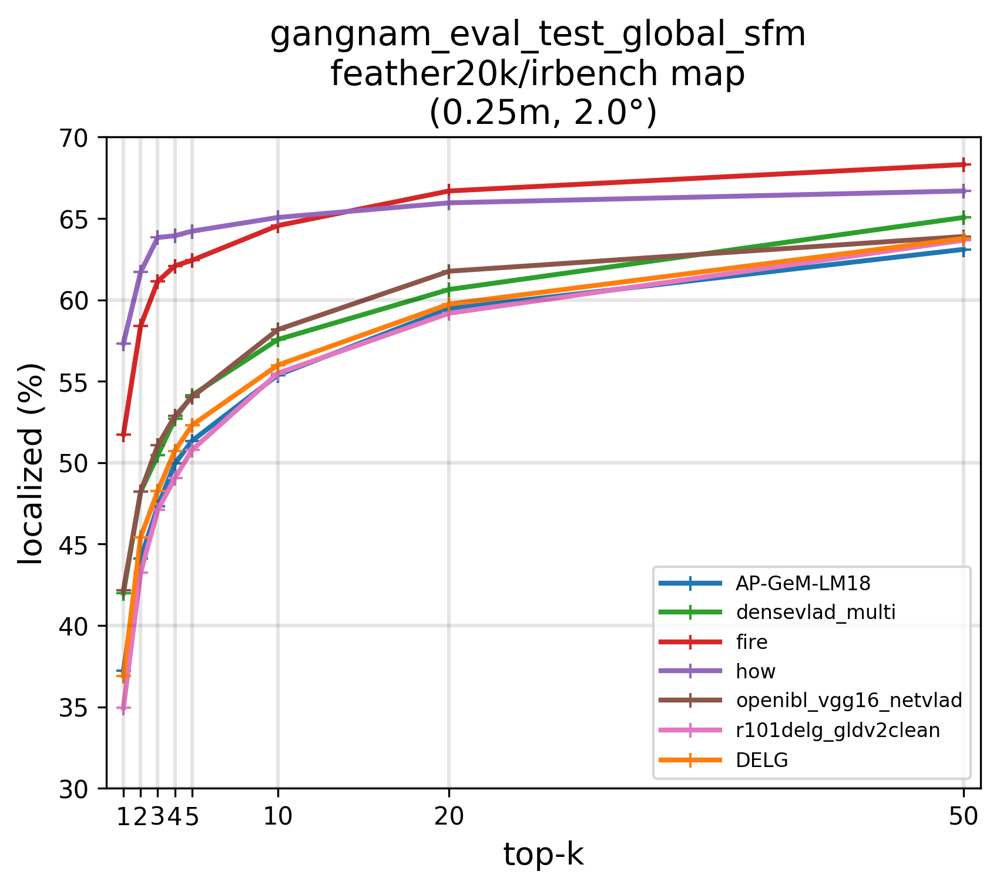
image::../doc/plots/feather2d2/gangnam_eval_test_global_sfm_1_0m_5_0deg.png[gangnam_eval_test_global_sfm_1_0m_5_0deg]

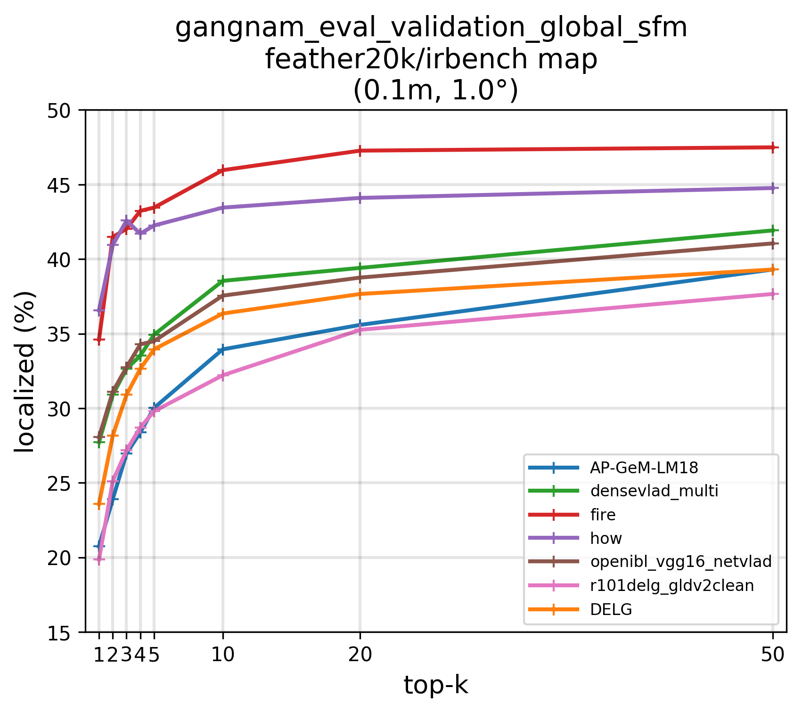
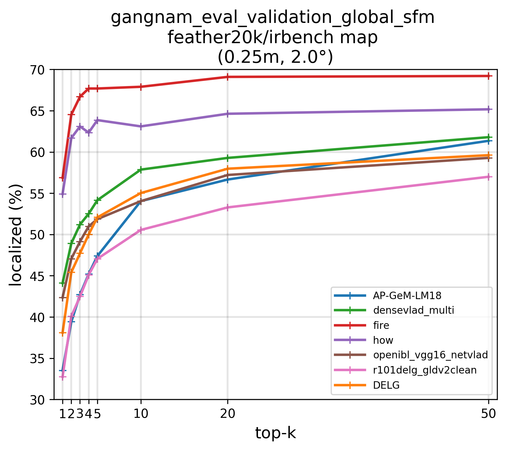
image::../doc/plots/feather2d2/gangnam_eval_validation_global_sfm_1_0m_5_0deg.png[gangnam_eval_validation_global_sfm_1_0m_5_0deg]

=== local_sfm

[%header]
|===
|feature type|topk 3+|test 5+|validation
|||(0.25m_2.0deg)|(0.5m_5.0deg)|(5.0m_10.0deg)|(0.25m_2.0deg)|(0.5m_5.0deg)|(5.0m_10.0deg)|median distance (m)|median angle (deg)
|AP-GeM-LM18|3|2.0%|3.6%|5.5%|2.18%|3.93%|5.57%|inf|inf
|densevlad_multi|3|3.0%|5.4%|6.8%|4.37%|6.99%|7.97%|inf|inf
|fire|3|5.3%|10.4%|14.6%|7.10%|11.90%|15.83%|inf|inf
|how|3|7.7%|13.4%|17.3%|7.42%|11.68%|15.39%|inf|inf
|openibl_vgg16_netvlad|3|2.6%|4.5%|5.8%|3.82%|6.00%|6.88%|inf|inf
|r101delg_gldv2clean|3|2.2%|4.1%|5.3%|2.18%|3.93%|4.59%|inf|inf
|DELG|3|2.2%|4.6%|5.9%|3.17%|5.68%|7.31%|inf|inf
||||||||||
|AP-GeM-LM18|4|4.4%|7.7%|10.9%|4.15%|7.31%|8.30%|inf|inf
|densevlad_multi|4|5.9%|10.2%|12.7%|7.75%|11.14%|13.54%|inf|inf
|fire|4|11.1%|18.8%|24.0%|12.12%|19.10%|24.89%|inf|inf
|how|4|12.9%|21.6%|26.9%|12.55%|19.76%|24.02%|inf|inf
|openibl_vgg16_netvlad|4|4.7%|8.3%|10.7%|5.90%|8.73%|10.81%|inf|inf
|r101delg_gldv2clean|4|4.7%|7.9%|9.9%|4.69%|7.75%|9.28%|inf|inf
|DELG|4|4.5%|8.8%|11.7%|4.59%|8.95%|11.46%|inf|inf
||||||||||
|AP-GeM-LM18|5|6.7%|11.9%|15.0%|5.02%|9.28%|10.48%|inf|inf
|densevlad_multi|5|8.3%|13.8%|16.7%|8.95%|13.21%|16.16%|inf|inf
|fire|5|13.2%|24.1%|29.7%|14.85%|23.25%|29.80%|inf|inf
|how|5|16.1%|26.5%|31.8%|15.28%|24.24%|29.91%|inf|inf
|openibl_vgg16_netvlad|5|6.4%|11.3%|14.6%|7.53%|11.46%|13.86%|inf|inf
|r101delg_gldv2clean|5|6.4%|10.3%|13.1%|5.57%|10.48%|12.77%|inf|inf
|DELG|5|6.6%|11.7%|15.3%|5.90%|10.92%|14.30%|inf|inf
||||||||||
|AP-GeM-LM18|10|12.7%|21.3%|26.1%|9.06%|15.39%|18.23%|inf|inf
|densevlad_multi|10|13.4%|21.4%|26.0%|12.34%|19.43%|23.25%|inf|inf
|fire|10|20.4%|34.3%|40.7%|21.83%|36.24%|42.47%|50.035|89.5379
|how|10|22.8%|35.7%|41.8%|20.09%|32.97%|38.97%|145.8425|177.1708
|openibl_vgg16_netvlad|10|12.3%|19.8%|23.6%|13.10%|19.32%|22.16%|inf|inf
|r101delg_gldv2clean|10|12.5%|19.8%|23.1%|11.03%|17.69%|21.94%|inf|inf
|DELG|10|13.3%|21.6%|26.5%|11.35%|17.90%|22.27%|inf|inf
||||||||||
|AP-GeM-LM18|20|17.2%|28.5%|33.5%|12.88%|21.18%|25.33%|inf|inf
|densevlad_multi|20|18.0%|28.1%|32.7%|17.25%|27.07%|31.99%|inf|inf
|fire|20|26.0%|41.7%|48.0%|25.44%|40.61%|46.51%|5.1373|4.4642
|how|20|26.4%|42.2%|48.3%|24.67%|38.10%|43.34%|13.6278|6.6769
|openibl_vgg16_netvlad|20|16.9%|26.5%|31.5%|17.25%|24.78%|29.15%|inf|inf
|r101delg_gldv2clean|20|18.3%|28.2%|33.5%|14.41%|23.25%|28.38%|inf|inf
|DELG|20|17.5%|28.6%|34.3%|15.94%|25.22%|30.24%|inf|inf
||||||||||
|AP-GeM-LM18|50|23.2%|37.2%|42.9%|18.34%|29.15%|34.61%|83.283|149.1298
|densevlad_multi|50|24.1%|35.9%|41.2%|22.60%|33.30%|38.86%|52.5008|9.2161
|fire|50|30.9%|46.7%|52.7%|28.49%|44.98%|51.31%|0.2414|2.1263
|how|50|30.9%|46.1%|52.1%|26.20%|40.39%|45.85%|9.538|2.8887
|openibl_vgg16_netvlad|50|22.5%|35.0%|41.3%|20.52%|29.15%|34.28%|79.8215|76.0621
|r101delg_gldv2clean|50|25.0%|39.1%|45.0%|19.43%|31.66%|36.68%|50.048|60.5858
|DELG|50|23.0%|36.2%|42.5%|21.18%|32.31%|37.45%|80.7481|96.131
|===

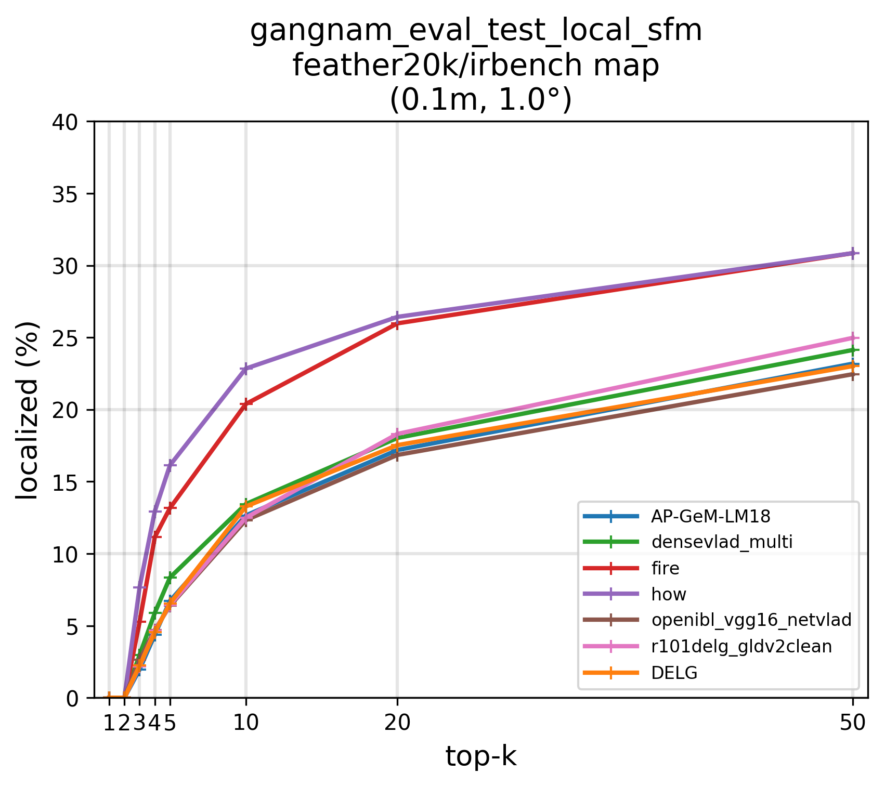
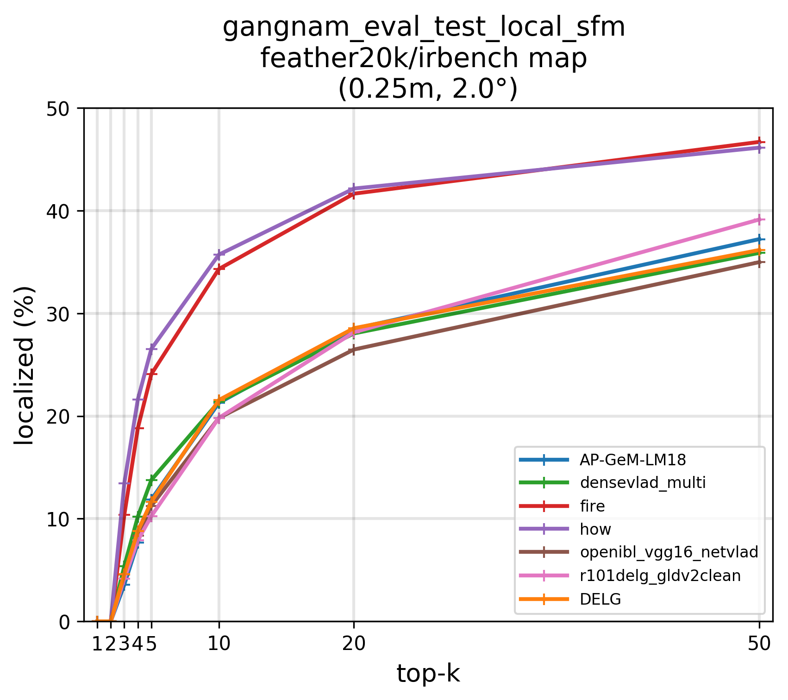
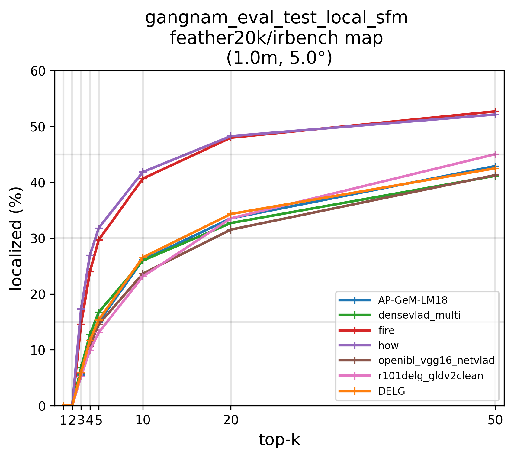

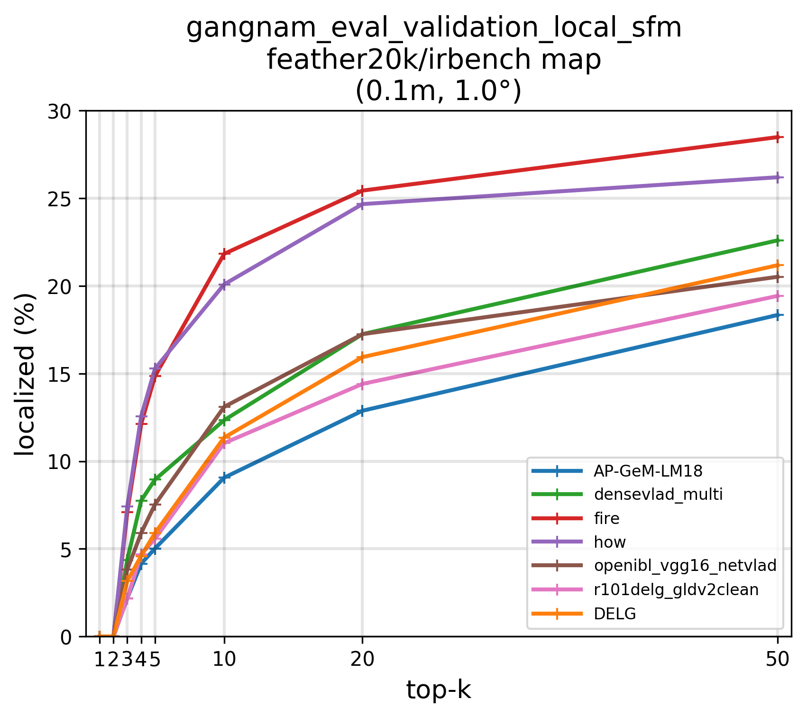
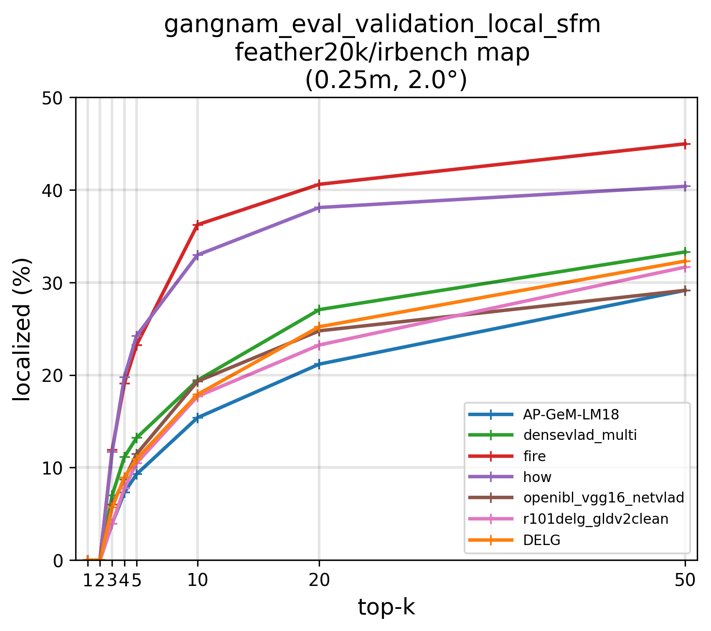
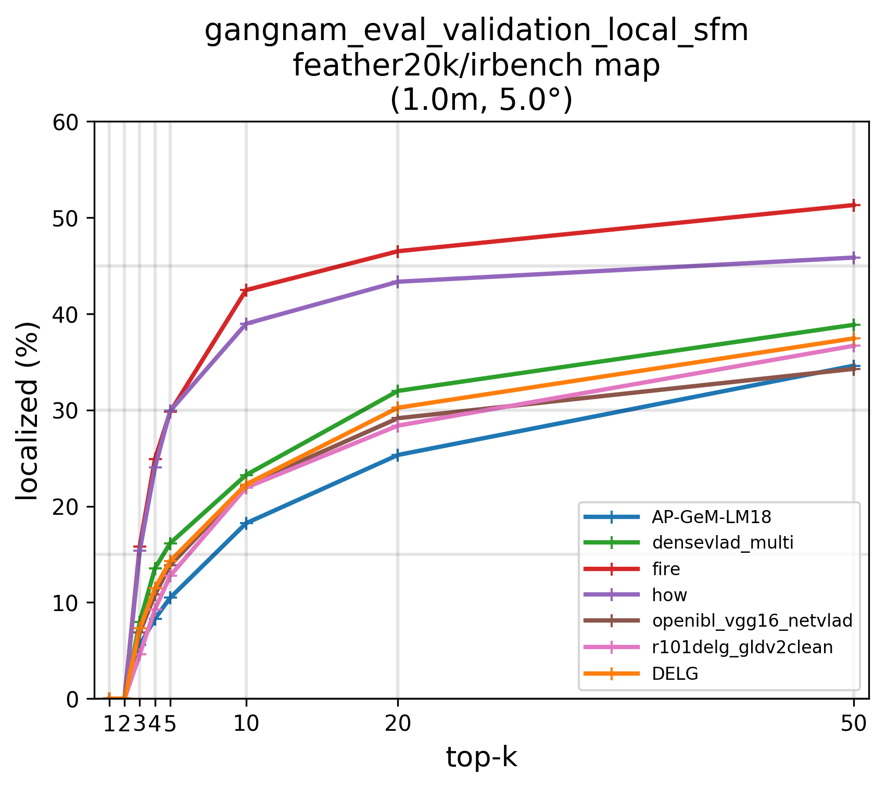

=== EWB

[%header]
|===
|feature type|topk|test 3+|validation
|||(5.0m_10.0deg)|(5.0m_10.0deg)|median distance (m)|median angle (deg)
|AP-GeM-LM18|1|7.2%|7.10%|9.3424|32.4455
|densevlad_multi|1|15.0%|12.88%|1.7043|21.7211
|fire|1|11.8%|11.35%|1.1299|24.3258
|how|1|12.2%|11.03%|1.2002|26.2644
|openibl_vgg16_netvlad|1|9.5%|9.17%|1.6348|24.9467
|r101delg_gldv2clean|1|9.1%|8.62%|7.3242|33.2266
|DELG|1|9.4%|9.17%|2.9575|28.3897
||||||
|AP-GeM-LM18|2|6.7%|6.66%|26.5404|53.7033
|densevlad_multi|2|15.3%|13.54%|19.9861|26.9344
|fire|2|16.2%|20.41%|2.1365|24.6344
|how|2|18.1%|17.03%|2.8138|26.6581
|openibl_vgg16_netvlad|2|9.4%|12.99%|20.0063|29.2547
|r101delg_gldv2clean|2|8.2%|7.53%|15.9593|50.3933
|DELG|2|8.8%|9.17%|13.7857|50.4102
||||||
|AP-GeM-LM18|3|6.4%|5.46%|32.5287|44.8997
|densevlad_multi|3|12.7%|10.15%|31.426|21.3753
|fire|3|14.1%|17.25%|4.847|22.8792
|how|3|15.7%|14.63%|9.8958|23.8021
|openibl_vgg16_netvlad|3|6.8%|8.30%|28.269|26.6298
|r101delg_gldv2clean|3|6.1%|7.10%|28.8875|45.2919
|DELG|3|6.6%|10.48%|22.4207|40.0337
||||||
|AP-GeM-LM18|4|5.4%|3.71%|33.0103|49.4994
|densevlad_multi|4|10.9%|8.41%|34.9468|25.2218
|fire|4|11.6%|16.05%|7.8771|24.9698
|how|4|13.6%|14.96%|14.6134|24.7318
|openibl_vgg16_netvlad|4|6.2%|6.00%|31.0726|30.5133
|r101delg_gldv2clean|4|4.7%|5.24%|30.7981|51.1382
|DELG|4|5.7%|7.53%|27.8829|47.8234
||||||
|AP-GeM-LM18|5|5.0%|2.95%|36.9162|46.8449
|densevlad_multi|5|8.6%|6.44%|36.9263|22.428
|fire|5|9.7%|12.45%|12.2167|27.4671
|how|5|12.2%|10.92%|17.2968|24.915
|openibl_vgg16_netvlad|5|4.6%|4.37%|33.2157|29.1717
|r101delg_gldv2clean|5|3.8%|3.71%|34.781|46.7612
|DELG|5|4.6%|5.35%|30.2361|41.5183
||||||
|AP-GeM-LM18|10|3.3%|0.22%|44.869|56.5601
|densevlad_multi|10|5.0%|1.42%|44.7523|27.8604
|fire|10|5.2%|4.26%|22.2106|33.5603
|how|10|6.9%|5.02%|29.0837|29.2194
|openibl_vgg16_netvlad|10|3.0%|0.55%|41.8669|39.9828
|r101delg_gldv2clean|10|2.2%|0.55%|42.5713|51.4846
|DELG|10|2.1%|0.55%|40.6985|47.7487
||||||
|AP-GeM-LM18|20|1.3%|0.00%|51.6639|63.4245
|densevlad_multi|20|2.0%|0.22%|52.191|28.3163
|fire|20|2.8%|1.20%|32.6906|40.2351
|how|20|3.6%|0.98%|37.1708|37.3056
|openibl_vgg16_netvlad|20|1.4%|0.22%|48.4789|43.4044
|r101delg_gldv2clean|20|1.5%|0.00%|51.8713|53.4991
|DELG|20|1.2%|0.11%|47.7647|57.1246
||||||
|AP-GeM-LM18|50|0.3%|0.00%|58.7295|76.4843
|densevlad_multi|50|0.6%|0.00%|59.6624|42.5387
|fire|50|0.2%|0.11%|43.8313|49.3844
|how|50|0.5%|0.00%|47.2794|49.9256
|openibl_vgg16_netvlad|50|0.3%|0.00%|56.5447|59.5042
|r101delg_gldv2clean|50|0.8%|0.00%|60.8332|62.0772
|DELG|50|0.3%|0.11%|58.4461|65.3615
|===

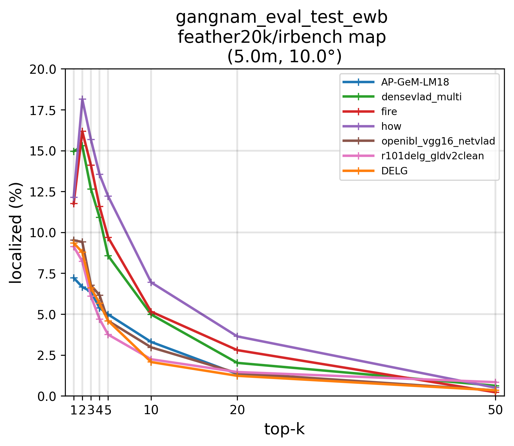
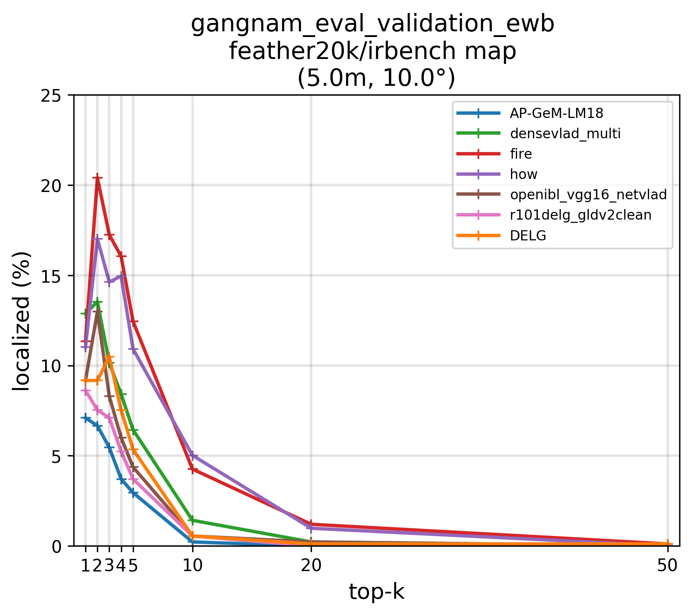

== r2d2_WASF_N8_big 20k Results

=== global_sfm

[%header]
|===
|feature type|topk 3+|test 5+|validation
|||(0.1, 1.0)|(0.25, 2.0)|(1.0, 5.0)|(0.1, 1.0)|(0.25, 2.0)|(1.0, 5.0)|median distance (m)|median angle (deg)
|AP-GeM-LM18|1           |27.0%|39.4%|43.3%|22.05%|37.45%|41.59%|11.8132|4.2542
|densevlad_multi|1       |31.5%|43.6%|47.6%|28.93%|45.41%|50.66%|0.1929|1.7301
|fire|1                  |37.5%|53.9%|59.0%|36.68%|58.08%|66.38%|0.0665|1.3107
|how|1                   |41.7%|58.6%|64.0%|37.99%|56.44%|62.99%|0.0732|1.2976
|openibl_vgg16_netvlad|1 |31.7%|43.7%|47.8%|29.04%|44.10%|50.11%|0.2385|1.6934
|r101delg_gldv2clean|1   |26.5%|37.9%|41.9%|22.05%|35.59%|41.81%|12.3551|3.8491
||||||||||
|AP-GeM-LM18|2           |31.9%|45.9%|50.0%|26.20%|42.36%|47.71%|1.7231|2.083
|densevlad_multi|2       |35.8%|49.2%|53.3%|32.31%|50.44%|55.46%|0.0949|1.3747
|fire|2                  |41.9%|60.5%|65.3%|42.36%|65.50%|72.27%|0.0551|1.1224
|how|2                   |45.6%|63.4%|68.5%|41.70%|62.55%|68.67%|0.0596|1.1554
|openibl_vgg16_netvlad|2 |35.3%|49.5%|54.1%|32.64%|49.56%|55.35%|0.0941|1.4064
|r101delg_gldv2clean|2   |32.5%|45.7%|49.9%|26.53%|42.25%|48.36%|1.6396|2.0249
||||||||||
|AP-GeM-LM18|3           |34.2%|49.4%|53.8%|28.71%|46.29%|50.98%|0.1867|1.6925
|densevlad_multi|3       |37.9%|52.0%|56.4%|34.17%|51.75%|57.86%|0.0816|1.2997
|fire|3                  |43.5%|62.8%|67.3%|44.00%|67.25%|74.02%|0.0543|1.0775
|how|3                   |46.3%|65.2%|70.1%|42.36%|63.43%|69.87%|0.0595|1.1419
|openibl_vgg16_netvlad|3 |37.2%|51.7%|56.7%|34.06%|51.53%|57.31%|0.0866|1.3649
|r101delg_gldv2clean|3   |34.7%|49.1%|53.6%|28.60%|45.20%|50.98%|0.2125|1.724
||||||||||
|AP-GeM-LM18|4           |36.2%|52.1%|56.5%|30.90%|49.13%|53.93%|0.1141|1.5381
|densevlad_multi|4       |39.5%|54.3%|58.6%|35.37%|53.93%|59.72%|0.0747|1.2385
|fire|4                  |44.5%|63.3%|68.6%|44.32%|68.78%|75.00%|0.0516|1.0555
|how|4                   |46.4%|65.3%|70.4%|43.12%|64.08%|69.76%|0.0577|1.1283
|openibl_vgg16_netvlad|4 |38.4%|53.4%|58.4%|35.15%|52.95%|58.52%|0.0853|1.3497
|r101delg_gldv2clean|4   |36.1%|50.8%|55.3%|29.91%|47.60%|53.93%|0.1216|1.5953
||||||||||
|AP-GeM-LM18|5           |37.4%|53.3%|57.7%|31.33%|50.66%|56.11%|0.1022|1.4472
|densevlad_multi|5       |40.7%|55.5%|59.7%|36.35%|55.02%|60.70%|0.0725|1.2373
|fire|5                  |45.0%|64.2%|69.3%|45.31%|69.32%|75.76%|0.051|1.0299
|how|5                   |46.1%|65.5%|70.3%|43.45%|64.63%|70.09%|0.0576|1.1026
|openibl_vgg16_netvlad|5 |39.3%|54.7%|60.0%|36.46%|54.37%|59.61%|0.0764|1.274
|r101delg_gldv2clean|5   |37.6%|52.7%|57.1%|31.55%|49.45%|55.46%|0.1067|1.5001
||||||||||
|AP-GeM-LM18|10          |40.8%|58.1%|62.3%|35.70%|56.33%|61.57%|0.0743|1.3216
|densevlad_multi|10      |43.0%|58.9%|63.3%|38.65%|58.73%|64.30%|0.0647|1.1438
|fire|10                 |46.5%|65.8%|70.8%|49.13%|72.05%|77.73%|0.0494|0.9606
|how|10                  |47.3%|66.4%|71.4%|44.21%|64.63%|70.09%|0.0563|1.0587
|openibl_vgg16_netvlad|10|42.4%|58.9%|63.9%|39.63%|57.64%|62.55%|0.0693|1.1703
|r101delg_gldv2clean|10  |41.7%|57.9%|62.7%|34.06%|53.28%|58.08%|0.0863|1.3592
||||||||||
|AP-GeM-LM18|20          |43.8%|61.9%|66.0%|37.23%|59.17%|63.65%|0.0701|1.2489
|densevlad_multi|20      |45.0%|61.8%|66.4%|40.07%|60.15%|65.72%|0.0606|1.1023
|fire|20                 |48.5%|67.9%|72.9%|49.13%|71.72%|77.29%|0.0493|0.9752
|how|20                  |47.6%|67.4%|72.6%|45.63%|66.16%|71.18%|0.055|1.0449
|openibl_vgg16_netvlad|20|45.9%|62.9%|68.0%|40.50%|59.39%|64.08%|0.0641|1.1485
|r101delg_gldv2clean|20  |43.6%|61.5%|66.2%|36.68%|56.00%|61.46%|0.0771|1.2382
||||||||||
|AP-GeM-LM18|50          |46.8%|65.0%|69.8%|40.61%|62.01%|67.14%|0.059|1.1378
|densevlad_multi|50      |48.1%|66.5%|71.8%|42.90%|62.99%|68.45%|0.0582|1.0605
|fire|50                 |50.0%|69.8%|74.9%|48.58%|70.52%|76.64%|0.0492|0.971
|how|50                  |48.8%|69.0%|73.9%|46.18%|66.38%|71.51%|0.0553|1.0224
|openibl_vgg16_netvlad|50|47.5%|65.6%|70.6%|42.69%|61.46%|66.05%|0.0595|1.0909
|r101delg_gldv2clean|50  |47.0%|65.9%|71.1%|38.43%|59.17%|64.30%|0.0675|1.2269
|===

image::../doc/plots/r2d2/gangnam_b2_test_r2d2_global_sfm_0.jpg[gangnam_b2_test_r2d2_global_sfm_0]
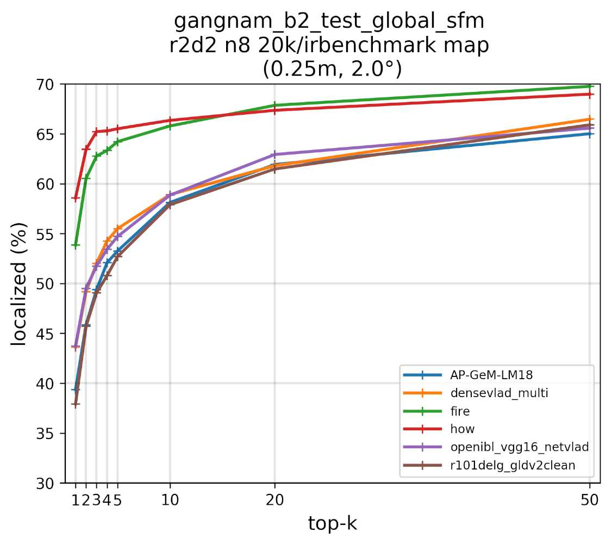
image::../doc/plots/r2d2/gangnam_b2_test_r2d2_global_sfm_2.jpg[gangnam_b2_test_r2d2_global_sfm_2]

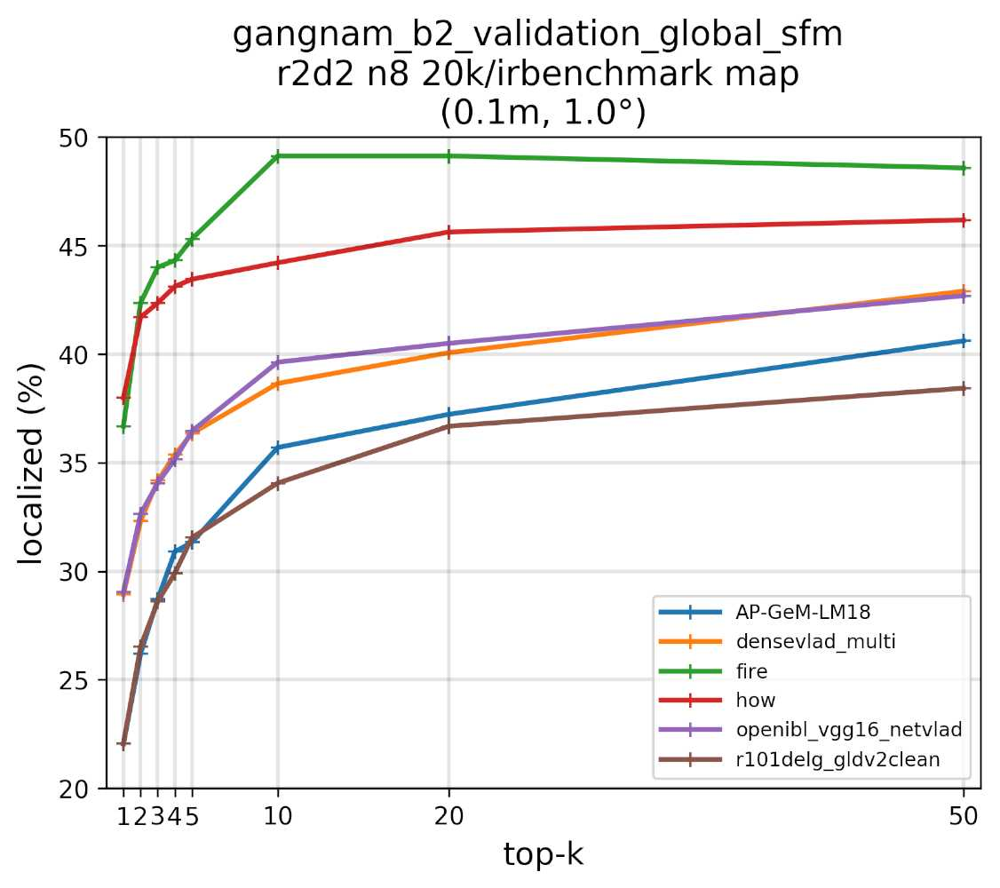
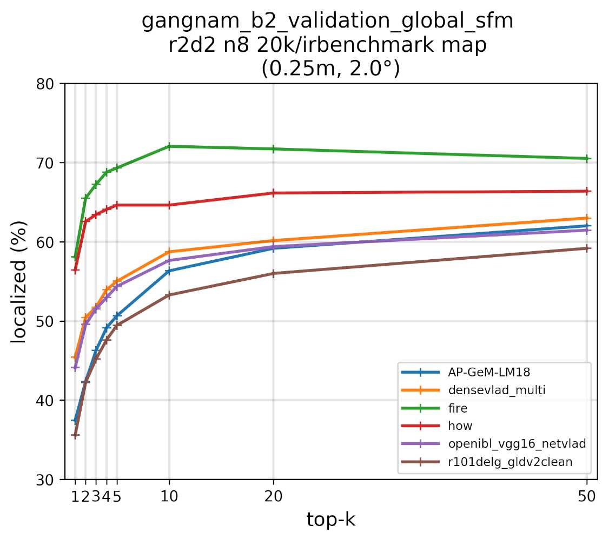
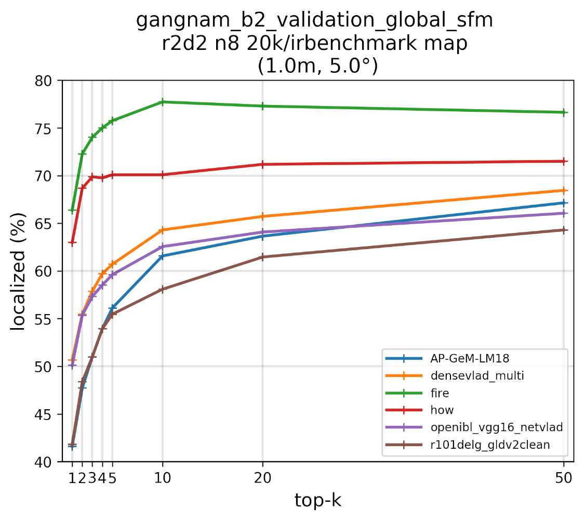

=== local_sfm

[%header]
|===
|feature type|topk 3+|test 5+|validation
|||(0.1, 1.0)|(0.25, 2.0)|(1.0, 5.0)|(0.1, 1.0)|(0.25, 2.0)|(1.0, 5.0)|median distance (m)|median angle (deg)
|AP-GeM-LM18|3           |3.3%|6.4%|8.3%|3.17%|5.57%|7.75%|inf      |inf           
|densevlad_multi|3       |4.6%|8.2%|10.4%|5.24%|8.73%|10.48%|inf      |inf           
|fire|3                  |8.7%|15.7%|19.3%|9.17%|15.17%|20.85%|inf      |inf           
|how|3                   |10.7%|18.5%|23.0%|10.37%|16.05%|20.20%|inf      |inf           
|openibl_vgg16_netvlad|3 |4.4%|6.7%|8.3%|4.80%|8.30%|9.50%|inf      |inf           
|r101delg_gldv2clean|3   |3.6%|6.9%|8.8%|2.51%|5.46%|6.88%|inf      |inf           
||||||||||
|AP-GeM-LM18|4           |6.7%|11.5%|15.1%|4.59%|8.62%|11.24%|inf      |inf           
|densevlad_multi|4       |8.3%|13.8%|16.6%|8.84%|12.99%|15.83%|inf      |inf           
|fire|4                  |14.3%|24.4%|28.4%|14.19%|25.22%|31.66%|inf      |inf           
|how|4                   |16.2%|26.4%|31.6%|15.50%|24.56%|29.37%|inf      |inf           
|openibl_vgg16_netvlad|4 |7.1%|11.8%|14.3%|7.64%|12.34%|14.30%|inf      |inf           
|r101delg_gldv2clean|4   |7.3%|12.4%|15.1%|5.24%|10.70%|13.10%|inf      |inf           
||||||||||
|AP-GeM-LM18|5           |9.9%|16.4%|19.8%|6.55%|11.68%|15.07%|inf      |inf           
|densevlad_multi|5       |11.1%|17.1%|20.7%|9.83%|15.50%|18.78%|inf      |inf           
|fire|5                  |18.0%|29.9%|34.6%|19.32%|31.11%|37.45%|inf      |inf           
|how|5                   |19.7%|32.1%|37.4%|18.67%|29.15%|35.92%|inf      |inf           
|openibl_vgg16_netvlad|5 |9.3%|14.9%|18.2%|10.15%|15.83%|18.23%|inf      |inf           
|r101delg_gldv2clean|5   |8.9%|15.2%|18.4%|6.66%|13.21%|17.47%|inf      |inf           
||||||||||
|AP-GeM-LM18|10          |16.5%|26.8%|31.2%|10.59%|19.21%|23.36%|inf      |inf           
|densevlad_multi|10      |15.8%|25.6%|29.9%|15.17%|23.47%|27.07%|inf      |inf           
|fire|10                 |25.0%|40.1%|45.7%|26.20%|41.70%|47.93%|1.8084|3.4737
|how|10                  |27.5%|42.1%|47.5%|24.02%|37.77%|44.98%|14.0386|6.3632
|openibl_vgg16_netvlad|10|15.5%|25.3%|29.2%|16.05%|23.69%|27.73%|inf      |inf           
|r101delg_gldv2clean|10  |15.3%|25.1%|29.6%|13.76%|22.60%|27.73%|inf      |inf           
||||||||||
|AP-GeM-LM18|20          |21.4%|33.3%|38.5%|15.94%|26.09%|30.68%|130.0278|177.1321
|densevlad_multi|20      |21.4%|32.7%|37.4%|18.89%|31.00%|35.70%|93.4907|149.0737
|fire|20                 |30.1%|47.3%|52.9%|29.48%|44.98%|50.44%|0.2289|2.1484
|how|20                  |30.7%|46.5%|52.0%|25.33%|41.05%|46.72%|5.0559|2.7953
|openibl_vgg16_netvlad|20|20.0%|30.9%|36.5%|19.76%|27.62%|32.21%|122.3517|166.8184
|r101delg_gldv2clean|20  |21.4%|33.9%|39.8%|17.79%|28.93%|33.95%|80.7263|133.7759
||||||||||
|AP-GeM-LM18|50          |27.2%|41.1%|47.5%|20.41%|34.39%|39.63%|16.5694|5.8163
|densevlad_multi|50      |27.0%|40.4%|45.1%|24.89%|37.34%|42.03%|20.9874|3.0187
|fire|50                 |34.4%|51.6%|57.3%|32.42%|49.34%|55.35%|0.1136|1.5768
|how|50                  |33.1%|49.1%|54.4%|28.28%|43.01%|48.25%|2.7191|2.0202
|openibl_vgg16_netvlad|50|26.7%|39.3%|44.9%|22.71%|31.88%|36.68%|39.5042|4.9221
|r101delg_gldv2clean|50  |28.7%|44.4%|49.9%|21.94%|33.95%|39.08%|18.7617|4.3711
|===

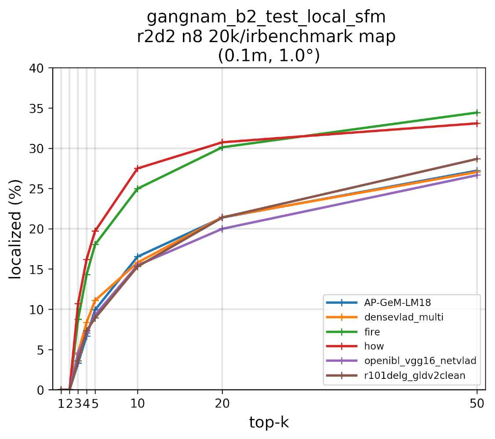
image::../doc/plots/r2d2/gangnam_b2_test_r2d2_local_sfm_1.jpg[gangnam_b2_test_r2d2_local_sfm_1]
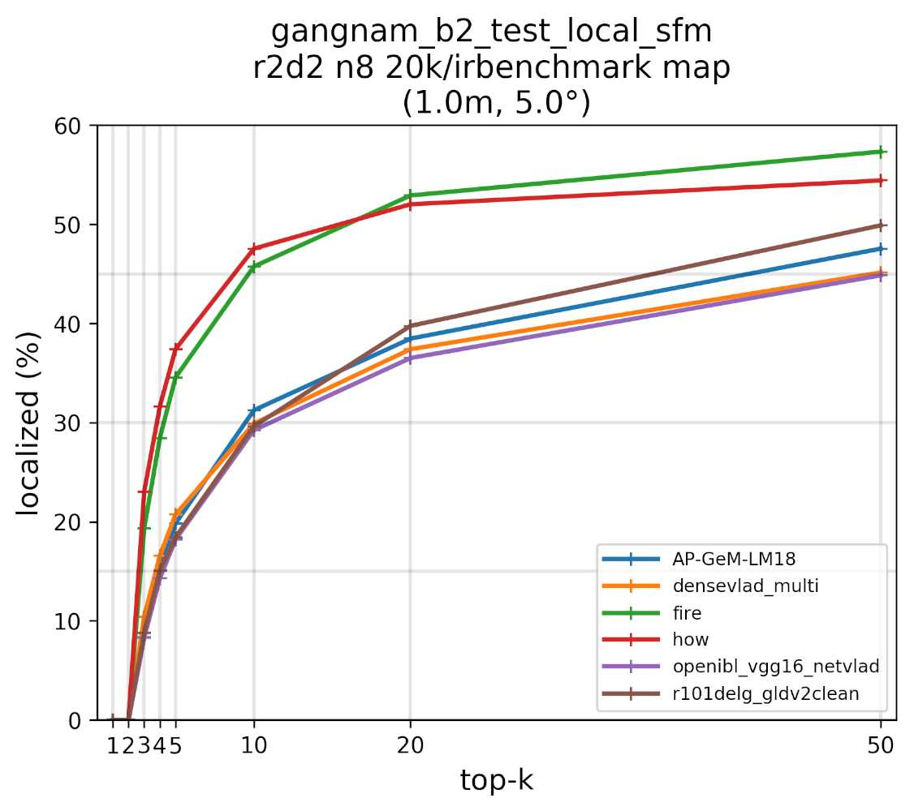

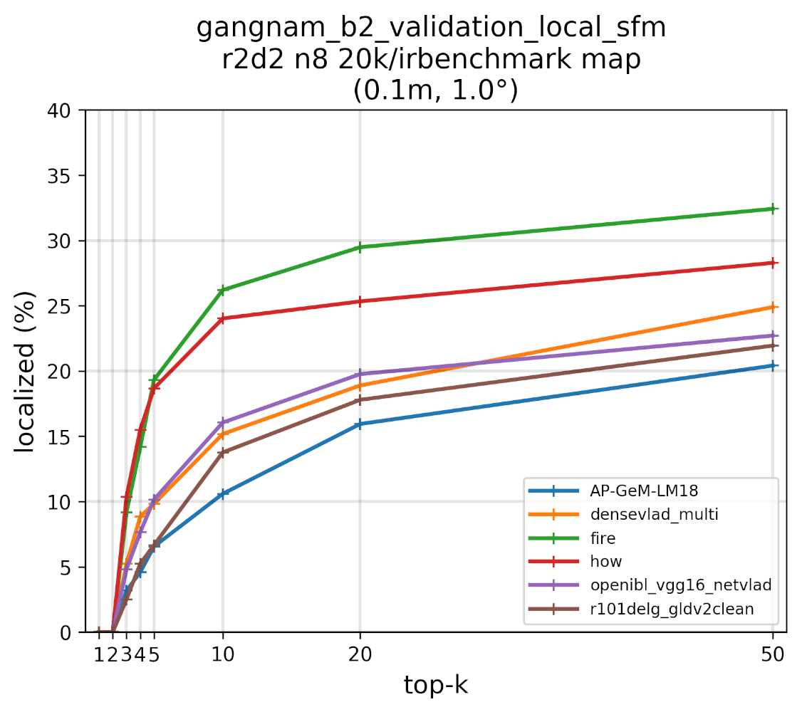
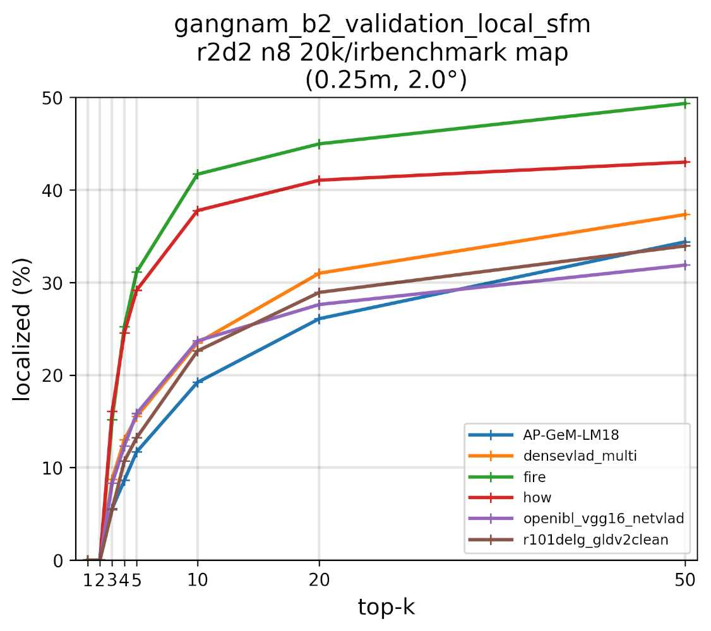
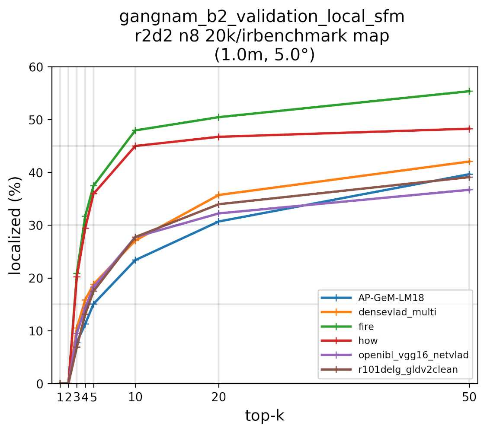

=== EWB

[%header]
|===
|feature type|topk|test 3+|validation
|||(5.0, 10.0)|(5.0, 10.0)|median distance (m)|median angle (deg)
|AP-GeM-LM18|1           |7.2%|7.10%|9.3424|32.4455
|densevlad_multi|1       |15.0%|12.88%|1.7043|21.7211
|fire|1                  |11.8%|11.35%|1.1299|24.3258
|how|1                   |12.2%|11.03%|1.2002|26.2644
|openibl_vgg16_netvlad|1 |9.5%|9.17%|1.6348|24.9467
|r101delg_gldv2clean|1   |9.1%|8.62%|7.3242|33.2266
||||||
|AP-GeM-LM18|2           |6.7%|6.66%|26.5404|53.7033
|densevlad_multi|2       |15.3%|13.54%|19.9861|26.9344
|fire|2                  |16.2%|20.41%|2.1365|24.6344
|how|2                   |18.1%|17.03%|2.8138|26.6581
|openibl_vgg16_netvlad|2 |9.4%|12.99%|20.0063|29.2547
|r101delg_gldv2clean|2   |8.2%|7.53%|15.9593|50.3933
||||||
|AP-GeM-LM18|3           |6.4%|5.46%|32.5287|44.8997
|densevlad_multi|3       |12.7%|10.15%|31.426|21.3753
|fire|3                  |14.1%|17.25%|4.847|22.8792
|how|3                   |15.7%|14.63%|9.8958|23.8021
|openibl_vgg16_netvlad|3 |6.8%|8.30%|28.269|26.6298
|r101delg_gldv2clean|3   |6.1%|7.10%|28.8875|45.2919
||||||
|AP-GeM-LM18|4           |5.4%|3.71%|33.0103|49.4994
|densevlad_multi|4       |10.9%|8.41%|34.9468|25.2218
|fire|4                  |11.6%|16.05%|7.8771|24.9698
|how|4                   |13.6%|14.96%|14.6134|24.7318
|openibl_vgg16_netvlad|4 |6.2%|6.00%|31.0726|30.5133
|r101delg_gldv2clean|4   |4.7%|5.24%|30.7981|51.1382
||||||
|AP-GeM-LM18|5           |5.0%|2.95%|36.9162|46.8449
|densevlad_multi|5       |8.6%|6.44%|36.9263|22.428
|fire|5                  |9.7%|12.45%|12.2167|27.4671
|how|5                   |12.2%|10.92%|17.2968|24.915
|openibl_vgg16_netvlad|5 |4.6%|4.37%|33.2157|29.1717
|r101delg_gldv2clean|5   |3.8%|3.71%|34.781|46.7612
||||||
|AP-GeM-LM18|10          |3.3%|0.22%|44.869|56.5601
|densevlad_multi|10      |5.0%|1.42%|44.7523|27.8604
|fire|10                 |5.2%|4.26%|22.2106|33.5603
|how|10                  |6.9%|5.02%|29.0837|29.2194
|openibl_vgg16_netvlad|10|3.0%|0.55%|41.8669|39.9828
|r101delg_gldv2clean|10  |2.2%|0.55%|42.5713|51.4846
||||||
|AP-GeM-LM18|20          |1.3%|0.00%|51.6639|63.4245
|densevlad_multi|20      |2.0%|0.22%|52.191|28.3163
|fire|20                 |2.8%|1.20%|32.6906|40.2351
|how|20                  |3.6%|0.98%|37.1708|37.3056
|openibl_vgg16_netvlad|20|1.4%|0.22%|48.4789|43.4044
|r101delg_gldv2clean|20  |1.5%|0.00%|51.8713|53.4991
||||||
|AP-GeM-LM18|50          |0.3%|0.00%|58.7295|76.4843
|densevlad_multi|50      |0.6%|0.00%|59.6624|42.5387
|fire|50                 |0.2%|0.11%|43.8313|49.3844
|how|50                  |0.5%|0.00%|47.2794|49.9256
|openibl_vgg16_netvlad|50|0.3%|0.00%|56.5447|59.5042
|r101delg_gldv2clean|50  |0.8%|0.00%|60.8332|62.0772
|===

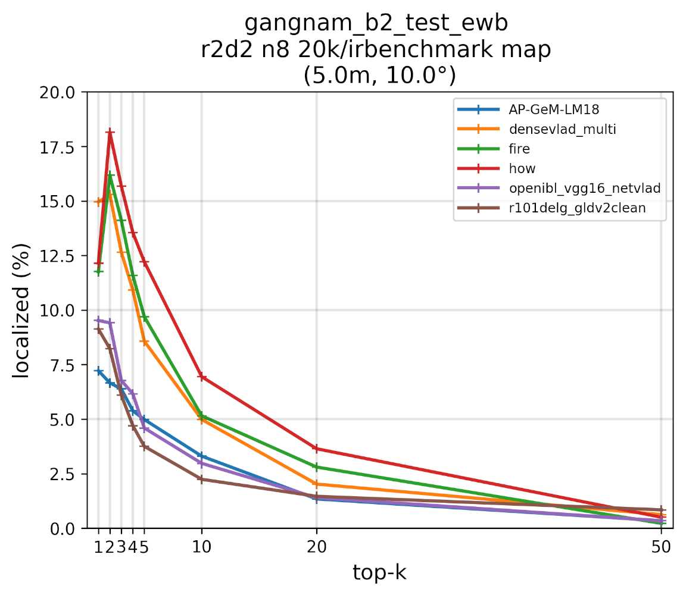
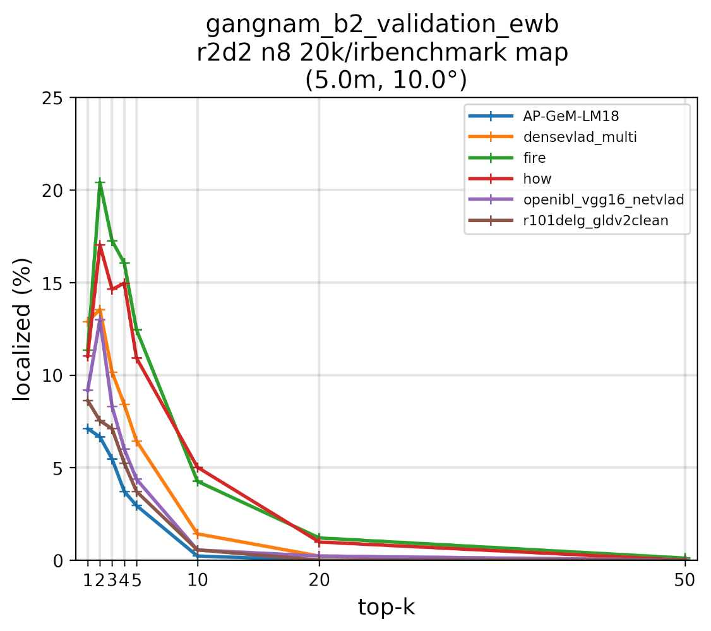
