= RobotCar Seasons : Image Retrieval Benchmark results
:sectnums:
:sectnumlevels: 0
:toc:
:toclevels: 3

== Feather2d2 20k Results

=== global_sfm

[%header]
|===
|feature type|topk 3+|day 3+|night
|||(0.25m_2.0deg)|(0.5m_5.0deg)|(5.0m_10.0deg)|(0.25m_2.0deg)|(0.5m_5.0deg)|(5.0m_10.0deg)
|AP-GeM-LM18|1|47.9%|76.8%|92.5%|7.9%|18.2%|35.3%
|DELG|1|47.2%|74.8%|89.6%|7.0%|14.0%|24.9%
|densevlad_multi|1|48.6%|76.4%|91.4%|10.6%|18.8%|26.2%
|fire|1|49.9%|78.5%|93.8%|8.4%|18.5%|29.0%
|how|1|48.7%|77.2%|92.3%|11.3%|22.1%|34.4%
|netvlad_vd16pitts|1|48.7%|77.5%|93.1%|6.6%|12.3%|18.2%
|r101delg_gldv2clean|1|47.6%|75.2%|91.2%|7.0%|16.9%|29.6%
||||||||
|AP-GeM-LM18|2|49.5%|78.3%|93.4%|12.3%|26.1%|40.4%
|DELG|2|49.0%|76.2%|91.0%|8.4%|17.1%|28.8%
|densevlad_multi|2|49.9%|78.1%|92.7%|11.9%|23.2%|31.4%
|fire|2|51.0%|79.4%|94.5%|11.4%|21.4%|32.7%
|how|2|50.0%|78.1%|93.1%|12.0%|25.3%|38.4%
|netvlad_vd16pitts|2|49.8%|78.6%|93.9%|9.9%|16.0%|23.9%
|r101delg_gldv2clean|2|49.1%|76.7%|92.6%|9.9%|20.8%|34.4%
||||||||
|AP-GeM-LM18|3|49.9%|78.8%|94.0%|13.9%|29.0%|45.6%
|DELG|3|49.5%|76.9%|91.9%|9.5%|19.3%|30.6%
|densevlad_multi|3|50.8%|78.8%|93.4%|13.2%|25.9%|34.7%
|fire|3|51.3%|79.7%|94.9%|12.2%|23.0%|36.0%
|how|3|50.6%|78.7%|93.5%|13.6%|26.5%|40.3%
|netvlad_vd16pitts|3|50.7%|79.0%|94.6%|10.3%|17.3%|27.8%
|r101delg_gldv2clean|3|49.8%|77.8%|93.4%|11.4%|23.8%|36.7%
||||||||
|AP-GeM-LM18|4|50.4%|79.2%|94.2%|15.5%|31.3%|47.7%
|DELG|4|50.2%|77.8%|92.6%|9.6%|20.3%|31.7%
|densevlad_multi|4|51.0%|79.1%|93.8%|14.4%|27.6%|37.2%
|fire|4|51.7%|80.0%|95.2%|14.0%|25.5%|37.5%
|how|4|50.7%|78.9%|93.9%|13.9%|28.0%|41.3%
|netvlad_vd16pitts|4|51.1%|79.5%|94.9%|11.3%|19.6%|29.3%
|r101delg_gldv2clean|4|50.2%|78.1%|93.6%|12.6%|26.0%|39.1%
||||||||
|AP-GeM-LM18|5|50.8%|79.6%|94.4%|16.0%|32.1%|49.2%
|DELG|5|50.3%|78.0%|93.0%|9.5%|20.7%|33.6%
|densevlad_multi|5|51.2%|79.3%|94.0%|14.5%|28.5%|38.0%
|fire|5|51.6%|80.1%|95.3%|14.6%|26.9%|39.3%
|how|5|51.2%|79.1%|94.2%|14.1%|29.6%|41.9%
|netvlad_vd16pitts|5|51.0%|79.7%|95.0%|12.0%|21.4%|30.9%
|r101delg_gldv2clean|5|50.4%|78.7%|93.9%|12.8%|27.6%|40.4%
||||||||
|AP-GeM-LM18|10|51.5%|80.0%|94.9%|19.8%|36.7%|54.3%
|DELG|10|51.0%|78.9%|93.7%|11.1%|23.8%|36.8%
|densevlad_multi|10|51.9%|80.0%|94.7%|15.6%|31.3%|43.2%
|fire|10|52.3%|80.7%|96.1%|16.4%|30.1%|44.5%
|how|10|51.8%|80.0%|95.2%|15.3%|32.9%|46.9%
|netvlad_vd16pitts|10|52.1%|80.6%|95.7%|13.0%|24.5%|35.9%
|r101delg_gldv2clean|10|52.1%|79.7%|94.9%|15.6%|32.2%|46.2%
||||||||
|AP-GeM-LM18|20|52.2%|80.4%|95.6%|20.7%|39.9%|57.6%
|DELG|20|51.6%|79.4%|94.7%|13.1%|27.2%|40.8%
|densevlad_multi|20|52.1%|80.6%|95.3%|16.4%|33.3%|45.8%
|fire|20|52.4%|80.9%|96.7%|19.5%|32.9%|47.6%
|how|20|52.3%|80.7%|95.8%|17.4%|33.6%|48.4%
|netvlad_vd16pitts|20|52.4%|80.8%|95.9%|13.9%|27.8%|39.8%
|r101delg_gldv2clean|20|52.2%|80.4%|95.5%|17.4%|35.5%|51.5%
||||||||
|AP-GeM-LM18|50|52.6%|80.8%|96.2%|22.6%|41.9%|57.7%
|DELG|50|52.3%|80.4%|95.7%|15.4%|31.1%|45.4%
|densevlad_multi|50|52.5%|80.9%|95.7%|17.2%|34.2%|47.2%
|fire|50|52.7%|81.1%|96.8%|18.6%|31.6%|46.9%
|how|50|52.7%|81.1%|96.3%|17.4%|35.0%|49.4%
|netvlad_vd16pitts|50|52.7%|81.1%|96.2%|15.3%|30.0%|42.7%
|r101delg_gldv2clean|50|52.4%|80.9%|95.9%|20.8%|38.7%|52.2%
|===

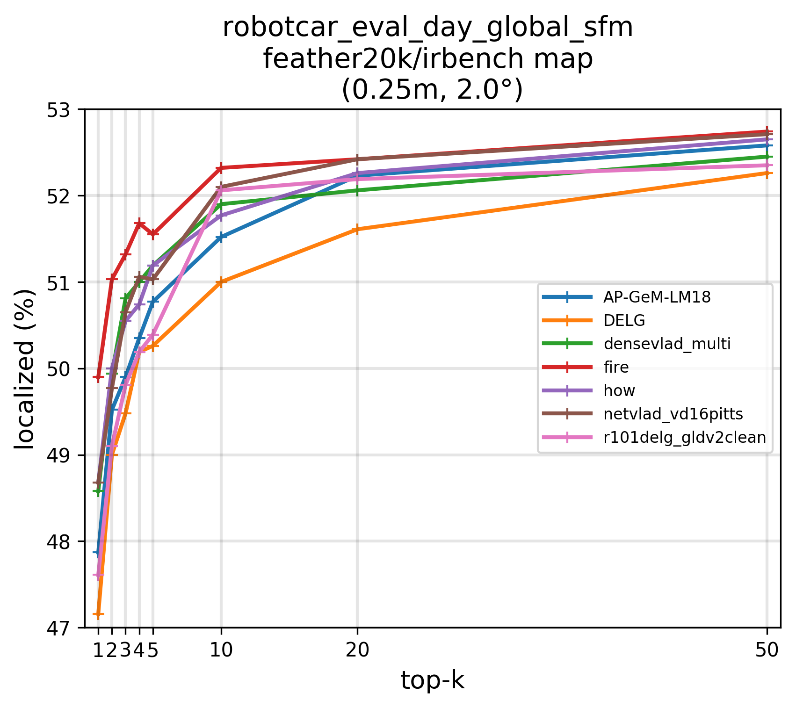
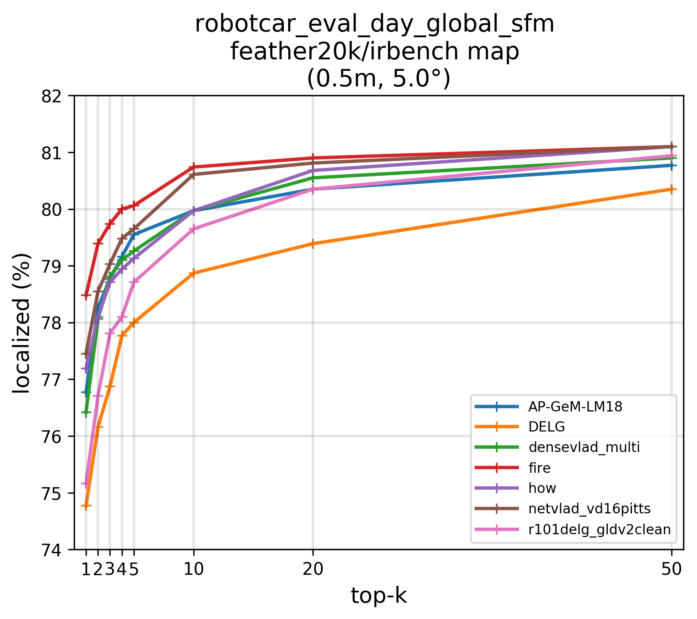
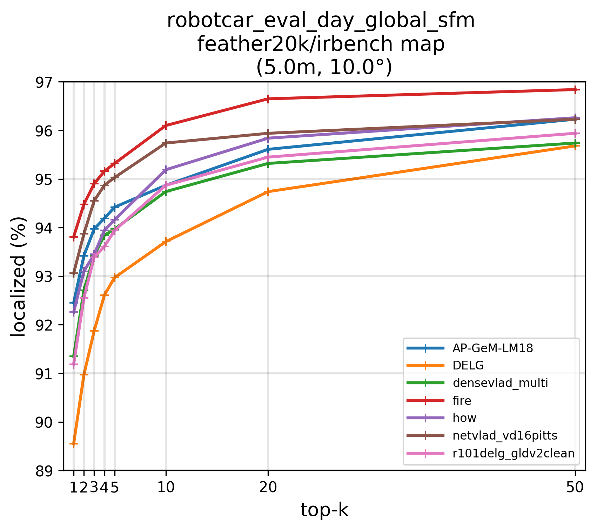

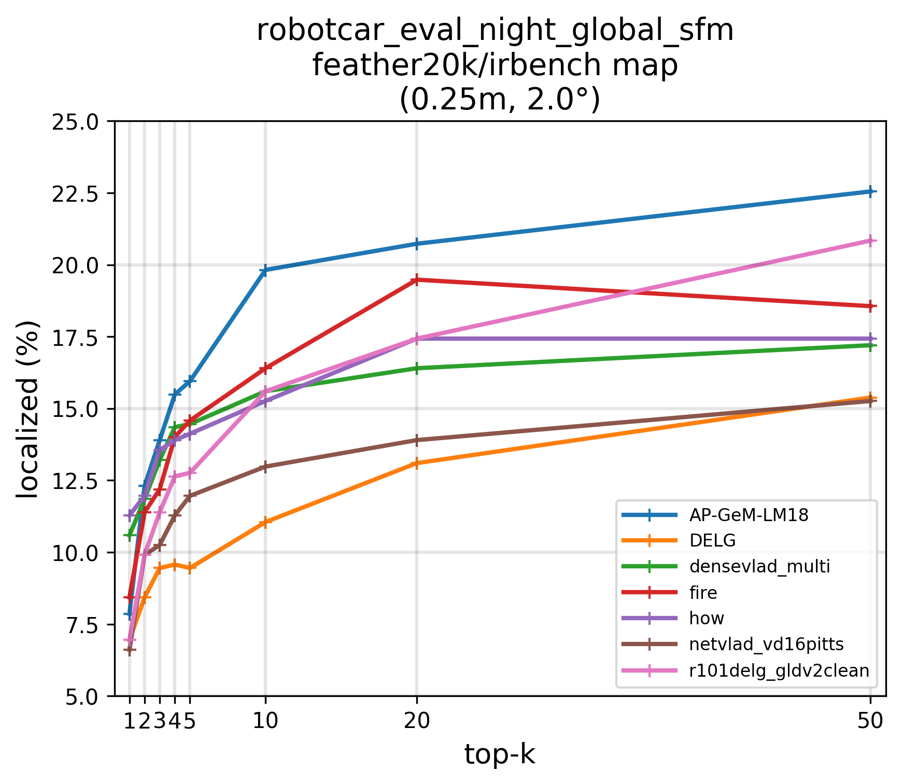
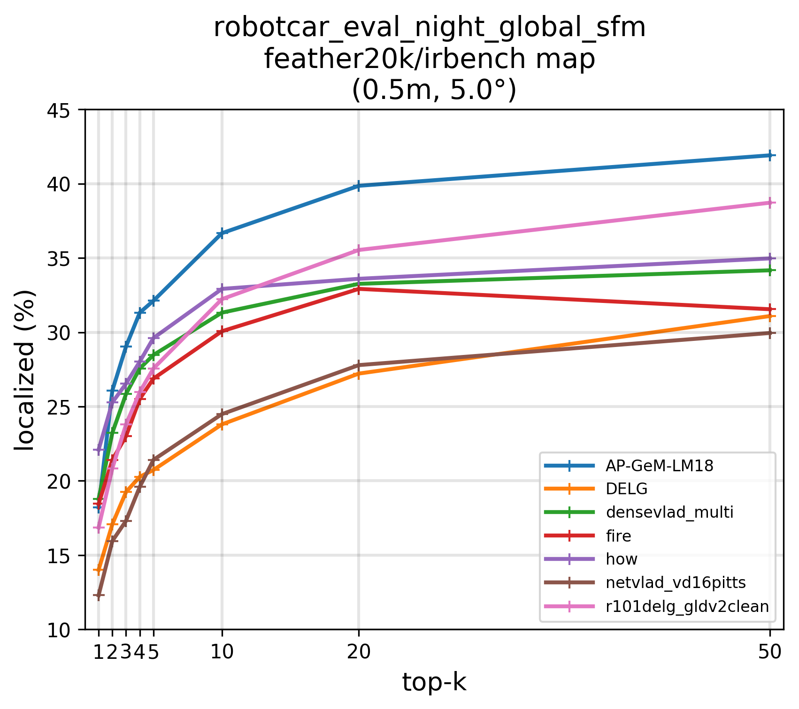
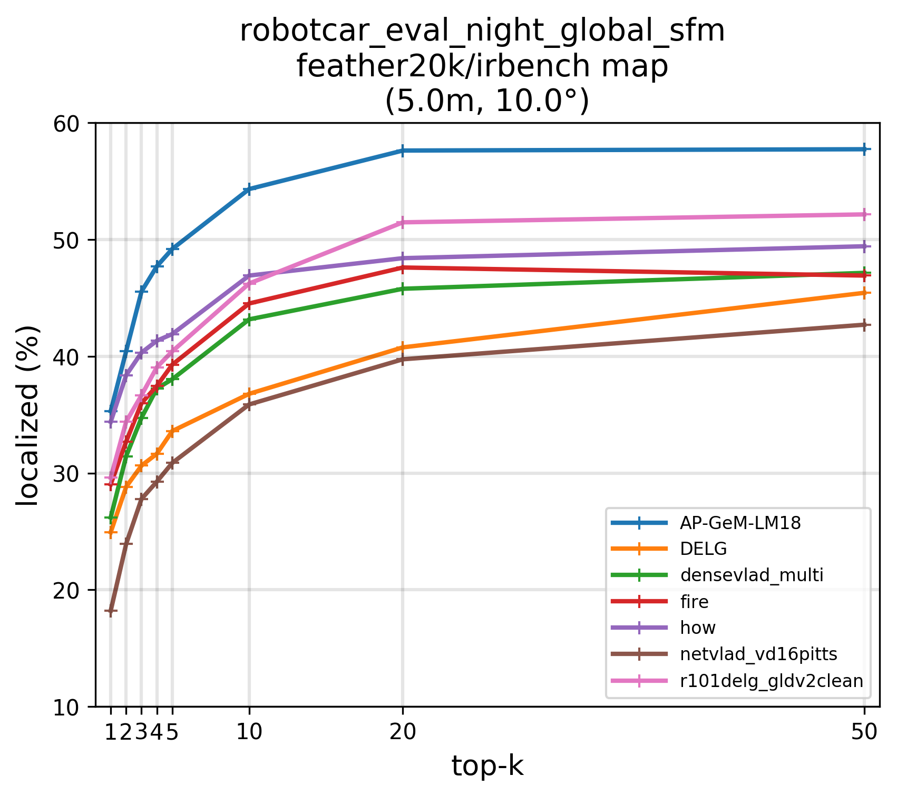

=== local_sfm

[%header]
|===
|feature type|topk 3+|day 3+|night
|||(0.25m_2.0deg)|(0.5m_5.0deg)|(5.0m_10.0deg)|(0.25m_2.0deg)|(0.5m_5.0deg)|(5.0m_10.0deg)
|AP-GeM-LM18|3|23.8%|46.3%|68.7%|0.5%|1.0%|2.7%
|DELG|3|23.3%|45.6%|66.7%|0.2%|0.9%|2.1%
|densevlad_multi|3|25.4%|49.3%|70.6%|0.3%|1.1%|3.3%
|fire|3|26.6%|50.7%|72.3%|0.5%|1.3%|3.4%
|how|3|26.7%|50.4%|71.4%|0.6%|2.2%|5.6%
|netvlad_vd16pitts|3|25.2%|48.7%|70.3%|0.0%|0.6%|2.2%
|r101delg_gldv2clean|3|24.0%|46.6%|67.1%|0.0%|0.9%|3.3%
||||||||
|AP-GeM-LM18|4|34.7%|63.5%|85.9%|1.7%|4.8%|10.0%
|DELG|4|34.3%|61.9%|82.5%|1.4%|3.8%|7.7%
|densevlad_multi|4|35.9%|64.5%|84.3%|1.6%|4.2%|8.3%
|fire|4|36.9%|66.9%|87.4%|0.9%|4.9%|10.8%
|how|4|37.3%|66.3%|86.2%|2.2%|7.1%|14.7%
|netvlad_vd16pitts|4|34.9%|64.1%|84.7%|0.6%|2.7%|6.0%
|r101delg_gldv2clean|4|33.8%|61.7%|82.7%|1.4%|4.4%|10.3%
||||||||
|AP-GeM-LM18|5|39.2%|68.5%|89.1%|2.4%|7.2%|17.2%
|DELG|5|38.1%|67.1%|86.4%|1.1%|5.6%|11.1%
|densevlad_multi|5|39.0%|68.9%|86.8%|2.2%|6.2%|10.8%
|fire|5|41.7%|71.8%|90.7%|2.1%|8.7%|14.6%
|how|5|40.7%|70.7%|88.7%|3.0%|10.5%|20.6%
|netvlad_vd16pitts|5|39.5%|68.7%|88.6%|1.5%|4.4%|8.0%
|r101delg_gldv2clean|5|38.5%|66.7%|87.3%|2.1%|8.3%|14.8%
||||||||
|AP-GeM-LM18|10|45.3%|76.3%|92.8%|5.9%|16.0%|27.8%
|DELG|10|44.6%|73.5%|90.7%|4.2%|12.8%|21.4%
|densevlad_multi|10|44.3%|74.1%|90.5%|4.3%|11.3%|17.2%
|fire|10|45.6%|76.6%|93.7%|4.4%|14.4%|22.6%
|how|10|45.0%|75.5%|91.7%|6.6%|17.4%|29.2%
|netvlad_vd16pitts|10|44.2%|74.7%|92.2%|3.6%|8.8%|13.1%
|r101delg_gldv2clean|10|44.5%|74.6%|92.5%|4.8%|14.8%|23.7%
||||||||
|AP-GeM-LM18|20|47.1%|77.9%|93.9%|9.0%|23.1%|36.3%
|DELG|20|47.0%|76.8%|93.1%|7.9%|18.3%|27.3%
|densevlad_multi|20|46.6%|76.2%|92.4%|6.2%|15.4%|23.6%
|fire|20|48.4%|79.1%|94.9%|7.3%|18.2%|27.7%
|how|20|47.3%|77.6%|93.3%|11.1%|22.4%|34.9%
|netvlad_vd16pitts|20|46.4%|77.6%|94.0%|5.4%|12.6%|19.0%
|r101delg_gldv2clean|20|46.9%|77.1%|94.0%|8.5%|19.9%|30.3%
||||||||
|AP-GeM-LM18|50|48.2%|79.3%|95.0%|13.1%|29.0%|45.4%
|DELG|50|48.6%|78.7%|94.6%|9.9%|21.9%|35.7%
|densevlad_multi|50|47.7%|78.1%|93.9%|8.5%|18.9%|30.5%
|fire|50|48.7%|80.1%|95.7%|9.1%|20.8%|33.8%
|how|50|48.7%|79.2%|94.8%|11.7%|26.9%|39.9%
|netvlad_vd16pitts|50|48.0%|79.5%|95.6%|7.3%|16.0%|26.4%
|r101delg_gldv2clean|50|48.7%|79.6%|95.6%|10.7%|25.1%|40.9%
|===

image::../doc/plots/feather2d2/robotcar_eval_day_local_sfm_0_25m_2_0deg.png[robotcar_eval_day_local_sfm_0_25m_2_0deg]
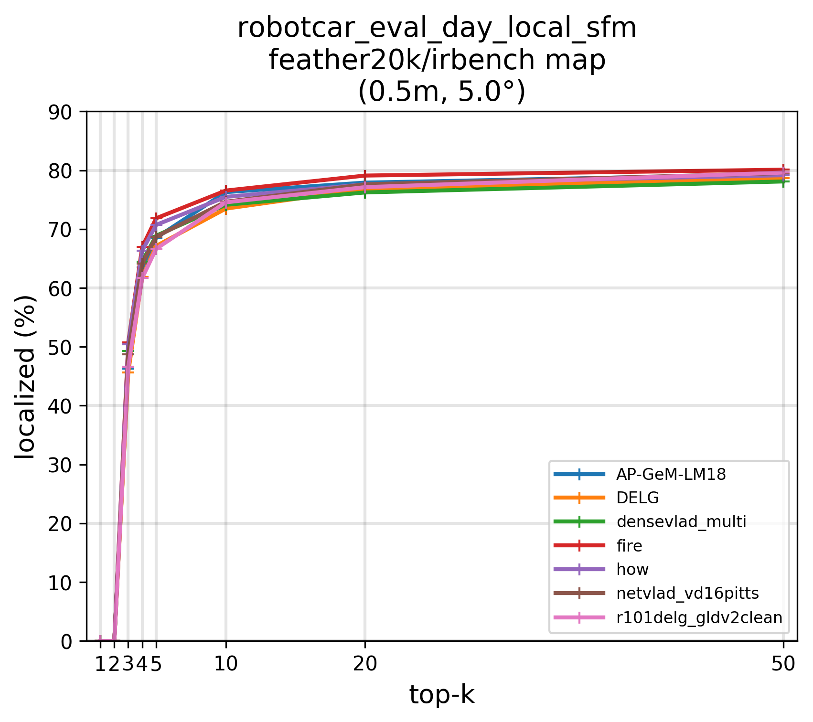
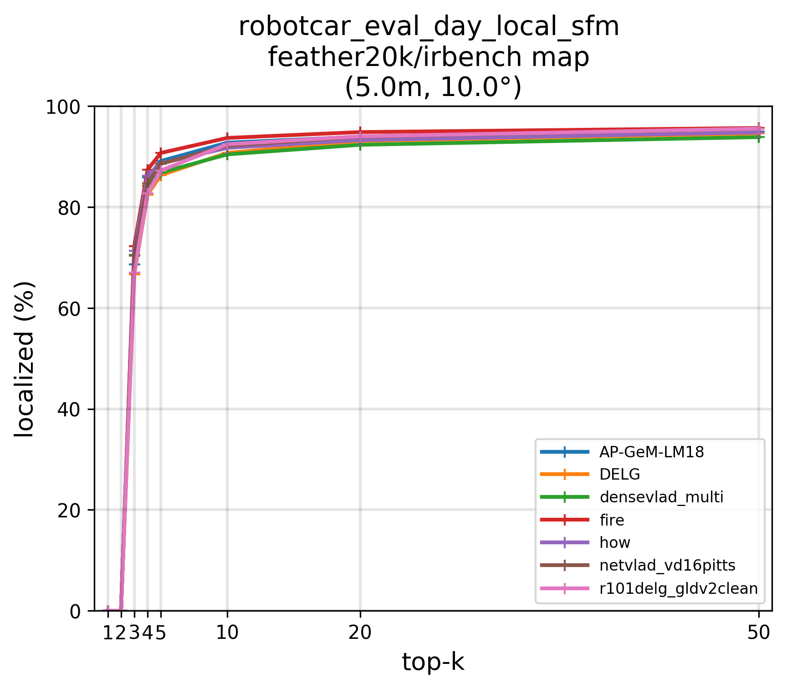

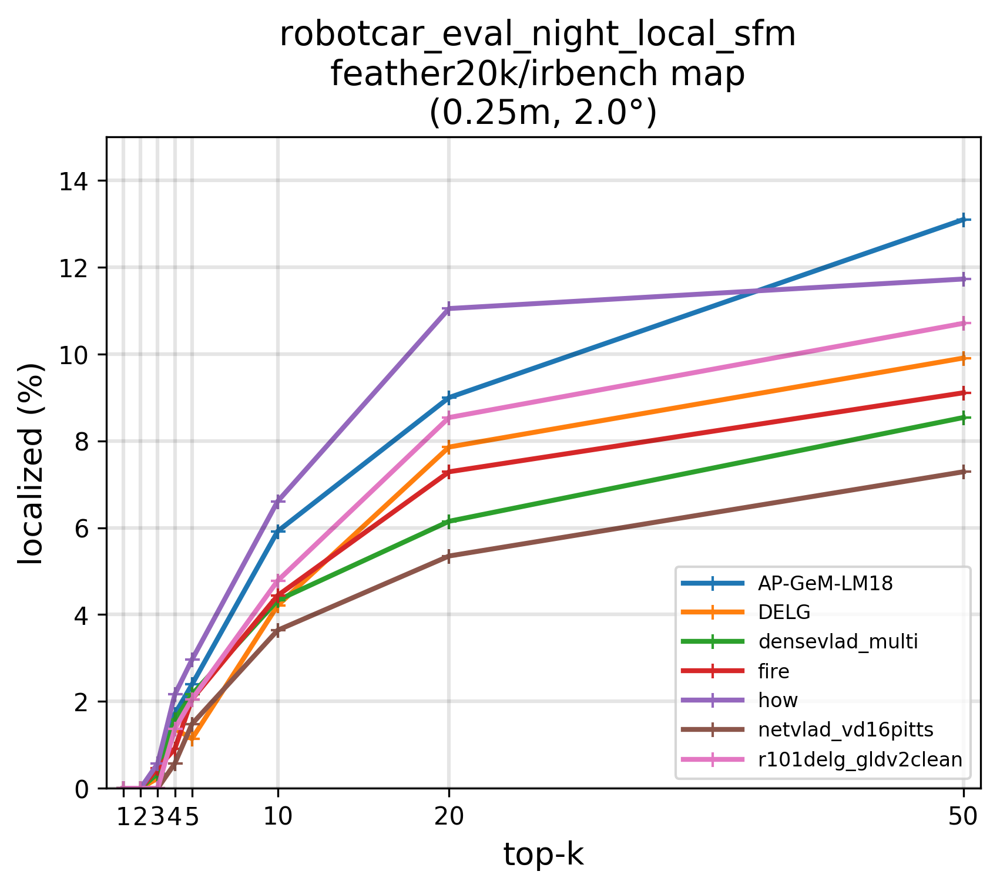
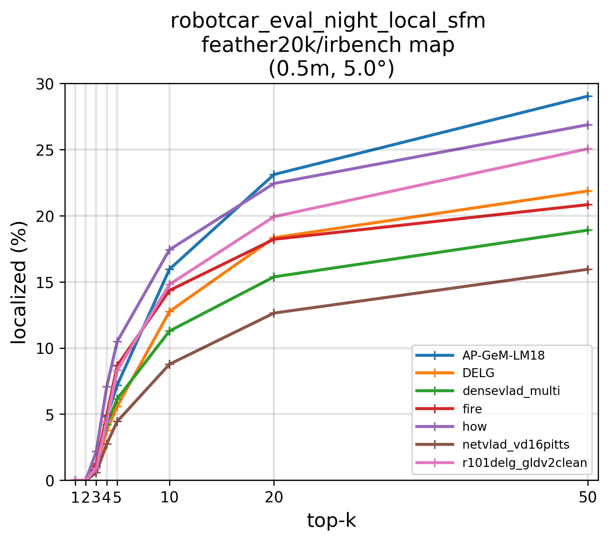
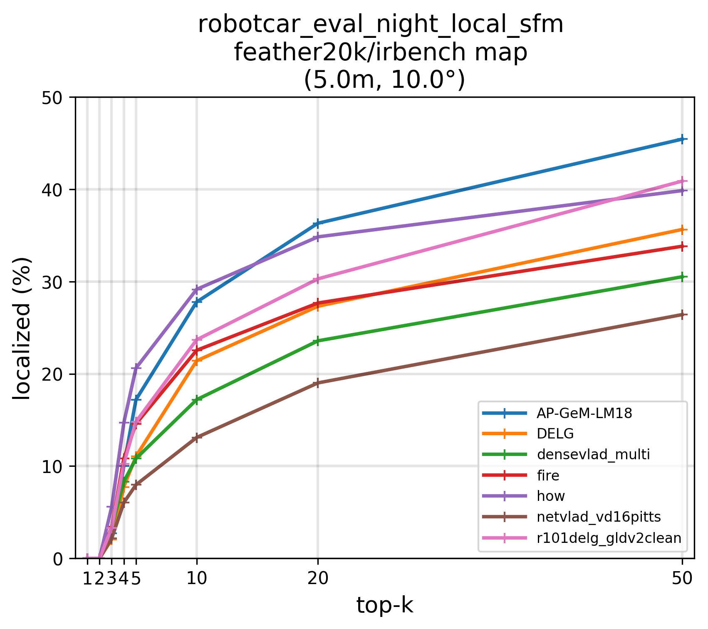

=== EWB

[%header]
|===
|feature type|topk|day|night
|||(5.0m_10.0deg)|(5.0m_10.0deg)
|AP-GeM-LM18|1|90.1%|28.4%
|DELG|1|85.4%|22.7%
|densevlad_multi|1|90.1%|24.9%
|fire|1|92.1%|25.9%
|how|1|91.0%|31.7%
|netvlad_vd16pitts|1|91.5%|16.1%
|r101delg_gldv2clean|1|86.7%|26.5%
||||
|AP-GeM-LM18|2|90.3%|27.2%
|DELG|2|85.1%|20.1%
|densevlad_multi|2|89.1%|20.4%
|fire|2|91.6%|22.4%
|how|2|90.1%|28.7%
|netvlad_vd16pitts|2|90.2%|12.9%
|r101delg_gldv2clean|2|86.2%|25.2%
||||
|AP-GeM-LM18|3|89.7%|24.6%
|DELG|3|85.2%|18.7%
|densevlad_multi|3|87.6%|16.6%
|fire|3|91.4%|21.2%
|how|3|89.1%|26.7%
|netvlad_vd16pitts|3|89.7%|10.6%
|r101delg_gldv2clean|3|86.1%|23.0%
||||
|AP-GeM-LM18|4|88.5%|23.9%
|DELG|4|84.5%|17.1%
|densevlad_multi|4|85.3%|13.7%
|fire|4|90.7%|18.7%
|how|4|88.3%|24.4%
|netvlad_vd16pitts|4|88.8%|8.1%
|r101delg_gldv2clean|4|85.8%|22.9%
||||
|AP-GeM-LM18|5|88.0%|21.5%
|DELG|5|83.5%|16.1%
|densevlad_multi|5|83.1%|11.3%
|fire|5|90.2%|17.7%
|how|5|87.7%|24.0%
|netvlad_vd16pitts|5|87.1%|6.7%
|r101delg_gldv2clean|5|85.4%|19.7%
||||
|AP-GeM-LM18|10|81.5%|14.0%
|DELG|10|78.8%|14.4%
|densevlad_multi|10|66.4%|4.4%
|fire|10|84.8%|12.1%
|how|10|81.3%|16.0%
|netvlad_vd16pitts|10|77.3%|2.1%
|r101delg_gldv2clean|10|79.5%|13.7%
||||
|AP-GeM-LM18|20|55.1%|4.0%
|DELG|20|58.7%|6.2%
|densevlad_multi|20|35.6%|0.7%
|fire|20|62.5%|4.6%
|how|20|61.4%|6.8%
|netvlad_vd16pitts|20|42.1%|0.2%
|r101delg_gldv2clean|20|58.7%|4.3%
||||
|AP-GeM-LM18|50|9.9%|0.0%
|DELG|50|12.3%|0.1%
|densevlad_multi|50|6.3%|0.0%
|fire|50|12.0%|0.0%
|how|50|9.8%|0.0%
|netvlad_vd16pitts|50|9.0%|0.0%
|r101delg_gldv2clean|50|15.7%|0.2%
|===

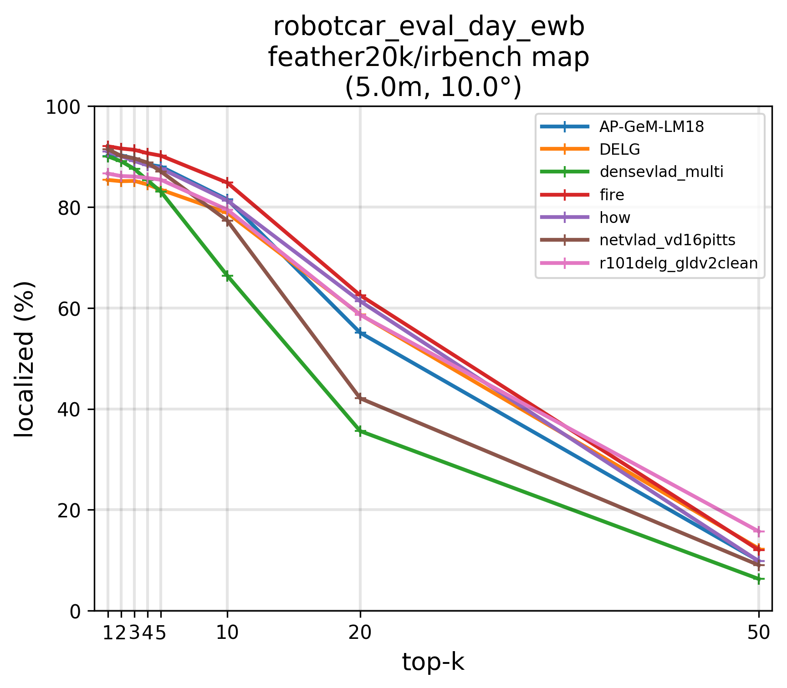
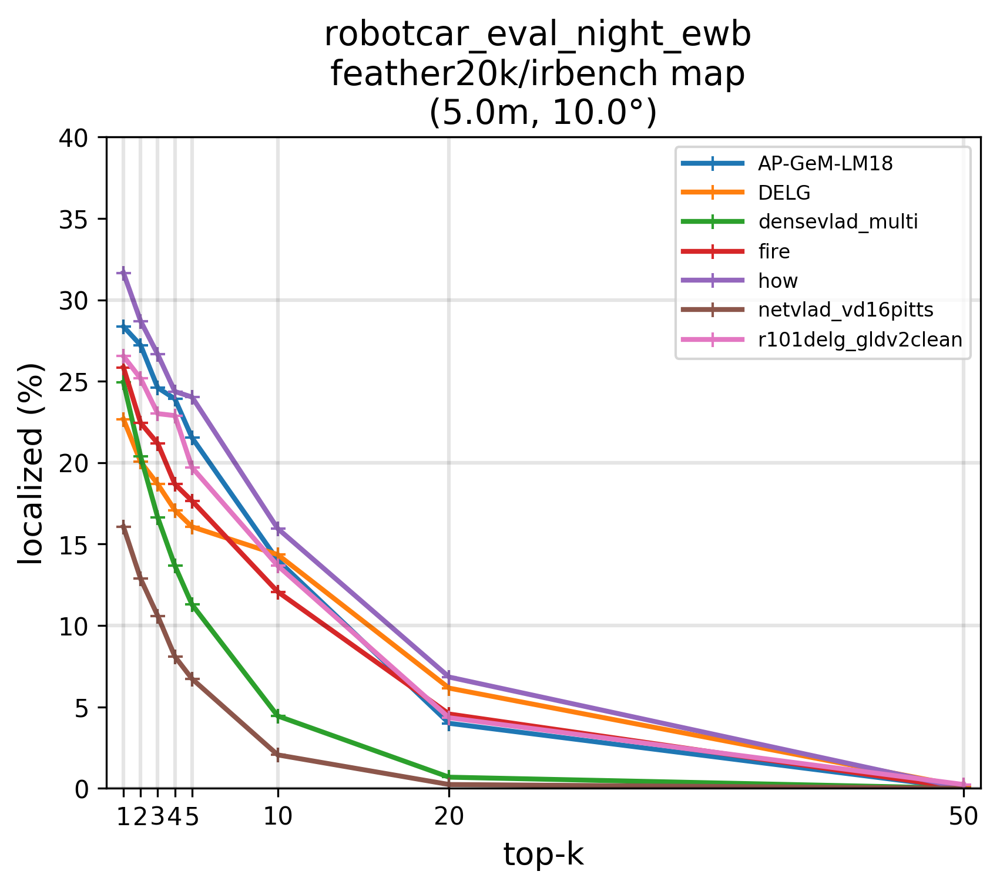

== r2d2_WASF_N8_big 20k Results

=== global_sfm

[%header]
|===
|feature_type|topk 3+|day 3+|night
|||(0.25m_2.0deg)|(0.5m_5.0deg)|(5.0m_10.0deg)|(0.25m_2.0deg)|(0.5m_5.0deg)|(5.0m_10.0deg)
|AP-GeM-LM18|1|50.0%|78.6%|93.3%|11.4%|25.4%|38.2%
|DELG|1|49.1%|75.8%|90.4%|8.8%|19.3%|28.3%
|densevlad_multi|1|49.6%|77.6%|91.7%|11.4%|21.5%|27.2%
|fire|1|51.3%|79.2%|94.3%|10.5%|21.8%|30.1%
|how|1|50.1%|78.1%|92.7%|11.9%|24.6%|35.5%
|netvlad_vd16pitts|1|50.2%|78.5%|93.6%|7.7%|15.0%|19.6%
|r101delg_gldv2clean|1|50.1%|77.3%|92.6%|11.1%|23.6%|32.9%
||||||||
|AP-GeM-LM18|2|51.3%|79.0%|93.9%|14.8%|31.3%|44.2%
|DELG|2|50.3%|76.9%|91.7%|9.7%|22.1%|31.4%
|densevlad_multi|2|51.3%|78.5%|92.9%|12.6%|26.0%|32.7%
|fire|2|52.1%|79.9%|94.7%|12.1%|24.7%|34.2%
|how|2|51.1%|78.5%|93.3%|13.2%|28.3%|39.2%
|netvlad_vd16pitts|2|51.4%|79.4%|94.4%|10.7%|19.4%|26.2%
|r101delg_gldv2clean|2|51.2%|78.2%|93.6%|12.9%|27.0%|36.8%
||||||||
|AP-GeM-LM18|3|51.7%|79.4%|94.4%|17.5%|34.9%|49.3%
|DELG|3|50.9%|77.7%|92.6%|10.7%|23.6%|32.8%
|densevlad_multi|3|51.6%|79.0%|93.5%|14.4%|28.7%|36.3%
|fire|3|52.4%|80.0%|95.1%|13.4%|27.5%|38.3%
|how|3|51.8%|79.0%|93.7%|14.4%|30.8%|41.2%
|netvlad_vd16pitts|3|52.0%|79.7%|94.8%|12.5%|21.3%|30.1%
|r101delg_gldv2clean|3|51.5%|78.8%|94.1%|14.7%|30.0%|39.9%
||||||||
|AP-GeM-LM18|4|51.7%|79.4%|94.6%|19.1%|37.1%|51.3%
|DELG|4|51.5%|78.3%|93.2%|10.9%|23.6%|34.2%
|densevlad_multi|4|51.8%|79.4%|93.9%|15.4%|29.5%|39.1%
|fire|4|52.6%|80.4%|95.2%|15.0%|28.7%|40.3%
|how|4|52.2%|79.3%|94.2%|15.2%|31.8%|42.5%
|netvlad_vd16pitts|4|52.1%|79.9%|95.1%|13.4%|21.9%|32.0%
|r101delg_gldv2clean|4|51.8%|79.2%|94.4%|16.2%|31.7%|42.4%
||||||||
|AP-GeM-LM18|5|52.0%|79.8%|95.0%|19.8%|37.8%|52.2%
|DELG|5|51.6%|78.5%|93.5%|11.3%|25.1%|35.3%
|densevlad_multi|5|51.9%|79.7%|94.0%|15.7%|30.9%|41.1%
|fire|5|52.7%|80.6%|95.7%|16.1%|30.5%|42.6%
|how|5|52.2%|79.5%|94.4%|15.4%|32.4%|43.7%
|netvlad_vd16pitts|5|52.4%|80.1%|95.3%|14.5%|24.5%|34.5%
|r101delg_gldv2clean|5|52.0%|79.4%|94.7%|17.0%|33.4%|44.0%
||||||||
|AP-GeM-LM18|10|52.5%|80.3%|95.6%|22.7%|42.6%|57.2%
|DELG|10|52.4%|79.2%|94.5%|13.0%|27.2%|39.4%
|densevlad_multi|10|52.8%|80.3%|94.9%|18.5%|35.4%|47.6%
|fire|10|53.1%|81.0%|96.5%|19.5%|36.8%|48.4%
|how|10|52.7%|80.4%|95.4%|18.1%|35.9%|48.2%
|netvlad_vd16pitts|10|53.2%|81.0%|96.0%|15.6%|29.3%|40.6%
|r101delg_gldv2clean|10|52.8%|80.3%|95.7%|19.4%|37.5%|49.8%
||||||||
|AP-GeM-LM18|20|53.3%|80.9%|96.5%|25.9%|46.6%|62.8%
|DELG|20|52.9%|80.1%|95.5%|16.6%|31.3%|45.1%
|densevlad_multi|20|53.3%|80.9%|95.4%|20.6%|39.3%|53.0%
|fire|20|53.4%|81.2%|97.0%|21.6%|41.7%|53.5%
|how|20|53.4%|81.0%|96.0%|19.8%|39.8%|52.4%
|netvlad_vd16pitts|20|53.3%|81.3%|96.2%|17.8%|34.1%|46.1%
|r101delg_gldv2clean|20|53.1%|80.7%|96.0%|22.1%|41.5%|55.5%
||||||||
|AP-GeM-LM18|50|53.5%|81.2%|97.5%|27.1%|50.6%|67.4%
|DELG|50|53.4%|80.9%|96.1%|21.1%|38.8%|53.3%
|densevlad_multi|50|53.6%|81.3%|95.9%|22.6%|43.4%|59.3%
|fire|50|53.7%|81.6%|97.6%|23.4%|43.2%|57.7%
|how|50|53.5%|81.4%|96.6%|21.6%|43.5%|56.3%
|netvlad_vd16pitts|50|53.7%|81.5%|96.5%|21.0%|40.4%|53.9%
|r101delg_gldv2clean|50|53.5%|81.3%|96.3%|25.7%|47.5%|61.4%
|===

image::../doc/plots/r2d2/robotcar_eval_day_global_sfm_0_25m_2_0deg.png[robotcar_eval_day_global_sfm_0_25m_2_0deg]
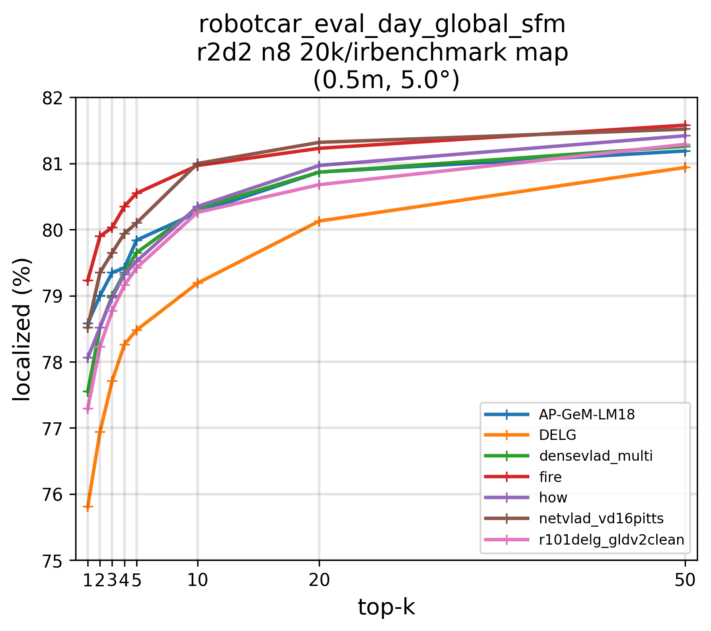
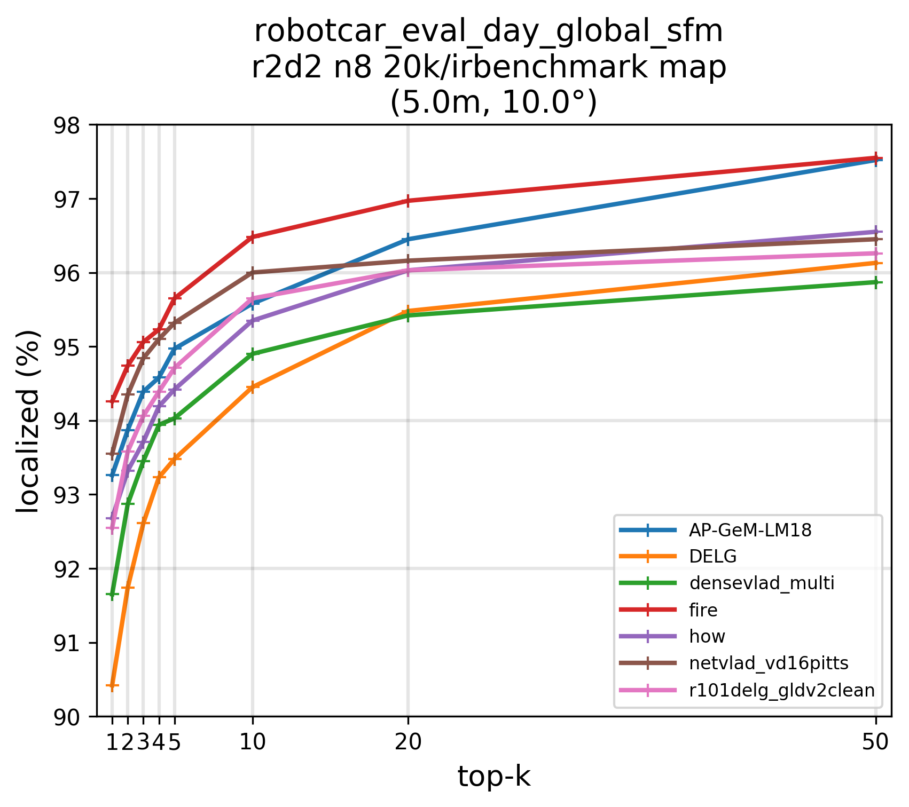

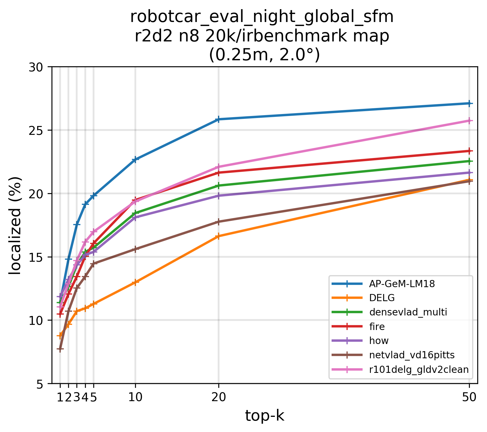
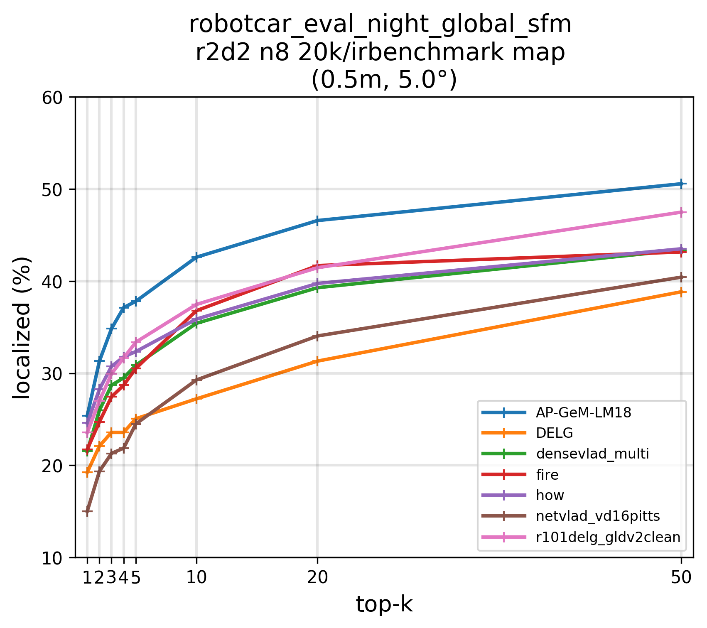
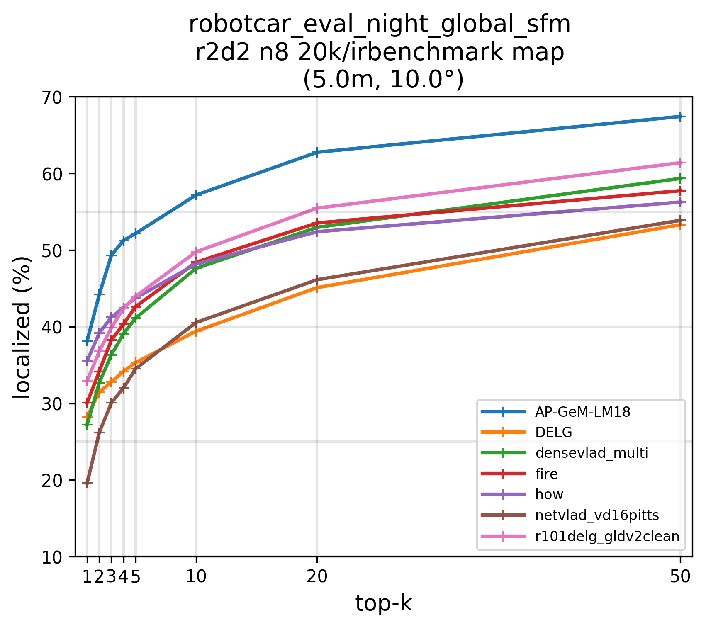

=== local_sfm

[%header]
|===
|feature_type|topk 3+|day 3+|night
|||(0.25m_2.0deg)|(0.5m_5.0deg)|(5.0m_10.0deg)|(0.25m_2.0deg)|(0.5m_5.0deg)|(5.0m_10.0deg)
|AP-GeM-LM18|3|34.4%|62.6%|83.5%|1.7%|4.2%|9.9%
|DELG|3|34.6%|60.5%|80.7%|0.6%|4.2%|10.6%
|densevlad_multi|3|35.6%|63.5%|82.7%|1.6%|4.3%|7.2%
|fire|3|36.6%|66.7%|86.7%|1.4%|4.7%|9.1%
|how|3|35.8%|65.1%|84.6%|2.9%|7.2%|14.7%
|netvlad_vd16pitts|3|35.4%|63.0%|83.0%|1.1%|2.7%|5.4%
|r101delg_gldv2clean|3|34.2%|60.1%|80.5%|1.4%|5.0%|9.9%
||||||||
|AP-GeM-LM18|4|42.1%|72.4%|90.8%|3.9%|10.6%|22.8%
|DELG|4|41.6%|69.6%|88.0%|3.1%|9.2%|16.0%
|densevlad_multi|4|42.7%|71.7%|88.2%|4.2%|8.9%|13.6%
|fire|4|44.9%|74.6%|92.6%|3.9%|10.8%|17.1%
|how|4|43.5%|72.9%|89.6%|6.2%|13.6%|23.7%
|netvlad_vd16pitts|4|43.0%|71.8%|90.0%|2.7%|6.3%|9.7%
|r101delg_gldv2clean|4|41.6%|69.4%|88.7%|3.4%|10.0%|17.3%
||||||||
|AP-GeM-LM18|5|45.0%|75.5%|92.1%|4.4%|14.9%|27.3%
|DELG|5|44.4%|72.8%|90.1%|4.3%|11.9%|20.2%
|densevlad_multi|5|45.2%|73.8%|89.8%|6.2%|11.5%|16.7%
|fire|5|47.6%|76.7%|93.7%|5.1%|14.4%|19.9%
|how|5|46.2%|75.5%|91.2%|7.0%|17.5%|27.1%
|netvlad_vd16pitts|5|45.7%|74.7%|91.7%|3.0%|8.3%|11.4%
|r101delg_gldv2clean|5|45.1%|73.0%|91.4%|4.9%|13.4%|21.4%
||||||||
|AP-GeM-LM18|10|48.6%|78.6%|93.7%|9.3%|23.8%|37.4%
|DELG|10|48.4%|76.7%|92.2%|7.5%|18.2%|26.5%
|densevlad_multi|10|48.7%|76.9%|92.1%|8.8%|16.6%|22.8%
|fire|10|50.1%|79.5%|94.8%|7.9%|19.4%|26.9%
|how|10|48.9%|77.6%|92.8%|10.3%|23.7%|35.9%
|netvlad_vd16pitts|10|48.7%|78.3%|94.1%|5.5%|12.1%|17.5%
|r101delg_gldv2clean|10|48.8%|77.8%|94.0%|7.7%|20.7%|31.0%
||||||||
|AP-GeM-LM18|20|50.6%|79.6%|94.5%|13.8%|30.5%|45.2%
|DELG|20|50.4%|78.2%|93.9%|9.0%|23.0%|32.6%
|densevlad_multi|20|50.0%|78.6%|93.6%|9.8%|21.5%|30.1%
|fire|20|51.2%|80.2%|95.6%|10.0%|24.5%|32.6%
|how|20|50.4%|78.9%|94.3%|12.5%|28.3%|41.0%
|netvlad_vd16pitts|20|50.6%|79.3%|95.0%|8.8%|16.7%|24.7%
|r101delg_gldv2clean|20|50.8%|79.6%|95.3%|10.9%|27.8%|39.9%
||||||||
|AP-GeM-LM18|50|51.5%|80.4%|96.2%|19.1%|38.0%|56.0%
|DELG|50|51.7%|80.0%|95.5%|14.0%|28.5%|42.8%
|densevlad_multi|50|50.9%|79.6%|94.7%|11.6%|28.3%|39.2%
|fire|50|51.8%|80.8%|96.5%|12.5%|28.9%|42.6%
|how|50|51.2%|80.0%|94.9%|13.6%|32.1%|45.4%
|netvlad_vd16pitts|50|51.5%|80.5%|95.9%|9.9%|22.8%|32.9%
|r101delg_gldv2clean|50|51.8%|80.9%|95.8%|14.8%|35.8%|51.6%
|===

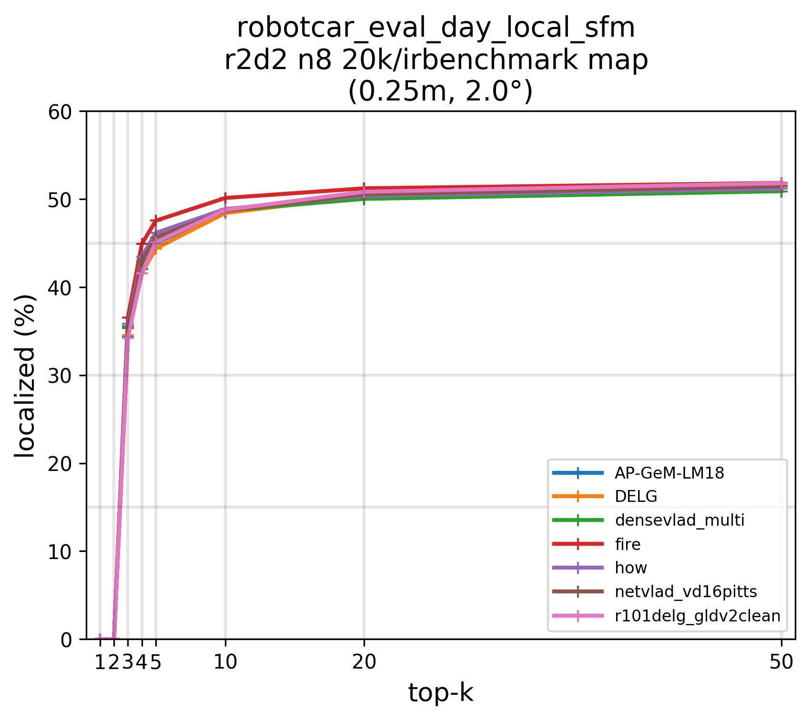
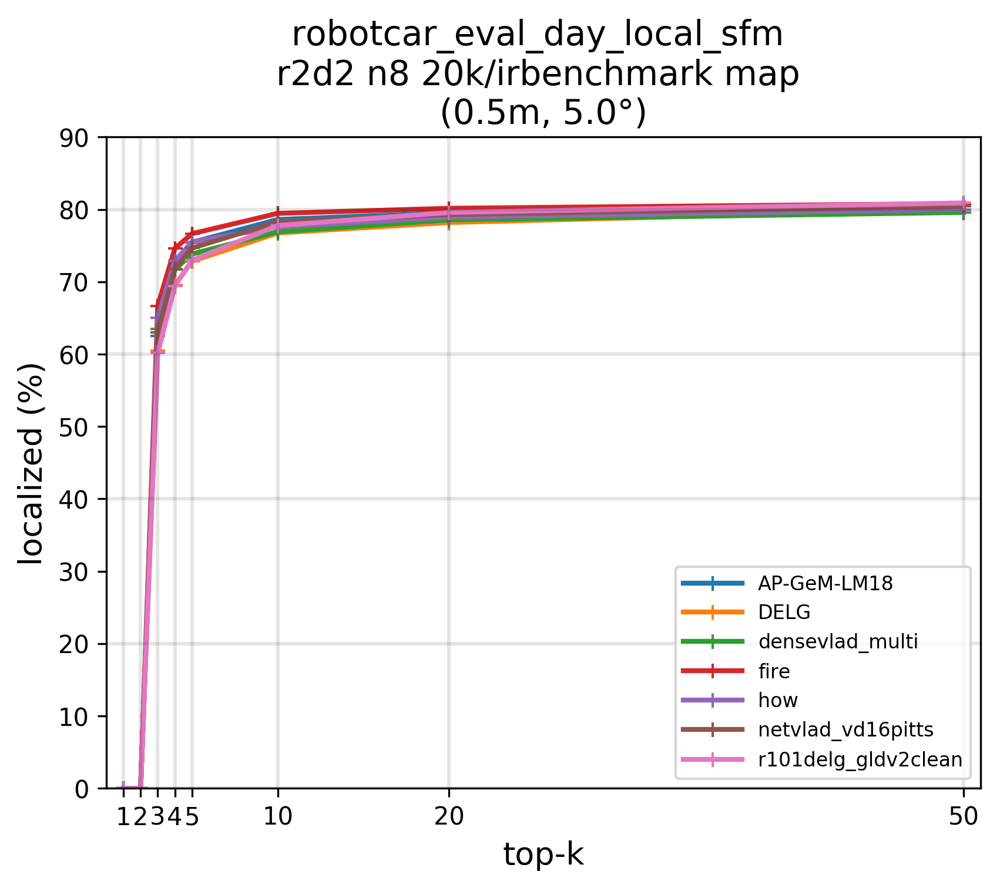
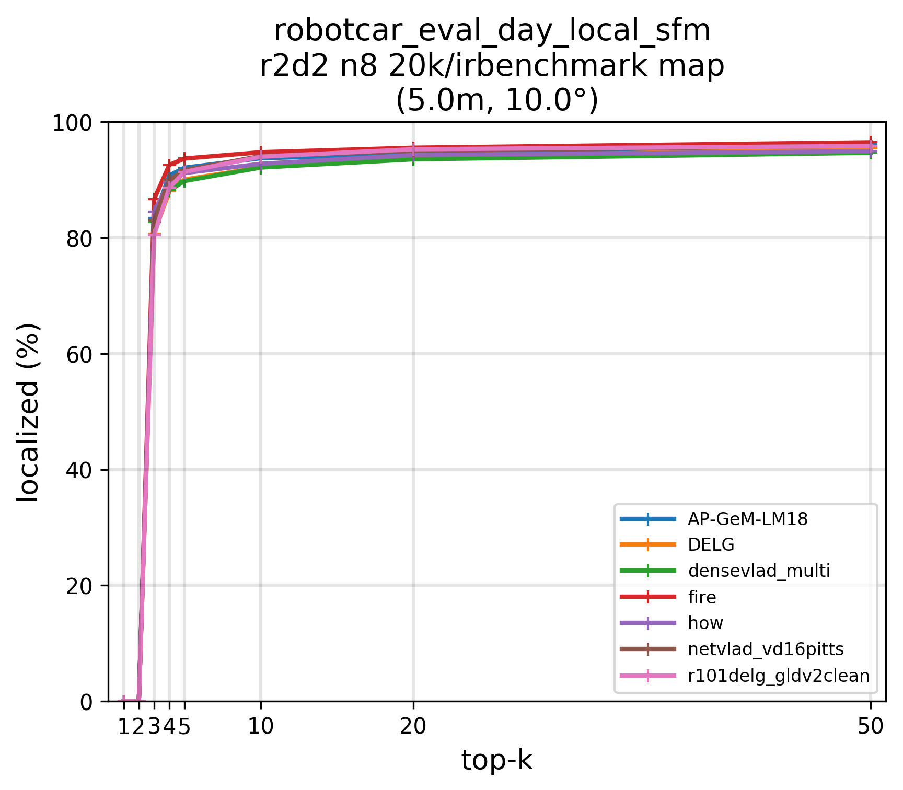

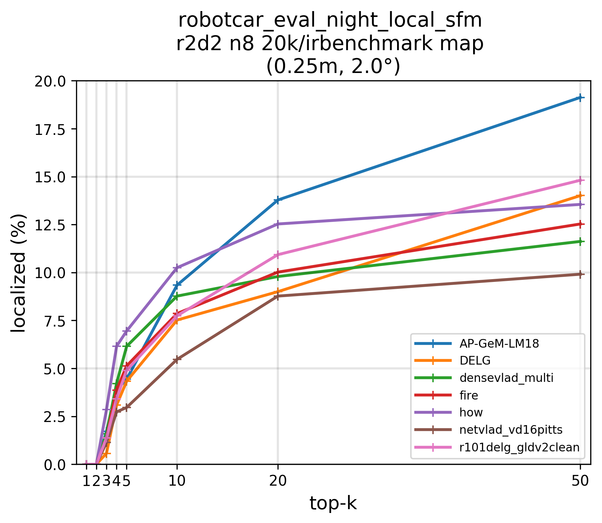
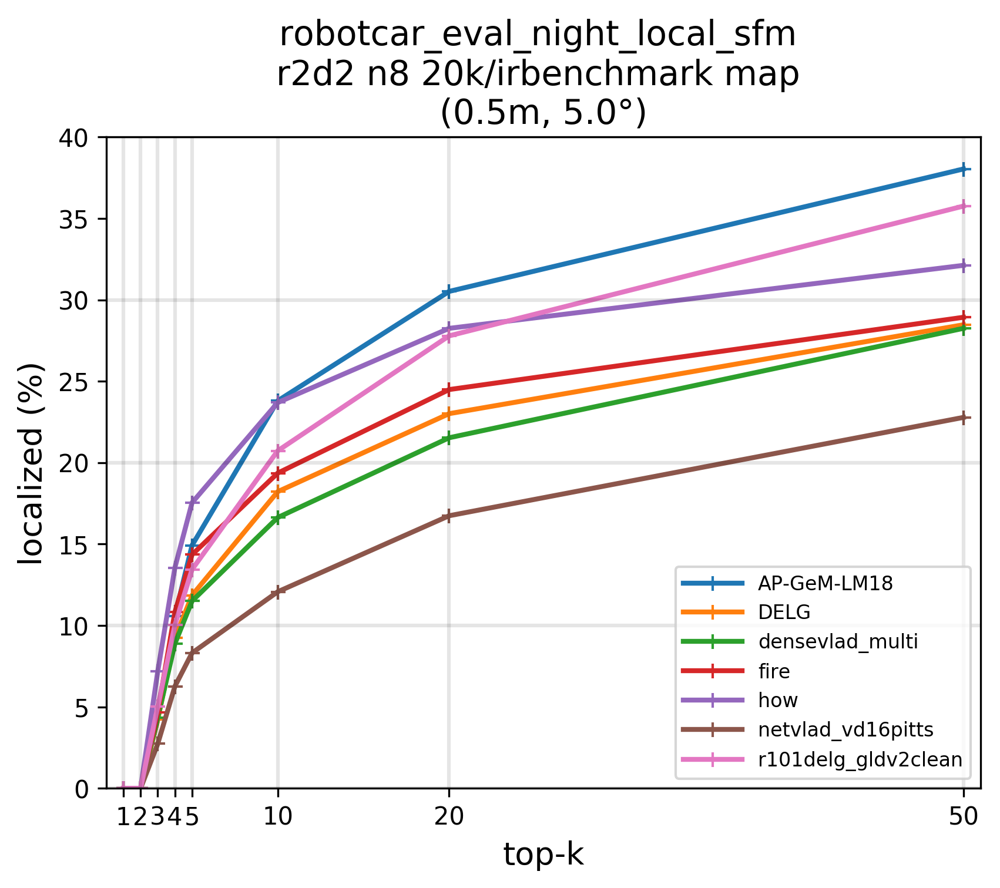
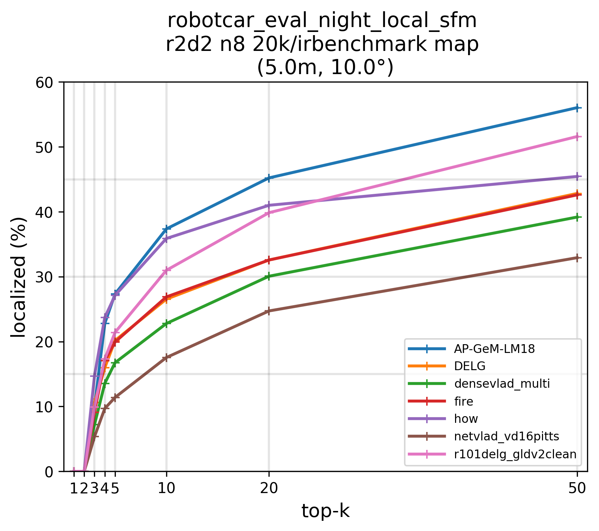

=== EWB

[%header]
|===
|feature_type|topk|day|night
|||(5.0m_10.0deg)|(5.0m_10.0deg)
|AP-GeM-LM18|1|90.1%|28.4%
|DELG|1|85.4%|22.7%
|densevlad_multi|1|90.1%|24.9%
|fire|1|92.1%|25.9%
|how|1|91.0%|31.7%
|netvlad_vd16pitts|1|91.5%|16.1%
|r101delg_gldv2clean|1|86.7%|26.5%
||||
|AP-GeM-LM18|2|90.3%|27.2%
|DELG|2|85.1%|20.1%
|densevlad_multi|2|89.1%|20.4%
|fire|2|91.6%|22.4%
|how|2|90.1%|28.7%
|netvlad_vd16pitts|2|90.2%|12.9%
|r101delg_gldv2clean|2|86.2%|25.2%
||||
|AP-GeM-LM18|3|89.7%|24.6%
|DELG|3|85.2%|18.7%
|densevlad_multi|3|87.6%|16.6%
|fire|3|91.4%|21.2%
|how|3|89.1%|26.7%
|netvlad_vd16pitts|3|89.7%|10.6%
|r101delg_gldv2clean|3|86.1%|23.0%
||||
|AP-GeM-LM18|4|88.5%|23.9%
|DELG|4|84.5%|17.1%
|densevlad_multi|4|85.3%|13.7%
|fire|4|90.7%|18.7%
|how|4|88.3%|24.4%
|netvlad_vd16pitts|4|88.8%|8.1%
|r101delg_gldv2clean|4|85.8%|22.9%
||||
|AP-GeM-LM18|5|88.0%|21.5%
|DELG|5|83.5%|16.1%
|densevlad_multi|5|83.1%|11.3%
|fire|5|90.2%|17.7%
|how|5|87.7%|24.0%
|netvlad_vd16pitts|5|87.1%|6.7%
|r101delg_gldv2clean|5|85.4%|19.7%
||||
|AP-GeM-LM18|10|81.5%|14.0%
|DELG|10|78.8%|14.4%
|densevlad_multi|10|66.4%|4.4%
|fire|10|84.8%|12.1%
|how|10|81.3%|16.0%
|netvlad_vd16pitts|10|77.3%|2.1%
|r101delg_gldv2clean|10|79.5%|13.7%
||||
|AP-GeM-LM18|20|55.1%|4.0%
|DELG|20|58.7%|6.2%
|densevlad_multi|20|35.6%|0.7%
|fire|20|62.5%|4.6%
|how|20|61.4%|6.8%
|netvlad_vd16pitts|20|42.1%|0.2%
|r101delg_gldv2clean|20|58.7%|4.3%
||||
|AP-GeM-LM18|50|9.9%|0.0%
|DELG|50|12.3%|0.1%
|densevlad_multi|50|6.3%|0.0%
|fire|50|12.0%|0.0%
|how|50|9.8%|0.0%
|netvlad_vd16pitts|50|9.0%|0.0%
|r101delg_gldv2clean|50|15.7%|0.2%
|===

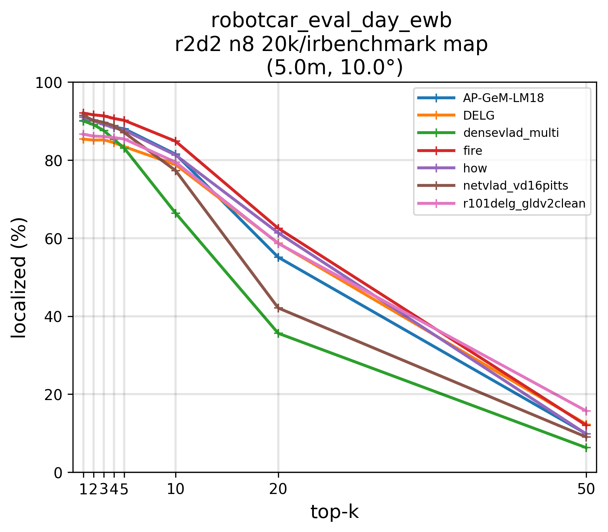
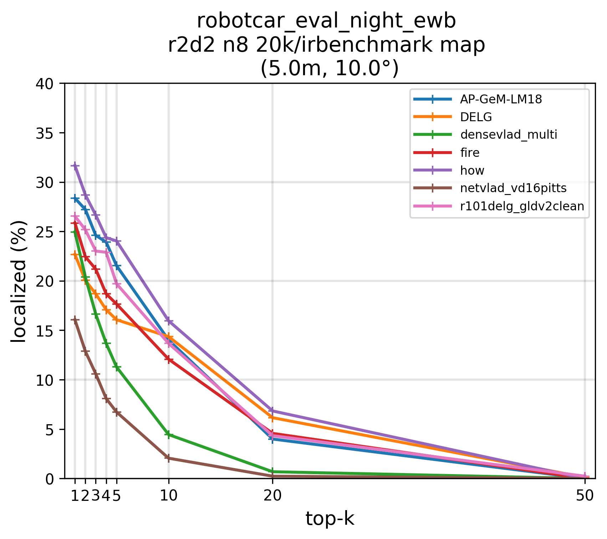
