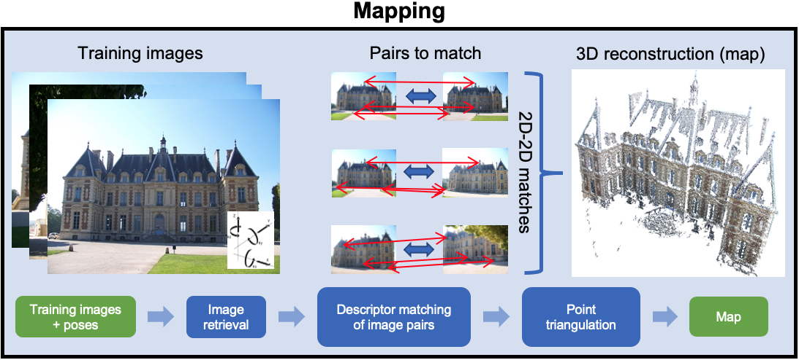
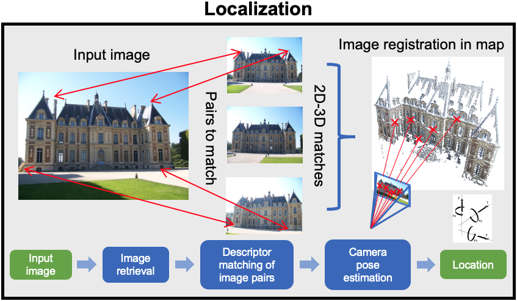
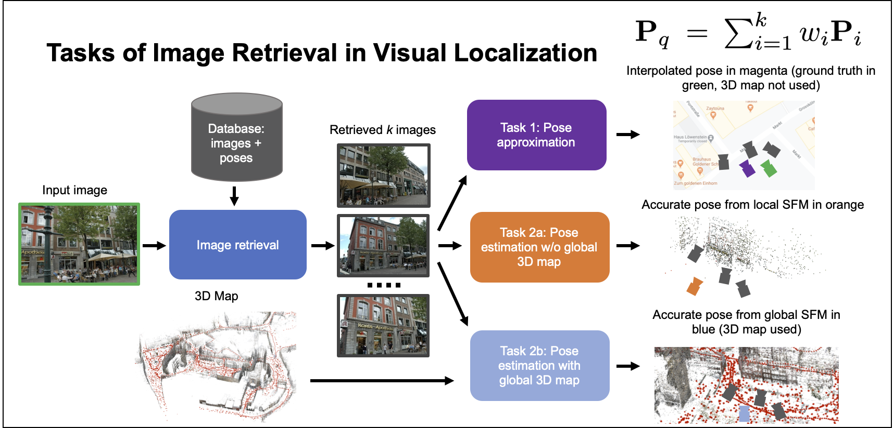

= kapture-localization / tutorial
:sectnums:
:sectnumlevels: 0
:toc:
:toclevels: 2

= Structure-based mapping and localization

In this tutorial, we us two pipelines (custom pipeline and COLMAP pipeline) to explain how to localize query images within a map.
Before explaining how to use the code, we provide more details about the algorithmic workflow and the methods used.

For both pipelines (custom and COLMAP), we explain how to build a map using structure-from-motion leveraging known camera poses, we show how to localize query images within this map, and we show how to evaluate the precision of the obtained localization against the ground truth.

We will use the `virtual_gallery_tutorial` dataset as an example. It is a subset of the https://europe.naverlabs.com/research/3d-vision/virtual-gallery-dataset/[virtual gallery dataset].
The sample dataset can be found in the `samples/` folder.
The tutorial can be used for any dataset that follows the <<Recommended dataset structure>>.
Further information about the pipelines can be found in link:../pipeline/README.adoc[pipeline/README].

If you use this work for your research, please cite the respective paper:

----
@misc{kapture2020,
      title={Robust Image Retrieval-based Visual Localization using Kapture},
      author={Martin Humenberger and Yohann Cabon and Nicolas Guerin and Julien Morat and Jérôme Revaud and Philippe Rerole and Noé Pion and Cesar de Souza and Vincent Leroy and Gabriela Csurka},
      year={2020},
      eprint={2007.13867},
      archivePrefix={arXiv},
      primaryClass={cs.CV}
}
----

== Algorithmic workflow

In this section, we present the algorithmic workflow of our pipelines.
In the custom pipeline, we follow a structure-based approach using image retrieval (any compatible global image representation can be used) to select the image pairs to match (using any compatible local feature type).
In this pipeline, we use COLMAP for point triangulation and image registration.
More details about the method can be found in our https://arxiv.org/pdf/2007.13867[paper].
In the COLMAP pipeline, we follow the COLMAP workflow which uses a vocabulary tree matcher and SIFT features.
For more details about the COLMAP workflow, please refer to the https://colmap.github.io/faq.html?highlight=localization#register-localize-new-images-into-an-existing-reconstruction[documentation] and this https://github.com/tsattler/visuallocalizationbenchmark[repository].

Fig. <<fig_mapping>> illustrates the algorithmic steps of the mapping part:

1. Extraction of local descriptors and keypoints (e.g. R2D2, D2-Net, SIFT) of training images
2. Extraction of global features (e.g. AP-GeM, NetVLAD, DenseVLAD) of training images
3. Computation of training image pairs using global features
4. Local descriptor matching and geometric verification of the image pairs
5. Point triangulation with COLMAP (point triangulator)

.Map generation with SFM. Images from https://github.com/openMVG/ImageDataset_SceauxCastle/tree/master/images[SceauxCastle Dataset].
[[fig_mapping]]


Fig. <<fig_localization>> illustrates the algorithmic steps of the localization part:

1. Extraction of local and global features (same local and global feature types as used for mapping) of query images
2. Retrieval of similar images from the training images (training-query image pairs)
3. Local descriptor matching and geometric verification
4. Camera pose estimation with COLMAP (image registrator)

.Localization of query images in an SFM map. Images from https://github.com/openMVG/ImageDataset_SceauxCastle/tree/master/images[SceauxCastle Dataset].
[[fig_localization]]


== Recommended dataset structure

The pipeline scripts use the same locations of keypoints, descriptors, global features, and matches for multiple kapture folders.
Note, a kapture folder contains sensor data and, if available, reconstruction data. More details about the structure of a kapture folder and the data it contains can be found in the link:https://github.com/naver/kapture/blob/main/kapture_format.adoc[kapture repository].

In order to share reconstruction data across different kapture folders, this data has to be stored outside of any kapture folder and the pipeline scripts will use these locations to assemble the correct kapture folders using symlinks.

The following example contains 3 kapture folders (mapping, query, map_plus_query) and 2 locations for shared reconstruction data (local_features, global_features). Note, since keypoint matches depend on the local feature type, they are stored in the respective subfolder. For example, r2d2_WASF-N8_20k/NN_no_gv means matches without geometric verification of 20k R2D2 features extracted using the model named r2d2_WASF-N8. Of course the naming of the matching method and the local features is arbitrary.

[source,txt]
----
my_dataset
├─ mapping
│  └─ sensors
│     ├─ sensors.txt          # list of all sensors with their specifications (e.g. camera intrinsics)
│     ├─ trajectories.txt     # extrinsics (timestamp, sensor, pose)
│     ├─ records_camera.txt   # all records of type 'camera' (timestamp, sensor and path to image)
│     └─ records_data/        # image data path
├─ query
│  └─ sensors
│     ├─ sensors.txt          # list of all sensors with their specifications (e.g. camera intrinsics)
│     ├─ trajectories.txt     # if available: extrinsics (timestamp, sensor, pose)
│     ├─ records_camera.txt   # all records of type 'camera' (timestamp, sensor and path to image)
│     └─ records_data/        # image data path
├─ map_plus_query # kapture_merge.py with mapping/query inputs
│  └─ sensors
│     ├─ sensors.txt          # list of all sensors with their specifications (e.g. camera intrinsics)
│     ├─ trajectories.txt     # extrinsics (timestamp, sensor, pose)
│     ├─ records_camera.txt   # all records of type 'camera' (timestamp, sensor and path to image)
│     └─ records_data/        # image data path
├─ local_features
│  ├─ r2d2_WASF-N8_20k # 20k R2D2 with model r2d2_WASF-N8
│  │  ├─ keypoints/
│  │  ├─ descriptors/
│  │  ├─ NN_no_gv # match method, here: cross validation without geometric verification
│  │  │  └─ matches/
│  │  └─ NN_colmap_gv/ # match method, here: cross validation with COLMAP geometric verification
│  │     └─ matches/
│  └─ d2_tf
│     ├─ keypoints/
│     ├─ descriptors/
│     ├─ NN_no_gv # match method (see above)
│     │  └─ matches/
│     └─ NN_colmap_gv/ # match method (see above)
│        └─ matches/
└─ global_features
   └─ AP-GeM-LM18 # APGeM features with model AP-GeM-LM18
      └─ global_features
----

== Install kapture-localization

See link:installation.adoc[] for more details.

For __Windows__ users: Please use `colmap.bat`. If the __colmap__ path is not available from your `%PATH%`
environment variable, you have to provide it to kapture tools through the parameter `-colmap`,
e.g. `-colmap C:/Workspace/dev/colmap/colmap.bat`.

WARNING: Windows users need to have the file extension `.py` associated to the python3.6 executable and elevated rights
to allow symlink. They should also enable long paths. See link:installation.adoc[installation instructions] for more details.

.using docker
[source,bash]
----
docker run --runtime=nvidia -it --rm  kapture/kapture-localization
cd kapture-localization
----

== Prepare data

Before going through the kapture pipelines, __local features__ and __global features__ have to be extracted for each image.

.precomputed features
For easy use of this tutorial, we provide precomputed local and global features (virtual_gallery_tutorial):

- local features: __R2D2__ (500 kps per image), stored in `./local_features/r2d2_500/{descriptors,keypoints}`.
- global features: __AP-GeM__, stored in `./global_features/AP-GeM-LM18/global_features/`.

.extract own __local features__
Custom local features in the __kapture__ format can be used as well. For example, __R2D2__ features can be extracted using
https://github.com/naver/r2d2/blob/master/extract_kapture.py[extract_kapture.py] provided
in the https://github.com/naver/r2d2#feature-extraction-with-kapture-datasets[R2D2 git repository].
See https://github.com/naver/kapture#local-features[here] for more local feature types that are directly supported in kapture.

.extract own __global features__
Custom global features in the __kapture__ format can be used as well.
For example, __AP-GeM__ global features can be extracted using https://github.com/naver/deep-image-retrieval/blob/master/dirtorch/extract_kapture.py[extract_kapture.py] provided
in the https://github.com/naver/deep-image-retrieval#feature-extraction-with-kapture-datasets[deep-image-retrieval git repository]
See https://github.com/naver/kapture#global-features[here] for more global feature types that are directly supported in kapture.

Features for mapping and query images need to be in the same folder (see the <<Recommended dataset structure>> above).

.previous experiments
To be sure starting from scratch, unwanted files (e.g. previous experiments) should be deleted before running this tutorial.

[source,bash]
----
cd samples/virtual_gallery_tutorial
./reset_tutorial_folder.py
----

Next, we will introduce two mapping and localization pipelines. The first one is a custom-built pipeline that can be used with any local or global feature type as well as custom keypoint matches, the second one is fully based on COLMAP and shows how COLMAP can be used with data provided in kapture format.

== Kapture pipeline (custom)

=== 1. Mapping

[source,bash]
----
cd samples/virtual_gallery_tutorial # or a custom dataset
# if the COLMAP executable is not available from PATH,
# parameter -colmap needs to be set. example -colmap C:/Workspace/dev/colmap/colmap.bat
kapture_pipeline_mapping.py -v info \
    -i ./mapping \
    -kpt ./local_features/r2d2_500/keypoints \
    -desc ./local_features/r2d2_500/descriptors \
    -gfeat ./global_features/AP-GeM-LM18/global_features \
    -matches ./local_features/r2d2_500/NN_no_gv/matches \
    -matches-gv ./local_features/r2d2_500/NN_colmap_gv/matches \
    --colmap-map ./colmap-sfm/r2d2_500/AP-GeM-LM18_top5  # lfeat type / map pairs \
    --topk 5
----

`kapture_pipeline_mapping.py` will run the following sequence:

 . `kapture_compute_image_pairs.py`: associate similar images within the mapping set
 . `kapture_compute_matches.py`: compute 2D-2D matches using local features and the list of pairs
 . `kapture_run_colmap_gv.py`: run COLMAP geometric verification on the 2D-2D matches
 . `kapture_colmap_build_map.py` triangulate the 2D-2D matches to get 3D points and 2D-3D observations

The resulting list of image pairs and the 3D reconstruction (map) can be found in `./colmap-sfm/r2d2_500/AP-GeM-LM18_top5`.

The map you can visualized using the __COLMAP__ gui as follows:

[source,bash]
----
colmap gui \
    --database_path ./colmap-sfm/r2d2_500/AP-GeM-LM18_top5/colmap.db \
    --image_path ./mapping/sensors/records_data \
    --import_path ./colmap-sfm/r2d2_500/AP-GeM-LM18_top5/reconstruction/ # only available in colmap 3.6
----

NOTE: For Windows user, replace "colmap" with the full path to "colmap.bat",
as described in <<Install kapture-localization>>.

NOTE: For older versions of COLMAP (< 3.6) the model needs to be imported manually: menu `file` > `import model` > browse to
`colmap-sfm/r2d2_500/AP-GeM-LM18_top5/reconstruction` >  click `yes` and `save` in the following two dialogs.

As show in Fig. <<fig_reconstruct>>, the 3D interface of __COLMAP__
shows the 3D points and the cameras in the scene.
A double-click on a camera will show the image and the observed 3D points will be highlighted.

NOTE: If you are using docker, you can simply use __COLMAP__ GUI from host, even if the version is < 3.6.

.Map reconstruction in __COLMAP__.
[[fig_reconstruct]]
image::../doc/colmap_mapping.jpg[reconstruction]


=== 2. Localization

[source,bash]
----
# If the COLMAP executable is not available from PATH, the parameter -colmap needs to be set
#   example: -colmap C:/Workspace/dev/colmap/colmap.bat
# For RobotCar or RobotCar_v2 --benchmark-style RobotCar_Seasons needs to be added.
# For Gangnam_Station --benchmark-style Gangnam_Station
# For Hyundai_Department_Store --benchmark-style Hyundai_Department_Store
# For RIO10 --benchmark-style RIO10
# For ETH-Microsoft --benchmark-style ETH_Microsoft
kapture_pipeline_localize.py -v info \
      -i ./mapping \
      --query ./query \
      -kpt ./local_features/r2d2_500/keypoints \
      -desc ./local_features/r2d2_500/descriptors \
      -gfeat ./global_features/AP-GeM-LM18/global_features \
      -matches ./local_features/r2d2_500/NN_no_gv/matches \
      -matches-gv ./local_features/r2d2_500/NN_colmap_gv/matches \
      --colmap-map ./colmap-sfm/r2d2_500/AP-GeM-LM18_top5 \
      -o ./colmap-localization/r2d2_500/AP-GeM-LM18_top5/AP-GeM-LM18_top5/ \
      --topk 5 \
      --config 2
----

`kapture_pipeline_localize.py` will run the following sequence:

 . `kapture_compute_image_pairs.py` associates similar images between the mapping and query sets
 . `kapture_merge.py` merges the mapping and query sensors into the same folder (necessary to compute shared matches)
 . `kapture_compute_matches.py` computes 2D-2D matches using local features and the list of pairs
 . `kapture_run_colmap_gv.py` runs geometric verification on the 2D-2D matches
 . `kapture_colmap_localize.py` runs the camera pose estimation
 . `kapture_import_colmap.py` imports the COLMAP results into kapture
 . `kapture_evaluate.py` if query ground truth is available, this evaluates the localization results
 . `kapture_export_LTVL2020.py` exports the localized images to a format compatible with the
                                https://www.visuallocalization.net/ benchmark

In this script, the --config option will decide the parameters passed to the COLMAP image_registrator.
The parameters are described in link:../kapture_localization/colmap/colmap_command.py[colmap_command.py].

The resulting `./colmap-localization/r2d2_500/AP-GeM-LM18_top5/AP-GeM-LM18_top5/eval/stats.txt` will look similar to:

[source,ini]
----
Model: colmap_config_2

Found 4 / 4 image positions (100.00 %).
Found 4 / 4 image rotations (100.00 %).
Localized images: mean=(0.0124m, 0.2086 deg) / median=(0.0110m, 0.1675 deg)
All: median=(0.0110m, 0.1675 deg)
Min: 0.0030m; 0.0539 deg
Max: 0.0246m; 0.4454 deg

(0.25m, 2.0 deg): 100.00%
(0.5m, 5.0 deg): 100.00%
(5.0m, 10.0 deg): 100.00%
----

If the dataset used is part of the https://www.visuallocalization.net/[online benchmark] (not the case for virtual gallery), `./colmap-localization/r2d2_500/AP-GeM-LM18_top5/AP-GeM-LM18_top5/LTVL2020_style_result.txt` contains the results in compatible format.

To visualise the queries in the map, __COLMAP__ gui can be used as follows:
[source,bash]

----
colmap gui \
    --database_path ./colmap-localization/r2d2_500/AP-GeM-LM18_top5/AP-GeM-LM18_top5/colmap_localized/colmap.db \
    --image_path query/sensors/records_data \
    --import_path ./colmap-localization/r2d2_500/AP-GeM-LM18_top5/AP-GeM-LM18_top5/colmap_localized/reconstruction/ # only available in colmap 3.6
----

.Query localized in __COLMAP__.
[[fig_localized]]
image::../doc/colmap_localized.jpg[localized]

== Examples

This section presents examples of how to use the custom pipeline with some public datasets. To use these examples with other datasets that are available in kapture format, only very little adaptions are needed (some parameters need to be changed; please see the documentation of the source code of the functions used for more details).

We will use the pre-built docker container for these examples.
```
docker pull kapture/kapture-localization
docker run --runtime=nvidia -it --rm --volume <my_data>:<my_data> kapture/kapture-localization
```

The path specified in WORKING_DIR (defined in the scripts) can be the same for all examples. There will be a subfolder that contains the downloaded datasets and a subfolder that contains the processed data for each example.

=== NAVER LABS Localization datasets (Gangnam Station and Hyundai Department Store)

1) Point WORKING_DIR in the scripts to a location where you want the dataset to be downloaded and processed data to be stored.

2) The datasets consist of 5 scenes, 2 for GangnamStation and 3 for Hyundai Department Store. If you do not want to process all of them, modify the for loops in the scripts. For example, the visual localization challenge in the https://sites.google.com/view/ltvl2021/home?authuser=0[LTVL workshop] (ICCV 2021) only requires B2 from Gangnam and 1F from Hyundai Department Store.

3) Execute the scripts.
```
cd kapture-localization/pipeline/examples
./run_gangnam.sh
./run_hyundai_dept_store.sh
```

4) If everything was successful, you should get a file named `GangnamStation_LTVL2020_style_result_all_scenes_r2d2_WASF-N8_20k_Resnet101-AP-GeM-LM18.txt` in `${WORKING_DIR}/GangnamStation` and a file named `HyundaiDepartmentStore_LTVL2020_style_result_all_scenes_r2d2_WASF-N8_20k_Resnet101-AP-GeM-LM18.txt` in `${WORKING_DIR}/HyundaiDepartmentStore. These files can be uploaded to the benchmark at https://www.visuallocalization.net.

=== Aachen Day-Night v.1.1

1) Point WORKING_DIR in the script to a location where you want the dataset to be downloaded and processed data to be stored.

2) Execute the script.
```
cd kapture-localization/pipeline/examples
./run_aachen-v11.sh
```

3) If everything was successful, you should get a file named `LTVL2020_style_result.txt` in `${WORKING_DIR}/Aachen-Day-Night-v1.1/colmap-localize/r2d2_WASF-N8_20k/Resnet101-AP-GeM-LM18`. This file can be uploaded to the benchmark at https://www.visuallocalization.net.

=== RIO10

RIO10 consists of 10 individual scenes that are processed within a for loop. At the end, all result files are concatenated. If you only want to download and process one scene, please modify the script accordingly.

1) Point WORKING_DIR in the script to a location where you want the dataset to be downloaded and processed data to be stored.

2) Execute the script.
```
cd kapture-localization/pipeline/examples
./run_rio10.sh
```

3) If everything was successful, you should get a file named `LTVL2020_style_result_all_scenes_r2d2_WASF-N8_20k_AP-GeM-LM18.txt` in `${WORKING_DIR}/RIO10`. This file can be uploaded to the benchmark at https://waldjohannau.github.io/RIO10/.

=== ETH-Microsoft_ICCV2021_preview

1) Point WORKING_DIR in the script to a location where you want the dataset to be downloaded and processed data to be stored.

2) Execute the script.
```
cd kapture-localization/pipeline/examples
./run_eth-microsoft_ICCV2021_preview.sh
```

3) If everything was successful, you should get a file named `LTVL2020_style_result.txt` in `${WORKING_DIR}/ETH-Microsoft_ICCV2021_preview/colmap-localize/r2d2_WASF-N8_20k/Resnet101-AP-GeM-LM18`. This file can be uploaded to the benchmark at https://www.visuallocalization.net.

== Kapture pipeline (COLMAP)

This section describes a simpler pipeline fully based on COLMAP using SIFT local features
and Vocabulary Tree matching.

This tutorial also needs to be started from scratch. To clean unwanted files (e.g. previous experiments) see <<Prepare data>>.

As keypoint matching is done with a vocabulary tree, an index file can be downloaded from https://demuc.de/colmap/.
In this tutorial, we will use `vocab_tree_flickr100K_words32K.bin`.

[source,bash]
----
# Windows 10 includes curl.exe
curl -C - --output ./vocab_tree_flickr100K_words32K.bin --url https://demuc.de/colmap/vocab_tree_flickr100K_words32K.bin
----

[source,bash]
----
# if the COLMAP executable is not available from PATH,
# the parameter -colmap needs to be set. example -colmap C:/Workspace/dev/colmap/colmap.bat
# For RobotCar or RobotCar_v2 --benchmark-style RobotCar_Seasons needs to be added.
# For Gangnam_Station --benchmark-style Gangnam_Station
# For Hyundai_Department_Store --benchmark-style Hyundai_Department_Store
# For RIO10 --benchmark-style RIO10
# For ETH-Microsoft --benchmark-style ETH_Microsoft
kapture_pipeline_colmap_vocab_tree.py -v info \
        -i ./mapping \
        --query ./query \
        -o ./sift_colmap_vocab_tree/ \
        -voc ./vocab_tree_flickr100K_words32K.bin \
        --localize-config 2
----

`kapture_pipeline_colmap_vocab_tree.py` will run the following sequence:

 . `kapture_colmap_build_sift_map.py` extracts SIFT features, runs vocab tree matching and point_triangulator
 . `kapture_colmap_localize_sift.py` extracts SIFT features, runs vocab tree matching and image_registrator
 . `kapture_import_colmap.py` imports the COLMAP results into kapture
 . `kapture_evaluate.py` if query ground truth is available, this evaluates the localization results
 . `kapture_export_LTVL2020.py` exports the localized images to a format compatible with the
                                https://www.visuallocalization.net/ benchmark.

In this script, the --localize-config option will set the parameters passed to the COLMAP image_registrator.
The parameters are described in link:../kapture_localization/colmap/colmap_command.py[colmap_command.py].

The resulting `./sift_colmap_vocab_tree/eval/stats.txt` will look similar to:

[source,bash]
----
Model: sift_colmap_vocab_tree_config_2

Found 4 / 4 image positions (100.00 %).
Found 4 / 4 image rotations (100.00 %).
Localized images: mean=(0.0027m, 0.0406 deg) / median=(0.0023m, 0.0407 deg)
All: median=(0.0023m, 0.0407 deg)
Min: 0.0020m; 0.0314 deg
Max: 0.0040m; 0.0495 deg

(0.25m, 2.0 deg): 100.00%
(0.5m, 5.0 deg): 100.00%
(5.0m, 10.0 deg): 100.00%
----

If the dataset used is part of the https://www.visuallocalization.net/[online benchmark] (not the case for virtual gallery), `./sift_colmap_vocab_tree/LTVL2020_style_result.txt` contains the results in compatible format.

= Image retrieval benchmark

In this section, we will present our benchmark of image retrieval methods for visual localization.
More details and analysis are presented in our 3DV https://europe.naverlabs.com/research/publications/benchmarking-image-retrieval-for-visual-localization/[paper].

As shown in Fig. <<fig_roles_ir>> image retrieval can play different roles in visual localization:

- Task 1: Pose approximation
- Task 2a: Accurate pose estimation without global map
- Task 2b: Accurate pose estimation with global map

.Roles of image retrieval in visual localization.
[[fig_roles_ir]]


== Introduction

This benchmark is used to evaluate how well a global image representation is suited for visual localization.
To do this, we provide the following script that runs predefined visual localization pipelines representing all three tasks mentioned above for any set of global image representations provided in kapture format.
Since the image features are the only part that changes, this benchmark can be used to compare global image features for the task of visual localization.

In the 3DV paper, we evaluated 4 image representations (APGeM, DELG, NetVLAD, DenseVLAD) on 3 datasets (Aachen Day-Night v1.1, RobotCar Seasons, Baidu-Mall). All datasets are available through our https://github.com/naver/kapture#datasets[dataset downloader] (for Baidu-Mall, the images need to be downloaded separately).

If you use this benchmark in research papers, please cite this paper:
----
@inproceedings{benchmarking_ir3DV2020,
      title={Benchmarking Image Retrieval for Visual Localization},
      author={Noé Pion, Martin Humenberger, Gabriela Csurka, Yohann Cabon, Torsten Sattler},
      year={2020},
      booktitle={International Conference on 3D Vision}
}
----

NOTE: In this section, we use the small virtual gallery dataset as example.
A detailed description of how to reproduce the experiments of the paper can be found link:./benchmark.adoc[here].

== Benchmark

In order to run the image retrieval benchmark, a COLMAP map as well as local (same type as used in the COLMAP map) and global features for both mapping and query data are needed.
This data needs to be stored in the same file structure as described above.
This is important because in this way all data will be reused as much as possible.
This means that, for example, the matches for each image pair will only be computed once even if multiple types of global features are evaluated.
Note that the features needed to execute the command below are provided as part of this repository and the COLMAP map can be built using the mapping pipeline explained <<1. Mapping, here>>.

Once everything is ready, the following example shows how the benchmark should be called.

Example using the small virtual gallery dataset from above:
[source,bash]
----
# if the COLMAP executable is not available from PATH, the parameter -colmap needs to be set
#   example: -colmap C:/Workspace/dev/colmap/colmap.bat
# For RobotCar or RobotCar_v2 --benchmark-style RobotCar_Seasons needs to be added.
# For Gangnam_Station --benchmark-style Gangnam_Station
# For Hyundai_Department_Store --benchmark-style Hyundai_Department_Store
# For RIO10 --benchmark-style RIO10
# For ETH-Microsoft --benchmark-style ETH_Microsoft
kapture_pipeline_image_retrieval_benchmark.py -v info \
      -i ./mapping \
      --query ./query \
      -kpt ./local_features/r2d2_500/keypoints \
      -desc ./local_features/r2d2_500/descriptors \
      -gfeat ./global_features/AP-GeM-LM18/global_features \
      -matches ./local_features/r2d2_500/NN_no_gv/matches \
      -matches-gv ./local_features/r2d2_500/NN_colmap_gv/matches \
      --colmap-map ./colmap-sfm/r2d2_500/AP-GeM-LM18_top5 \
      -o ./image_retrieval_benchmark/r2d2_500/AP-GeM-LM18_top5/AP-GeM-LM18_top5/ \
      --topk 5 \
      --config 2
----

This script will execute the following commands:

 . `kapture_compute_image_pairs.py` associates similar images between the mapping and query sets
 . `kapture_merge.py` merges the mapping and query sensors into the same folder (necessary to compute matches)
 . `kapture_compute_matches.py` computes 2D-2D matches using local features and the list of pairs
 . `kapture_run_colmap_gv.py` runs geometric verification on the 2D-2D matches
 . `kapture_colmap_localize.py` runs the camera pose estimation (Task 2b: global sfm)
 . `kapture_import_colmap.py` imports the COLMAP results into kapture
 . `kapture_export_LTVL2020.py` exports the global sfm results to a format compatible with the
                                https://www.visuallocalization.net/ benchmark
 . `kapture_colmap_localize_localsfm.py` runs the camera pose estimation (Task 2a: local sfm)
 . `kapture_export_LTVL2020.py` exports the local sfm results to a format compatible with the
                                https://www.visuallocalization.net/ benchmark
 . `kapture_pose_approximation.py` run 3 variants of camera pose approximation (Task 1)
 . `kapture_export_LTVL2020.py` exports the three pose approximation results (called 3 times) to a format compatible with the
                                https://www.visuallocalization.net/ benchmark
 . `kapture_evaluate.py` if query ground truth is available, this evaluates the localization results

In this script, the --config option will select the parameters passed to the COLMAP image_registrator.
The parameters are described in link:../kapture_localization/colmap/colmap_command.py[colmap_command.py].

It will output something similar to:
----
                     (0.25, 2.0)    (0.5, 5.0)    (5.0, 10.0)
-------------------  -------------  ------------  -------------
global_sfm_config_2  100.00%        100.00%       100.00%
local_sfm            100.00%        100.00%       100.00%
EWB                  0.00%          25.00%        25.00%
BDI                  0.00%          25.00%        25.00%
CSI                  0.00%          25.00%        50.00%
----

`./image_retrieval_benchmark/r2d2_500/AP-GeM-LM18_top5/AP-GeM-LM18_top5/` contains the pairs file as well as the LTVL-style results and kapture-style `eval` results.

We encourage to organize the experiment data by local feature type, COLMAP map used, and global feature type.
In our example, the results path is composed like this because we use `r2d2_500` (top 500 r2d2 features), the map is named `AP-GeM-LM18_top5`, and we localize using top 5 retrieved images using AP-GeM-LM18 global features (`AP-GeM-LM18_top5`).

The benchmark script also has a parameter `--skip` which can be used to skip parts of the benchmark.
For example, if you want to evaluate your global features only on global SFM, you could use `--skip local_sfm pose_approximation`.
